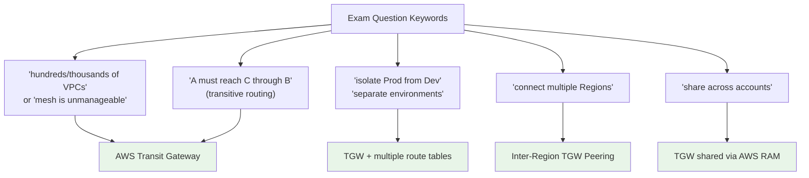

# AWS Transit Gateway Exam Scenarios & Facts - SAA-C03 Deep Dive

> The SAA-C03 exam loves Transit Gateway as the answer to **scale** (hundreds/thousands of VPCs), **transitive routing** (A talks to C through a hub), and **isolation** (separate route tables per environment). This file gives you the keyword-to-answer reflexes and the facts AWS quizzes most.

See also: [01 - Transit Gateway Fundamentals & Architecture](01%20-%20Transit%20Gateway%20Fundamentals%20%26%20Architecture.md) · [02 - Route Tables, Peering & Sharing](02%20-%20Route%20Tables%2C%20Peering%20%26%20Sharing.md)

---

## Table of Contents

- [How to Read a TGW Question](#how-to-read-a-tgw-question)
- [Scenario 1: Hundreds of VPCs, Full Connectivity](#scenario-1-hundreds-of-vpcs-full-connectivity)
- [Scenario 2: Transitive Routing Between Spokes](#scenario-2-transitive-routing-between-spokes)
- [Scenario 3: Isolating Prod from Dev](#scenario-3-isolating-prod-from-dev)
- [Scenario 4: Shared Services Reachable by All](#scenario-4-shared-services-reachable-by-all)
- [Scenario 5: Connecting Multiple Regions](#scenario-5-connecting-multiple-regions)
- [Scenario 6: Sharing One TGW Across Accounts](#scenario-6-sharing-one-tgw-across-accounts)
- [Scenario 7: Centralized Egress and Inspection](#scenario-7-centralized-egress-and-inspection)
- [Scenario 8: Hybrid - VPN and Direct Connect at Scale](#scenario-8-hybrid---vpn-and-direct-connect-at-scale)
- [Quick "Question Says X then Pick Y" Table](#quick-question-says-x-then-pick-y-table)
- [TGW vs Alternatives Decision Table](#tgw-vs-alternatives-decision-table)
- [Important Facts Cheat Sheet](#important-facts-cheat-sheet)
- [Summary: Key Takeaways for SAA-C03](#summary-key-takeaways-for-saa-c03)

---



---

## How to Read a TGW Question

Transit Gateway answers are usually competing against **VPC Peering**, **Transit VPC (self-managed)**, **VPN mesh**, and sometimes **PrivateLink**. Train these reflexes:

- **"Full mesh", "N(N-1)/2 connections", "unmanageable number of peering connections"** → the pain of VPC peering at scale → **TGW**.
- **"Transitive" / "A reaches C via B"** → VPC peering is **NOT transitive** → **TGW** (or TGW peering).
- **"Isolate", "must not communicate", "separate environments"** → one TGW with **multiple route tables** (associate spokes to different tables), not multiple TGWs.
- **"Across Regions"** → **inter-Region TGW peering** (encrypted over the AWS backbone).
- **"Across accounts / Organizations"** → share the TGW with **AWS RAM**.
- **"Centralize NAT / inspection firewall"** → TGW with an **egress/inspection VPC** + **appliance mode**.

> **Exam Tip:** If the question stresses _number of VPCs_ or _operational overhead of peering_, TGW is almost always correct over VPC peering, even if peering is technically possible.

[⬆ Back to top](#table-of-contents)

---

## Scenario 1: Hundreds of VPCs, Full Connectivity

**Question:** A company has 200 VPCs across one Region that all need to communicate. They currently use VPC peering and find managing the connections and route tables impossible. What is the most scalable, low-operational-overhead solution?

**Answer:** Deploy an **AWS Transit Gateway** and attach all VPCs to it.

**Why:** A full mesh of 200 VPCs needs 200 x 199 / 2 = **19,900 peering connections**, each with manual route entries. A TGW collapses this to **one attachment per VPC** (200 attachments) with centralized route tables. This is the canonical "VPC peering does not scale" question.

> **Exam Trap:** "Create more VPC peering connections" or "use a Transit VPC with EC2 routers" are distractors — both add operational burden. The Transit VPC pattern (third-party router appliances on EC2) is the _legacy_ answer TGW replaced.

[⬆ Back to top](#table-of-contents)

---

## Scenario 2: Transitive Routing Between Spokes

**Question:** VPC A is peered to VPC B, and VPC B is peered to VPC C. Instances in VPC A cannot reach VPC C even after adding routes. Why, and how do you fix it cleanly?

**Answer:** VPC peering is **non-transitive** — traffic cannot hop through B to reach C. Replace the peering web with a **Transit Gateway**; attach A, B, and C, and the TGW provides transitive routing between all of them.

**Why:** Peering is strictly point-to-point. No route table trick makes peering transitive. TGW (or TGW inter-Region peering) is the supported way to get transitive reachability.

> **Exam Tip:** The phrase "transitive routing" in the answer choices is a strong signal for Transit Gateway. VPC peering being non-transitive is one of the most tested facts in the networking domain.

[⬆ Back to top](#table-of-contents)

---

## Scenario 3: Isolating Prod from Dev

**Question:** A company attaches Prod and Dev VPCs plus a Shared-Services VPC to a single TGW. Prod and Dev must NOT reach each other, but both must reach Shared Services. What is the most cost-effective design?

**Answer:** Use **one TGW with multiple route tables**. Associate Prod and Dev attachments to **separate, isolated route tables** that do not have routes to each other, and **propagate** the Shared-Services VPC route into both. Propagate Prod and Dev into the Shared-Services route table.

**Why:** Isolation is achieved with **route table association**, not with extra gateways. Deploying two TGWs is unnecessary cost and complexity.

> **Exam Trap:** "Deploy a separate Transit Gateway for each environment" is a tempting but wrong/expensive answer. Isolation = separate **route tables** on one TGW (or blackhole routes). See [02 - Route Tables, Peering & Sharing](02%20-%20Route%20Tables%2C%20Peering%20%26%20Sharing.md).

[⬆ Back to top](#table-of-contents)

---

## Scenario 4: Shared Services Reachable by All

**Question:** Many spoke VPCs must reach a central Shared-Services VPC (DNS, AD, monitoring) but the spokes must stay isolated from one another. Design the TGW routing.

**Answer:** Implement the **shared services / "hub" route table pattern**:

- **Spoke route table:** spokes associate here; it has a route ONLY to the Shared-Services VPC (no spoke-to-spoke routes).
- **Shared-Services route table:** has propagated routes to all spokes so it can reply.

```text
Spoke RT (associated: VPC-A, VPC-B, VPC-C)
  10.99.0.0/16 -> attach-shared   # only the shared VPC

Shared RT (associated: VPC-Shared)
  10.0.0.0/16  -> attach-vpc-a    # propagated
  10.1.0.0/16  -> attach-vpc-b    # propagated
  10.2.0.0/16  -> attach-vpc-c    # propagated
```

> **Exam Tip:** This asymmetric routing (spokes see only shared, shared sees all spokes) is exactly how AWS expects "all spokes reach shared services but not each other" to be solved.

[⬆ Back to top](#table-of-contents)

---

## Scenario 5: Connecting Multiple Regions

**Question:** An application spans `us-east-1` and `eu-west-1`. VPCs in both Regions, plus on-premises, need full reachability over a private, encrypted path. What do you build?

**Answer:** Deploy a **TGW in each Region** and create an **inter-Region TGW peering attachment** between them. Attach VPCs locally to each TGW; traffic between Regions crosses the encrypted **AWS global backbone**.

**Why:** A TGW is **regional** — it cannot attach VPCs in another Region directly. Inter-Region peering is the supported, encrypted, no-Internet path.

> **Exam Trap:** Inter-Region TGW peering does **NOT** support transitive routing through a third TGW and historically did not support multicast — connect each peer pair directly. Also, you must add **static routes** pointing to the peering attachment (propagation across Regions is limited).

[⬆ Back to top](#table-of-contents)

---

## Scenario 6: Sharing One TGW Across Accounts

**Question:** An organization uses AWS Organizations with one networking account and many workload accounts. They want all accounts to attach VPCs to a single, centrally managed TGW. How?

**Answer:** Create the TGW in the **networking (hub) account** and **share it via AWS Resource Access Manager (RAM)** with the Organization or specific accounts. Workload accounts then create **VPC attachments** to the shared TGW.

**Why:** RAM enables cross-account resource sharing without peering or duplicate gateways. The **owner account controls the TGW route tables**; participant accounts only manage their own attachments.

> **Exam Tip:** "Centrally managed connectivity for many accounts" → TGW + **AWS RAM**. RAM is the standard sharing mechanism for TGW, subnets, and Route 53 Resolver rules.

[⬆ Back to top](#table-of-contents)

---

## Scenario 7: Centralized Egress and Inspection

**Question:** Dozens of VPCs each run their own NAT Gateway for Internet egress, driving up cost. Security also wants all east-west and outbound traffic inspected by a firewall. Design a consolidated solution.

**Answer:** Route all spoke traffic through the TGW to a dedicated **egress/inspection VPC** that contains the **NAT Gateways** and a stateful firewall (AWS Network Firewall or a third-party appliance). Enable **appliance mode** on the inspection VPC attachment so flow symmetry is preserved.

**Why:** Centralizing NAT cuts per-VPC NAT cost; centralizing inspection enforces one security choke point. **Appliance mode** keeps both directions of a flow pinned to the same AZ/appliance, preventing asymmetric routing that breaks stateful inspection.

> **Exam Trap:** Without **appliance mode**, multi-AZ traffic through an inspection appliance can return via a different AZ, and the stateful firewall drops it. "Asymmetric routing through a firewall" = enable appliance mode.

[⬆ Back to top](#table-of-contents)

---

## Scenario 8: Hybrid - VPN and Direct Connect at Scale

**Question:** On-premises must reach 50 VPCs over Direct Connect, with VPN as backup. Managing a VGW per VPC is unmanageable. What is the recommended design?

**Answer:** Attach the 50 VPCs to a **Transit Gateway**, then connect on-premises via a **Transit Gateway association on a Direct Connect Gateway** (using a **Transit VIF**) for the primary path and a **Site-to-Site VPN attachment** on the TGW as backup.

**Why:** TGW + DX Gateway lets a single Transit VIF reach all attached VPCs, replacing one Virtual Private Gateway per VPC. VPN attachments support **ECMP** to scale/aggregate tunnel bandwidth and serve as failover.

> **Exam Tip:** Direct Connect to **many VPCs** → **Transit VIF → Direct Connect Gateway → Transit Gateway**. A private VIF + VGW only reaches a single VPC. See [01 - Direct Connect Fundamentals & Architecture](01%20-%20Direct%20Connect%20Fundamentals%20%26%20Architecture.md) and [01 - Site-to-Site VPN Fundamentals & Architecture](01%20-%20Site-to-Site%20VPN%20Fundamentals%20%26%20Architecture.md).

[⬆ Back to top](#table-of-contents)

---

## Quick "Question Says X then Pick Y" Table

| Question Says (keyword/clue)                          | Pick This Answer                                         |
| :---------------------------------------------------- | :------------------------------------------------------- |
| Hundreds/thousands of VPCs; peering mesh unmanageable | **Transit Gateway**                                      |
| Transitive routing / A reaches C through B            | **Transit Gateway** (peering is non-transitive)          |
| Isolate Prod from Dev on the same hub                 | **One TGW, separate route tables** (not multiple TGWs)   |
| All spokes reach shared services, not each other      | TGW **shared-services route table pattern**              |
| Drop traffic to a CIDR / sinkhole a route             | **Blackhole route** in the TGW route table               |
| Connect VPCs across Regions, private + encrypted      | **Inter-Region TGW peering**                             |
| Share connectivity across many accounts / Org         | **TGW shared via AWS RAM**                               |
| Centralize NAT egress for many VPCs                   | TGW + **central egress VPC**                             |
| Inspect all traffic through a firewall                | TGW + inspection VPC + **appliance mode**                |
| Asymmetric routing breaks stateful firewall           | Enable **appliance mode**                                |
| On-prem to many VPCs over Direct Connect              | **Transit VIF → DX Gateway → TGW**                       |
| Aggregate/scale VPN tunnel bandwidth                  | TGW VPN attachment with **ECMP**                         |
| Only two VPCs need to talk; lowest cost               | **VPC Peering** (TGW is overkill/more expensive)         |
| Expose a single service privately to consumers        | **PrivateLink / VPC Endpoint Service**, not TGW          |
| Overlapping CIDRs must communicate                    | **PrivateLink** (TGW/peering need non-overlapping CIDRs) |
| Multicast application in AWS                          | **TGW multicast domain**                                 |

[⬆ Back to top](#table-of-contents)

---

## TGW vs Alternatives Decision Table

| Requirement                   | Transit Gateway | VPC Peering                | PrivateLink         | VPN Mesh         |
| :---------------------------- | :-------------- | :------------------------- | :------------------ | :--------------- |
| Connect many VPCs at scale    | Best (hub)      | Poor (N-squared)           | N/A                 | Poor             |
| Transitive routing            | Yes             | No                         | No (single service) | Via routers only |
| Overlapping CIDRs allowed     | No              | No                         | Yes                 | No               |
| Cross-Region                  | Yes (peering)   | Yes (inter-Region peering) | Yes                 | Yes              |
| Cross-account                 | Yes (RAM)       | Yes                        | Yes                 | Yes              |
| Cost for just 2 VPCs          | Higher          | Lowest                     | N/A                 | Higher           |
| Centralized inspection/egress | Yes             | No                         | No                  | Limited          |
| Expose one service only       | No              | No                         | Yes (one-way)       | No               |

> **Exam Tip:** When CIDRs **overlap**, neither TGW nor VPC peering works — only **PrivateLink** bridges overlapping address spaces (consumer reaches a service ENI, not the whole VPC).

[⬆ Back to top](#table-of-contents)

---

## Important Facts Cheat Sheet

| Fact                           | Detail to Remember                                                                                                     |
| :----------------------------- | :--------------------------------------------------------------------------------------------------------------------- |
| **Regional**                   | A TGW lives in one Region; cross-Region needs **inter-Region peering**                                                 |
| **Attachment types**           | VPC, VPN, Direct Connect Gateway, TGW Peering, Connect (SD-WAN/GRE)                                                    |
| **Default route table**        | New attachments auto-associate + auto-propagate to the **default** TGW route table (can disable)                       |
| **Association vs propagation** | Association = which RT an attachment uses to route OUT; propagation = how an attachment's CIDRs get learned INTO an RT |
| **Isolation**                  | Achieved via **multiple route tables**, not multiple TGWs                                                              |
| **Blackhole route**            | Explicitly drops matching traffic (security/isolation)                                                                 |
| **Transitive**                 | TGW is transitive; VPC peering is **not**                                                                              |
| **Appliance mode**             | Keeps flow symmetric for stateful inspection across AZs                                                                |
| **Multicast**                  | Supported via **multicast domains** (single-Region)                                                                    |
| **CIDRs**                      | Must be **non-overlapping** across attached VPCs                                                                       |
| **Bandwidth**                  | ~50 Gbps per VPC attachment; ECMP scales VPN/Connect throughput                                                        |
| **MTU**                        | Up to **8500 bytes** (jumbo) for VPC/DX/peering/Connect attachments                                                    |
| **Sharing**                    | Cross-account via **AWS RAM**; owner controls route tables                                                             |
| **Inter-Region peering**       | Encrypted over AWS backbone; needs **static routes**; **not transitive** through a third TGW                           |
| **DX to many VPCs**            | **Transit VIF → DX Gateway → TGW**                                                                                     |
| **Cost**                       | Per-**attachment-hour** + per-**GB** data processed (+ peering data)                                                   |
| **When NOT to use**            | Just two VPCs → **VPC peering** is cheaper and simpler                                                                 |

> **Exam Trap:** Memorize the difference between **association** (the route table an attachment sends traffic through) and **propagation** (advertising an attachment's routes into a route table). Mixing these up is a classic miss.

[⬆ Back to top](#table-of-contents)

---

## Summary: Key Takeaways for SAA-C03

| Theme                 | One-Line Takeaway                                                       |
| :-------------------- | :---------------------------------------------------------------------- |
| **Scale**             | Many VPCs / unmanageable peering mesh → **Transit Gateway**             |
| **Transitive**        | Need A↔C through a hub → TGW (peering is non-transitive)                |
| **Isolation**         | Separate environments → one TGW, **multiple route tables** + blackholes |
| **Shared services**   | Asymmetric route tables: spokes see shared, shared sees all spokes      |
| **Multi-Region**      | **Inter-Region TGW peering** (encrypted, static routes, not transitive) |
| **Multi-account**     | Share the TGW with **AWS RAM**                                          |
| **Centralization**    | Central egress (NAT) and inspection VPC + **appliance mode**            |
| **Hybrid scale**      | Transit VIF → DX Gateway → TGW; VPN with ECMP for backup/bandwidth      |
| **Overlapping CIDRs** | Not TGW/peering → use **PrivateLink**                                   |
| **Cost guard**        | Two VPCs only → VPC peering, not TGW                                    |

[⬆ Back to top](#table-of-contents)
