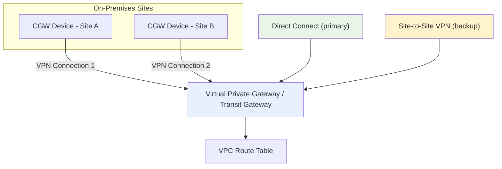
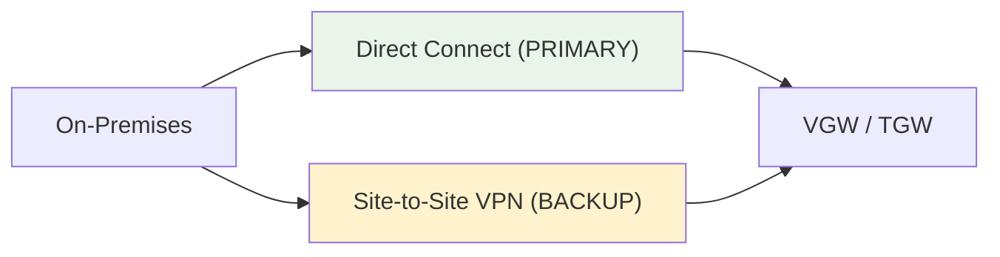
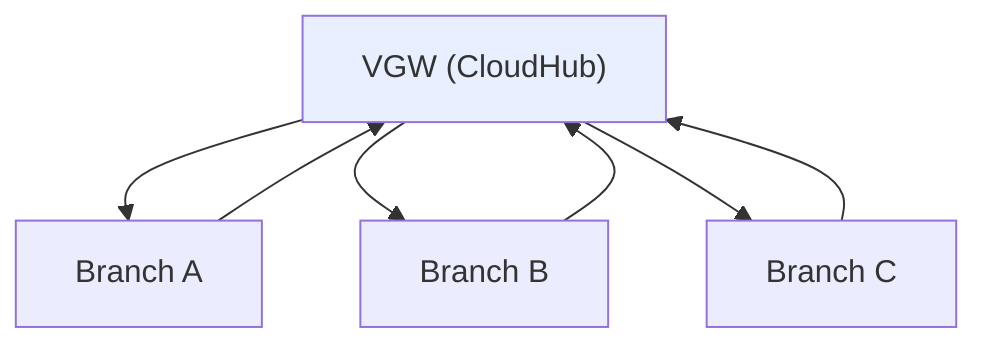

# VGW, CGW, Routing & Redundancy - SAA-C03 Deep Dive

> Deep dive into the **Virtual Private Gateway**, the **Customer Gateway**, route selection, and the redundancy patterns that turn a single VPN into a resilient hybrid network - including using VPN as a **Direct Connect backup** and the multi-site **VPN CloudHub**.

See also: [01 - Site-to-Site VPN Fundamentals & Architecture](01%20-%20Site-to-Site%20VPN%20Fundamentals%20%26%20Architecture.md) · [03 - Site-to-Site VPN Exam Scenarios & Facts](03%20-%20Site-to-Site%20VPN%20Exam%20Scenarios%20%26%20Facts.md)

---

## Table of Contents

- [Part 1: Virtual Private Gateway (VGW) Deep Dive](#part-1-virtual-private-gateway-vgw-deep-dive)
- [Part 2: Customer Gateway (CGW) Configuration](#part-2-customer-gateway-cgw-configuration)
- [Part 3: Route Selection - Static vs BGP](#part-3-route-selection---static-vs-bgp)
- [Part 4: Tunnel Redundancy & Dead Peer Detection](#part-4-tunnel-redundancy--dead-peer-detection)
- [Part 5: Multiple VPNs for Resiliency](#part-5-multiple-vpns-for-resiliency)
- [Part 6: VPN + Direct Connect (Backup and Primary)](#part-6-vpn--direct-connect-backup-and-primary)
- [Part 7: VPN CloudHub (Multi-Site Hub)](#part-7-vpn-cloudhub-multi-site-hub)
- [Part 8: Monitoring Site-to-Site VPN](#part-8-monitoring-site-to-site-vpn)
- [Part 9: Site-to-Site VPN vs Direct Connect](#part-9-site-to-site-vpn-vs-direct-connect)
- [Summary: Key Takeaways for SAA-C03](#summary-key-takeaways-for-saa-c03)

---



---

This note covers the building blocks of a Site-to-Site VPN in detail and the architecture patterns that the exam loves to test: how routes are chosen, how to remove single points of failure, and how VPN combines with Direct Connect.

---

## Part 1: Virtual Private Gateway (VGW) Deep Dive

The **Virtual Private Gateway (VGW)** is the AWS-managed VPN concentrator that attaches to a VPC.

### Key Facts

| Property                | Detail                                                                            |
| :---------------------- | :-------------------------------------------------------------------------------- |
| **Attachment**          | One VGW attaches to **exactly one VPC**                                           |
| **Amazon-side ASN**     | Default **64512**; customizable at creation (private ASN 64512-65534 or your own) |
| **Managed & redundant** | AWS runs it across multiple AZs; nothing for you to patch                         |
| **Terminates**          | Site-to-Site VPN connections and/or Direct Connect (via VIF)                      |
| **Route propagation**   | Can auto-inject learned routes into VPC route tables                              |

### VGW vs Transit Gateway as the Endpoint

- **VGW** is the classic, single-VPC choice. Cannot do ECMP.
- **Transit Gateway** is the scalable, multi-VPC hub and supports **ECMP** to aggregate tunnel bandwidth. See [01 - Transit Gateway Fundamentals & Architecture](01%20-%20Transit%20Gateway%20Fundamentals%20%26%20Architecture.md).

> **Exam Tip:** A VGW has its own **Amazon-side ASN**. If a BGP scenario mentions an ASN conflict with on-prem, remember you can set a **custom Amazon-side ASN** on the VGW (or TGW).

[⬆ Back to top](#table-of-contents)

---

## Part 2: Customer Gateway (CGW) Configuration

The **Customer Gateway** is the AWS resource that describes your on-premises VPN device. The physical device itself is the **Customer Gateway Device**.

### What You Configure

| Setting                    | Description                                                                                            |
| :------------------------- | :----------------------------------------------------------------------------------------------------- |
| **IP address**             | The **static, internet-routable public IP** of your device                                             |
| **Behind NAT**             | If the device sits behind NAT, supply the NAT device's static public IP; AWS uses **NAT-T (UDP 4500)** |
| **Routing type**           | Static or dynamic (BGP)                                                                                |
| **BGP ASN**                | Required for dynamic routing - your on-prem ASN                                                        |
| **Certificate (optional)** | An ACM private certificate for tunnel authentication instead of a PSK                                  |

### On-Prem Device Requirements

- Must support **IPsec** (IKEv1 or IKEv2).
- For dynamic routing, must support **BGP**.
- AWS supplies a **vendor-specific downloadable config** to apply on the device.

```bash
# Customer Gateway with a public IP and BGP ASN
aws ec2 create-customer-gateway \
    --type ipsec.1 \
    --public-ip 198.51.100.5 \
    --bgp-asn 65010 \
    --tag-specifications 'ResourceType=customer-gateway,Tags=[{Key=Name,Value=site-a}]'
```

> **Exam Trap:** The CGW public IP must be **static**. If on-prem has a dynamic public IP, put a NAT/firewall with a static public IP in front, or the tunnel cannot be reliably established.

[⬆ Back to top](#table-of-contents)

---

## Part 3: Route Selection - Static vs BGP

When the same destination is reachable multiple ways, AWS uses a defined order to pick the route.

### Route Priority on the VGW

1. **Longest prefix match** wins first (most specific CIDR).
2. For equal prefixes, **static routes are preferred over BGP-propagated routes** (when both exist for the same prefix).
3. Among BGP routes: routes from **Direct Connect are preferred over VPN** for the same prefix.

### Static vs Dynamic Recap

| Aspect              | Static        | Dynamic (BGP)         |
| :------------------ | :------------ | :-------------------- |
| Failover            | Manual / slow | **Automatic / fast**  |
| New networks        | Manual update | Learned automatically |
| Required for ECMP   | No            | **Yes**               |
| Device must run BGP | No            | Yes                   |

> **Exam Tip:** When **both Direct Connect and VPN advertise the same prefix via BGP**, AWS prefers **Direct Connect**. This is exactly why VPN works as a clean **backup** to DX - covered in Part 6.

[⬆ Back to top](#table-of-contents)

---

## Part 4: Tunnel Redundancy & Dead Peer Detection

### The Two Tunnels

Each VPN connection has **two tunnels** to two AWS endpoints in two AZs. To benefit, the on-prem device must be configured for **both** tunnels.

### Dead Peer Detection (DPD)

- **DPD** is an IKE mechanism that detects when the peer (the other tunnel endpoint) becomes unreachable.
- On DPD timeout, AWS can take a configurable **DPD timeout action**: `clear` (end the IKE session), `restart`, or `none`.
- DPD enables fast detection of a dead tunnel so traffic shifts to the healthy tunnel.

### Keeping Tunnels Up

- VPN tunnels can go **idle/down** if there is no traffic. Generate **keepalive / interesting traffic** (e.g., a ping or BGP keepalives) to keep them active.
- With **BGP**, route withdrawal on a failed tunnel triggers automatic failover to the other tunnel.

| Mechanism             | Purpose                                       |
| :-------------------- | :-------------------------------------------- |
| **DPD**               | Detect a dead peer/tunnel quickly             |
| **BGP keepalives**    | Maintain dynamic routing + fast reconvergence |
| **Keepalive traffic** | Prevent idle tunnels from dropping            |

> **Exam Trap:** A tunnel showing **DOWN with no traffic** is often just idle. Generating steady traffic (or relying on BGP keepalives) keeps both tunnels healthy.

[⬆ Back to top](#table-of-contents)

---

## Part 5: Multiple VPNs for Resiliency

The built-in two tunnels protect the **AWS side**. They do **not** protect against failure of your single on-prem device or single internet link.

### Removing the Customer-Side Single Point of Failure

```mermaid
graph TD
    subgraph OnPrem["On-Premises"]
        D1["CGW Device 1<br/>(ISP A)"]
        D2["CGW Device 2<br/>(ISP B)"]
    end
    VGW["VGW / TGW"]
    D1 -->|VPN Connection 1 (2 tunnels)| VGW
    D2 -->|VPN Connection 2 (2 tunnels)| VGW
    style D1 fill:#e8f5e8
    style D2 fill:#fff3cd
```

### Pattern

- Deploy **two Customer Gateway Devices** on-prem, ideally on **different ISPs/links**.
- Create **two VPN connections** (one per device) to the same VGW/TGW.
- Use **BGP** so traffic automatically reroutes if one device/link fails.

| Resilience Layer            | How to Achieve                                |
| :-------------------------- | :-------------------------------------------- |
| AWS endpoint / AZ failure   | Built-in **two tunnels** in two AZs           |
| On-prem device failure      | **Second CGW device + second VPN connection** |
| ISP / internet path failure | Two devices on **different ISPs**             |
| Total internet outage       | Add **Direct Connect** (Part 6)               |

> **Exam Tip:** "VPN tunnels are redundant but our setup still has a single point of failure" → the gap is the **single on-prem Customer Gateway Device**. Add a second device + VPN connection.

[⬆ Back to top](#table-of-contents)

---

## Part 6: VPN + Direct Connect (Backup and Primary)

Direct Connect and Site-to-Site VPN are frequently combined.

### Pattern A: VPN as Backup to Direct Connect (most common)

- **Direct Connect = primary** (private, consistent, low latency).
- **Site-to-Site VPN = backup** over the internet, for when DX fails.
- With BGP advertising the same prefixes, AWS **prefers DX**; if DX drops, traffic fails over to the VPN automatically.



### Pattern B: Direct Connect as Primary, encrypted

- DX is **not encrypted by default**. To encrypt over DX, run an **IPsec VPN over a public VIF** (or use MACsec on supported ports).

### Why It Works

- DX gives **consistent performance**; VPN gives a **cheap encrypted failover** without a second physical circuit.
- This is far cheaper than provisioning a **second Direct Connect** for redundancy (though that is the highest-resilience option).

> **Exam Tip:** "Use Direct Connect but need a **cost-effective backup**" the answer is a **Site-to-Site VPN as failover**. "Need an **encrypted** Direct Connect" run an IPsec VPN over a public VIF.

[⬆ Back to top](#table-of-contents)

---

## Part 7: VPN CloudHub (Multi-Site Hub)

**VPN CloudHub** connects **multiple on-premises sites** to AWS and lets them **communicate with each other** through a single VGW - a low-cost hub-and-spoke over VPN.

### How It Works

- Attach **multiple Customer Gateways** (one per site) to a **single VGW** using **BGP**.
- Each site advertises its prefixes; the VGW re-advertises them to the other sites.
- Sites can then reach AWS **and** each other.



| Property               | Detail                                                      |
| :--------------------- | :---------------------------------------------------------- |
| **Requires**           | BGP, unique ASN per site                                    |
| **Topology**           | Hub-and-spoke via a single VGW                              |
| **Use case**           | Connect branch offices to AWS **and** to each other cheaply |
| **Modern alternative** | **Transit Gateway** for larger, more scalable hubs          |

> **Exam Tip:** "Connect several remote sites to each other and to AWS over VPN, cheaply" → **VPN CloudHub**. For large scale / many VPCs, prefer **Transit Gateway**.

[⬆ Back to top](#table-of-contents)

---

## Part 8: Monitoring Site-to-Site VPN

| Tool                   | What It Shows                                                       |
| :--------------------- | :------------------------------------------------------------------ |
| **CloudWatch metrics** | `TunnelState` (up/down), `TunnelDataIn`, `TunnelDataOut` per tunnel |
| **CloudWatch Alarms**  | Alert when a tunnel goes down (TunnelState = 0)                     |
| **VPN tunnel logs**    | IKE/IPsec negotiation logs to CloudWatch Logs for troubleshooting   |
| **Health Dashboard**   | AWS-side maintenance/health notifications                           |

```bash
# Check tunnel status and details
aws ec2 describe-vpn-connections \
    --vpn-connection-ids vpn-0abcd1234 \
    --query "VpnConnections[0].VgwTelemetry"
```

> **Exam Tip:** Use a **CloudWatch alarm on `TunnelState`** to be notified the moment a tunnel drops - the standard "how do we get alerted on VPN failure" answer.

[⬆ Back to top](#table-of-contents)

---

## Part 9: Site-to-Site VPN vs Direct Connect

| Dimension              | Site-to-Site VPN                         | Direct Connect (DX)                     |
| :--------------------- | :--------------------------------------- | :-------------------------------------- |
| **Transport**          | Public internet                          | Private dedicated connection            |
| **Setup time**         | Minutes / hours                          | Weeks (physical provisioning)           |
| **Encryption**         | Built-in (IPsec)                         | **None by default** (add VPN/MACsec)    |
| **Latency / jitter**   | Variable                                 | Low and consistent                      |
| **Bandwidth**          | ~1.25 Gbps per tunnel                    | 1 / 10 / 100 Gbps dedicated             |
| **Cost**               | Low                                      | Higher (port + cross-connect + data)    |
| **Best for**           | Quick/cheap hybrid, backup, branch sites | Consistent high throughput, low latency |
| **Resilience pattern** | 2 tunnels; add 2nd CGW device            | Add 2nd DX or VPN backup                |

> **Exam Trap:** Direct Connect is **private but not encrypted**. If a question wants **both private/consistent AND encrypted**, the answer is **Direct Connect + an IPsec VPN over it**, not DX alone. See [01 - Direct Connect Fundamentals & Architecture](01%20-%20Direct%20Connect%20Fundamentals%20%26%20Architecture.md).

[⬆ Back to top](#table-of-contents)

---

## Summary: Key Takeaways for SAA-C03

| Concept              | What You Must Know                                                    |
| :------------------- | :-------------------------------------------------------------------- |
| **VGW**              | One per VPC; custom Amazon-side ASN (default 64512); no ECMP          |
| **CGW**              | AWS resource = device's **static public IP** + ASN; device is yours   |
| **Route selection**  | Longest prefix → static over BGP → **DX preferred over VPN**          |
| **DPD**              | Detects dead tunnels for fast failover; keep tunnels with traffic/BGP |
| **Customer-side HA** | Built-in tunnels protect AWS side; add **2nd CGW device + VPN**       |
| **DX + VPN**         | VPN is the cheap **backup** to DX; VPN over public VIF encrypts DX    |
| **VPN CloudHub**     | Multi-site hub-and-spoke over a single VGW using BGP                  |
| **Monitoring**       | CloudWatch `TunnelState` metric + alarm                               |
| **VPN vs DX**        | VPN = quick/cheap/encrypted; DX = consistent/low-latency/private      |

[⬆ Back to top](#table-of-contents)
