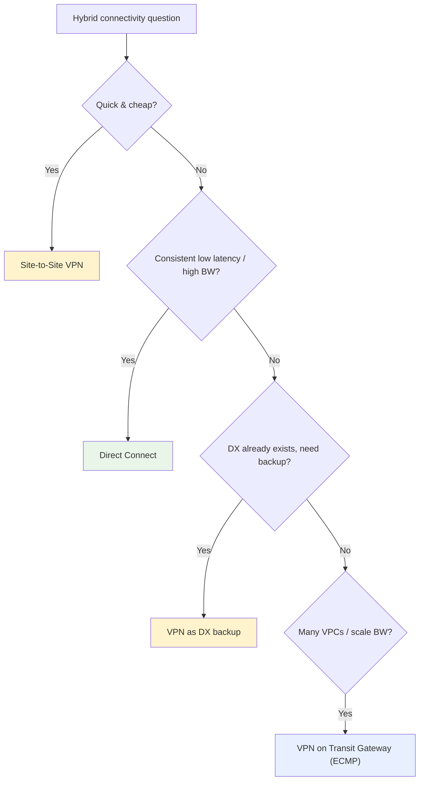

# Site-to-Site VPN Exam Scenarios & Facts - SAA-C03 Deep Dive

> Scenario-driven walkthrough for the exam: how to map question keywords to the right hybrid-connectivity answer, plus a cheat table of must-memorize Site-to-Site VPN facts.

See also: [01 - Site-to-Site VPN Fundamentals & Architecture](01%20-%20Site-to-Site%20VPN%20Fundamentals%20%26%20Architecture.md) · [02 - VGW, CGW, Routing & Redundancy](02%20-%20VGW%2C%20CGW%2C%20Routing%20%26%20Redundancy.md)

---

## Table of Contents

- [Part 1: Keyword-to-Answer Quick Map](#part-1-keyword-to-answer-quick-map)
- [Part 2: Scenario 1 - Fast & Cheap Hybrid Link](#part-2-scenario-1---fast--cheap-hybrid-link)
- [Part 3: Scenario 2 - Encrypted Connectivity Over the Internet](#part-3-scenario-2---encrypted-connectivity-over-the-internet)
- [Part 4: Scenario 3 - Consistent Low Latency / High Throughput](#part-4-scenario-3---consistent-low-latency--high-throughput)
- [Part 5: Scenario 4 - Backup for Direct Connect](#part-5-scenario-4---backup-for-direct-connect)
- [Part 6: Scenario 5 - Removing the Single Point of Failure](#part-6-scenario-5---removing-the-single-point-of-failure)
- [Part 7: Scenario 6 - Many VPCs and Scaling Bandwidth](#part-7-scenario-6---many-vpcs-and-scaling-bandwidth)
- [Part 8: Scenario 7 - Multi-Site Mesh Over VPN](#part-8-scenario-7---multi-site-mesh-over-vpn)
- [Part 9: Scenario 8 - Tunnel Up but Traffic Fails](#part-9-scenario-8---tunnel-up-but-traffic-fails)
- [Part 10: Important Facts Cheat Table](#part-10-important-facts-cheat-table)
- [Summary: Key Takeaways for SAA-C03](#summary-key-takeaways-for-saa-c03)

---

---

This note is pure exam preparation: practice scenarios with reasoning, plus the facts most likely to appear as distractors or correct answers on SAA-C03.

---

## Part 1: Keyword-to-Answer Quick Map

| Question Says (keywords)                                                      | Pick This                                   |
| :---------------------------------------------------------------------------- | :------------------------------------------ |
| "quickly", "in hours", "cost-effective", "temporary" hybrid link              | **Site-to-Site VPN**                        |
| "encrypted" connection "over the internet"                                    | **Site-to-Site VPN**                        |
| "consistent low latency", "dedicated bandwidth", "no jitter"                  | **Direct Connect**                          |
| Direct Connect already in place + "backup" / "failover" / "resilient" cheaply | **Site-to-Site VPN as DX backup**           |
| "encrypt" traffic over Direct Connect                                         | **IPsec VPN over a public VIF** (or MACsec) |
| Connect "many VPCs" / "thousands of VPCs" to on-prem                          | **VPN on Transit Gateway**                  |
| Aggregate VPN bandwidth beyond ~1.25 Gbps                                     | **Transit Gateway + ECMP**                  |
| VPN needs "more consistent performance" but still internet                    | **Accelerated Site-to-Site VPN (TGW)**      |
| Connect "multiple branch sites" to AWS and each other, cheaply                | **VPN CloudHub**                            |
| Individual remote "users/laptops" connecting to VPC                           | **Client VPN** (not Site-to-Site)           |

> **Exam Tip:** The single biggest discriminator is **internet vs dedicated** and **fast/cheap vs consistent/low-latency**. VPN = internet + fast + cheap; DX = dedicated + consistent + slow to provision.

[⬆ Back to top](#table-of-contents)

---

## Part 2: Scenario 1 - Fast & Cheap Hybrid Link

**Question:** A startup needs to connect its small data center to a VPC **within a day** to start migrating data. Cost matters and the link will only be needed during a 3-month migration. What should they use?

**Answer:** **Site-to-Site VPN.**

**Why:** It can be provisioned in **minutes** with no physical circuit, costs little (hourly + data transfer), and is easily torn down after the migration. Direct Connect would take **weeks** to provision - wrong for a short, urgent, low-cost need.

> **Exam Trap:** "Within a day/hours" alone almost always eliminates Direct Connect, which requires physical cross-connect provisioning.

[⬆ Back to top](#table-of-contents)

---

## Part 3: Scenario 2 - Encrypted Connectivity Over the Internet

**Question:** A company must connect on-prem to AWS and the security team mandates that **all data in transit be encrypted**. They want to use their existing internet connection. What is the simplest solution?

**Answer:** **Site-to-Site VPN.**

**Why:** IPsec encryption is **built in** and it uses the existing internet link - no new hardware. Direct Connect alone would **not** satisfy the encryption requirement because DX is unencrypted by default.

> **Exam Tip:** "Encrypted in transit" + "existing internet" = Site-to-Site VPN. If they instead require encryption **and** a dedicated link, the answer is **VPN over Direct Connect**.

[⬆ Back to top](#table-of-contents)

---

## Part 4: Scenario 3 - Consistent Low Latency / High Throughput

**Question:** A financial firm runs latency-sensitive workloads and needs **consistent, predictable low latency** and **several Gbps** of dedicated throughput between on-prem and AWS. What should they choose?

**Answer:** **Direct Connect.**

**Why:** A VPN rides the **public internet** with variable latency/jitter and caps at **~1.25 Gbps per tunnel**. Only Direct Connect provides a **dedicated private connection** with consistent performance and multi-Gbps bandwidth.

> **Exam Trap:** Do not pick VPN for "consistent low latency" or large dedicated throughput - the internet path makes VPN unpredictable, and a single tunnel maxes out near 1.25 Gbps.

[⬆ Back to top](#table-of-contents)

---

## Part 5: Scenario 4 - Backup for Direct Connect

**Question:** A company relies on **Direct Connect** as its primary AWS link but needs a **cost-effective backup** if the DX connection fails. What is the recommended approach?

**Answer:** **Site-to-Site VPN as a backup**, using BGP so failover is automatic.

**Why:** With both advertising the same prefixes via BGP, AWS **prefers Direct Connect**; if DX goes down, traffic fails over to the VPN automatically. This is far cheaper than provisioning a **second Direct Connect** (which is the highest-resilience but costlier option).

> **Exam Tip:** "Cost-effective DX backup" = **VPN**. "Highest possible resilience / no internet dependency" = **second Direct Connect** (ideally at a different location).

[⬆ Back to top](#table-of-contents)

---

## Part 6: Scenario 5 - Removing the Single Point of Failure

**Question:** A company has one Site-to-Site VPN connection. They know it has two tunnels, yet an auditor flags a single point of failure. What is missing and how do you fix it?

**Answer:** The single **on-premises Customer Gateway Device** is the SPOF. Add a **second Customer Gateway Device** (ideally on a different ISP) and a **second VPN connection**, using **BGP** for automatic failover.

**Why:** The two built-in tunnels only protect the **AWS side** (two AZs). They do nothing for a failure of your single on-prem device or single internet link.

> **Exam Trap:** "Two tunnels" does **not** equal full redundancy. The exam tests whether you know the tunnels cover only the AWS endpoint, not your premises.

[⬆ Back to top](#table-of-contents)

---

## Part 7: Scenario 6 - Many VPCs and Scaling Bandwidth

**Question:** An enterprise needs its on-prem network to reach **dozens of VPCs across multiple accounts** over VPN, and also needs **more than 1.25 Gbps** of VPN throughput. What architecture fits?

**Answer:** Terminate the VPN on a **Transit Gateway** and use **ECMP** across multiple tunnels/connections.

**Why:** A **VGW serves only one VPC** and **cannot do ECMP**. Transit Gateway is the regional hub for many VPCs and supports **ECMP** to aggregate bandwidth beyond a single tunnel's ~1.25 Gbps. See [01 - Transit Gateway Fundamentals & Architecture](01%20-%20Transit%20Gateway%20Fundamentals%20%26%20Architecture.md).

> **Exam Tip:** "Many VPCs" or "scale VPN bandwidth" → **Transit Gateway + ECMP** (requires **BGP**).

[⬆ Back to top](#table-of-contents)

---

## Part 8: Scenario 7 - Multi-Site Mesh Over VPN

**Question:** A retailer has **5 branch offices** that each need to reach AWS **and** communicate with one another, as cheaply as possible. What feature enables this?

**Answer:** **VPN CloudHub.**

**Why:** CloudHub attaches **multiple Customer Gateways to one VGW** via BGP, letting all sites reach AWS and re-advertise routes to each other - a low-cost hub-and-spoke over VPN. (For large scale, **Transit Gateway** is the more scalable hub.)

> **Exam Tip:** "Branch sites talk to AWS and each other over VPN, low cost" = **VPN CloudHub**.

[⬆ Back to top](#table-of-contents)

---

## Part 9: Scenario 8 - Tunnel Up but Traffic Fails

**Question:** An engineer confirms the VPN **tunnel status is UP**, but instances in the VPC cannot reach on-prem hosts. What are the likely causes?

**Answer (check in order):**

1. **Route propagation not enabled** / missing route to the on-prem CIDR in the **VPC route table**.
2. **Security Groups / NACLs** blocking the traffic.
3. **On-prem firewall** rules blocking the VPC CIDR.
4. **Static routes** not defined (if using static routing).

**Why:** A healthy tunnel only means IPsec is established; packets still need a **route** and must pass **SG/NACL/firewall** checks.

> **Exam Trap:** "Tunnel UP but no connectivity" is almost always a **routing/route-propagation** or **security-group** problem, not the tunnel itself.

[⬆ Back to top](#table-of-contents)

---

## Part 10: Important Facts Cheat Table

| Fact                           | Value / Detail                                                  |
| :----------------------------- | :-------------------------------------------------------------- |
| **Transport**                  | Public internet (IPsec)                                         |
| **Tunnels per connection**     | Always **2**, in **2 AZs** (AWS-side HA)                        |
| **Per-tunnel throughput**      | ~**1.25 Gbps**                                                  |
| **Scale beyond one tunnel**    | **Transit Gateway + ECMP** (needs BGP)                          |
| **AWS endpoints**              | **VGW** (one VPC) or **Transit Gateway** (many VPCs)            |
| **VGW default Amazon ASN**     | **64512** (customizable)                                        |
| **CGW**                        | AWS resource = device **static public IP** + ASN                |
| **Routing**                    | Static (manual) or **dynamic BGP** (auto failover, ECMP)        |
| **Route preference**           | Longest prefix → static over BGP → **DX preferred over VPN**    |
| **Encryption**                 | IPsec: IKE Phase 1 + IPsec Phase 2; PSK or **ACM private cert** |
| **NAT-T**                      | UDP **4500** when CGW device is behind NAT                      |
| **Accelerated VPN**            | Global Accelerator backbone; **Transit Gateway only**           |
| **Monitoring**                 | CloudWatch **`TunnelState`** metric + alarm                     |
| **DX backup**                  | VPN over internet; BGP gives automatic failover                 |
| **Encrypt DX**                 | Run **IPsec VPN over a public VIF** (or MACsec)                 |
| **VPN CloudHub**               | Multi-site hub-and-spoke via one VGW + BGP                      |
| **Site-to-Site vs Client VPN** | Site-to-Site = **networks**; Client VPN = **individual users**  |

> **Exam Tip:** Memorize the two numbers most likely to appear as answers: **2 tunnels** and **~1.25 Gbps per tunnel**.

[⬆ Back to top](#table-of-contents)

---

## Summary: Key Takeaways for SAA-C03

| Decision Point                                  | Correct Choice                             |
| :---------------------------------------------- | :----------------------------------------- |
| Quick / cheap hybrid link                       | **Site-to-Site VPN**                       |
| Encrypted over the internet                     | **Site-to-Site VPN**                       |
| Consistent low latency / high dedicated BW      | **Direct Connect**                         |
| Cost-effective DX backup                        | **Site-to-Site VPN (BGP failover)**        |
| Encrypt a Direct Connect link                   | **VPN over public VIF** / MACsec           |
| Many VPCs / scale VPN bandwidth                 | **Transit Gateway + ECMP**                 |
| More consistent VPN performance, still internet | **Accelerated Site-to-Site VPN**           |
| Multiple branch sites, mesh, low cost           | **VPN CloudHub**                           |
| Remove on-prem SPOF                             | **2nd CGW device + 2nd VPN, BGP**          |
| Tunnel UP but no traffic                        | Check **routes / propagation / SG / NACL** |

[⬆ Back to top](#table-of-contents)
