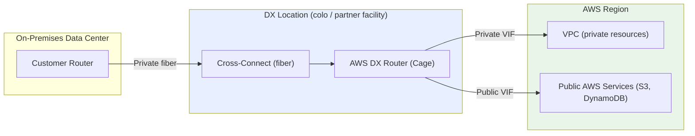
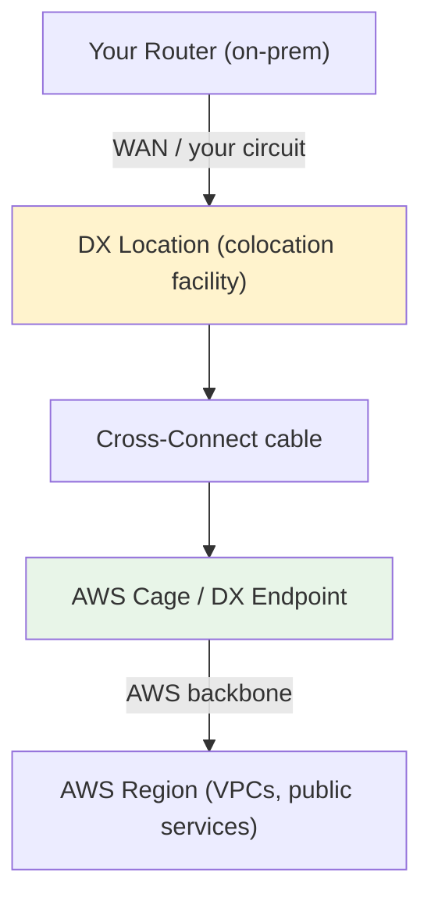
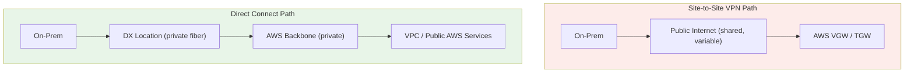

# AWS Direct Connect Fundamentals & Architecture - SAA-C03 Deep Dive

> Direct Connect (DX) is a **dedicated, private physical network link** from your data center to AWS via a DX location - delivering consistent low latency and high bandwidth, bypassing the public internet. It is **NOT encrypted by default**.

See also: [02 - Virtual Interfaces, Resiliency & DX Gateway](02%20-%20Virtual%20Interfaces%2C%20Resiliency%20%26%20DX%20Gateway.md) · [03 - Direct Connect Exam Scenarios & Facts](03%20-%20Direct%20Connect%20Exam%20Scenarios%20%26%20Facts.md)

---

## Table of Contents

- [What Direct Connect Is](#what-direct-connect-is)
- [What Problem DX Solves](#what-problem-dx-solves)
- [The Physical Architecture](#the-physical-architecture)
- [Dedicated vs Hosted Connections](#dedicated-vs-hosted-connections)
- [The Lead-Time Trap (Weeks, Not Minutes)](#the-lead-time-trap-weeks-not-minutes)
- [Public Internet vs DX Data Path](#public-internet-vs-dx-data-path)
- [Cost Model](#cost-model)
- [Key Takeaways for SAA-C03](#key-takeaways-for-saa-c03)

---



---

AWS Direct Connect is the cornerstone of **hybrid networking** on the SAA-C03 exam. Whenever a question stresses **consistent performance**, **predictable latency**, or **dedicated bandwidth** between on-premises and AWS, DX is almost always the answer.

---

## What Direct Connect Is

**AWS Direct Connect (DX)** is a service that establishes a **dedicated, private physical network connection** between your on-premises environment (data center, office, or colocation) and AWS. The connection is a physical fiber-optic link that terminates at an **AWS Direct Connect location**.

### Core Properties

| Property             | Detail                                                                 |
| :------------------- | :--------------------------------------------------------------------- |
| **Connection type**  | Physical, dedicated fiber (Layer 1/2) - not a tunnel over the internet |
| **Path**             | Bypasses the public internet entirely                                  |
| **Latency**          | Consistent and predictable (no internet congestion / variable routing) |
| **Bandwidth**        | High and stable: 1, 10, or 100 Gbps dedicated; sub-1 Gbps via hosted   |
| **Encryption**       | **None by default** - DX is private but NOT encrypted                  |
| **Routing protocol** | BGP (Border Gateway Protocol) for dynamic route exchange               |

> **Exam Trap:** "Private" does NOT mean "encrypted." DX traffic travels over a private circuit but is **plaintext** at the network layer. If the question requires **encryption in transit**, you must layer **IPsec VPN over DX** or use **MACsec** (on supported ports). See [02 - Virtual Interfaces, Resiliency & DX Gateway](02%20-%20Virtual%20Interfaces%2C%20Resiliency%20%26%20DX%20Gateway.md).

[⬆ Back to top](#table-of-contents)

---

## What Problem DX Solves

A standard internet connection (or even a Site-to-Site VPN that rides over the internet) suffers from **variable latency, jitter, and unpredictable throughput** because traffic shares the public internet with everyone else. DX fixes this.

### The Four Things DX Delivers

| Benefit                        | Explanation                                                                    |
| :----------------------------- | :----------------------------------------------------------------------------- |
| **Consistent low latency**     | Dedicated circuit, no internet hops or congestion - predictable performance    |
| **High & stable bandwidth**    | 1/10/100 Gbps dedicated capacity; ideal for large data transfers               |
| **Reduced data-transfer cost** | DX data-transfer-out rates are **cheaper** than standard internet egress rates |
| **Private connectivity**       | Traffic does not traverse the public internet (security + reliability)         |

### When To Choose DX (Exam Signals)

- "Requires **consistent, predictable** network performance" → DX
- "Needs **high throughput** for large/continuous data transfer (DB replication, big data, media)" → DX
- "Wants to **reduce data-transfer-out costs** at scale" → DX
- "Hybrid architecture needing **private** access to both VPC and public AWS services" → DX

> **Exam Tip:** A **Site-to-Site VPN** is fast to deploy (minutes) and encrypted, but rides the public internet so performance is variable. **DX** gives consistent performance but takes **weeks** to provision. The exam loves to contrast these two.

[⬆ Back to top](#table-of-contents)

---

## The Physical Architecture

DX involves three physical pieces that you must understand for the exam.



### The Components

| Component                     | What It Is                                                                                                                                                  |
| :---------------------------- | :---------------------------------------------------------------------------------------------------------------------------------------------------------- |
| **DX Location**               | A physical colocation facility where AWS has network equipment (e.g., Equinix). This is where the connection terminates. NOT inside an AWS Region building. |
| **Cross-Connect**             | The physical cable inside the DX location linking your router/cage to the AWS DX router/cage.                                                               |
| **Customer / Partner Router** | Your equipment at the DX location (or your provider's), running BGP to AWS.                                                                                 |
| **AWS DX Endpoint**           | AWS-owned router at the DX location that connects into the AWS backbone and on to Regions.                                                                  |

### Reaching the DX Location

You typically do **not** have gear physically sitting in a DX location. You connect to it via:

1. **Direct presence** - you have a cage/rack in the same colocation facility.
2. **An APN partner / telco** - the partner provides the last-mile circuit from your data center to the DX location (common for **hosted** connections).

[⬆ Back to top](#table-of-contents)

---

## Dedicated vs Hosted Connections

This is a high-yield exam distinction. There are **two ways** to buy a DX connection.

| Aspect                  | Dedicated Connection                                | Hosted Connection                                       |
| :---------------------- | :-------------------------------------------------- | :------------------------------------------------------ |
| **Provisioned by**      | AWS (you order a physical port from AWS)            | An AWS Direct Connect **Partner**                       |
| **Port speeds**         | **1 Gbps, 10 Gbps, 100 Gbps** (fixed physical port) | **50 Mbps up to 10 Gbps** (partner carves capacity)     |
| **Sub-1 Gbps capacity** | Not available                                       | **Yes** - this is the way to get <1 Gbps                |
| **Number of VIFs**      | Multiple VIFs per connection                        | Typically **one VIF** per hosted connection             |
| **Capacity changes**    | Order a new physical port                           | Partner can often adjust capacity faster                |
| **Best for**            | Predictable, large, steady bandwidth needs          | Smaller / flexible needs, faster onboarding via partner |

### Quick Mental Model

- **Dedicated** = you get a whole physical AWS port (1/10/100 Gbps). You manage it; you can create many VIFs.
- **Hosted** = a partner already has a big pipe to AWS and **slices** a portion of it for you (50 Mbps → 10 Gbps). Faster to get, more granular speeds.

> **Exam Tip:** If a question needs a **sub-1 Gbps** connection (e.g., 200 Mbps, 500 Mbps), the answer is a **Hosted Connection** through a Direct Connect partner. Dedicated connections only come in 1/10/100 Gbps.

```code
Dedicated port speeds:  1 Gbps | 10 Gbps | 100 Gbps
Hosted port speeds:     50 Mbps | 100 | 200 | 300 | 400 | 500 Mbps
                        | 1 | 2 | 5 | 10 Gbps
```

[⬆ Back to top](#table-of-contents)

---

## The Lead-Time Trap (Weeks, Not Minutes)

One of the **most common exam traps** is the provisioning time of DX.

> **Exam Trap:** A dedicated Direct Connect connection requires **physical cabling, cross-connects, and partner/telco coordination** - it takes **WEEKS (sometimes a month or more)** to provision. It is **NOT a quick fix.**

### What This Means for Scenario Questions

| Requirement in question                                                   | Right answer                                                |
| :------------------------------------------------------------------------ | :---------------------------------------------------------- |
| "Need connectivity **immediately / within hours / temporarily**"          | **Site-to-Site VPN** (deploys in minutes over the internet) |
| "Need consistent performance and have **time to plan**"                   | **Direct Connect**                                          |
| "Need DX-grade performance **but quickly while DX is being provisioned**" | **VPN now as interim**, migrate to DX when ready            |

This last pattern is extremely common: use a **VPN as a temporary bridge** during the multi-week DX provisioning window, then cut over (or keep VPN as encrypted backup).

[⬆ Back to top](#table-of-contents)

---

## Public Internet vs DX Data Path

Understanding what DX **bypasses** clarifies its value.



| Dimension        | VPN over Internet                   | Direct Connect                         |
| :--------------- | :---------------------------------- | :------------------------------------- |
| **Network path** | Public internet (shared)            | Dedicated private fiber + AWS backbone |
| **Latency**      | Variable (depends on internet)      | Consistent / predictable               |
| **Encryption**   | Encrypted (IPsec) by default        | **Plaintext** by default               |
| **Throughput**   | Limited (~1.25 Gbps per VPN tunnel) | Up to 100 Gbps per dedicated port      |
| **Setup time**   | Minutes                             | **Weeks**                              |

DX traffic enters the **AWS global backbone** at the DX location and is carried privately to the target Region. Crucially, when reaching **public AWS services** (S3, DynamoDB) via a **Public VIF**, traffic still uses public IP endpoints but travels **over the private DX link, not the internet**.

[⬆ Back to top](#table-of-contents)

---

## Cost Model

DX has two main cost components.

| Cost Component              | Detail                                                                                                                      |
| :-------------------------- | :-------------------------------------------------------------------------------------------------------------------------- |
| **Port-hour charge**        | Hourly fee based on port speed (1/10/100 Gbps) and connection type (dedicated/hosted). Billed for the provisioned capacity. |
| **Data Transfer Out (DTO)** | Per-GB egress over DX, billed at **DX rates which are lower** than standard internet egress. Data transfer IN is free.      |

### Why DX Saves Money at Scale

For organizations moving **large, sustained volumes of data out of AWS**, the discounted DX data-transfer-out rate can produce significant savings versus standard internet egress - this is a frequent exam justification for DX **beyond** performance.

> **Exam Tip:** If a scenario emphasizes **lowering data-transfer-out costs for large volumes** AND consistent performance, DX is the answer. If it is only about cost for occasional/low volume, the weeks-long lead time and port fees may not justify DX.

[⬆ Back to top](#table-of-contents)

---

## Key Takeaways for SAA-C03

| Concept            | What You Must Know                                                                        |
| :----------------- | :---------------------------------------------------------------------------------------- |
| **What DX is**     | Dedicated **private physical** fiber link to AWS via a DX location; bypasses the internet |
| **Encryption**     | **NOT encrypted by default** - private ≠ encrypted; add IPsec VPN or MACsec               |
| **Benefits**       | Consistent low latency, high stable bandwidth, lower data-transfer-out cost, private      |
| **Dedicated**      | AWS-provisioned physical port: **1 / 10 / 100 Gbps**; multiple VIFs                       |
| **Hosted**         | Partner-provisioned slice: **50 Mbps - 10 Gbps**; the way to get **sub-1 Gbps**           |
| **Lead time**      | **WEEKS** to provision - never the answer for "immediate/temporary" needs                 |
| **DX location**    | Colocation facility (e.g., Equinix) where you cross-connect to AWS                        |
| **Routing**        | **BGP** dynamic routing                                                                   |
| **Interim/backup** | Pair with **Site-to-Site VPN** for fast interim connectivity or encrypted failover        |

[⬆ Back to top](#table-of-contents)

---
