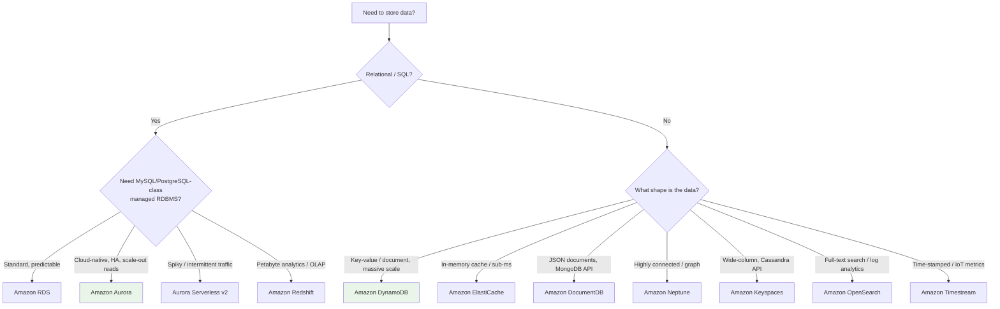

# AWS Databases - SAA-C03 Overview & Exam Guide

> A map of every AWS database service tested on SAA-C03: what each one is, when to pick it, and how they compare. Databases show up heavily in the **Design High-Performing** and **Design Resilient** domains. The single most-tested skill is **matching a workload to the right database**.

See also: [01 - RDS Intro & Core Concepts](01%20-%20RDS%20Intro%20%26%20Core%20Concepts.md) · [01 - Aurora Intro & Core Concepts](01%20-%20Aurora%20Intro%20%26%20Core%20Concepts.md) · [01 - Aurora Serverless Intro & Core Concepts](01%20-%20Aurora%20Serverless%20Intro%20%26%20Core%20Concepts.md) · [01 - DynamoDB Intro & Core Concepts](01%20-%20DynamoDB%20Intro%20%26%20Core%20Concepts.md) · [01 - ElastiCache Intro & Core Concepts](01%20-%20ElastiCache%20Intro%20%26%20Core%20Concepts.md) · [01 - Redshift Intro & Core Concepts](01%20-%20Redshift%20Intro%20%26%20Core%20Concepts.md) · [01 - DocumentDB Intro & Core Concepts](01%20-%20DocumentDB%20Intro%20%26%20Core%20Concepts.md) · [01 - Neptune Intro & Core Concepts](01%20-%20Neptune%20Intro%20%26%20Core%20Concepts.md) · [01 - Keyspaces Intro & Core Concepts](01%20-%20Keyspaces%20Intro%20%26%20Core%20Concepts.md) · [01 - OpenSearch Intro & Core Concepts](01%20-%20OpenSearch%20Intro%20%26%20Core%20Concepts.md) · [01 - Timestream Intro & Core Concepts](01%20-%20Timestream%20Intro%20%26%20Core%20Concepts.md)

---

## Table of Contents

- [Part 1: The Database Landscape](#part-1-the-database-landscape)
- [Part 2: Pick-the-Right-Database Decision Tree](#part-2-pick-the-right-database-decision-tree)
- [Part 3: Service-by-Service Cheat Matrix](#part-3-service-by-service-cheat-matrix)
- [Part 4: Engine & Model Families](#part-4-engine--model-families)
- [Part 5: Cross-Cutting Exam Themes](#part-5-cross-cutting-exam-themes)
- [Part 6: Folder Map](#part-6-folder-map)
- [Summary: Key Takeaways for SAA-C03](#summary-key-takeaways-for-saa-c03)

---

---

## Part 1: The Database Landscape

AWS groups its databases by **data model** (the "purpose-built database" philosophy). The exam expects you to recognize the model a scenario describes and map it to the service.

| Category                    | Service            | Data Model              | One-Line Identity                                           |
| :-------------------------- | :----------------- | :---------------------- | :---------------------------------------------------------- |
| **Relational (OLTP)**       | Amazon RDS         | Relational              | Managed MySQL/PostgreSQL/MariaDB/Oracle/SQL Server          |
| **Relational (OLTP)**       | Amazon Aurora      | Relational              | AWS-built MySQL/PostgreSQL-compatible, cloud-native storage |
| **Relational (serverless)** | Aurora Serverless  | Relational              | Auto-scaling Aurora; pay for capacity used                  |
| **Relational (OLAP)**       | Amazon Redshift    | Columnar MPP            | Petabyte-scale data warehouse                               |
| **Key-Value / Document**    | Amazon DynamoDB    | NoSQL key-value         | Single-digit-ms at any scale, serverless                    |
| **In-Memory**               | Amazon ElastiCache | Cache (Redis/Memcached) | Microsecond latency, caching/session store                  |
| **Document**                | Amazon DocumentDB  | Document                | MongoDB-compatible managed document DB                      |
| **Graph**                   | Amazon Neptune     | Graph                   | Relationships: fraud, social, recommendations               |
| **Wide-Column**             | Amazon Keyspaces   | Wide-column             | Apache Cassandra-compatible, serverless                     |
| **Search**                  | Amazon OpenSearch  | Search/analytics index  | Full-text search & log analytics (Elasticsearch-derived)    |
| **Time-Series**             | Amazon Timestream  | Time-series             | Serverless time-stamped data at massive scale               |

[⬆ Back to top](#table-of-contents)

---

## Part 2: Pick-the-Right-Database Decision Tree

Memorize these **trigger phrases** - they almost always point to one service:

| Scenario Keyword                                                                | Points To                                             |
| :------------------------------------------------------------------------------ | :---------------------------------------------------- |
| "Relational" + "minimal management" + "MySQL/PostgreSQL"                        | **RDS** (or Aurora if "high availability / scale")    |
| "5x throughput of MySQL" / "15 read replicas" / "6 copies across 3 AZ"          | **Aurora**                                            |
| "Unpredictable / intermittent / infrequent workload" + relational               | **Aurora Serverless v2**                              |
| "Millisecond latency at any scale" / "serverless NoSQL" / "key-value"           | **DynamoDB**                                          |
| "Microsecond" / "in-memory" / "cache" / "session store" / "leaderboard"         | **ElastiCache** (or **DAX** if specifically DynamoDB) |
| "Complex analytical queries" / "data warehouse" / "OLAP" / "petabyte" / "BI"    | **Redshift**                                          |
| "MongoDB" / "JSON documents" with MongoDB drivers                               | **DocumentDB**                                        |
| "Relationships" / "social network" / "fraud detection" / "knowledge graph"      | **Neptune**                                           |
| "Cassandra" / "CQL" / "wide-column"                                             | **Keyspaces**                                         |
| "Full-text search" / "log analytics" / "Elasticsearch" / "Kibana"               | **OpenSearch**                                        |
| "Time-series" / "IoT sensor data" / "metrics over time" / "time-stamped events" | **Timestream**                                        |

[⬆ Back to top](#table-of-contents)

---

## Part 3: Service-by-Service Cheat Matrix

| Feature               | RDS                        | Aurora                      | DynamoDB                     | ElastiCache                      | Redshift                        |
| :-------------------- | :------------------------- | :-------------------------- | :--------------------------- | :------------------------------- | :------------------------------ |
| **Serverless option** | No (Aurora SL)             | Yes (v2)                    | Yes (native)                 | Yes (Serverless)                 | Yes (Serverless)                |
| **Multi-AZ HA**       | Standby replica            | 6-way storage, auto         | 3-AZ replication             | Multi-AZ + auto failover (Redis) | Single-AZ (RA3 multi-AZ option) |
| **Read scaling**      | Up to 15 read replicas     | Up to 15 Aurora Replicas    | On-demand / auto scaling     | Read replicas (Redis)            | Concurrency scaling             |
| **Max storage**       | 64 TiB (most engines)      | 128 TiB (auto-grow)         | Unlimited                    | RAM-bound                        | Petabytes                       |
| **Backup**            | Automated + snapshots      | Continuous to S3, backtrack | PITR + on-demand             | Snapshots (Redis)                | Automated + manual snapshots    |
| **Global**            | Cross-Region read replicas | Aurora Global Database      | Global Tables (multi-active) | Global Datastore (Redis)         | Cross-Region snapshot copy      |

[⬆ Back to top](#table-of-contents)

---

## Part 4: Engine & Model Families

### Relational (managed RDBMS)

- **RDS** runs the actual engine on managed EC2 with EBS. Choose for lift-and-shift of MySQL/PostgreSQL/MariaDB/Oracle/SQL Server.
- **Aurora** re-implements the storage layer: data is striped as **6 copies across 3 AZs**, self-healing, and decoupled from compute. MySQL- and PostgreSQL-compatible only.

### NoSQL families

- **Key-value:** DynamoDB - partition-key access, predictable single-digit-ms.
- **Document:** DocumentDB - MongoDB API, nested JSON.
- **Wide-column:** Keyspaces - Cassandra/CQL.
- **Graph:** Neptune - Gremlin / SPARQL / openCypher.
- **In-memory:** ElastiCache - Redis (rich data types, persistence, HA) vs Memcached (simple, multi-threaded, no persistence).

### Analytics

- **Redshift** is **columnar + MPP** for OLAP. Never the answer for transactional (OLTP) workloads.

[⬆ Back to top](#table-of-contents)

---

## Part 5: Cross-Cutting Exam Themes

These appear regardless of which database the question targets:

| Theme                     | What to Remember                                                                                                                                   |
| :------------------------ | :------------------------------------------------------------------------------------------------------------------------------------------------- |
| **Encryption at rest**    | KMS-based for all; **must be enabled at creation** for RDS/Aurora (can't toggle on later - restore an encrypted snapshot instead).                 |
| **Encryption in transit** | TLS/SSL supported by all.                                                                                                                          |
| **OLTP vs OLAP**          | OLTP = RDS/Aurora/DynamoDB; OLAP = Redshift. A "reporting/analytics slows down my production DB" scenario → offload to Redshift or a read replica. |
| **Caching layer**         | "Reduce database load / improve read latency" → ElastiCache (or DAX for DynamoDB).                                                                 |
| **Cross-Region DR**       | Aurora Global DB, DynamoDB Global Tables, RDS cross-Region read replica, Redshift snapshot copy.                                                   |
| **IAM authentication**    | RDS/Aurora support IAM DB auth (token-based); DynamoDB is IAM-native.                                                                              |
| **Connection management** | RDS Proxy solves "too many connections" / Lambda connection storms.                                                                                |

[⬆ Back to top](#table-of-contents)

---

## Part 6: Folder Map

| Folder                          | Service                 | Start Here                                       |
| :------------------------------ | :---------------------- | :----------------------------------------------- |
| `01 - Amazon RDS`               | Relational managed      | [01 - RDS Intro & Core Concepts](01%20-%20RDS%20Intro%20%26%20Core%20Concepts.md)               |
| `02 - Amazon Aurora`            | Cloud-native relational | [01 - Aurora Intro & Core Concepts](01%20-%20Aurora%20Intro%20%26%20Core%20Concepts.md)            |
| `03 - Amazon Aurora Serverless` | Auto-scaling Aurora     | [01 - Aurora Serverless Intro & Core Concepts](01%20-%20Aurora%20Serverless%20Intro%20%26%20Core%20Concepts.md) |
| `04 - Amazon DynamoDB`          | NoSQL key-value         | [01 - DynamoDB Intro & Core Concepts](01%20-%20DynamoDB%20Intro%20%26%20Core%20Concepts.md)          |
| `05 - Amazon ElastiCache`       | In-memory cache         | [01 - ElastiCache Intro & Core Concepts](01%20-%20ElastiCache%20Intro%20%26%20Core%20Concepts.md)       |
| `06 - Amazon Redshift`          | Data warehouse          | [01 - Redshift Intro & Core Concepts](01%20-%20Redshift%20Intro%20%26%20Core%20Concepts.md)          |
| `07 - Amazon DocumentDB`        | Document (MongoDB)      | [01 - DocumentDB Intro & Core Concepts](01%20-%20DocumentDB%20Intro%20%26%20Core%20Concepts.md)        |
| `08 - Amazon Neptune`           | Graph                   | [01 - Neptune Intro & Core Concepts](01%20-%20Neptune%20Intro%20%26%20Core%20Concepts.md)           |
| `09 - Amazon Keyspaces`         | Wide-column (Cassandra) | [01 - Keyspaces Intro & Core Concepts](01%20-%20Keyspaces%20Intro%20%26%20Core%20Concepts.md)         |
| `10 - Amazon OpenSearch`        | Search & log analytics  | [01 - OpenSearch Intro & Core Concepts](01%20-%20OpenSearch%20Intro%20%26%20Core%20Concepts.md)        |
| `11 - Amazon Timestream`        | Time-series             | [01 - Timestream Intro & Core Concepts](01%20-%20Timestream%20Intro%20%26%20Core%20Concepts.md)        |

Each service folder contains: **Intro & Core Concepts → Architecture Deep Dive → Best Practices & Examples → Scenario Questions → Troubleshooting (SRE) → Important Facts & Cheat Sheet**.

[⬆ Back to top](#table-of-contents)

---

## Summary: Key Takeaways for SAA-C03

| Concept                  | What You Must Know                                                                                      |
| :----------------------- | :------------------------------------------------------------------------------------------------------ |
| **Purpose-built**        | AWS wants you to match data model → service. Don't force everything into RDS.                           |
| **RDS vs Aurora**        | Aurora = higher availability (6 copies/3 AZ), more read replicas (15), auto-scaling storage to 128 TiB. |
| **DynamoDB**             | Serverless, single-digit-ms, Global Tables for multi-active. DAX for microsecond reads.                 |
| **ElastiCache**          | Redis (HA, persistence, data structures) vs Memcached (simple, multi-threaded).                         |
| **Redshift**             | OLAP only. Never the OLTP answer.                                                                       |
| **Niche models**         | DocumentDB = MongoDB, Neptune = graph, Keyspaces = Cassandra.                                           |
| **Search & time-series** | OpenSearch = full-text search/log analytics; Timestream = serverless time-series (IoT/metrics).         |
| **Encryption**           | Enable at creation for RDS/Aurora; can't add encryption to an unencrypted DB directly.                  |

[⬆ Back to top](#table-of-contents)
