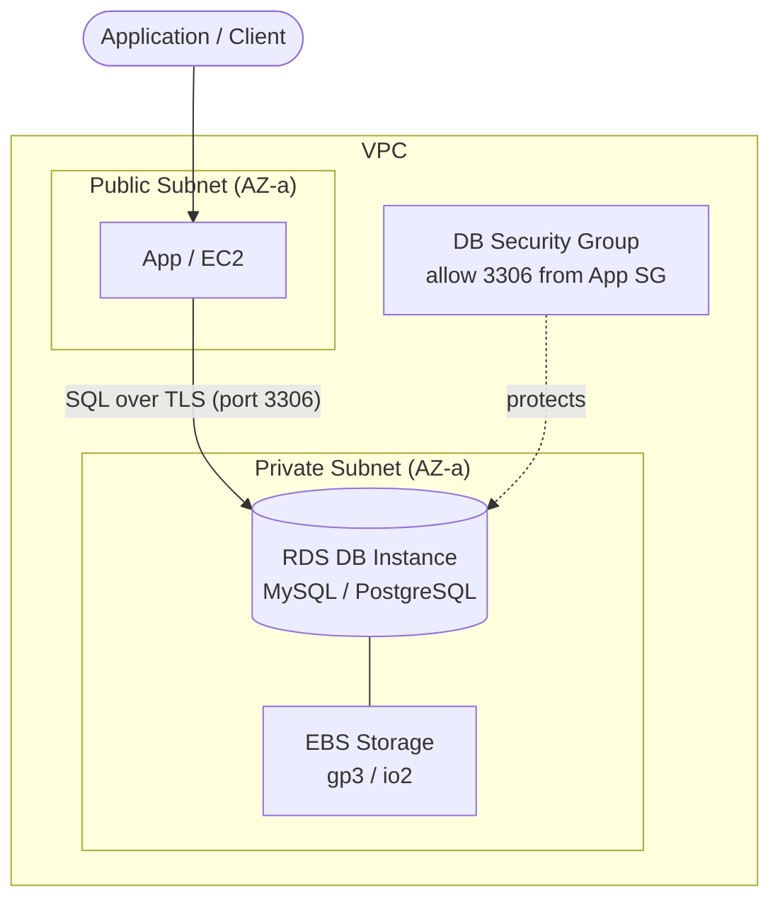

# RDS Intro & Core Concepts - SAA-C03 Deep Dive

> What Amazon RDS is, the engines it supports, instance classes, storage types, autoscaling, the shared-responsibility split, and when to pick RDS vs Aurora vs self-managed.

See also: [02 - RDS Architecture Deep Dive](02%20-%20RDS%20Architecture%20Deep%20Dive.md) · [03 - RDS Best Practices & Examples](03%20-%20RDS%20Best%20Practices%20%26%20Examples.md) · [04 - RDS Scenario Questions](04%20-%20RDS%20Scenario%20Questions.md) · [05 - RDS Troubleshooting (SRE)](05%20-%20RDS%20Troubleshooting%20%28SRE%29.md) · [06 - RDS Important Facts & Cheat Sheet](06%20-%20RDS%20Important%20Facts%20%26%20Cheat%20Sheet.md) · [00 - Databases Overview & Exam Guide](00%20-%20Databases%20Overview%20%26%20Exam%20Guide.md)

---

## Table of Contents

- [What Is Amazon RDS](#what-is-amazon-rds)
- [Supported Database Engines](#supported-database-engines)
- [DB Instance Classes](#db-instance-classes)
- [Storage Types](#storage-types)
- [Storage Autoscaling](#storage-autoscaling)
- [Shared Responsibility Model](#shared-responsibility-model)
- [RDS vs Aurora vs Self-Managed on EC2](#rds-vs-aurora-vs-self-managed-on-ec2)
- [When to Choose RDS vs NoSQL](#when-to-choose-rds-vs-nosql)
- [Aurora DSQL (Emerging)](#aurora-dsql-emerging)

---

---

## What Is Amazon RDS

Amazon Relational Database Service (RDS) is a **managed relational database** that runs a standard database engine on an **EC2 instance backed by EBS storage**, with AWS handling the undifferentiated heavy lifting: provisioning, OS patching, engine minor-version patching, automated backups, monitoring, and failover.

Key characteristics:

- You connect to a **DNS endpoint** (e.g., `mydb.abc123.us-east-1.rds.amazonaws.com`), never to an IP. The endpoint resolves to the current primary; AWS swaps the underlying record on failover.
- You do **not** get OS / SSH / `root` access to the host (exception: **RDS Custom** for Oracle/SQL Server).
- RDS lives **inside a VPC**, in subnets defined by a **DB Subnet Group**, and is protected by **security groups**.
- It is **regional in scope** for a single instance but supports **cross-Region read replicas** and **cross-Region automated backup copy** for DR.

> [!tip] Exam Tip
> If a question wants a relational engine with minimal operational overhead, automatic backups, and Multi-AZ failover, the answer is **RDS** (or **Aurora**). If it wants full OS control or an unsupported engine/version, the answer is **self-managed on EC2**.

[⬆ Back to top](#table-of-contents)

---

## Supported Database Engines

RDS supports **six** engines:

| Engine        | Notes for SAA-C03                                                                |
| :------------ | :------------------------------------------------------------------------------- |
| MySQL         | Open-source, up to 15 read replicas; default port 3306                           |
| MariaDB       | MySQL-compatible fork; port 3306                                                 |
| PostgreSQL    | Open-source; up to 15 read replicas; port 5432                                   |
| Oracle        | Commercial; **BYOL** or **License Included**; TDE via Option Group; port 1521    |
| SQL Server    | Commercial; License Included or BYOL; TDE for Enterprise; port 1433              |
| Amazon Aurora | MySQL/PostgreSQL-compatible, AWS-built, separate service tier (see Aurora notes) |

> [!tip] Exam Tip
> **Aurora is technically part of RDS** but is architecturally different (shared cluster storage, 6 copies across 3 AZs). When the exam contrasts "RDS" with "Aurora", treat RDS as the five traditional engines: MySQL, MariaDB, PostgreSQL, Oracle, SQL Server.

**Exam trap:** Oracle and SQL Server support **License Included** (pay per second/hour with the license bundled) or **Bring Your Own License (BYOL)**. SQL Server does **not** support all features in Multi-AZ the same way; for example, some Oracle/SQL Server features require **Option Groups**.

[⬆ Back to top](#table-of-contents)

---

## DB Instance Classes

The instance class controls CPU, memory, network, and EBS bandwidth. Three families:

| Class family                              | Purpose                              | Examples               |
| :---------------------------------------- | :----------------------------------- | :--------------------- |
| **Standard (db.m)**                       | Balanced general purpose             | db.m6g, db.m6i, db.m7g |
| **Memory-optimized (db.r / db.x / db.z)** | High RAM for in-memory workloads     | db.r6g, db.r6i, db.x2g |
| **Burstable (db.t)**                      | Low-cost, CPU-credit based; dev/test | db.t3, db.t4g          |

- `g` suffix = **Graviton (ARM)** — best price/performance for many workloads.
- **Burstable (db.t)** instances accumulate **CPU credits**; sustained high CPU exhausts credits and throttles — avoid for steady production load.
- Changing instance class triggers a **reboot** (brief outage unless Multi-AZ, which fails over).

> [!tip] Exam Tip
> "Cost-effective for a dev/test database with intermittent traffic" → **db.t** burstable class. "Memory-intensive analytics / large working set" → **db.r** memory-optimized.

[⬆ Back to top](#table-of-contents)

---

## Storage Types

RDS storage is **EBS volumes** under the hood. Choices:

| Type                         | Code          | IOPS / Throughput                                      | Use case                                            |
| :--------------------------- | :------------ | :----------------------------------------------------- | :-------------------------------------------------- |
| General Purpose SSD          | **gp3**       | Baseline 3,000 IOPS / 125 MB/s, independently scalable | Default for most workloads; cost-effective          |
| General Purpose SSD (legacy) | **gp2**       | IOPS scales with size (3 IOPS/GiB), burst to 3,000     | Older; bursts then throttles on small volumes       |
| Provisioned IOPS SSD         | **io1 / io2** | Up to 256,000 IOPS, consistent low latency             | I/O-intensive, latency-sensitive OLTP               |
| Magnetic                     | **standard**  | Low, legacy                                            | Backward compatibility only — do not choose for new |

Key facts:

- **gp3** decouples IOPS/throughput from capacity — you can raise IOPS without growing the disk. Usually the best default and cheaper than gp2 for high I/O.
- **io2 Block Express** offers the highest durability and IOPS-to-storage ratios.
- Max storage is **64 TiB** for MySQL, MariaDB, PostgreSQL, Oracle; **16 TiB** for SQL Server.

> [!tip] Exam Tip
> "Consistent, predictable low-latency I/O / guaranteed IOPS" → **Provisioned IOPS (io1/io2)**. "General workload, want to right-size IOPS independently and save money" → **gp3**. gp2 burst-credit exhaustion is a classic latency-spike scenario.

[⬆ Back to top](#table-of-contents)

---

## Storage Autoscaling

**RDS Storage Autoscaling** automatically grows storage when free space runs low, avoiding `DiskFull` outages.

Triggers a scale-up when **all** are true:

- Free space < **10%** of allocated storage.
- The low-space condition lasts **at least 5 minutes**.
- At least **6 hours** have passed since the last storage modification.

You set a **Maximum Storage Threshold** as a ceiling. Storage can only grow — it never shrinks automatically.

> [!tip] Exam Tip
> "Database storage filled up and caused an outage; prevent it without manual intervention" → enable **Storage Autoscaling** with a sensible max threshold. Also alarm on **FreeStorageSpace** in CloudWatch.

[⬆ Back to top](#table-of-contents)

---

## Shared Responsibility Model

| AWS manages                            | You manage                              |
| :------------------------------------- | :-------------------------------------- |
| Physical hardware, host OS             | Database schema, tables, indexes        |
| Database engine install & **patching** | Query tuning / slow queries             |
| Automated backups & Multi-AZ failover  | Security group rules & network access   |
| Underlying EBS storage durability      | IAM / DB user accounts & passwords      |
| OS-level security patches              | Parameter group & option group settings |
| Maintenance window execution           | Choosing encryption at create time      |

You do **not** get SSH/OS access (except RDS Custom). AWS does **not** tune your queries or design your schema.

> [!tip] Exam Tip
> "Who patches the OS/engine?" → **AWS**. "Why is the DB slow on well-sized hardware?" → almost always **your queries/indexes**, which is **your** responsibility (diagnose with Performance Insights).

[⬆ Back to top](#table-of-contents)

---

## RDS vs Aurora vs Self-Managed on EC2

| Dimension      | RDS (traditional)                                                                               | Aurora                                                            | Self-managed on EC2                                         |
| :------------- | :---------------------------------------------------------------------------------------------- | :---------------------------------------------------------------- | :---------------------------------------------------------- |
| Engines        | MySQL, MariaDB, PostgreSQL, Oracle, SQL Server                                                  | MySQL/PostgreSQL-compatible                                       | Any engine/version                                          |
| Ops overhead   | Low                                                                                             | Lowest                                                            | Highest (you own everything)                                |
| OS access      | No                                                                                              | No                                                                | Full                                                        |
| Storage        | Single EBS volume per instance, up to 64 TiB                                                    | Shared distributed storage, auto-grows to 128 TiB, 6 copies/3 AZs | Whatever you build                                          |
| Read scaling   | Up to 5 (Oracle/SQL Server) or 15 (MySQL/MariaDB/PostgreSQL) replicas                           | Up to 15 low-lag replicas                                         | Manual                                                      |
| HA / failover  | Multi-AZ standby, ~60–120s failover                                                             | Failover ~30s, multi-AZ by design                                 | DIY                                                         |
| When to choose | Need a specific commercial engine (Oracle/SQL Server) or standard MySQL/PostgreSQL with low ops | Want cloud-native performance/scale on MySQL/PostgreSQL           | Need unsupported engine, OS access, or exact legacy version |

> [!tip] Exam Tip
> **Oracle or SQL Server** → must be **RDS** (Aurora can't run them). **MySQL/PostgreSQL with extreme scale, fast failover, low-lag replicas** → **Aurora**. **Need root/OS or an engine RDS doesn't offer** → **EC2 self-managed**.

[⬆ Back to top](#table-of-contents)

---

## When to Choose RDS vs NoSQL

RDS (and relational databases generally) is the right choice when the data is **structured and relational** with a **fixed schema** and you need **full ACID compliance** (Atomicity, Consistency, Isolation, Durability) for transactions.

| Choose RDS / relational when…                               | Choose NoSQL (e.g., DynamoDB) when…                                         |
| :---------------------------------------------------------- | :-------------------------------------------------------------------------- |
| Data is structured with relationships (joins, foreign keys) | Data is unstructured / semi-structured or schema evolves freely             |
| You need a **fixed schema** and strong data integrity       | You need a **flexible / schemaless** model                                  |
| You require **full ACID** transactional guarantees          | Eventual consistency and high horizontal scale matter more than strict ACID |
| Complex queries / aggregations across tables                | Simple key/value or document access at massive scale                        |

> [!tip] Exam Tip
> Keywords **"relational"**, **"ACID compliance"**, **"fixed/structured schema"**, **"complex joins"** → **RDS/Aurora**. Keywords **"flexible schema"**, **"key-value"**, **"single-digit ms at any scale"** → **NoSQL (DynamoDB)**.

[⬆ Back to top](#table-of-contents)

---

## Aurora DSQL (Emerging)

**Aurora DSQL** is a newer AWS offering: a **distributed relational database** that is **PostgreSQL-compatible** and **ACID-compliant**, designed to run with **zero maintenance / operational overhead** (serverless-style — no instances, patching, or capacity planning).

How it differs from classic RDS and Aurora:

- **Distributed by design** — built for **virtually unlimited compute and storage scaling** for transactional workloads, rather than scaling a single primary instance vertically.
- **Active-active, multi-Region** — supports multiple Regions serving reads and writes concurrently with strong consistency, unlike classic RDS (single writer) or Aurora Global Database (one primary Region).
- **Serverless-style operations** — you don't choose an instance class or storage size; the service scales automatically.

> [!tip] Exam Tip
> Aurora DSQL is an emerging service. If a scenario stresses **PostgreSQL-compatible**, **distributed**, **multi-Region active-active**, **virtually unlimited scale**, and **no operational overhead** all at once, think **Aurora DSQL** — distinct from RDS (single instance) and standard Aurora (cluster with one writer per Region).

[⬆ Back to top](#table-of-contents)
