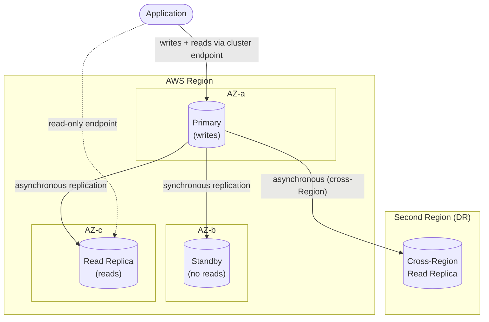

# RDS Architecture Deep Dive - SAA-C03 Deep Dive

> Multi-AZ vs read replicas, the Multi-AZ DB cluster, endpoints, backups & PITR, encryption, RDS Proxy, Blue/Green, RDS Custom, parameter/option groups, and monitoring.

See also: [01 - RDS Intro & Core Concepts](01%20-%20RDS%20Intro%20%26%20Core%20Concepts.md) · [03 - RDS Best Practices & Examples](03%20-%20RDS%20Best%20Practices%20%26%20Examples.md) · [04 - RDS Scenario Questions](04%20-%20RDS%20Scenario%20Questions.md) · [05 - RDS Troubleshooting (SRE)](05%20-%20RDS%20Troubleshooting%20%28SRE%29.md) · [06 - RDS Important Facts & Cheat Sheet](06%20-%20RDS%20Important%20Facts%20%26%20Cheat%20Sheet.md) · [00 - Databases Overview & Exam Guide](00%20-%20Databases%20Overview%20%26%20Exam%20Guide.md)

---

## Table of Contents

- [Multi-AZ Deployments](#multi-az-deployments)
- [Read Replicas](#read-replicas)
- [Multi-AZ DB Cluster](#multi-az-db-cluster)
- [Endpoints](#endpoints)
- [Backups and Point-in-Time Recovery](#backups-and-point-in-time-recovery)
- [Encryption At Rest and In Transit](#encryption-at-rest-and-in-transit)
- [RDS Proxy](#rds-proxy)
- [Blue Green Deployments](#blue-green-deployments)
- [RDS Custom](#rds-custom)
- [Parameter Groups and Option Groups](#parameter-groups-and-option-groups)
- [Maintenance Windows](#maintenance-windows)
- [IAM Database Authentication](#iam-database-authentication)
- [Performance Insights and Enhanced Monitoring](#performance-insights-and-enhanced-monitoring)

---

---

## Multi-AZ Deployments

**Multi-AZ** provisions a **synchronous standby replica in a different AZ** for **high availability**, not for read scaling.

- Replication is **synchronous** → standby is always current; no data loss on failover (RPO ~0).
- The standby is **not readable** and serves no traffic (in classic Multi-AZ instance deployment).
- **Automatic failover** on primary failure, AZ outage, storage failure, or instance-class change. AWS **swaps the DNS endpoint** to point at the promoted standby — apps just reconnect.
- Typical failover time: **60–120 seconds**.
- Backups are taken from the **standby**, so no I/O hit on the primary.

> [!tip] Exam Tip
> Multi-AZ = **high availability / durability**, NOT performance or read scaling. The standby cannot serve reads. Failover is automatic and transparent via DNS.

[⬆ Back to top](#table-of-contents)

---

## Read Replicas

**Read replicas** offload **read traffic** using **asynchronous replication**.

- Up to **15 replicas** for MySQL, MariaDB, PostgreSQL; up to **5** for Oracle and SQL Server.
- **Asynchronous** → **replica lag** is possible; reads are **eventually consistent**.
- Can be in the **same AZ, cross-AZ, or cross-Region**.
- Each replica has its **own endpoint** — the app must explicitly send reads there.
- A replica can be **promoted** to a standalone writable DB (breaks replication) — useful for DR or migrations.
- You can enable Multi-AZ on a replica for its own HA.

|               | Multi-AZ               | Read Replica |
| :------------ | :--------------------- | :----------- |
| Replication   | Synchronous            | Asynchronous |
| Purpose       | HA / failover          | Read scaling |
| Readable?     | No                     | Yes          |
| Cross-Region? | No (instance Multi-AZ) | Yes          |

> [!tip] Exam Tip
> "Offload reporting/analytics reads" or "scale read throughput" → **read replica**. "Survive an AZ failure with automatic failover" → **Multi-AZ**. Cross-Region **DR** for RDS → **cross-Region read replica** (then promote).

[⬆ Back to top](#table-of-contents)

---

## Multi-AZ DB Cluster

A newer deployment mode (MySQL & PostgreSQL) with **one writer and two readable standbys across three AZs**.

- Standbys are **readable** (unlike classic Multi-AZ) — combines HA **and** some read capacity.
- Uses **semi-synchronous** replication; failover typically **under 35 seconds**.
- Two reader endpoints can serve read traffic.

> [!tip] Exam Tip
> "Need Multi-AZ HA **and** want the standbys to also serve reads, with faster failover" → **Multi-AZ DB cluster** (not classic Multi-AZ instance, whose standby is idle).

[⬆ Back to top](#table-of-contents)

---

## Endpoints

| Endpoint                                  | Points to         | Used for              |
| :---------------------------------------- | :---------------- | :-------------------- |
| **Primary/Instance endpoint**             | Current primary   | Reads + writes        |
| **Reader endpoint** (Multi-AZ DB cluster) | Readable standbys | Reads, load-balanced  |
| **Read replica endpoint**                 | Specific replica  | Reads to that replica |

Endpoints are **DNS names**, not IPs. On failover the DNS record is updated — keep client DNS caching (TTL) low so reconnection is fast.

[⬆ Back to top](#table-of-contents)

---

## Backups and Point-in-Time Recovery

| Feature               | Detail                                                                                   |
| :-------------------- | :--------------------------------------------------------------------------------------- |
| **Automated backups** | Daily full snapshot + transaction logs; **retention 0–35 days** (0 disables)             |
| **PITR**              | Restore to any point, typically within the **last 5 minutes**, up to the retention limit |
| **Manual snapshots**  | User-initiated; retained until **you** delete them (survive instance deletion)           |
| **Restore behavior**  | Restoring **always creates a NEW instance** with a new endpoint                          |
| **Cross-Region**      | Copy snapshots or automated backups to another Region for DR                             |

> [!tip] Exam Tip
> Automated backups are **deleted when you delete the DB instance** (unless you took a final snapshot). **Manual snapshots persist**. Restore = new instance, so you must repoint apps / security groups.

[⬆ Back to top](#table-of-contents)

---

## Encryption At Rest and In Transit

**At rest (KMS):**

- Uses **AWS KMS**; encrypts the underlying storage, automated backups, snapshots, and read replicas.
- **Must be enabled at creation time.** You **cannot** encrypt an existing unencrypted instance directly.
- Workaround: **snapshot → copy snapshot with encryption enabled → restore** the encrypted snapshot.
- An encrypted instance's read replicas and snapshots are also encrypted (same or KMS-permitted key).

**TDE (Transparent Data Encryption):** column/tablespace-level encryption for **Oracle and SQL Server**, configured via **Option Groups** (separate from KMS storage encryption).

**In transit (SSL/TLS):** all engines support TLS connections using the **`rds-ca`** certificate bundle. You can force TLS via parameter (e.g., `rds.force_ssl` for PostgreSQL, `require_secure_transport` for MySQL).

> [!tip] Exam Tip
> Classic trap: "Encrypt an existing unencrypted RDS database." You **cannot** toggle it on. Answer: **snapshot it, copy the snapshot with encryption, restore from the encrypted copy.**

[⬆ Back to top](#table-of-contents)

---

## RDS Proxy

**RDS Proxy** is a fully managed **connection pooler** sitting between clients and RDS/Aurora.

- **Pools and reuses DB connections**, drastically reducing connection churn — ideal for **Lambda** and other serverless/spiky workloads that open many short connections.
- **Reduces failover time** by up to ~66% by holding connections and routing to the new primary.
- Integrates with **IAM authentication** and **Secrets Manager** for credentials.
- Runs **inside your VPC**; not publicly accessible by default.

> [!tip] Exam Tip
> "Lambda functions exhaust database connections / `Too many connections` errors at scale" → **RDS Proxy**. It also improves failover resilience and enables IAM auth.

[⬆ Back to top](#table-of-contents)

---

## Blue Green Deployments

**RDS Blue/Green Deployments** create a synchronized **green (staging) copy** of your production **blue** environment for safe changes (engine upgrades, parameter changes, schema changes).

- Green stays in sync via **logical replication**.
- You test on green, then **switch over** — typically in **under a minute** with built-in safety checks.
- Switchover renames endpoints so the app points to green with no string changes.

> [!tip] Exam Tip
> "Upgrade the engine / make schema changes with minimal downtime and easy rollback" → **Blue/Green Deployments**.

[⬆ Back to top](#table-of-contents)

---

## RDS Custom

**RDS Custom** (Oracle & SQL Server) gives you **OS and database access** for apps needing custom configuration, while AWS still automates backups/HA.

- Bridges the gap between fully managed RDS and self-managed EC2.
- You can install agents, patches, and customize the underlying OS.

> [!tip] Exam Tip
> "Need a managed Oracle/SQL Server but also require OS/SSH access for a third-party agent or custom patch" → **RDS Custom**.

[⬆ Back to top](#table-of-contents)

---

## Parameter Groups and Option Groups

|            | Parameter Group                                                 | Option Group                                      |
| :--------- | :-------------------------------------------------------------- | :------------------------------------------------ |
| Controls   | Engine config values (e.g., `max_connections`, `rds.force_ssl`) | Optional features/add-ons                         |
| Examples   | Timeouts, memory, SSL enforcement                               | Oracle TDE, SQL Server SQLSERVER_AUDIT, MEMCACHED |
| Apply type | **Dynamic** (immediate) or **Static** (needs reboot)            | Varies by option                                  |

**Static parameters require a reboot** to take effect. Changing a parameter group association may also require a reboot.

> [!tip] Exam Tip
> "Changed a parameter but it didn't take effect" → it was a **static** parameter needing a **reboot**. TDE/feature add-ons live in **Option Groups**, not Parameter Groups.

[⬆ Back to top](#table-of-contents)

---

## Maintenance Windows

- A weekly **30-minute maintenance window** for OS/engine patching and required maintenance.
- Minor version upgrades can be auto-applied; major versions are **never** automatic.
- In **Multi-AZ**, maintenance is applied to the standby first, then a **failover** moves traffic, minimizing downtime.

> [!tip] Exam Tip
> "Minimize downtime during patching" → **Multi-AZ** patches the standby then fails over. Major version upgrades are opt-in and may need compatibility checks.

[⬆ Back to top](#table-of-contents)

---

## IAM Database Authentication

Authenticate to MySQL/PostgreSQL using **IAM credentials** instead of DB passwords.

- Client requests a short-lived (**15-minute**) **auth token** via the AWS API/SDK.
- No passwords stored in code; centralized via IAM policies.
- Best paired with **TLS** (token is sent over the wire) and used with **RDS Proxy**.
- Limited connection rate — not for extremely high new-connection rates.

> [!tip] Exam Tip
> "Avoid hardcoded DB passwords / centralize DB access control with IAM" → **IAM database authentication** (MySQL/PostgreSQL). For rotation of static creds, use **Secrets Manager**.

[⬆ Back to top](#table-of-contents)

---

## Performance Insights and Enhanced Monitoring

| Tool                     | What it shows                                                                        | Source            |
| :----------------------- | :----------------------------------------------------------------------------------- | :---------------- |
| **Performance Insights** | DB load by **wait events**, top SQL, top hosts/users                                 | Engine internals  |
| **Enhanced Monitoring**  | OS-level metrics (per-process CPU, memory, disk) at up to **1-second** granularity   | Agent on the host |
| **CloudWatch metrics**   | Hypervisor-level: CPUUtilization, FreeStorageSpace, ReadLatency, DatabaseConnections | RDS service       |

Performance Insights identifies **which SQL/wait events** are driving load; Enhanced Monitoring shows **OS process detail** standard CloudWatch can't.

> [!tip] Exam Tip
> "Find the specific query/wait event causing DB load" → **Performance Insights**. "Need per-process OS metrics at 1-second resolution" → **Enhanced Monitoring**. Standard CloudWatch metrics are at the hypervisor level only.

[⬆ Back to top](#table-of-contents)
