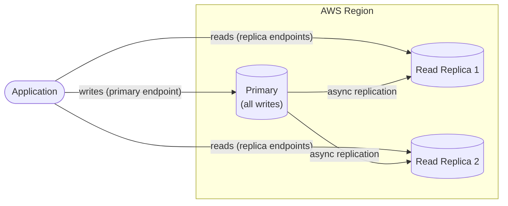

# RDS Best Practices & Examples - SAA-C03 Deep Dive

> Right-sizing, gp3 vs io2, Multi-AZ for prod, read-offload patterns, RDS Proxy, IAM + Secrets Manager, backup strategy, encryption from day one, CloudWatch alarms, cost optimization — with Terraform and CLI examples.

See also: [01 - RDS Intro & Core Concepts](01%20-%20RDS%20Intro%20%26%20Core%20Concepts.md) · [02 - RDS Architecture Deep Dive](02%20-%20RDS%20Architecture%20Deep%20Dive.md) · [04 - RDS Scenario Questions](04%20-%20RDS%20Scenario%20Questions.md) · [05 - RDS Troubleshooting (SRE)](05%20-%20RDS%20Troubleshooting%20%28SRE%29.md) · [06 - RDS Important Facts & Cheat Sheet](06%20-%20RDS%20Important%20Facts%20%26%20Cheat%20Sheet.md) · [00 - Databases Overview & Exam Guide](00%20-%20Databases%20Overview%20%26%20Exam%20Guide.md)

---

## Table of Contents

- [Creating an RDS Instance Configuration Checklist](#creating-an-rds-instance-configuration-checklist)
- [Right-Sizing the Instance](#right-sizing-the-instance)
- [Choosing Storage gp3 vs io2](#choosing-storage-gp3-vs-io2)
- [Multi-AZ for Production](#multi-az-for-production)
- [Read Replicas for Read Scaling](#read-replicas-for-read-scaling)
- [RDS Proxy for Serverless](#rds-proxy-for-serverless)
- [Least-Privilege Access](#least-privilege-access)
- [Backup and Retention Strategy](#backup-and-retention-strategy)
- [Encryption From Day One](#encryption-from-day-one)
- [CloudWatch Alarms](#cloudwatch-alarms)
- [Cost Optimization](#cost-optimization)
- [Terraform Multi-AZ Example](#terraform-multi-az-example)
- [CLI Snapshot and Restore](#cli-snapshot-and-restore)

---



---

## Creating an RDS Instance Configuration Checklist

When you create an RDS database, the console walks you through these configuration choices. Knowing the groupings makes the exam scenarios obvious:

| Configuration group           | What you choose                                                                                                                                                                       |
| :---------------------------- | :------------------------------------------------------------------------------------------------------------------------------------------------------------------------------------ |
| **Engine options**            | **Engine type** first (MySQL, MariaDB, PostgreSQL, Oracle, SQL Server, Aurora), then **edition** and **engine version**                                                               |
| **Templates**                 | Three presets that pre-select sensible defaults: **Production**, **Dev/Test**, and **Free tier**                                                                                      |
| **Settings**                  | **DB instance identifier** (must be **unique across all RDS instances in your AWS account in that Region**); master **credentials** (username/password, or manage in Secrets Manager) |
| **DB instance class**         | **Standard (db.m)**, **Memory-optimized (db.r/x/z)**, or **Burstable (db.t)**                                                                                                         |
| **Storage**                   | Type (**SSD gp3/io2**, legacy gp2, or magnetic/standard), **allocated amount**, and **storage autoscaling** on/off with a max threshold                                               |
| **Availability & durability** | **Multi-AZ** — provisions a synchronous **standby in a different AZ** for automatic failover                                                                                          |
| **Connectivity**              | **VPC**, **DB subnet group**, **security group(s)**, **public accessibility** (yes/no), **AZ** preference, and **DB port**                                                            |
| **Additional config**         | **Backups** (retention/window), **monitoring** (Performance Insights, Enhanced Monitoring), and **maintenance window**                                                                |

**Networking notes (RDS operates at the VPC level):**

- Every RDS instance is launched **into a VPC** and reachable via its subnets/security groups — it is a **VPC-level** resource, not a flat public service.
- A "classic" RDS instance can be **made publicly accessible** (reachable from the internet via a public endpoint) **or restricted** so only specific IPs/CIDRs or security groups can reach it for external access. **Public accessibility** is the toggle; the **security group** controls which source IPs/SGs are actually allowed.
- **Best practice:** keep production databases **not publicly accessible**, in **private subnets**, with the security group referencing the **app's SG** rather than `0.0.0.0/0`.

> [!tip] Exam Tip
> The **DB instance identifier must be unique within your account per Region**. The **Free tier / Dev/Test / Production** templates just pre-fill defaults (e.g., Production turns on Multi-AZ). **Public accessibility = Yes** plus an open security group is the classic "database exposed to the internet" misconfiguration.

[⬆ Back to top](#table-of-contents)

---

## Right-Sizing the Instance

- Start from the **workload profile**: CPU-bound (db.m), memory-bound/large working set (db.r), intermittent dev/test (db.t).
- Use **Performance Insights** and **CloudWatch** to observe real CPU, memory, IOPS, and connections before scaling.
- Prefer **Graviton (`g`) instances** for better price/performance where the engine version supports them.
- Scale **vertically** (instance class) for write/compute; scale **horizontally** (read replicas) for reads.

> [!tip] Exam Tip
> Don't oversize on day one — right-size from metrics. Burstable (db.t) is for spiky/low workloads; sustained load exhausts CPU credits.

[⬆ Back to top](#table-of-contents)

---

## Choosing Storage gp3 vs io2

| Need                                                                      | Choose                                |
| :------------------------------------------------------------------------ | :------------------------------------ |
| General workload, cost-effective, independent IOPS scaling                | **gp3**                               |
| Consistent sub-millisecond latency, very high IOPS, mission-critical OLTP | **io2 (Block Express)**               |
| Legacy only                                                               | gp2 / magnetic — avoid for new builds |

- **gp3** is the modern default: baseline 3,000 IOPS / 125 MB/s, scalable without growing capacity, and usually cheaper than gp2.
- Move to **io1/io2** only when you need **guaranteed, sustained high IOPS** with predictable latency.

> [!tip] Exam Tip
> If a question pits "save money / general purpose" vs "guaranteed consistent IOPS / latency-sensitive", that's **gp3 vs io1/io2**.

[⬆ Back to top](#table-of-contents)

---

## Multi-AZ for Production

- **Always enable Multi-AZ for production** databases — it provides automatic failover and zero-RPO synchronous standby.
- Backups run off the standby, so no production I/O penalty.
- Combine Multi-AZ (HA) with **read replicas** (scaling) — they solve different problems.
- For HA **plus** readable standbys and faster failover, consider a **Multi-AZ DB cluster**.

> [!tip] Exam Tip
> Multi-AZ does not improve performance and the standby is not readable (classic mode). It is purely an availability/durability control.

[⬆ Back to top](#table-of-contents)

---

## Read Replicas for Read Scaling

- Route **reporting, analytics, and read-heavy** traffic to replicas to protect the primary.
- Use a separate **reader connection string** in the app; never assume the primary endpoint balances reads.
- Tolerate **eventual consistency** (async lag) — don't read-after-write critical data from a replica.
- A dedicated **reporting replica** isolates heavy analytical queries from OLTP.

> [!tip] Exam Tip
> "Heavy reporting queries are slowing the production database" → add a **read replica** and point reporting at it.

[⬆ Back to top](#table-of-contents)

---

## RDS Proxy for Serverless

- Put **RDS Proxy** in front of databases accessed by **Lambda** or autoscaling fleets to pool connections.
- Prevents connection storms and `Too many connections` errors.
- Improves failover handling and supports **IAM auth** + **Secrets Manager** for credentials.

> [!tip] Exam Tip
> Lambda + RDS at scale almost always implies **RDS Proxy** in the correct answer.

[⬆ Back to top](#table-of-contents)

---

## Least-Privilege Access

- Use **IAM database authentication** (MySQL/PostgreSQL) to avoid static passwords where possible.
- Store and **rotate** DB credentials with **AWS Secrets Manager** (native RDS rotation Lambda).
- Restrict network access with **security groups** referencing the **app's SG**, not `0.0.0.0/0`.
- Place databases in **private subnets**; never assign a public IP to production DBs.
- Enforce **TLS** in transit via parameter groups.

```json
{
  "Version": "2012-10-17",
  "Statement": [
    {
      "Effect": "Allow",
      "Action": "rds-db:connect",
      "Resource": "arn:aws:rds-db:us-east-1:123456789012:dbuser:db-ABCDEFGHIJKL/app_user"
    }
  ]
}
```

> [!tip] Exam Tip
> "Rotate DB credentials automatically" → **Secrets Manager** rotation. "No passwords in code" → **IAM database authentication**.

[⬆ Back to top](#table-of-contents)

---

## Backup and Retention Strategy

- Set **automated backup retention** to meet your RPO (1–35 days; longer for compliance).
- Take **manual snapshots** before risky changes — they persist independently of the instance.
- **Copy snapshots/backups cross-Region** for DR.
- Take a **final snapshot** on deletion (don't skip it for prod).
- Remember **PITR** lets you restore to ~5-minute granularity within retention.

> [!tip] Exam Tip
> Long-term/cross-Region retention and DR → copy snapshots to another Region. Automated backups vanish with the instance; manual snapshots don't.

[⬆ Back to top](#table-of-contents)

---

## Encryption From Day One

- **Enable KMS encryption at creation** — you cannot turn it on later without a snapshot-copy-restore dance.
- Use a **customer-managed KMS key (CMK)** for control over rotation and cross-account/cross-Region sharing.
- For Oracle/SQL Server column-level needs, add **TDE via Option Group**.
- Enforce **TLS** for in-transit protection.

> [!tip] Exam Tip
> Build encrypted from the start. To encrypt an existing DB: **snapshot → copy with encryption → restore.**

[⬆ Back to top](#table-of-contents)

---

## CloudWatch Alarms

Recommended baseline alarms:

| Metric                         | Why                          | Example threshold      |
| :----------------------------- | :--------------------------- | :--------------------- |
| **CPUUtilization**             | Sustained CPU pressure       | > 80% for 15 min       |
| **FreeStorageSpace**           | Prevent DiskFull outage      | < 10% / < 5 GiB        |
| **ReadLatency / WriteLatency** | I/O bottleneck               | > 20 ms                |
| **DatabaseConnections**        | Connection exhaustion        | near `max_connections` |
| **FreeableMemory**             | Memory pressure / swapping   | low / dropping         |
| **ReplicaLag**                 | Stale reads on replicas      | > acceptable seconds   |
| **BurstBalance** (gp2)         | gp2 IOPS credits running out | < 20%                  |

> [!tip] Exam Tip
> The classic four to alarm on: **CPUUtilization, FreeStorageSpace, ReadLatency, DatabaseConnections.** Add **ReplicaLag** and **BurstBalance** where relevant.

[⬆ Back to top](#table-of-contents)

---

## Cost Optimization

- **Reserved Instances** (1- or 3-year) for steady-state production — large savings vs On-Demand.
- **Stop/Start** dev/test instances when idle (RDS auto-restarts after 7 days stopped).
- Migrate **gp2 → gp3** to cut storage cost and gain IOPS flexibility.
- Use **Graviton** instance classes for price/performance.
- Delete unused **manual snapshots** (they bill until deleted).
- Right-size with metrics; avoid permanently over-provisioned io1/io2.

> [!tip] Exam Tip
> "Lowest cost for a predictable, always-on production DB" → **Reserved Instances**. "Idle dev DB nights/weekends" → **stop/start**.

[⬆ Back to top](#table-of-contents)

---

## Terraform Multi-AZ Example

```hcl
resource "aws_db_instance" "prod" {
  identifier              = "app-prod-mysql"
  engine                  = "mysql"
  engine_version          = "8.0"
  instance_class          = "db.m6g.large"

  allocated_storage       = 100
  max_allocated_storage   = 1000          # storage autoscaling ceiling
  storage_type            = "gp3"
  iops                    = 12000
  storage_encrypted       = true          # MUST be set at create
  kms_key_id              = aws_kms_key.rds.arn

  multi_az                = true          # HA standby in another AZ
  db_subnet_group_name    = aws_db_subnet_group.private.name
  vpc_security_group_ids  = [aws_security_group.db.id]
  publicly_accessible     = false

  backup_retention_period = 14            # days (0-35)
  backup_window           = "03:00-04:00"
  maintenance_window      = "sun:04:30-sun:05:30"
  deletion_protection     = true
  skip_final_snapshot     = false
  final_snapshot_identifier = "app-prod-mysql-final"

  performance_insights_enabled = true
  iam_database_authentication_enabled = true

  username                = "admin"
  manage_master_user_password = true      # store/rotate in Secrets Manager
}
```

> [!tip] Exam Tip
> `storage_encrypted` and `multi_az` are the load-bearing prod flags. `manage_master_user_password = true` offloads the master credential to **Secrets Manager**.

[⬆ Back to top](#table-of-contents)

---

## CLI Snapshot and Restore

Create a manual snapshot:

```bash
aws rds create-db-snapshot \
  --db-instance-identifier app-prod-mysql \
  --db-snapshot-identifier app-prod-mysql-2026-06-01
```

Copy the snapshot to another Region **with encryption** (also the trick to encrypt an unencrypted DB):

```bash
aws rds copy-db-snapshot \
  --source-db-snapshot-identifier arn:aws:rds:us-east-1:123456789012:snapshot:app-prod-mysql-2026-06-01 \
  --target-db-snapshot-identifier app-prod-mysql-dr \
  --kms-key-id alias/rds-dr-key \
  --source-region us-east-1 \
  --region us-west-2
```

Restore the snapshot into a **new** instance:

```bash
aws rds restore-db-instance-from-db-snapshot \
  --db-instance-identifier app-prod-mysql-restored \
  --db-snapshot-identifier app-prod-mysql-2026-06-01 \
  --db-instance-class db.m6g.large \
  --multi-az
```

Point-in-time restore (PITR) to a specific timestamp:

```bash
aws rds restore-db-instance-to-point-in-time \
  --source-db-instance-identifier app-prod-mysql \
  --target-db-instance-identifier app-prod-mysql-pitr \
  --restore-time 2026-06-01T02:55:00Z
```

> [!tip] Exam Tip
> Every restore produces a **new instance with a new endpoint** — update app config/security groups. Copy-snapshot-with-KMS is the canonical "encrypt an existing DB" answer.

[⬆ Back to top](#table-of-contents)
