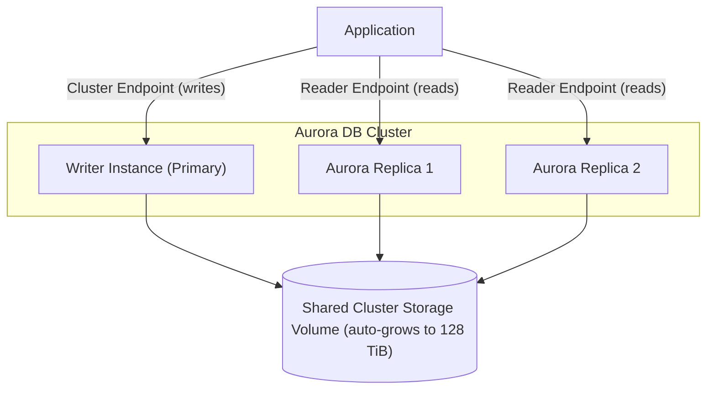

# Aurora Intro & Core Concepts - SAA-C03 Deep Dive

> Amazon Aurora is AWS's cloud-native, MySQL- and PostgreSQL-compatible relational database that decouples compute from a distributed, auto-scaling storage layer for high performance and availability.

See also: [02 - Aurora Architecture Deep Dive](02%20-%20Aurora%20Architecture%20Deep%20Dive.md) · [03 - Aurora Best Practices & Examples](03%20-%20Aurora%20Best%20Practices%20%26%20Examples.md) · [04 - Aurora Scenario Questions](04%20-%20Aurora%20Scenario%20Questions.md) · [05 - Aurora Troubleshooting (SRE)](05%20-%20Aurora%20Troubleshooting%20%28SRE%29.md) · [06 - Aurora Important Facts & Cheat Sheet](06%20-%20Aurora%20Important%20Facts%20%26%20Cheat%20Sheet.md) · [00 - Databases Overview & Exam Guide](00%20-%20Databases%20Overview%20%26%20Exam%20Guide.md) · [01 - RDS Intro & Core Concepts](01%20-%20RDS%20Intro%20%26%20Core%20Concepts.md)

---

## Table of Contents

- [What Is Amazon Aurora](#what-is-amazon-aurora)
- [Performance Claims & Why](#performance-claims--why)
- [Decoupled Compute & Storage](#decoupled-compute--storage)
- [Auto-Scaling Storage](#auto-scaling-storage)
- [Aurora vs RDS](#aurora-vs-rds)
- [Aurora I/O-Optimized vs Standard](#aurora-io-optimized-vs-standard)
- [Exam Tips & Traps](#exam-tips--traps)

---

---

## What Is Amazon Aurora

Amazon Aurora is a fully managed, **cloud-native relational database** built by AWS that is **wire-compatible with MySQL and PostgreSQL**. Existing applications, drivers, and tools that work with MySQL or PostgreSQL work with Aurora with little or no change.

Key points:

- It is part of the **RDS family** — you manage it through the RDS console/API — but its internal storage engine is a custom AWS design, not the open-source engine.
- Aurora is **not serverless by default**; it runs on provisioned DB instances (with Aurora Serverless v2 as an option — see [02 - Aurora Architecture Deep Dive](02%20-%20Aurora%20Architecture%20Deep%20Dive.md)).
- Designed for **enterprise workloads** needing high throughput, high availability (HA), and durability without the operational overhead of self-managing replication and storage.

Compatibility versions track upstream engines (e.g., Aurora MySQL 3.x = MySQL 8.0 compatible; Aurora PostgreSQL tracks PostgreSQL major versions).

[⬆ Back to top](#table-of-contents)

---

## Performance Claims & Why

AWS markets Aurora as delivering:

- **Up to 5x the throughput of standard MySQL**
- **Up to 3x the throughput of standard PostgreSQL**

These gains come from architectural choices, not just bigger hardware:

| Factor                             | How it helps                                                                                              |
| :--------------------------------- | :-------------------------------------------------------------------------------------------------------- |
| Offloaded redo log processing      | The storage layer applies redo log records; the DB instance does not write full data pages, reducing I/O. |
| Distributed, purpose-built storage | Storage is a multi-tenant, SSD-backed fleet shared across the cluster.                                    |
| Reduced network chatter            | Only redo log records cross the network on writes, not full pages.                                        |
| Parallel, quorum-based writes      | Writes go to 6 copies; only 4 must ack — see [02 - Aurora Architecture Deep Dive](02%20-%20Aurora%20Architecture%20Deep%20Dive.md).                      |

> [!note]
> The "5x / 3x" numbers are benchmark claims under specific conditions. For the exam, just remember the **direction**: Aurora is faster and more available than self-managed or RDS-on-the-same-engine.

[⬆ Back to top](#table-of-contents)

---

## Decoupled Compute & Storage

Aurora's defining feature is that **compute (DB instances) and storage are separated**:

- **Compute layer** = the writer + readers. These are stateless with respect to durable data; they cache pages but persist nothing locally that can't be rebuilt.
- **Storage layer** = a single, shared, distributed **cluster volume** that all instances in the cluster read from and write to.

Consequences:

- Adding a read replica does **not** copy the data — replicas attach to the same shared volume, so they spin up fast and stay in sync with very low lag.
- Failover is fast because a replica already sees the same storage; it just gets promoted.
- You can resize or replace instances independently of the data.

[⬆ Back to top](#table-of-contents)

---

## Auto-Scaling Storage

The Aurora cluster volume **grows automatically** as data is added:

| Property     | Value                                                                             |
| :----------- | :-------------------------------------------------------------------------------- |
| Increment    | **10 GB** chunks (protection groups)                                              |
| Maximum size | **128 TiB**                                                                       |
| Shrinking    | Aurora MySQL/PostgreSQL can reclaim space (dynamic resizing) when data is deleted |
| Provisioning | No need to pre-provision storage — you never run out unexpectedly                 |

You pay for storage consumed (and for I/O, unless on I/O-Optimized — see below). There is **no manual storage scaling action** like there is with classic RDS (no "modify allocated storage").

> [!tip]
> Exam phrasing: "storage automatically scales in 10 GB increments up to 128 TiB" is a classic Aurora identifier.

[⬆ Back to top](#table-of-contents)

---

## Aurora vs RDS

Aurora _is_ a member of the RDS family, but differs sharply from RDS for MySQL/PostgreSQL/etc.:

| Dimension           | RDS (MySQL/PostgreSQL)               | Amazon Aurora                              |
| :------------------ | :----------------------------------- | :----------------------------------------- |
| Storage             | EBS volume per instance              | Shared distributed cluster volume          |
| Storage replication | 1 copy (+1 in Multi-AZ standby)      | **6 copies across 3 AZs**                  |
| Read replicas       | Up to 5 (engine-dependent), async    | Up to **15 Aurora Replicas**, very low lag |
| Failover (Multi-AZ) | ~60–120s, DNS to standby             | Typically **< 30s**, often faster          |
| Storage scaling     | Manual or storage autoscaling, GP/IO | Automatic, 10 GB increments to 128 TiB     |
| Throughput          | Baseline engine                      | Up to 5x MySQL / 3x PostgreSQL             |
| Backtrack           | No                                   | Yes (Aurora MySQL only)                    |
| Global Database     | No                                   | Yes                                        |
| Cost                | Lower entry cost                     | Higher per-instance, more capability       |

> [!warning]
> A common trap: "RDS Multi-AZ" gives a standby in another AZ for **HA only** (no read traffic on the standby for MySQL/PostgreSQL). Aurora replicas serve reads **and** act as failover targets.

[⬆ Back to top](#table-of-contents)

---

## Aurora I/O-Optimized vs Standard

Aurora has two storage/pricing configurations:

| Config                   | You pay for                                                               | Best when                                              |
| :----------------------- | :------------------------------------------------------------------------ | :----------------------------------------------------- |
| **Aurora Standard**      | Compute + storage + **per-request I/O**                                   | I/O is a small fraction of the bill (low/moderate I/O) |
| **Aurora I/O-Optimized** | Compute + storage only (**no I/O charges**); higher compute/storage rates | I/O charges exceed **~25%** of your total Aurora bill  |

Key facts:

- I/O-Optimized provides **predictable pricing** (no per-I/O line item) and can be **up to ~40% cheaper** for I/O-intensive workloads.
- You can switch a cluster to I/O-Optimized; switching **back to Standard** is limited (typically once per 30-day period).
- Applies to provisioned and Serverless v2.

> [!tip]
> Decision rule for the exam: **if I/O > ~25% of the bill, choose I/O-Optimized.** See worked decision in [04 - Aurora Scenario Questions](04%20-%20Aurora%20Scenario%20Questions.md).

[⬆ Back to top](#table-of-contents)

---

## Exam Tips & Traps

- "MySQL- and PostgreSQL-compatible, cloud-native, 5x/3x throughput" → **Aurora**.
- "Storage auto-grows in 10 GB increments to 128 TiB" → **Aurora** (RDS uses allocated storage).
- "6 copies across 3 AZs" → Aurora durability signature (details in [02 - Aurora Architecture Deep Dive](02%20-%20Aurora%20Architecture%20Deep%20Dive.md)).
- Aurora ≠ serverless by default; **Aurora Serverless v2** is the auto-scaling-compute option.
- Choose **I/O-Optimized** when the workload is I/O-heavy (>~25% of bill) for cost savings + predictability.
- Don't confuse **Aurora Replicas** (share storage, fast failover) with **RDS read replicas** (separate storage, async).

[⬆ Back to top](#table-of-contents)
