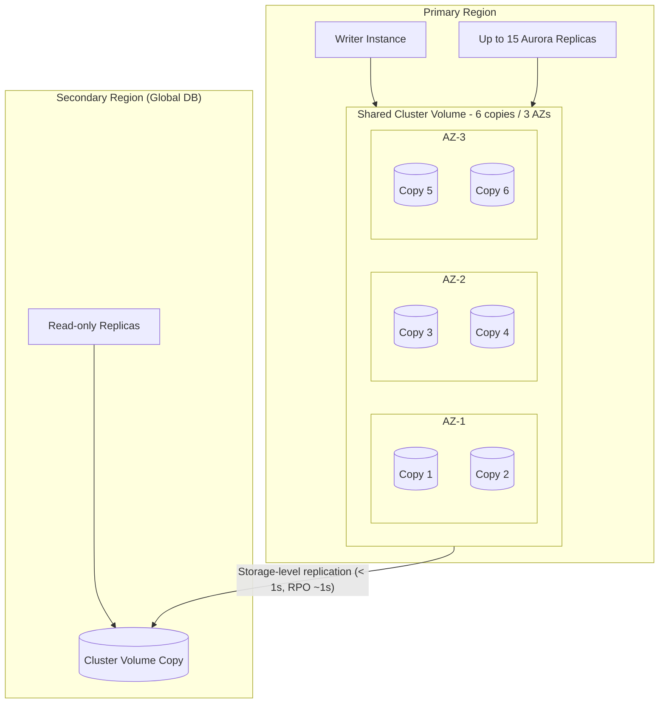

# Aurora Architecture Deep Dive - SAA-C03 Deep Dive

> Aurora stores 6 copies of your data across 3 Availability Zones with quorum writes/reads, a single writer plus up to 15 replicas, multiple endpoint types, and optional Global Database, Backtrack, and fast cloning.

See also: [01 - Aurora Intro & Core Concepts](01%20-%20Aurora%20Intro%20%26%20Core%20Concepts.md) · [03 - Aurora Best Practices & Examples](03%20-%20Aurora%20Best%20Practices%20%26%20Examples.md) · [04 - Aurora Scenario Questions](04%20-%20Aurora%20Scenario%20Questions.md) · [05 - Aurora Troubleshooting (SRE)](05%20-%20Aurora%20Troubleshooting%20%28SRE%29.md) · [06 - Aurora Important Facts & Cheat Sheet](06%20-%20Aurora%20Important%20Facts%20%26%20Cheat%20Sheet.md) · [00 - Databases Overview & Exam Guide](00%20-%20Databases%20Overview%20%26%20Exam%20Guide.md) · [01 - RDS Intro & Core Concepts](01%20-%20RDS%20Intro%20%26%20Core%20Concepts.md)

---

## Table of Contents

- [Distributed Storage Layer](#distributed-storage-layer)
- [Quorum & Self-Healing](#quorum--self-healing)
- [Writer & Aurora Replicas](#writer--aurora-replicas)
- [Endpoint Types](#endpoint-types)
- [Automatic Failover & Priority Tiers](#automatic-failover--priority-tiers)
- [Aurora Global Database](#aurora-global-database)
- [Backtrack](#backtrack)
- [Fast Database Cloning](#fast-database-cloning)
- [Continuous Backup & PITR](#continuous-backup--pitr)
- [Aurora Serverless](#aurora-serverless)
- [Encryption](#encryption)
- [Exam Tips & Traps](#exam-tips--traps)

---

---

## Distributed Storage Layer

The Aurora cluster volume is **not** a normal disk. It is a purpose-built, distributed, log-structured storage service:

- Data is stored as **6 copies across 3 Availability Zones** (2 copies per AZ).
- Storage is divided into **10 GB segments** (protection groups); each segment is independently replicated 6-ways.
- The DB instance sends only **redo log records** to storage; the storage fleet materializes data pages asynchronously. This is the core of Aurora's performance advantage.

Because storage spans 3 AZs, Aurora can tolerate the loss of an **entire AZ plus one additional copy** without losing the ability to read, and the loss of a full AZ without losing write availability.

[⬆ Back to top](#table-of-contents)

---

## Quorum & Self-Healing

Aurora uses **quorum-based** I/O across the 6 copies:

| Operation | Quorum required     | Reason                                                               |
| :-------- | :------------------ | :------------------------------------------------------------------- |
| **Write** | **4 of 6** (Vw = 4) | Survives loss of an entire AZ (2 copies) and still writes            |
| **Read**  | **3 of 6** (Vr = 3) | Vw + Vr > 6 guarantees a consistent read intersects the latest write |

Durability/availability properties:

- **Lose 2 copies** (e.g., a full AZ): writes continue (4 remaining ≥ 4).
- **Lose 3 copies**: reads still succeed (3 remaining ≥ 3); write availability is restored as copies heal.
- **Self-healing**: the storage fleet continuously scans for and repairs lost/corrupt segments using the surviving copies and peer-to-peer gossip — no DBA action needed.

> [!note]
> Remember the pair: **Write = 4/6, Read = 3/6.** It is designed so a single AZ failure never blocks writes.

[⬆ Back to top](#table-of-contents)

---

## Writer & Aurora Replicas

An Aurora cluster has:

- **Exactly one writer (primary) instance** that handles all writes (single-master, the common mode).
- **Up to 15 Aurora Replicas** that serve read traffic and act as failover targets.

Properties:

- All instances share the **same cluster volume**, so replica lag is typically **milliseconds** (no separate data replication stream like RDS read replicas).
- Replicas can be in **different AZs** for HA.
- Adding/removing replicas is fast (no data copy).

(Aurora also offers **Multi-Master** in older Aurora MySQL, but it is niche and rarely tested; assume single-writer.)

[⬆ Back to top](#table-of-contents)

---

## Endpoint Types

Aurora exposes several DNS endpoints — using the right one is a frequent exam point:

| Endpoint                      | Points to                                    | Use for                                              |
| :---------------------------- | :------------------------------------------- | :--------------------------------------------------- |
| **Cluster (writer) endpoint** | Current **writer** instance                  | All writes; follows failover automatically           |
| **Reader endpoint**           | **Load-balanced** across all Aurora Replicas | Scale-out **reads**; connection-level load balancing |
| **Custom endpoint**           | A user-defined subset of instances           | Route workloads (e.g., analytics to large instances) |
| **Instance endpoint**         | One specific instance                        | Diagnostics/fine control — **avoid in app config**   |

> [!warning]
> Never hard-code an **instance endpoint** in your application. After a failover the writer changes; use the **cluster endpoint** (writes) and **reader endpoint** (reads) so DNS follows the promotion. See [05 - Aurora Troubleshooting (SRE)](05%20-%20Aurora%20Troubleshooting%20%28SRE%29.md).

[⬆ Back to top](#table-of-contents)

---

## Automatic Failover & Priority Tiers

If the writer fails, Aurora **automatically promotes** a replica:

- The **cluster endpoint** DNS is repointed to the new writer — typically in **under 30 seconds** (often ~30s end-to-end including DNS).
- If there are **no replicas**, Aurora creates a new instance, which is slower.

**Failover priority tiers (0–15):**

- Each replica is assigned a **promotion tier 0–15** (`promotion-tier`).
- On failover, Aurora promotes the replica in the **lowest-numbered tier** (0 = highest priority).
- **Tie-breaker**: among replicas in the same tier, the one with the **largest instance size** is promoted.

> [!tip]
> Put the replica you want promoted (e.g., the largest, same-size-as-writer instance) in **tier 0**.

[⬆ Back to top](#table-of-contents)

---

## Aurora Global Database

Aurora Global Database spans Regions for low-latency global reads and disaster recovery:

| Property          | Value                                                                                        |
| :---------------- | :------------------------------------------------------------------------------------------- |
| Topology          | **1 primary Region + up to 5 secondary Regions**                                             |
| Replication       | **Storage-level**, typically **< 1 second** cross-Region                                     |
| RPO               | **~1 second**                                                                                |
| RTO               | **< 1 minute** (managed planned failover / unplanned promotion)                              |
| Secondary Regions | **Read-only** (up to 16 replicas each)                                                       |
| Write forwarding  | Secondary-Region instances can **forward writes** to the primary (Aurora MySQL & PostgreSQL) |

Use cases:

- **Low-latency reads** for users in distant Regions.
- **Cross-Region DR** with sub-minute RTO and ~1s RPO — far better than building your own cross-Region read replica.
- **Managed failover** promotes a secondary to primary.

> [!note]
> Replication uses the dedicated storage layer, so it **does not consume DB instance CPU** the way logical replication would, and lag stays low.

[⬆ Back to top](#table-of-contents)

---

## Backtrack

**Backtrack** (Aurora **MySQL only**) rewinds the cluster to a prior point in time **in place**, without restoring from a snapshot:

- Rewinds the **existing cluster** (no new cluster created) — fast, seconds to minutes.
- Configure a **target backtrack window** (e.g., up to 72 hours).
- Great for recovering from a **bad write / accidental data change** (e.g., a faulty `DELETE`).
- It is **not a backup** — it does not protect against storage loss; it rewinds within the retained change records.

> [!warning]
> Backtrack is **Aurora MySQL only** — not available for Aurora PostgreSQL. For PostgreSQL, use **PITR** (snapshot/continuous restore) instead.

[⬆ Back to top](#table-of-contents)

---

## Fast Database Cloning

Aurora **fast cloning** creates a new cluster from an existing one using **copy-on-write**:

- The clone initially shares the **same storage pages** as the source — created in **minutes** regardless of DB size.
- Storage diverges only as **either** cluster writes new data (copy-on-write).
- Clone and source are **isolated** (separate instances/endpoints).
- Ideal for **test/dev, what-if analysis, schema changes** on prod-like data without a full copy.

> [!tip]
> Cloning is much faster and cheaper than restoring a snapshot when you need a prod-like environment **right now**.

[⬆ Back to top](#table-of-contents)

---

## Continuous Backup & PITR

- Aurora **continuously backs up** the cluster volume to **Amazon S3** with **no performance impact** (it's a storage-layer feature, not an instance snapshot).
- Supports **Point-in-Time Recovery (PITR)** within the backup retention window (1–35 days).
- Backups are incremental and automatic; you can also take **manual snapshots** (retained until deleted).
- Snapshots can be **shared** and **copied cross-Region**.

[⬆ Back to top](#table-of-contents)

---

## Aurora Serverless

Aurora Serverless **auto-scales compute**:

- **Serverless v2** scales capacity in fine-grained **ACUs** (Aurora Capacity Units), supports HA, replicas, Global Database, and most features — recommended over v1.
- Pay for capacity consumed; good for **variable/intermittent** workloads.
- Covered as a cross-link here; the storage architecture is identical to provisioned Aurora.

See pricing interplay with I/O-Optimized in [01 - Aurora Intro & Core Concepts](01%20-%20Aurora%20Intro%20%26%20Core%20Concepts.md).

[⬆ Back to top](#table-of-contents)

---

## Encryption

- **Encryption at rest** uses **AWS KMS** and must be **enabled at cluster creation** — you cannot turn on encryption for an existing unencrypted cluster directly.
- To encrypt an existing unencrypted cluster: take a snapshot, **copy the snapshot with encryption enabled**, then restore.
- Encryption covers the cluster volume, automated backups, snapshots, and replicas.
- **In transit**: TLS/SSL to the endpoints.
- Encryption is **inherited** by replicas and Global Database secondaries.

[⬆ Back to top](#table-of-contents)

---

## Exam Tips & Traps

- **6 copies / 3 AZs**, **write 4/6**, **read 3/6** — memorize.
- **Up to 15 Aurora Replicas**; failover < 30s; promotion by **lowest tier (0–15)**, ties broken by size.
- **Global Database**: 1 primary + **up to 5 secondary Regions**, **< 1s** replication, **RPO ~1s**, **RTO < 1 min**, **write forwarding**.
- **Backtrack = Aurora MySQL only**, in-place rewind, not a backup.
- **Cloning = copy-on-write**, fast prod-like environments.
- Use **cluster/reader endpoints**, never instance endpoints, in apps.
- **Encryption must be set at create** (snapshot-copy trick to add later).

[⬆ Back to top](#table-of-contents)
