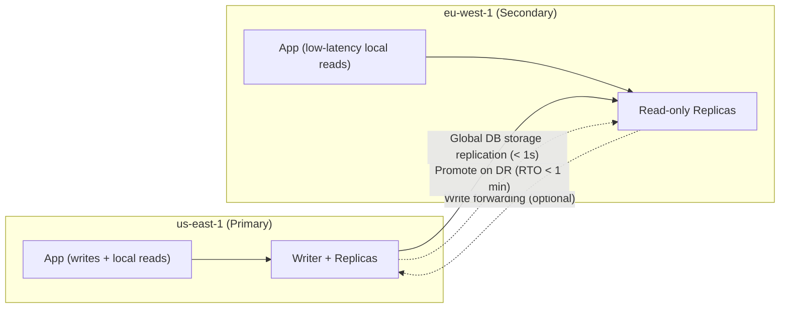

# Aurora Best Practices & Examples - SAA-C03 Deep Dive

> Practical patterns for choosing Aurora, scaling reads, configuring failover, building cross-Region DR with Global Database, using cloning and Backtrack, and provisioning with Terraform.

See also: [01 - Aurora Intro & Core Concepts](01%20-%20Aurora%20Intro%20%26%20Core%20Concepts.md) · [02 - Aurora Architecture Deep Dive](02%20-%20Aurora%20Architecture%20Deep%20Dive.md) · [04 - Aurora Scenario Questions](04%20-%20Aurora%20Scenario%20Questions.md) · [05 - Aurora Troubleshooting (SRE)](05%20-%20Aurora%20Troubleshooting%20%28SRE%29.md) · [06 - Aurora Important Facts & Cheat Sheet](06%20-%20Aurora%20Important%20Facts%20%26%20Cheat%20Sheet.md) · [00 - Databases Overview & Exam Guide](00%20-%20Databases%20Overview%20%26%20Exam%20Guide.md) · [01 - RDS Intro & Core Concepts](01%20-%20RDS%20Intro%20%26%20Core%20Concepts.md)

---

## Table of Contents

- [When to Choose Aurora](#when-to-choose-aurora)
- [Scaling Reads with the Reader Endpoint](#scaling-reads-with-the-reader-endpoint)
- [Configuring Failover Priority](#configuring-failover-priority)
- [Global Database for DR & Global Reads](#global-database-for-dr--global-reads)
- [Cloning for Test & Dev](#cloning-for-test--dev)
- [Backtrack vs Snapshot Restore](#backtrack-vs-snapshot-restore)
- [I/O-Optimized Decision](#io-optimized-decision)
- [RDS Proxy with Aurora](#rds-proxy-with-aurora)
- [CloudWatch Alarms](#cloudwatch-alarms)
- [Terraform Example](#terraform-example)
- [Failover Testing](#failover-testing)
- [Exam Tips & Traps](#exam-tips--traps)

---



---

## When to Choose Aurora

Pick Aurora over RDS or self-managed when you need:

- **High availability** with fast failover and 6-way/3-AZ durability.
- **Read scaling** with up to 15 low-lag replicas.
- **Global low-latency reads** and **sub-minute cross-Region DR** (Global Database).
- **Operational features** like Backtrack, fast cloning, continuous S3 backup.

Stay on **RDS** (not Aurora) when:

- You need an engine Aurora doesn't support (SQL Server, Oracle, MariaDB).
- Cost sensitivity favors a smaller, simpler single-AZ footprint.
- You need exact upstream-engine behavior/version Aurora hasn't adopted yet.

[⬆ Back to top](#table-of-contents)

---

## Scaling Reads with the Reader Endpoint

- Point **read-heavy** traffic at the **reader endpoint** — it load-balances new connections across all Aurora Replicas.
- Add replicas (up to 15) to scale reads **without application changes**.
- Use **Aurora Auto Scaling** to add/remove replicas based on CPU or connections.
- For deterministic routing (e.g., reporting on a big instance), use a **custom endpoint**.

> [!tip]
> Reader endpoint balances **per connection**, not per query. Long-lived pooled connections can pin to one replica — use short-lived connections or a proxy if balance matters.

[⬆ Back to top](#table-of-contents)

---

## Configuring Failover Priority

- Assign **promotion tiers (0–15)** to control which replica is promoted first.
- Put your **largest, same-class** replica in **tier 0**.
- Spread replicas across **multiple AZs** so a single-AZ failure leaves a promotion candidate.

```bash
aws rds modify-db-instance \
  --db-instance-identifier aurora-replica-1 \
  --promotion-tier 0 \
  --apply-immediately
```

[⬆ Back to top](#table-of-contents)

---

## Global Database for DR & Global Reads

Use Aurora **Global Database** when:

- Users are spread across Regions and need **local read latency**.
- You need **DR with RPO ~1s and RTO < 1 min**.

Best practices:

- Keep **at least one replica** in each secondary Region for HA.
- Use **managed planned failover** for Region maintenance/migration (no data loss).
- Use **unplanned promotion** in a real Region outage.
- Enable **write forwarding** if secondary-Region apps occasionally write.

```bash
# Create the global cluster, then add a secondary Region cluster
aws rds create-global-cluster --global-cluster-identifier my-global \
  --source-db-cluster-identifier arn:aws:rds:us-east-1:111122223333:cluster:primary
```

[⬆ Back to top](#table-of-contents)

---

## Cloning for Test & Dev

- Use **fast cloning (copy-on-write)** to create prod-like environments in minutes.
- Cheaper than snapshot-restore because only **changed pages** consume new storage.
- Great for **schema migrations, load tests, what-if analysis**.

```bash
aws rds restore-db-cluster-to-point-in-time \
  --db-cluster-identifier my-clone \
  --restore-type copy-on-write \
  --source-db-cluster-identifier my-prod \
  --use-latest-restorable-time
```

[⬆ Back to top](#table-of-contents)

---

## Backtrack vs Snapshot Restore

| Need                                                         | Use                                        |
| :----------------------------------------------------------- | :----------------------------------------- |
| Undo a recent bad write quickly, same cluster (Aurora MySQL) | **Backtrack** (in-place, seconds–minutes)  |
| Recover to any point within retention, new cluster           | **PITR / snapshot restore**                |
| PostgreSQL recovery                                          | **PITR** (Backtrack not supported)         |
| Long-term/compliance recovery                                | **Manual snapshots** (+ cross-Region copy) |

> [!warning]
> Backtrack rewinds **everything** in the cluster to that timestamp — you lose all writes after the target time, not just the bad one.

[⬆ Back to top](#table-of-contents)

---

## I/O-Optimized Decision

Rule of thumb:

- If **I/O charges > ~25%** of your total Aurora bill → switch to **I/O-Optimized** for lower, predictable cost.
- If I/O is a small fraction → stay on **Standard**.

Steps:

1. Check the **Cost Explorer / billing** breakdown for the Aurora I/O line item.
2. Compare against the higher compute/storage rates of I/O-Optimized.
3. Switch via console/CLI; remember switching **back to Standard** is rate-limited (≈ once / 30 days).

[⬆ Back to top](#table-of-contents)

---

## RDS Proxy with Aurora

- **RDS Proxy** sits in front of Aurora to **pool and share connections**, reducing failover impact and connection storms.
- Benefits: handles **connection pile-ups** from Lambda/serverless apps, **faster failover** (proxy holds connections), IAM auth, Secrets Manager integration.
- Place the proxy in the same VPC; apps connect to the **proxy endpoint** instead of the cluster endpoint.

> [!tip]
> For **serverless/Lambda** front-ends with many short connections, RDS Proxy is the standard answer to "too many connections" or "failover causes errors."

[⬆ Back to top](#table-of-contents)

---

## CloudWatch Alarms

Recommended alarms:

| Metric                             | Why                                            |
| :--------------------------------- | :--------------------------------------------- |
| `CPUUtilization`                   | Right-size / trigger read-replica auto scaling |
| `AuroraReplicaLag`                 | Detect lagging replicas / stale reads          |
| `DatabaseConnections`              | Catch connection pile-ups before exhaustion    |
| `FreeableMemory`                   | Memory pressure / swapping                     |
| `Deadlocks`, `BufferCacheHitRatio` | Query/contention health                        |
| `AuroraGlobalDBReplicationLag`     | Global DB DR readiness                         |
| `VolumeBytesUsed`                  | Storage growth toward 128 TiB                  |

[⬆ Back to top](#table-of-contents)

---

## Terraform Example

```hcl
resource "aws_rds_cluster" "aurora" {
  cluster_identifier      = "app-aurora"
  engine                  = "aurora-mysql"
  engine_version          = "8.0.mysql_aurora.3.05.2"
  database_name           = "appdb"
  master_username         = "admin"
  manage_master_user_password = true        # Secrets Manager
  storage_type            = "aurora-iopt1"  # I/O-Optimized
  backup_retention_period = 14
  backtrack_window        = 86400           # 24h (Aurora MySQL)
  storage_encrypted       = true
  kms_key_id              = aws_kms_key.db.arn
  db_subnet_group_name    = aws_db_subnet_group.this.name
  vpc_security_group_ids  = [aws_security_group.db.id]
}

resource "aws_rds_cluster_instance" "writer" {
  identifier         = "app-aurora-0"
  cluster_identifier = aws_rds_cluster.aurora.id
  instance_class     = "db.r6g.large"
  engine             = aws_rds_cluster.aurora.engine
  promotion_tier     = 0
}

resource "aws_rds_cluster_instance" "reader" {
  count              = 2
  identifier         = "app-aurora-r${count.index + 1}"
  cluster_identifier = aws_rds_cluster.aurora.id
  instance_class     = "db.r6g.large"
  engine             = aws_rds_cluster.aurora.engine
  promotion_tier     = 1
}
```

[⬆ Back to top](#table-of-contents)

---

## Failover Testing

- Use **`failover-db-cluster`** to test failover (game days) before relying on it in prod.
- Verify the app reconnects via the **cluster endpoint** and that read traffic stays on the **reader endpoint**.

```bash
aws rds failover-db-cluster \
  --db-cluster-identifier app-aurora \
  --target-db-instance-identifier app-aurora-r1
```

[⬆ Back to top](#table-of-contents)

---

## Exam Tips & Traps

- **Reader endpoint** = scale reads with no app change; **custom endpoint** = route to a subset.
- **Tier 0** = first promoted; ties broken by **instance size**.
- **Global Database** = global reads + sub-minute DR; **write forwarding** lets secondaries write.
- **Cloning (copy-on-write)** for instant prod-like test envs; **Backtrack** (MySQL) for quick in-place undo.
- **I/O-Optimized** when I/O > ~25% of bill.
- **RDS Proxy** answers connection pile-ups + smoother failover, especially with Lambda.

[⬆ Back to top](#table-of-contents)
