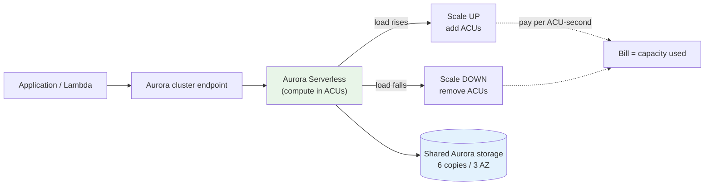

# Aurora Serverless Intro & Core Concepts - SAA-C03 Deep Dive

> Aurora Serverless is an **on-demand, auto-scaling configuration** of Amazon Aurora. Instead of provisioning a fixed instance class, you set a capacity range and Aurora scales compute up and down automatically to match the load - and you **pay only for the capacity consumed**. The modern, exam-relevant flavour is **Aurora Serverless v2**, which scales in fine-grained increments within seconds and supports almost every Aurora feature (replicas, Multi-AZ, Global Database). The legacy **v1** scales in coarse steps and can **auto-pause to ~$0** when idle.

See also: [02 - Aurora Serverless Architecture Deep Dive](02%20-%20Aurora%20Serverless%20Architecture%20Deep%20Dive.md) · [03 - Aurora Serverless Best Practices & Examples](03%20-%20Aurora%20Serverless%20Best%20Practices%20%26%20Examples.md) · [04 - Aurora Serverless Scenario Questions](04%20-%20Aurora%20Serverless%20Scenario%20Questions.md) · [05 - Aurora Serverless Troubleshooting (SRE)](05%20-%20Aurora%20Serverless%20Troubleshooting%20%28SRE%29.md) · [06 - Aurora Serverless Important Facts & Cheat Sheet](06%20-%20Aurora%20Serverless%20Important%20Facts%20%26%20Cheat%20Sheet.md) · [00 - Databases Overview & Exam Guide](00%20-%20Databases%20Overview%20%26%20Exam%20Guide.md) · [01 - Aurora Intro & Core Concepts](01%20-%20Aurora%20Intro%20%26%20Core%20Concepts.md)

---

## Table of Contents

- [What Is Aurora Serverless?](#what-is-aurora-serverless)
- [The Aurora Capacity Unit (ACU)](#the-aurora-capacity-unit-acu)
- [v1 vs v2 at a Glance](#v1-vs-v2-at-a-glance)
- [When to Use Aurora Serverless](#when-to-use-aurora-serverless)
- [Pricing Model](#pricing-model)
- [Exam Tips & Traps](#exam-tips--traps)
- [Summary](#summary)

---

---

## What Is Aurora Serverless?

Aurora Serverless is a **deployment mode** for an Aurora cluster (MySQL- or PostgreSQL-compatible) where AWS manages the **compute capacity** for you:

- You do **not** pick an instance class (no `db.r6g.xlarge`). You set a **minimum and maximum capacity** measured in **ACUs**.
- Aurora continuously monitors load (CPU, connections, memory) and **scales compute automatically** between your min and max.
- Storage is the **same distributed Aurora storage** - 6 copies across 3 AZs, auto-growing to 128 TiB. Only the **compute** is serverless.
- Billing is **consumption-based**: you pay for the ACUs actually in use (plus standard storage and I/O), not for an always-on instance size.

It is still a **full relational database** with a normal cluster endpoint - your application connects exactly as it would to a provisioned Aurora cluster.

[⬆ Back to top](#table-of-contents)

---

## The Aurora Capacity Unit (ACU)

The **ACU** is the unit of serverless compute. Think of it as a bundle of CPU + memory + networking:

- **~2 GiB of memory** per ACU, with corresponding CPU and network.
- **Aurora Serverless v2** scales in increments as small as **0.5 ACU**, ranging **0.5 → 256 ACU** (some engine versions support a minimum of **0** ACU, allowing auto-pause-like behaviour on v2 in newer releases).
- **Aurora Serverless v1** scales in **discrete capacity steps** (e.g. 1, 2, 4, 8, 16 ... up to 256 ACU) and can drop all the way to **0 (paused)** when idle.

You are billed **per ACU-second** (with a minimum granularity), so a workload that hovers at 4 ACUs for an hour costs far less than a provisioned instance sized for peak.

| Concept            | Meaning                                      |
| :----------------- | :------------------------------------------- |
| **1 ACU**          | ~2 GiB memory + proportional CPU/network     |
| **v2 granularity** | Scales in 0.5-ACU increments, near-instantly |
| **v1 granularity** | Jumps between fixed capacity steps           |
| **Min ACU**        | Floor capacity (and idle cost) you choose    |
| **Max ACU**        | Ceiling that caps scale-up (and cost)        |

[⬆ Back to top](#table-of-contents)

---

## v1 vs v2 at a Glance

There are two generations. **For SAA-C03, v2 is the default "modern" answer** for variable relational workloads; v1 is the answer when the scenario emphasises **scale-to-zero / pause-when-idle for dev-test**.

| Capability                 | Serverless v1                               | Serverless v2                                                                                        |
| :------------------------- | :------------------------------------------ | :--------------------------------------------------------------------------------------------------- |
| **Scaling style**          | Coarse steps (doubles), at "scaling points" | Fine-grained 0.5-ACU increments                                                                      |
| **Scaling speed**          | Seconds-to-minutes, can stall               | Near-instant (sub-second to seconds), in-place                                                       |
| **Auto-pause to ~$0**      | Yes (after inactivity)                      | No traditional pause (v2 can reach 0 ACU on supported versions, not the same pause/cold-start model) |
| **Read replicas**          | No                                          | Yes                                                                                                  |
| **Multi-AZ**               | No (single AZ; failover by relaunch)        | Yes                                                                                                  |
| **Global Database**        | No                                          | Yes                                                                                                  |
| **Blue/Green deployments** | No                                          | Yes                                                                                                  |
| **Mixed with provisioned** | No                                          | Yes (provisioned writer + serverless readers)                                                        |
| **Data API (HTTP/SQL)**    | Yes (original RDS Data API)                 | Yes (Data API supported for Serverless v2 on Aurora PostgreSQL/MySQL)                                |
| **Best for**               | Intermittent dev/test, infrequent apps      | Almost everything new: variable/spiky production workloads                                           |

[⬆ Back to top](#table-of-contents)

---

## When to Use Aurora Serverless

Reach for Aurora Serverless when capacity is **hard to predict** or **changes a lot**:

- **Variable / unpredictable workloads** - traffic that spikes and dips throughout the day. v2 right-sizes continuously instead of you over-provisioning for peak.
- **Intermittent / infrequent workloads** - apps used a few hours a day or sporadically. v1 auto-pause makes these cost almost nothing when idle.
- **Dev / test / QA databases** - environments that sit idle nights and weekends. v1 auto-pause → near-zero cost.
- **New applications with unknown load** - start serverless, let it find the right capacity, avoid guessing an instance size.
- **Multi-tenant SaaS** - many databases with bursty, uneven usage.

**Avoid / reconsider serverless when:**

- You have a **steady, predictable, high** load 24/7 - a Reserved/provisioned instance is usually cheaper.
- You need the **absolute lowest latency** with zero scaling jitter and have a flat load profile.

[⬆ Back to top](#table-of-contents)

---

## Pricing Model

| Component                   | How You Pay                                                                               |
| :-------------------------- | :---------------------------------------------------------------------------------------- |
| **Compute**                 | Per **ACU-second** for capacity in use (between min and max). v1 paused = **$0 compute**. |
| **Storage**                 | Per GB-month of the shared Aurora storage volume (auto-grows).                            |
| **I/O**                     | Per million requests (standard) or bundled (Aurora I/O-Optimized).                        |
| **Data transfer / backups** | Standard Aurora/AWS rates.                                                                |

The key exam framing: **you pay for capacity consumed, not provisioned**. A spiky workload that would need a large provisioned instance for occasional peaks can be far cheaper on serverless because the high ACU count only applies during the spike.

[⬆ Back to top](#table-of-contents)

---

## Exam Tips & Traps

- **"Unpredictable / spiky / variable" relational workload → Aurora Serverless v2.** This is the single most common trigger phrase.
- **"Dev/test DB that should cost ~nothing when idle" → Aurora Serverless v1 (auto-pause).** v2 does not auto-pause the same way.
- **"Need read replicas / Multi-AZ / Global Database on a serverless DB" → v2 only.** v1 cannot do these - a classic distractor.
- **"HTTP / SQL over an API without managing connections (Lambda)" → Data API.** Available for v1 and supported for v2.
- Aurora Serverless is **still relational** - it is **not** a DynamoDB substitute. Don't pick it for key-value/NoSQL scenarios.
- Only **compute** is serverless; **storage is the same 6-copy/3-AZ Aurora volume**. Durability is identical to provisioned Aurora.
- **ACU ≈ 2 GiB memory** - know this if asked to reason about sizing.

[⬆ Back to top](#table-of-contents)

---

## Summary

| Concept            | What You Must Know                                                       |
| :----------------- | :----------------------------------------------------------------------- |
| **What it is**     | On-demand auto-scaling **compute** for Aurora; pay per capacity used     |
| **ACU**            | Capacity unit ≈ 2 GiB memory; v2 scales in 0.5-ACU steps (0.5–256)       |
| **v2**             | Modern default: fast fine-grained scaling, replicas, Multi-AZ, Global DB |
| **v1**             | Legacy: coarse steps, **auto-pause to ~$0** for dev/test, Data API       |
| **Use when**       | Variable, intermittent, unpredictable, or dev/test workloads             |
| **Don't use when** | Steady high 24/7 load (provisioned/Reserved is cheaper)                  |

[⬆ Back to top](#table-of-contents)
