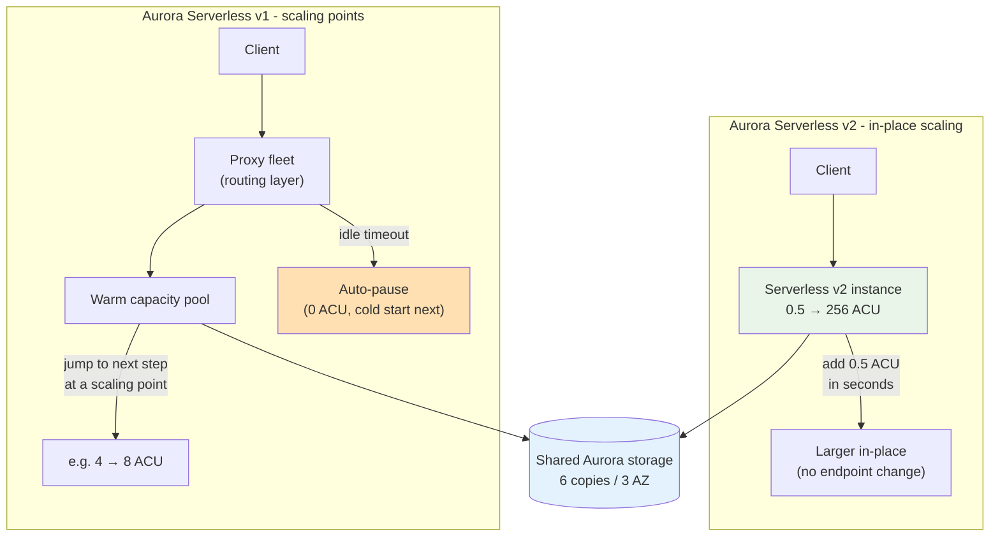
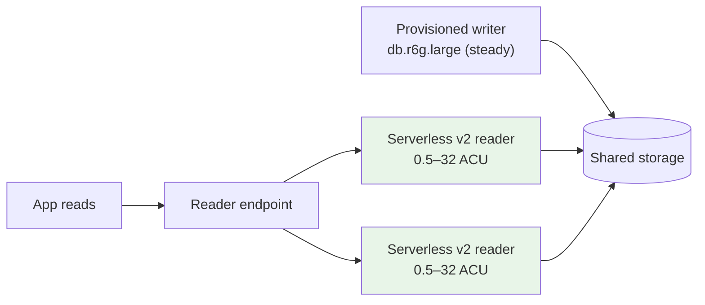

# Aurora Serverless Architecture Deep Dive - SAA-C03 Deep Dive

> Under the hood, both serverless generations share Aurora's **distributed, log-structured storage** (6 copies across 3 AZs). What differs is the **compute layer**. **v2** runs Aurora instances whose capacity is measured in ACUs and scaled **in place, near-instantly**, supporting readers, Multi-AZ, and Global Database. **v1** uses a **shared proxy fleet** that routes to a warm capacity pool, scales at discrete **scaling points**, and can **auto-pause** the compute entirely (incurring a cold start on the next connection). This page contrasts the two architectures and explains mixed-configuration clusters.

See also: [01 - Aurora Serverless Intro & Core Concepts](01%20-%20Aurora%20Serverless%20Intro%20%26%20Core%20Concepts.md) · [03 - Aurora Serverless Best Practices & Examples](03%20-%20Aurora%20Serverless%20Best%20Practices%20%26%20Examples.md) · [04 - Aurora Serverless Scenario Questions](04%20-%20Aurora%20Serverless%20Scenario%20Questions.md) · [05 - Aurora Serverless Troubleshooting (SRE)](05%20-%20Aurora%20Serverless%20Troubleshooting%20%28SRE%29.md) · [06 - Aurora Serverless Important Facts & Cheat Sheet](06%20-%20Aurora%20Serverless%20Important%20Facts%20%26%20Cheat%20Sheet.md) · [00 - Databases Overview & Exam Guide](00%20-%20Databases%20Overview%20%26%20Exam%20Guide.md) · [01 - Aurora Intro & Core Concepts](01%20-%20Aurora%20Intro%20%26%20Core%20Concepts.md)

---

## Table of Contents

- [Shared Foundation: Aurora Storage](#shared-foundation-aurora-storage)
- [Aurora Serverless v2 Architecture](#aurora-serverless-v2-architecture)
- [Aurora Serverless v1 Architecture](#aurora-serverless-v1-architecture)
- [The Data API](#the-data-api)
- [Network Access - No Public Access](#network-access---no-public-access)
- [v1 vs v2 Detailed Comparison](#v1-vs-v2-detailed-comparison)
- [Mixed-Configuration Clusters](#mixed-configuration-clusters)
- [Exam Tips & Traps](#exam-tips--traps)
- [Summary](#summary)

---

---

## Shared Foundation: Aurora Storage

Regardless of generation, the **storage layer is identical to provisioned Aurora**:

- Data is striped as **6 copies across 3 Availability Zones**, self-healing, auto-growing in 10 GB increments up to **128 TiB**.
- Compute is **decoupled** from storage. Scaling, pausing, or replacing compute does **not** touch the durable data.
- This is why serverless inherits Aurora's durability and why scaling can be fast - only the stateless compute changes.

So "serverless" applies to the **compute tier only**. The exam loves the distinction: _storage durability is unchanged; only capacity provisioning is automated._

[⬆ Back to top](#table-of-contents)

---

## Aurora Serverless v2 Architecture

v2 is the modern, full-featured generation:

- Runs **actual Aurora DB instances** whose capacity is expressed in **ACUs (0.5 → 256)** instead of an instance class.
- **Scales in place, near-instantly** - it adds capacity in **0.5-ACU increments** within seconds, with **no failover and no endpoint change**. It does not double-and-warm like v1.
- Supports **reader instances** - you can have serverless readers behind the reader endpoint, scaling independently of the writer.
- Supports **Multi-AZ** (failover to a reader in another AZ), **Aurora Global Database** (cross-Region), **Blue/Green deployments**, **RDS Proxy**, **performance Insights**, and IAM auth - essentially the full Aurora feature set.
- Each instance in the cluster has its **own min/max ACU range**, set via the cluster's `serverlessv2_scaling_configuration` and the instance class `db.serverless`.
- **No traditional auto-pause** model like v1. (Newer engine versions allow a **minimum of 0 ACU**, which lets v2 scale down very low when idle, but it does not have v1's pause/cold-start behaviour.)

This is why v2 is the recommended default for new clusters and the answer to "variable/spiky production workload needing replicas or Global DB."

[⬆ Back to top](#table-of-contents)

---

## Aurora Serverless v1 Architecture

v1 is the older, more limited generation, optimised for **intermittent** workloads and **scale-to-zero**:

- You define a **capacity range** (min/max ACU) from a fixed set of steps. Aurora scales by **doubling/halving** between those steps.
- Scaling happens at a **scaling point** - a moment when the database has no long-running transactions, locks, or temp tables in the way. If the DB can't find a safe scaling point, scaling **stalls** (you can force it, dropping connections).
- A **shared proxy fleet** sits in front of the compute. Clients connect to the proxy, which routes to the warm capacity pool. This indirection is what lets v1 swap the underlying compute transparently.
- **Auto-pause:** after a configurable inactivity period (e.g. 5 minutes), v1 **pauses compute to 0 ACU**, so you pay only for storage. The next connection triggers a **resume** with a **cold-start latency** (seconds to ~30s+) while compute is reprovisioned.
- **Single AZ** for compute - no read replicas, no Multi-AZ standby. On failure, v1 relaunches compute (the proxy fleet helps mask this), but there is no synchronous standby.
- Supports the **Data API** and **Query Editor** for HTTP/SQL access.

[⬆ Back to top](#table-of-contents)

---

## The Data API

The **RDS Data API** lets you run SQL over **HTTPS** without managing a persistent database connection:

- Calls are **authenticated via IAM**, with DB credentials stored in **AWS Secrets Manager**.
- No driver, no connection pool, no VPC networking required on the caller - ideal for **AWS Lambda** and other serverless callers that otherwise suffer **connection storms**.
- Originally introduced for **Serverless v1**; AWS later added **Data API support for Aurora Serverless v2** (and provisioned) on supported Aurora PostgreSQL and MySQL versions.
- Subject to **request size and throughput limits** (and historically per-Region throttling) - high-TPS OLTP should use normal connections or RDS Proxy.

Exam trigger: _"Lambda needs to query the DB over HTTP/SQL without managing connections"_ → **Data API**.

[⬆ Back to top](#table-of-contents)

---

## Network Access - No Public Access

A frequently-missed but important distinction from classic RDS:

- **Classic RDS** works at the **VPC level** and can be made **publicly accessible** (assigned a public IP/endpoint) or locked down to specific IPs via security groups.
- **Aurora Serverless does NOT allow public access.** The cluster has **no public endpoint** - it can only be reached from **inside its VPC**.

To connect to an Aurora Serverless cluster you therefore use one of:

| Connection method                | How it reaches the cluster                                                                                 |
| :------------------------------- | :--------------------------------------------------------------------------------------------------------- |
| **Data API**                     | SQL over **HTTPS** (IAM + Secrets Manager) - no VPC networking on the caller; AWS routes it to the cluster |
| **EC2 instance in the same VPC** | Connect from an EC2 host (or other compute) that lives **in the same VPC** as the Aurora cluster           |

| Dimension      | Classic RDS                            | Aurora Serverless                             |
| :------------- | :------------------------------------- | :-------------------------------------------- |
| Operates at    | VPC level                              | VPC level                                     |
| Public access  | **Allowed** (optional public endpoint) | **Not allowed** - private only                |
| IP restriction | Yes (security groups)                  | Yes (security groups), but no public exposure |
| Typical access | Public endpoint or in-VPC clients      | **Data API** or **EC2 in the same VPC**       |

> [!warning]
> Exam trap: a scenario that needs to reach an Aurora Serverless database from outside its VPC cannot just "make it public." The correct answers are the **Data API** or compute (e.g. **EC2/Lambda**) **inside the same VPC** (Lambda attached to the VPC, or via the Data API).

[⬆ Back to top](#table-of-contents)

---

## v1 vs v2 Detailed Comparison

| Dimension                  | Serverless v1                                   | Serverless v2                              |
| :------------------------- | :---------------------------------------------- | :----------------------------------------- |
| **Instance model**         | Hidden compute behind proxy fleet               | Real `db.serverless` instances             |
| **Capacity range**         | Fixed steps; min can be 0 (paused)              | 0.5 → 256 ACU (or 0 on supported versions) |
| **Scaling increments**     | Doubling/halving at scaling points              | 0.5-ACU fine-grained                       |
| **Scaling speed**          | Seconds–minutes; can stall on scaling point     | Near-instant, in place, no failover        |
| **Auto-pause to ~$0**      | **Yes** (after idle timeout)                    | No (v1-style pause not available)          |
| **Cold start**             | Yes, on resume from pause                       | No pause → no cold start                   |
| **Read replicas**          | No                                              | Yes                                        |
| **Multi-AZ failover**      | No (single AZ, relaunch)                        | Yes                                        |
| **Global Database**        | No                                              | Yes                                        |
| **Blue/Green, RDS Proxy**  | No / limited                                    | Yes                                        |
| **Mixed with provisioned** | No                                              | Yes                                        |
| **Data API**               | Yes (original)                                  | Yes (supported versions)                   |
| **Engine support**         | MySQL 5.7-class & PostgreSQL (limited versions) | Current Aurora MySQL & PostgreSQL versions |
| **Recommended for**        | Intermittent dev/test, scale-to-zero            | New & production variable workloads        |

[⬆ Back to top](#table-of-contents)

---

## Mixed-Configuration Clusters

A powerful v2 capability: **a single Aurora cluster can mix provisioned and serverless v2 instances**.

- Example: a **provisioned writer** (steady baseline) plus **serverless v2 readers** that scale with read traffic - or the reverse.
- Lets you migrate gradually: add serverless v2 readers to an existing provisioned cluster, then optionally promote/convert the writer.
- Each serverless v2 instance honours the cluster's `serverlessv2_scaling_configuration` (min/max ACU); provisioned instances keep their fixed class.
- Useful for **predictable write baseline + bursty read fan-out** patterns and for **zero-downtime adoption** of serverless.

[⬆ Back to top](#table-of-contents)

---

## Exam Tips & Traps

- **Storage is shared/identical** to provisioned Aurora (6 copies/3 AZ). Serverless only changes **compute provisioning**.
- **v1 scales at "scaling points"** and can **stall** if long transactions block it - a known limitation. **v2 scales in place** with no failover.
- **Auto-pause + cold start = v1 only.** If a question wants "scale to zero when idle, accept slight resume latency," that's **v1**.
- **Replicas / Multi-AZ / Global DB / Blue-Green = v2 only.** v1 cannot do them.
- **Data API** decouples SQL from connections (HTTP + IAM + Secrets Manager) - perfect for **Lambda**; available on v1 and supported v2.
- **Aurora Serverless has no public access** (unlike classic RDS). Reach it via the **Data API** or compute **inside the same VPC** (e.g. EC2/Lambda-in-VPC).
- **Mixed clusters** (provisioned writer + serverless v2 readers) exist - a good answer for "steady writes, bursty reads, gradual adoption."

[⬆ Back to top](#table-of-contents)

---

## Summary

| Concept            | What You Must Know                                          |
| :----------------- | :---------------------------------------------------------- |
| **Shared storage** | 6 copies / 3 AZ, 128 TiB; only compute is serverless        |
| **v2 compute**     | `db.serverless`, 0.5–256 ACU, in-place near-instant scaling |
| **v1 compute**     | Proxy fleet, scaling points, auto-pause + cold start        |
| **Data API**       | HTTPS SQL via IAM + Secrets Manager; great for Lambda       |
| **v2 features**    | Readers, Multi-AZ, Global DB, Blue/Green - v1 has none      |
| **Mixed clusters** | Provisioned + serverless v2 in one cluster (v2 only)        |

[⬆ Back to top](#table-of-contents)
