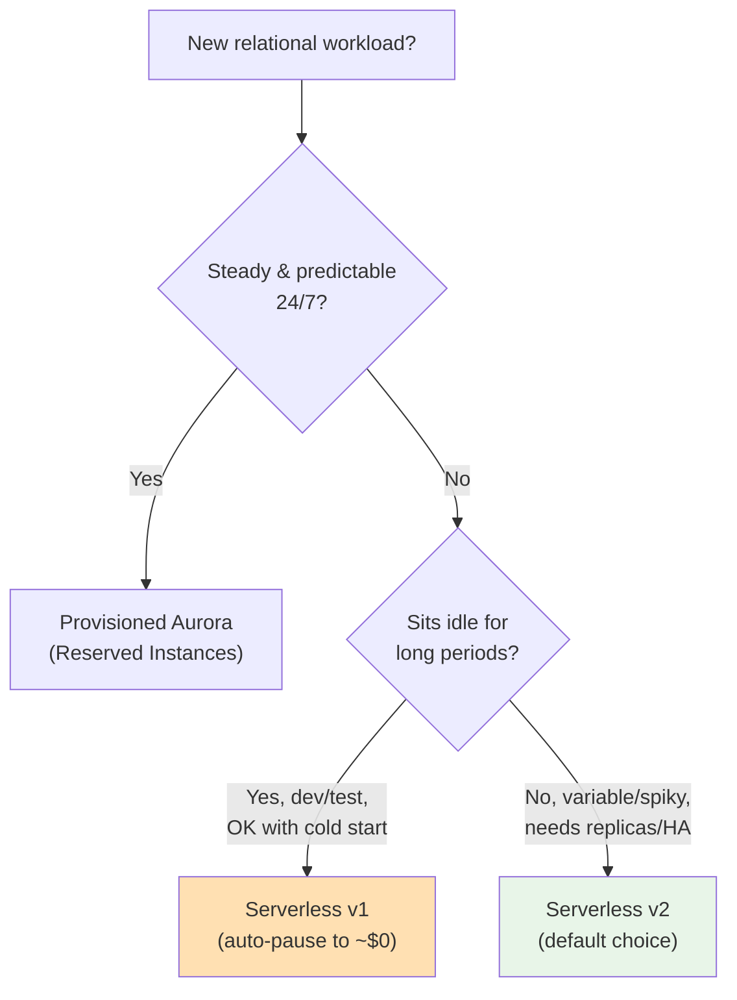

# Aurora Serverless Best Practices & Examples - SAA-C03 Deep Dive

> Practical guidance for running Aurora Serverless well: **default to v2** for almost everything new, set **sensible min/max ACU** to balance responsiveness against cost, reserve **v1 auto-pause for dev/test** scale-to-zero, use the **Data API** for serverless callers, plan capacity from real metrics (**ServerlessDatabaseCapacity**, **ACUUtilization**), and provision it as code. Includes a Terraform `aws_rds_cluster` example with `serverlessv2_scaling_configuration`.

See also: [01 - Aurora Serverless Intro & Core Concepts](01%20-%20Aurora%20Serverless%20Intro%20%26%20Core%20Concepts.md) · [02 - Aurora Serverless Architecture Deep Dive](02%20-%20Aurora%20Serverless%20Architecture%20Deep%20Dive.md) · [04 - Aurora Serverless Scenario Questions](04%20-%20Aurora%20Serverless%20Scenario%20Questions.md) · [05 - Aurora Serverless Troubleshooting (SRE)](05%20-%20Aurora%20Serverless%20Troubleshooting%20%28SRE%29.md) · [06 - Aurora Serverless Important Facts & Cheat Sheet](06%20-%20Aurora%20Serverless%20Important%20Facts%20%26%20Cheat%20Sheet.md) · [00 - Databases Overview & Exam Guide](00%20-%20Databases%20Overview%20%26%20Exam%20Guide.md) · [01 - Aurora Intro & Core Concepts](01%20-%20Aurora%20Intro%20%26%20Core%20Concepts.md)

---

## Table of Contents

- [Choosing v1 vs v2](#choosing-v1-vs-v2)
- [Setting Min and Max ACU](#setting-min-and-max-acu)
- [Auto-Pause for Dev/Test (v1)](#auto-pause-for-devtest-v1)
- [Using the Data API](#using-the-data-api)
- [Capacity Planning & Monitoring](#capacity-planning--monitoring)
- [Provisioning with Terraform](#provisioning-with-terraform)
- [CLI Examples](#cli-examples)
- [Exam Tips & Traps](#exam-tips--traps)
- [Summary](#summary)

---



---

## Choosing v1 vs v2

| Pick **v2** when...                           | Pick **v1** when...                             |
| :-------------------------------------------- | :---------------------------------------------- |
| New production or variable workload           | Pure dev/test/QA that idles overnight           |
| You need replicas, Multi-AZ, or Global DB     | You need true **scale-to-zero** (~$0 when idle) |
| You want fast, in-place, fine-grained scaling | You can tolerate cold-start latency on resume   |
| You want Blue/Green or mixed clusters         | You're on a legacy v1 cluster already           |

**Rule of thumb:** _Default to v2._ Only choose v1 specifically for **scale-to-zero on intermittent dev/test**. AWS positions v2 as the path forward for all new clusters.

[⬆ Back to top](#table-of-contents)

---

## Setting Min and Max ACU

The min/max ACU range is the most important knob:

- **Minimum ACU** is your **floor capacity and idle cost**. Set it high enough to hold your working set in the buffer pool and handle baseline connections - too low and every quiet period evicts cache, causing slow cold-ish reads when traffic returns.
- **Maximum ACU** is your **cost ceiling and scale-up limit**. Set it above your real peak so the DB doesn't throttle/queue under load. Too low = the classic "max ACU too small → throttling" problem.
- Remember **1 ACU ≈ 2 GiB memory**. Size the **min** so memory ≥ your hot dataset; size the **max** for peak concurrency.
- For v2, **readers can have their own range** - keep writer max generous, scale readers for fan-out.

Start with a measured estimate, then tighten using `ACUUtilization` and `ServerlessDatabaseCapacity` metrics.

[⬆ Back to top](#table-of-contents)

---

## Auto-Pause for Dev/Test (v1)

For **v1**, auto-pause is the headline cost saver:

- Enable **auto-pause** and set the **inactivity timeout** (e.g. 5 minutes). After that idle window with no connections, compute drops to **0 ACU** → you pay **storage only**.
- The **first connection after pause** triggers a **resume** with cold-start latency (seconds to ~30s+). Set client/connection **timeouts generously** so the resume doesn't surface as an error.
- Great for **CI pipelines, QA, demo, and personal dev DBs** that are unused nights/weekends.
- **Do not** rely on auto-pause for production user-facing apps - the cold start hurts UX. For variable _production_ load, use **v2** instead.

[⬆ Back to top](#table-of-contents)

---

## Using the Data API

For serverless/Lambda callers, the **Data API** removes connection management:

- Run SQL via **HTTPS**, authenticated with **IAM**, using DB creds in **Secrets Manager** - no driver, no pool, no VPC plumbing on the caller.
- Eliminates **Lambda connection storms** (thousands of concurrent functions exhausting DB connections).
- Best for **moderate-throughput** workloads. For very high TPS, use normal connections behind **RDS Proxy** (v2) to avoid Data API request limits/throttling.
- Enable it explicitly (`enable_http_endpoint` on the cluster for v1; supported-version flag for v2).

[⬆ Back to top](#table-of-contents)

---

## Capacity Planning & Monitoring

Track these CloudWatch metrics to right-size and catch problems:

| Metric                                   | What It Tells You                                                |
| :--------------------------------------- | :--------------------------------------------------------------- |
| **ServerlessDatabaseCapacity**           | Current ACUs in use - watch it hit your **max** (capacity-bound) |
| **ACUUtilization**                       | % of max ACU consumed - sustained near 100% → raise max          |
| **CPUUtilization / DatabaseConnections** | Drivers of scale-up; connection ceilings                         |
| **FreeableMemory / BufferCacheHitRatio** | Whether **min ACU** is too low (cache thrash)                    |
| (v1) **EngineUptime / resume events**    | Pause/resume frequency, cold-start exposure                      |

**Alarm** on `ACUUtilization` pinned high (raise max), and on `ServerlessDatabaseCapacity` constantly at the floor with poor cache hit ratio (raise min).

[⬆ Back to top](#table-of-contents)

---

## Provisioning with Terraform

**Serverless v2** (modern, recommended) - the cluster has **no** `engine_mode = "serverless"`; instead you add `serverlessv2_scaling_configuration` and create instances with class `db.serverless`:

```hcl
resource "aws_rds_cluster" "app" {
  cluster_identifier   = "app-aurora-sv2"
  engine               = "aurora-postgresql"
  engine_version       = "15.4"
  database_name        = "app"
  master_username      = "admin"
  manage_master_user_password = true   # store in Secrets Manager

  serverlessv2_scaling_configuration {
    min_capacity = 0.5
    max_capacity = 16
  }
}

resource "aws_rds_cluster_instance" "app" {
  count               = 2 # 1 writer + 1 serverless reader
  identifier          = "app-aurora-sv2-${count.index}"
  cluster_identifier  = aws_rds_cluster.app.id
  instance_class      = "db.serverless"
  engine              = aws_rds_cluster.app.engine
  engine_version      = aws_rds_cluster.app.engine_version
}
```

**Serverless v1** (legacy, uses `engine_mode = "serverless"` + `scaling_configuration` with auto-pause):

```hcl
resource "aws_rds_cluster" "devtest" {
  cluster_identifier  = "devtest-aurora-sv1"
  engine              = "aurora-mysql"
  engine_mode         = "serverless"
  database_name       = "devtest"
  master_username     = "admin"
  master_password     = var.db_password
  enable_http_endpoint = true # Data API

  scaling_configuration {
    auto_pause               = true
    min_capacity             = 1
    max_capacity             = 4
    seconds_until_auto_pause = 300
    timeout_action           = "ForceApplyCapacityChange"
  }
}
```

[⬆ Back to top](#table-of-contents)

---

## CLI Examples

Create a **v2** cluster and a serverless instance:

```bash
aws rds create-db-cluster \
  --db-cluster-identifier app-aurora-sv2 \
  --engine aurora-postgresql --engine-version 15.4 \
  --serverless-v2-scaling-configuration MinCapacity=0.5,MaxCapacity=16 \
  --master-username admin --manage-master-user-password

aws rds create-db-instance \
  --db-instance-identifier app-aurora-sv2-writer \
  --db-cluster-identifier app-aurora-sv2 \
  --db-instance-class db.serverless --engine aurora-postgresql
```

Query via the **Data API**:

```bash
aws rds-data execute-statement \
  --resource-arn arn:aws:rds:us-east-1:111122223333:cluster:app-aurora-sv2 \
  --secret-arn arn:aws:secretsmanager:us-east-1:111122223333:secret:app-db \
  --database app \
  --sql "SELECT count(*) FROM orders;"
```

[⬆ Back to top](#table-of-contents)

---

## Exam Tips & Traps

- **Default to v2**; choose **v1 only for scale-to-zero dev/test**.
- **Min ACU too low** → cache thrash / slow warm-up; **max ACU too low** → throttling under peak. Size from metrics.
- **Auto-pause is v1-only** and adds **cold-start latency** - never for latency-sensitive production.
- **Data API** = HTTP + IAM + Secrets Manager; solves **Lambda connection storms**; mind its throughput limits.
- Monitor **ServerlessDatabaseCapacity** and **ACUUtilization** - the two metrics the exam expects you to name for serverless sizing.
- **v2 in Terraform** uses `serverlessv2_scaling_configuration` + `instance_class = "db.serverless"`, **not** `engine_mode = "serverless"` (that's v1).

[⬆ Back to top](#table-of-contents)

---

## Summary

| Practice       | Recommendation                                              |
| :------------- | :---------------------------------------------------------- |
| **Generation** | v2 by default; v1 only for dev/test scale-to-zero           |
| **Min ACU**    | High enough to hold hot dataset / baseline connections      |
| **Max ACU**    | Above real peak to avoid throttling                         |
| **Auto-pause** | v1 dev/test only; expect cold start on resume               |
| **Data API**   | Lambda/serverless callers; avoids connection storms         |
| **Monitoring** | ServerlessDatabaseCapacity, ACUUtilization, cache hit ratio |
| **IaC**        | v2 = `serverlessv2_scaling_configuration` + `db.serverless` |

[⬆ Back to top](#table-of-contents)
