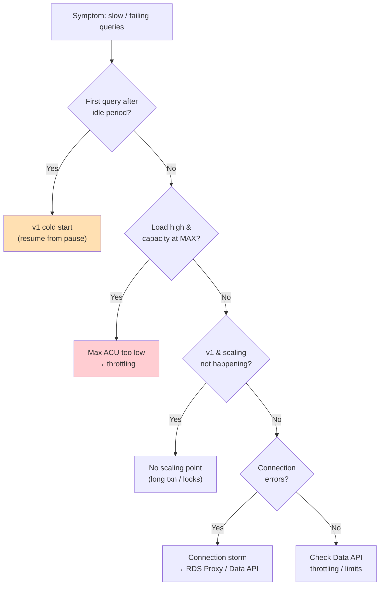

# Aurora Serverless Troubleshooting (SRE) - SAA-C03 Deep Dive

> An SRE-flavoured field guide to the failure modes of Aurora Serverless: **v1 cold-start latency** after auto-pause, **scaling that can't keep up** (v1 scaling points & cooldowns), **max ACU set too low** (throttling), **connection handling** under bursty load, **Data API limits/throttling**, and **v1→v2 migration gotchas**. Each entry gives symptoms, root cause, and the fix.

See also: [01 - Aurora Serverless Intro & Core Concepts](01%20-%20Aurora%20Serverless%20Intro%20%26%20Core%20Concepts.md) · [02 - Aurora Serverless Architecture Deep Dive](02%20-%20Aurora%20Serverless%20Architecture%20Deep%20Dive.md) · [03 - Aurora Serverless Best Practices & Examples](03%20-%20Aurora%20Serverless%20Best%20Practices%20%26%20Examples.md) · [04 - Aurora Serverless Scenario Questions](04%20-%20Aurora%20Serverless%20Scenario%20Questions.md) · [06 - Aurora Serverless Important Facts & Cheat Sheet](06%20-%20Aurora%20Serverless%20Important%20Facts%20%26%20Cheat%20Sheet.md) · [00 - Databases Overview & Exam Guide](00%20-%20Databases%20Overview%20%26%20Exam%20Guide.md) · [01 - Aurora Intro & Core Concepts](01%20-%20Aurora%20Intro%20%26%20Core%20Concepts.md)

---

## Table of Contents

- [Triage Flow](#triage-flow)
- [1. v1 Cold-Start Latency After Auto-Pause](#1-v1-cold-start-latency-after-auto-pause)
- [2. Scaling Not Keeping Up (v1 Scaling Points)](#2-scaling-not-keeping-up-v1-scaling-points)
- [3. Max ACU Too Low (Throttling)](#3-max-acu-too-low-throttling)
- [4. Min ACU Too Low (Cache Thrash)](#4-min-acu-too-low-cache-thrash)
- [5. Connection Handling Under Bursts](#5-connection-handling-under-bursts)
- [6. Data API Throttling & Limits](#6-data-api-throttling--limits)
- [7. v1 to v2 Migration Gotchas](#7-v1-to-v2-migration-gotchas)
- [Exam Tips & Traps](#exam-tips--traps)
- [Summary](#summary)

---

---

## Triage Flow

1. **Is it the first request after idle?** → likely **v1 cold start** (resume from auto-pause).
2. **Is `ServerlessDatabaseCapacity` pinned at max?** → **max ACU too low**, requests queue/throttle.
3. **v1 not scaling despite load?** → no **scaling point** (long transactions/locks blocking).
4. **Connection errors during bursts?** → **connection storm**, add **RDS Proxy** / use **Data API**.
5. **Data API HTTP 429 / size errors?** → **Data API limits**.
6. **Issues right after a generation change?** → **v1→v2 migration gotcha**.

[⬆ Back to top](#table-of-contents)

---

## 1. v1 Cold-Start Latency After Auto-Pause

**Symptoms:** The first query after a quiet period takes **several seconds to ~30s+** or times out; subsequent queries are fast.

**Root cause:** v1 **auto-paused to 0 ACU** after the inactivity timeout. The next connection triggers a **resume**, reprovisioning compute - that warm-up is the latency.

**Fixes:**

- Increase **client/connection timeouts** so resume doesn't surface as an error.
- **Raise the auto-pause inactivity window** or **disable auto-pause** if cold starts hurt UX.
- For latency-sensitive or production workloads, **move to v2** (no auto-pause/cold start).
- Use a lightweight **keep-warm ping** only if business hours justify it (it negates pause savings overnight).

[⬆ Back to top](#table-of-contents)

---

## 2. Scaling Not Keeping Up (v1 Scaling Points)

**Symptoms:** Load rises but **capacity doesn't increase**; performance degrades; scaling appears stuck.

**Root cause:** v1 can only scale at a **scaling point** - a moment with **no long-running transactions, table locks, or temp tables** blocking. Long transactions prevent the scale event. v1 also scales in **coarse doubling steps** with cooldown, so it reacts slowly.

**Fixes:**

- Set the cluster **timeout action** to `ForceApplyCapacityChange` so Aurora scales at the timeout even if it must **drop blocking connections** (trade-off: dropped connections).
- Keep transactions **short**; avoid long-held locks and large temp tables.
- For workloads needing **fast, in-place** scaling, **migrate to v2** - it scales in 0.5-ACU steps within seconds without scaling points.

[⬆ Back to top](#table-of-contents)

---

## 3. Max ACU Too Low (Throttling)

**Symptoms:** Under peak, `ACUUtilization` hits **~100%** and `ServerlessDatabaseCapacity` sits at the configured **max**; CPU saturates; queries queue and slow down.

**Root cause:** The **maximum ACU ceiling** is below the workload's real peak demand, so the DB can't scale further.

**Fixes:**

- **Raise max ACU** (v2: edit `serverlessv2_scaling_configuration`; v1: edit capacity range) above measured peak.
- **Alarm** on sustained high `ACUUtilization`.
- Offload reads to **serverless v2 readers**; add caching (**ElastiCache**) to cut DB pressure.

[⬆ Back to top](#table-of-contents)

---

## 4. Min ACU Too Low (Cache Thrash)

**Symptoms:** After quiet periods, queries are slow until "warmed up"; **BufferCacheHitRatio** drops; latency spikes when traffic returns.

**Root cause:** A very low **minimum ACU** shrinks memory (1 ACU ≈ 2 GiB), **evicting the buffer cache**, so the working set must be re-read from storage when load resumes.

**Fixes:**

- **Raise min ACU** so memory comfortably holds the hot dataset and baseline connections.
- Balance against idle cost - min ACU is your **floor bill**.

[⬆ Back to top](#table-of-contents)

---

## 5. Connection Handling Under Bursts

**Symptoms:** Bursts (especially **Lambda** spikes) produce **"too many connections"** errors even when CPU/ACU is fine.

**Root cause:** Each connection consumes memory; thousands of concurrent clients exhaust the connection limit faster than ACU scaling helps. This is a **connection** problem, not a capacity problem.

**Fixes:**

- Put **RDS Proxy** in front (v2) to **pool and multiplex** connections.
- Use the **Data API** for serverless callers to avoid persistent connections entirely.
- Tune application **connection pooling** and reuse.

[⬆ Back to top](#table-of-contents)

---

## 6. Data API Throttling & Limits

**Symptoms:** Data API calls return **HTTP 429 (ThrottlingException)** or fail on large payloads/result sets at high request rates.

**Root cause:** The Data API enforces **request-size and throughput limits** (and historically per-Region throttling). It targets moderate throughput, not high-TPS OLTP.

**Fixes:**

- **Back off and retry** on 429; batch where possible.
- Keep statements/results within size limits; **paginate** large queries.
- For sustained high TPS, switch to **normal connections behind RDS Proxy** instead of the Data API.

[⬆ Back to top](#table-of-contents)

---

## 7. v1 to v2 Migration Gotchas

**Symptoms:** Migration is more involved than expected; features/config differ; behaviour changes after cutover.

**Root cause / gotchas:**

- There is **no single in-place toggle** from v1 to v2 - migration typically uses **snapshot/restore** or **logical/Blue-Green-style** paths and may require an **engine-version upgrade** (v1 runs older engine versions).
- **Config model differs:** v1 uses `engine_mode = "serverless"` + `scaling_configuration` (with auto-pause); v2 uses `serverlessv2_scaling_configuration` + `db.serverless` instances and **no** `engine_mode = "serverless"`.
- **Auto-pause goes away** on v2 - dev/test cost behaviour changes (no scale-to-zero pause).
- After migrating, you **gain** replicas, Multi-AZ, and Global DB - reconfigure HA/DR intentionally.

**Fixes:** Plan a tested migration (snapshot/restore or Blue/Green), validate engine version, update IaC to the v2 config model, and reassess cost/idle behaviour.

[⬆ Back to top](#table-of-contents)

---

## Exam Tips & Traps

- **First-query latency after idle = v1 cold start** (resume from auto-pause). Fix: timeouts up, or move to v2.
- **Scaling stuck on v1 = no scaling point** (long txn/locks). Fix: `ForceApplyCapacityChange` (drops connections) or v2.
- **Capacity pinned at max = max ACU too low** → raise it. **Cache thrash after idle = min ACU too low** → raise it.
- **"Too many connections" under Lambda bursts = connection storm** → **RDS Proxy** / **Data API**, not more ACU.
- **Data API 429 / size errors = Data API limits** → retry/batch/paginate, or use RDS Proxy for high TPS.
- **v1→v2 is not a toggle** - snapshot/restore or Blue/Green, possible engine upgrade, different config model, no more auto-pause.

[⬆ Back to top](#table-of-contents)

---

## Summary

| Symptom                       | Root Cause               | Fix                                           |
| :---------------------------- | :----------------------- | :-------------------------------------------- |
| Slow first query after idle   | v1 cold start (resume)   | Raise timeouts / disable pause / use v2       |
| Scaling stuck under load (v1) | No scaling point         | ForceApplyCapacityChange / migrate to v2      |
| Capacity stuck at max         | Max ACU too low          | Raise max ACU; offload reads/cache            |
| Slow warm-up after idle       | Min ACU too low          | Raise min ACU                                 |
| "Too many connections"        | Connection storm         | RDS Proxy / Data API                          |
| Data API 429 / size errors    | Data API limits          | Retry/batch/paginate; RDS Proxy for high TPS  |
| Migration surprises           | v1↔v2 config differences | Snapshot/Blue-Green; update IaC; recheck cost |

[⬆ Back to top](#table-of-contents)
