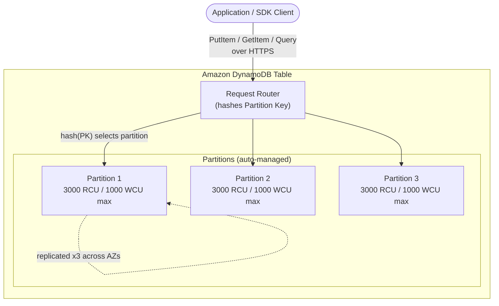

# DynamoDB Intro & Core Concepts - SAA-C03 Deep Dive

> What Amazon DynamoDB is - a serverless, fully managed NoSQL key-value and document database with single-digit-millisecond latency at any scale - plus its data model (tables/items/attributes), primary keys, how partitions distribute data, capacity modes, RCU/WCU math, and read consistency.

See also: [02 - DynamoDB Architecture Deep Dive](02%20-%20DynamoDB%20Architecture%20Deep%20Dive.md) · [03 - DynamoDB Best Practices & Examples](03%20-%20DynamoDB%20Best%20Practices%20%26%20Examples.md) · [04 - DynamoDB Scenario Questions](04%20-%20DynamoDB%20Scenario%20Questions.md) · [05 - DynamoDB Troubleshooting (SRE)](05%20-%20DynamoDB%20Troubleshooting%20%28SRE%29.md) · [06 - DynamoDB Important Facts & Cheat Sheet](06%20-%20DynamoDB%20Important%20Facts%20%26%20Cheat%20Sheet.md) · [00 - Databases Overview & Exam Guide](00%20-%20Databases%20Overview%20%26%20Exam%20Guide.md) · [01 - ElastiCache Intro & Core Concepts](01%20-%20ElastiCache%20Intro%20%26%20Core%20Concepts.md)

---

## Table of Contents

- [What Is Amazon DynamoDB](#what-is-amazon-dynamodb)
- [Tables, Items, and Attributes](#tables-items-and-attributes)
- [Primary Keys: Partition Key and Composite Keys](#primary-keys-partition-key-and-composite-keys)
- [Partitions and Data Distribution](#partitions-and-data-distribution)
- [Capacity Modes: On-Demand vs Provisioned](#capacity-modes-on-demand-vs-provisioned)
- [RCU and WCU Math](#rcu-and-wcu-math)
- [Read Consistency Models](#read-consistency-models)
- [Summary: Key Takeaways for SAA-C03](#summary-key-takeaways-for-saa-c03)

---



---

## What Is Amazon DynamoDB

Amazon DynamoDB is a **serverless, fully managed NoSQL database** that delivers **single-digit-millisecond** read/write latency at virtually any scale (and **microsecond** latency when fronted by **DAX**). There are no servers to provision, patch, or manage - you create a table and AWS handles the rest.

Key identity points the exam tests:

| Property     | DynamoDB                                                            |
| :----------- | :------------------------------------------------------------------ |
| Data model   | **NoSQL** - key-value **and** document                              |
| Management   | **Serverless**, fully managed (no instances, no version upgrades)   |
| Latency      | Single-digit-ms; **microseconds with DAX**                          |
| Scaling      | Horizontal, automatic; handles 10s of millions of req/sec           |
| Availability | Data replicated across **3 AZs** in a Region automatically          |
| Durability   | 99.999999999% region-level durability                               |
| Encryption   | **Encryption at rest is always on** (cannot disable)                |
| Pricing      | Pay per capacity (provisioned) or per request (on-demand) + storage |
| Multi-Region | **Global Tables** (multi-active replication)                        |

**When the exam points here:** "serverless NoSQL", "key-value", "millisecond latency at any scale", "massive scale", "no server management", "automatic scaling". Contrast with RDS/Aurora (relational/SQL) and ElastiCache (in-memory cache).

> **Exam Tip:** DynamoDB is **regional** by default. To go multi-Region active-active you add **Global Tables** - this is a common distractor where candidates assume a single table spans Regions automatically. It does not.

[⬆ Back to top](#table-of-contents)

---

## Tables, Items, and Attributes

DynamoDB's data model has three levels:

| Term          | Relational Analogy | Description                                                          |
| :------------ | :----------------- | :------------------------------------------------------------------- |
| **Table**     | Table              | A collection of items. Schemaless except for the primary key.        |
| **Item**      | Row                | A single record. Max size **400 KB** (item + all attributes).        |
| **Attribute** | Column             | A name-value pair. Items can have different attributes (schemaless). |

Important model facts:

- **Schemaless beyond the key.** Only the primary key attributes must exist on every item; any other attributes are optional and can differ item-to-item.
- **Supported attribute types:** scalar (String, Number, Binary, Boolean, Null), document (List, Map), and set (String Set, Number Set, Binary Set).
- **Documents** (Map/List) allow nesting JSON-like structures up to 32 levels deep - this is the "document database" half of DynamoDB.
- **Max item size is 400 KB.** Store large blobs in S3 and keep a pointer (the S3 key) in DynamoDB.

```json
{
  "UserId": { "S": "u#1024" },
  "Email": { "S": "alex@example.com" },
  "Age": { "N": "29" },
  "Active": { "BOOL": true },
  "Roles": { "SS": ["admin", "editor"] },
  "Address": { "M": { "City": { "S": "Austin" }, "Zip": { "S": "78701" } } }
}
```

> **Exam Tip:** The **400 KB item limit** is a recurring trap. If a scenario stores images/videos/large documents, the answer is "store the object in S3, store the reference in DynamoDB."

[⬆ Back to top](#table-of-contents)

---

## Primary Keys: Partition Key and Composite Keys

Every table has a **primary key** that uniquely identifies each item. There are two forms:

| Key Type                         | Components                   | Behavior                                                                                                                                             |
| :------------------------------- | :--------------------------- | :--------------------------------------------------------------------------------------------------------------------------------------------------- |
| **Simple (Partition key)**       | Partition key only           | Also called the **hash key**. Its value is hashed to choose the partition. Must be **unique** per item.                                              |
| **Composite (Partition + Sort)** | Partition key **+** Sort key | Also called **hash + range key**. PK selects the partition; items within a partition are **sorted by the sort key**. The combination must be unique. |

- The **partition key** determines **which partition** an item lives in (via an internal hash function).
- The **sort key** (a.k.a. range key) enables **range queries** within a partition - `begins_with`, `between`, `>`, `<`, sorted ordering, and "get the latest N" patterns.
- With a composite key, **many items can share the same partition key** as long as each has a distinct sort key (e.g., all orders for one customer).

```
Simple key:     UserId = "u#1024"            -> one item
Composite key:  CustomerId = "c#500" (PK)
                OrderDate  = "2025-01-14" (SK) -> query "all orders for c#500 in Jan 2025"
```

> **Exam Tip:** If a scenario says "retrieve all X for a given Y, sorted/ranged by time" - that is a **composite key** (PK = Y, SK = timestamp). If it says "look up by a single unique ID", a **simple partition key** suffices.

[⬆ Back to top](#table-of-contents)

---

## Partitions and Data Distribution

DynamoDB stores table data across **partitions** - physical storage units, each backed by SSD and **replicated across 3 Availability Zones**.

How distribution works:

1. You write an item. DynamoDB applies an internal **hash function to the partition key**.
2. The hash output maps the item to **exactly one partition**.
3. Items with the same partition key land on the same partition (sorted by sort key if composite).

Capacity per partition (hard physical limits):

| Per-Partition Limit | Value                         |
| :------------------ | :---------------------------- |
| Max throughput      | **3000 RCU** and **1000 WCU** |
| Max size            | **10 GB**                     |

DynamoDB **automatically adds partitions** as your data grows past 10 GB or as you raise provisioned capacity. You never manage partitions directly, but you must **design partition keys for even distribution** - because a single partition key value that receives disproportionate traffic creates a **hot partition** (see [02 - DynamoDB Architecture Deep Dive](02%20-%20DynamoDB%20Architecture%20Deep%20Dive.md) and [05 - DynamoDB Troubleshooting (SRE)](05%20-%20DynamoDB%20Troubleshooting%20%28SRE%29.md)).

> **Exam Tip:** Uniform key distribution = predictable performance. A low-cardinality partition key (e.g., `status = "active"`) funnels traffic into one partition and throttles. High-cardinality keys (userId, deviceId) spread load.

[⬆ Back to top](#table-of-contents)

---

## Capacity Modes: On-Demand vs Provisioned

DynamoDB offers two billing/throughput modes. You can switch between them (limited to once every 24 hours per table).

|              | **On-Demand**                                                  | **Provisioned**                                                 |
| :----------- | :------------------------------------------------------------- | :-------------------------------------------------------------- |
| You specify  | Nothing - it scales automatically                              | RCU and WCU per table/index                                     |
| Billing      | Pay **per request** (per million reads/writes)                 | Pay for **provisioned capacity per hour**                       |
| Best for     | **Unpredictable/spiky** traffic, new apps, unknown patterns    | **Predictable/steady** traffic                                  |
| Throttling   | Effectively none for typical workloads (instant accommodation) | Throttles if you exceed provisioned (unless auto scaling/burst) |
| Cost profile | Higher per-request, zero idle cost                             | Cheaper at steady high utilization                              |
| Auto scaling | Built in / automatic                                           | **Optional Auto Scaling** tracks a target utilization %         |

**Provisioned + Auto Scaling:** Define min/max capacity and a **target utilization** (e.g., 70%). Application Auto Scaling adjusts RCU/WCU via CloudWatch alarms. Note: it reacts to sustained change, not instantaneous spikes.

Some material presents these as **three distinct capacity modes** - it is worth recognizing the framing:

| Mode            | You configure                                   | Behavior                                                                  | Best for                                       |
| :-------------- | :---------------------------------------------- | :------------------------------------------------------------------------ | :--------------------------------------------- |
| **Provisioned** | Fixed RCU/WCU                                   | Constant throughput; throttles past the limit                             | **Predictable** traffic                        |
| **Autoscaling** | Provisioned with **lower/upper** RCU/WCU limits | DynamoDB scales RCU/WCU **up and down** within the band as traffic shifts | Predictable traffic with **gradual variation** |
| **On-Demand**   | Nothing (serverless)                            | No RCU/WCU to set; pay per request                                        | **Unknown / unpredictable** workloads          |

Strictly, Autoscaling is Provisioned mode with Application Auto Scaling enabled - but treating it as its own mode highlights the three real choices you make at table creation.

> **Exam Tip:** "Spiky, unpredictable, or unknown traffic" -> **On-Demand**. "Steady, predictable, cost-sensitive at scale" -> **Provisioned (+ Auto Scaling)**. "We keep getting ProvisionedThroughputExceededException during unpredictable spikes" -> switch to **On-Demand**.

[⬆ Back to top](#table-of-contents)

---

## RCU and WCU Math

In **provisioned mode** you buy throughput in **capacity units**. Memorize these formulas - they appear directly on the exam.

**Read Capacity Unit (RCU):**

| Read Type                 | 1 RCU buys                                                           |
| :------------------------ | :------------------------------------------------------------------- |
| **Strongly consistent**   | 1 read/sec of up to **4 KB**                                         |
| **Eventually consistent** | **2** reads/sec of up to **4 KB**                                    |
| **Transactional**         | 0.5 reads/sec of up to 4 KB (i.e., **2 RCU per transactional read**) |

**Write Capacity Unit (WCU):**

| Write Type         | 1 WCU buys                                               |
| :----------------- | :------------------------------------------------------- |
| **Standard write** | 1 write/sec of up to **1 KB**                            |
| **Transactional**  | 0.5 writes/sec (i.e., **2 WCU per transactional write**) |

**Rounding rule:** item size always rounds **up** to the next 4 KB (reads) or 1 KB (writes).

Worked examples:

- Read **8 KB** items, **strongly consistent**, 100/sec: 8 KB / 4 KB = 2 RCU per read x 100 = **200 RCU**.
- Read **8 KB** items, **eventually consistent**, 100/sec: ceil(8/4)/2 = 1 RCU per read x 100 = **100 RCU**.
- Write **2.5 KB** items, 50/sec: ceil(2.5/1) = 3 WCU per write x 50 = **150 WCU**.
- Read **6 KB**, strongly consistent, 200/sec: ceil(6/4) = 2 RCU x 200 = **400 RCU**.

> **Exam Tip:** Eventually consistent reads are **half the RCU cost** of strongly consistent. Transactional reads/writes cost **double**. The exam loves "calculate the RCU/WCU" questions - watch whether it specifies the consistency model.

[⬆ Back to top](#table-of-contents)

---

## Read Consistency Models

DynamoDB lets you choose how fresh a read must be:

| Model                               | Behavior                                                          | Cost                 | When to use                                     |
| :---------------------------------- | :---------------------------------------------------------------- | :------------------- | :---------------------------------------------- |
| **Eventually consistent** (default) | May not reflect a write completed seconds ago (reads any replica) | **0.5 RCU** per 4 KB | Default; cheapest; fine for most apps           |
| **Strongly consistent**             | Returns the most up-to-date data (reads the leader replica)       | **1 RCU** per 4 KB   | Read-after-write correctness                    |
| **Transactional (ACID)**            | All-or-nothing across multiple items                              | **2x** standard cost | Bank transfers, inventory, multi-item atomicity |

Notes:

- **Eventually consistent is the default.** Set `ConsistentRead=true` on `GetItem`/`Query`/`Scan` to force strong consistency.
- **GSIs only support eventually consistent reads** - you cannot do a strongly consistent read against a Global Secondary Index. LSIs support both.
- **Transactions** (`TransactWriteItems`/`TransactGetItems`) give ACID guarantees across up to 100 items / 4 MB.

> **Exam Tip:** "Must read the value just written" / "read-after-write" -> **strongly consistent**. "Bank transfer / all-or-nothing / atomic across items" -> **transactions**. "Query a GSI with strong consistency" -> **impossible**, GSIs are eventually consistent only.

[⬆ Back to top](#table-of-contents)

---

## Summary: Key Takeaways for SAA-C03

- DynamoDB = **serverless, fully managed NoSQL** (key-value + document), **single-digit-ms** latency, **microseconds with DAX**.
- Data model: **table -> item (max 400 KB) -> attribute**; schemaless beyond the key.
- Primary key = **partition key** (simple) or **partition + sort key** (composite). PK is hashed to pick a partition; SK enables range queries.
- Data is auto-partitioned and replicated across **3 AZs**; design keys for **uniform distribution** to avoid hot partitions.
- **On-Demand** for spiky/unknown traffic; **Provisioned (+ Auto Scaling)** for steady/predictable.
- **1 RCU** = 1 strongly-consistent read of 4 KB/s = **2** eventually-consistent; **1 WCU** = 1 write of 1 KB/s; transactions cost **double**.
- Consistency: **eventually (default)**, **strongly consistent**, or **transactional (ACID)**. GSIs = eventually consistent only.

[⬆ Back to top](#table-of-contents)
