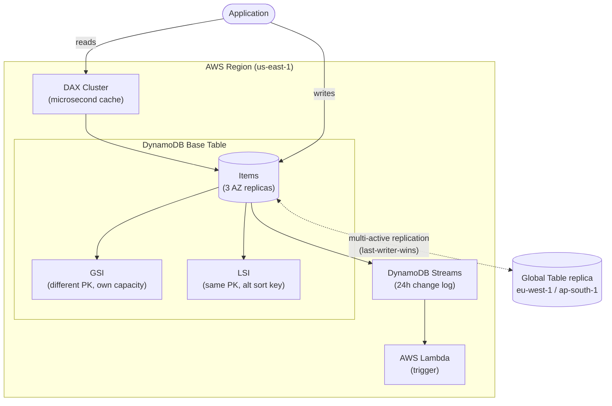
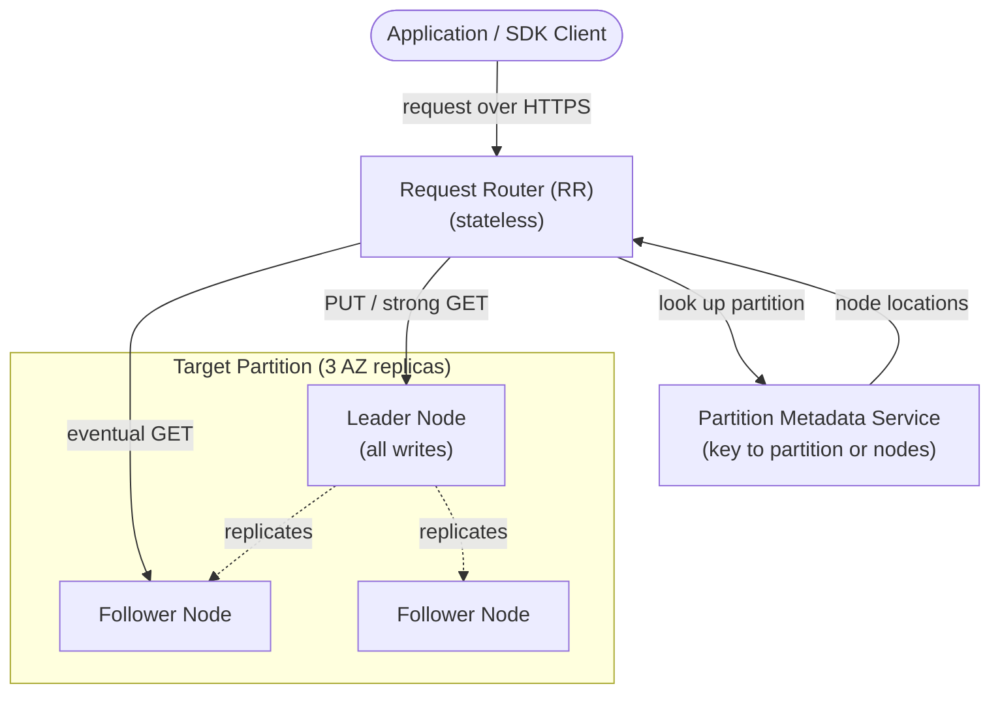
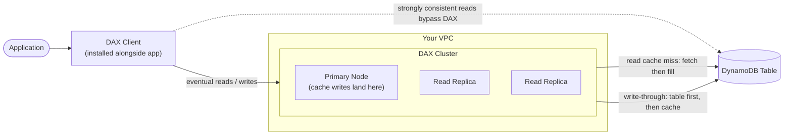

# DynamoDB Architecture Deep Dive - SAA-C03 Deep Dive

> The internals and feature surface of DynamoDB: partitioning and adaptive capacity, secondary indexes (GSI vs LSI), Streams (CDC), TTL, DAX in-memory caching, Global Tables, PITR and on-demand backups, ACID transactions, export to S3, and always-on encryption.

See also: [01 - DynamoDB Intro & Core Concepts](01%20-%20DynamoDB%20Intro%20%26%20Core%20Concepts.md) · [03 - DynamoDB Best Practices & Examples](03%20-%20DynamoDB%20Best%20Practices%20%26%20Examples.md) · [04 - DynamoDB Scenario Questions](04%20-%20DynamoDB%20Scenario%20Questions.md) · [05 - DynamoDB Troubleshooting (SRE)](05%20-%20DynamoDB%20Troubleshooting%20%28SRE%29.md) · [06 - DynamoDB Important Facts & Cheat Sheet](06%20-%20DynamoDB%20Important%20Facts%20%26%20Cheat%20Sheet.md) · [00 - Databases Overview & Exam Guide](00%20-%20Databases%20Overview%20%26%20Exam%20Guide.md) · [01 - ElastiCache Intro & Core Concepts](01%20-%20ElastiCache%20Intro%20%26%20Core%20Concepts.md)

---

## Table of Contents

- [Internal Architecture: Request Router and Leader-Follower](#internal-architecture-request-router-and-leader-follower)
- [Partitioning, Hot Partitions, and Adaptive Capacity](#partitioning-hot-partitions-and-adaptive-capacity)
- [Secondary Indexes: GSI vs LSI](#secondary-indexes-gsi-vs-lsi)
- [DynamoDB Streams](#dynamodb-streams)
- [Time To Live (TTL)](#time-to-live-ttl)
- [DynamoDB Accelerator (DAX)](#dynamodb-accelerator-dax)
- [Global Tables](#global-tables)
- [Backups: PITR and On-Demand](#backups-pitr-and-on-demand)
- [Transactions (ACID)](#transactions-acid)
- [Export to S3 and Encryption](#export-to-s3-and-encryption)
- [Summary: Key Takeaways for SAA-C03](#summary-key-takeaways-for-saa-c03)

---

---

## Internal Architecture: Request Router and Leader-Follower

Under the hood, DynamoDB runs a **leader-follower** node model and routes every request through a stateless front door.

- **Request Router (RR)** - a **stateless** service that receives every incoming request. It consults the **Partition Metadata Service** to learn which partition (and which nodes) hold the target key, then **forwards** the request to the right node.
- **Partition Metadata Service** - the lookup that maps a hashed partition key to its partition and the nodes serving it (one **leader**, multiple **followers**, spread across 3 AZs).
- **Leader node** - the authoritative replica for a partition. **All writes (PUT) go to the leader**, which then replicates to followers.
- **Follower nodes** - additional replicas that can serve reads.

How reads and writes route:

| Operation                       | Routed to                | Why                                                        |
| :------------------------------ | :----------------------- | :--------------------------------------------------------- |
| **PUT / write**                 | **Leader node only**     | The leader owns the write path and replicates to followers |
| **GET - strongly consistent**   | **Leader node**          | Only the leader is guaranteed to have the latest write     |
| **GET - eventually consistent** | **Leader OR a follower** | Any replica may answer; a follower may lag slightly        |

> **Exam Tip:** The fact that maps cleanly to consistency: **strongly consistent reads hit the leader**, while **eventually consistent reads may hit a lagging follower** - which is exactly why eventual reads can return stale data and cost half the RCU.

[⬆ Back to top](#table-of-contents)

---

## Partitioning, Hot Partitions, and Adaptive Capacity

DynamoDB spreads items across **partitions** by hashing the partition key. Each partition tops out at **3000 RCU / 1000 WCU / 10 GB**.

**Hot partition:** when a single partition key value (or a small set) absorbs a disproportionate share of traffic, that partition can hit its limit and throttle even though the table's total provisioned capacity is far from exhausted.

**Adaptive capacity** mitigates this in two ways:

| Mechanism             | What it does                                                                                                                             |
| :-------------------- | :--------------------------------------------------------------------------------------------------------------------------------------- |
| **Adaptive capacity** | Automatically and **instantly** reallocates unused throughput from quiet partitions to the hot one, isolating frequently accessed items. |
| **Burst capacity**    | Lets a partition temporarily use up to **300 seconds** of previously unused capacity to absorb short spikes.                             |

Adaptive capacity is automatic and free, but it is **not a substitute for good key design** - if one key value alone exceeds **3000 RCU/1000 WCU**, no reallocation can save it. Use **write sharding** (append a suffix to the partition key) to spread an unavoidably hot key.

> **Exam Tip:** Throttling on a well-provisioned table = **hot partition**. The first-line fix is **better partition-key design** (higher cardinality / write sharding); adaptive capacity helps but cannot exceed the per-partition ceiling.

[⬆ Back to top](#table-of-contents)

---

## Secondary Indexes: GSI vs LSI

Indexes let you query on attributes that are **not** the table's primary key.

|                | **Global Secondary Index (GSI)**             | **Local Secondary Index (LSI)**                    |
| :------------- | :------------------------------------------- | :------------------------------------------------- |
| Partition key  | **Different** PK (and optional SK)           | **Same** PK as base table                          |
| Sort key       | Any attribute (optional)                     | **Alternate** sort key                             |
| When created   | **Any time** (add/remove after table exists) | **Only at table creation** (immutable)             |
| Capacity       | **Own** RCU/WCU (separate from base table)   | **Shares** base table capacity                     |
| Consistency    | **Eventually consistent only**               | **Strong or eventual**                             |
| Querying scope | **Global** - can span all partitions         | **Local** - scoped to the base-table partition key |
| Count limit    | **20 per table** (default, soft)             | **5 per table**                                    |
| Size limit     | None                                         | Items per PK across base + LSIs <= **10 GB**       |

Both index types let you **project** a subset of attributes (KEYS_ONLY, INCLUDE, ALL) to control storage and read cost.

- Use a **GSI** when you must query by a **completely different attribute** (e.g., look up users by `email` when PK is `userId`), or you forgot to plan an index up front.
- Use an **LSI** when you need an **alternate sort order on the same partition key** with the **option of strongly consistent reads**.

> **Exam Tip:** Three GSI vs LSI traps: (1) **LSIs must be created at table creation** - you cannot add one later. (2) **GSIs are eventually consistent only**. (3) A **throttled GSI applies backpressure to the base table** for writes (see [05 - DynamoDB Troubleshooting (SRE)](05%20-%20DynamoDB%20Troubleshooting%20%28SRE%29.md)).

[⬆ Back to top](#table-of-contents)

---

## DynamoDB Streams

**DynamoDB Streams** is a **change data capture (CDC)** feature: an ordered, time-ordered log of item-level modifications (inserts, updates, deletes).

| Property   | Detail                                                             |
| :--------- | :----------------------------------------------------------------- |
| Retention  | **24 hours**                                                       |
| Ordering   | Ordered **per partition key**                                      |
| View types | KEYS_ONLY, NEW_IMAGE, OLD_IMAGE, **NEW_AND_OLD_IMAGES**            |
| Consumers  | **AWS Lambda** (triggers), Kinesis Client Library / KCL adapter    |
| Use cases  | Replication, aggregation, notifications, audit, materialized views |

Common pattern: **Streams -> Lambda** to react to changes (send an email when a new order is written, propagate updates to OpenSearch, maintain derived data).

There is also **Kinesis Data Streams for DynamoDB** - an alternative that streams changes into a Kinesis Data Stream with longer retention (up to 1 year) and higher fan-out, when you outgrow native Streams.

> **Exam Tip:** "Trigger an action whenever an item changes / on insert / on delete" -> **DynamoDB Streams + Lambda**. This is the canonical event-driven DynamoDB answer.

[⬆ Back to top](#table-of-contents)

---

## Time To Live (TTL)

**TTL** automatically deletes items after a timestamp you store in a designated attribute.

- You pick an attribute holding a **Unix epoch timestamp (seconds)**; DynamoDB deletes the item shortly after that time.
- Deletion is **background, free** (no WCU consumed), and happens **within ~48 hours** of expiry (not instant - eventual).
- Expired items also appear in **Streams as a delete** (with a `userIdentity` flag) so you can archive them before they vanish.

Use cases: **session data**, ephemeral tokens, event logs, time-limited records.

> **Exam Tip:** "Automatically expire/clean up session/temporary data without extra cost" -> **TTL**. Remember deletion is not immediate and consumes no write capacity. To archive on expiry: TTL delete -> Streams -> Lambda -> S3.

[⬆ Back to top](#table-of-contents)

---

## DynamoDB Accelerator (DAX)

**DAX** is a fully managed, **in-memory cache** purpose-built for DynamoDB that delivers **microsecond** read latency (vs single-digit-ms direct).

| Property       | Detail                                                                         |
| :------------- | :----------------------------------------------------------------------------- |
| Latency        | **Microseconds** for cached reads                                              |
| Caches         | **Item cache** (GetItem/BatchGetItem) and **query cache** (Query/Scan results) |
| Write behavior | **Write-through** - writes go to DynamoDB then update the cache                |
| Integration    | API-compatible; minimal code change (point the DAX client at the cluster)      |
| Deployment     | Runs **inside your VPC** as a multi-node cluster                               |
| Best for       | **Read-heavy**, latency-sensitive, repeated reads of the same keys             |

**Cluster topology and access model.** DAX is DynamoDB's **custom in-memory cache**, deployed as a **cluster of one primary node plus read replicas** that runs **inside your VPC**. To use it, you **install the DAX client alongside the application** (on the same server/instance); the client **redirects the application's DynamoDB API calls to the DAX cluster** instead of straight to DynamoDB. Because the DAX client speaks the same DynamoDB API, adopting DAX is a **minimal code change** - you point the client at the cluster endpoint and keep your existing calls.

**Read API behavior (cache fill on miss).** Only **eventually consistent** reads are served from DAX: **`GetItem`, `BatchGetItem`, `Query`, `Scan`**.

- **Cache hit** - DAX returns the item/result from memory in microseconds; DynamoDB is not touched.
- **Cache miss** - DAX **forwards the request to DynamoDB**; as DynamoDB returns the result, DAX **writes it into the cache on the primary node** so subsequent reads hit.
- **Strongly consistent reads bypass DAX entirely** - they pass straight through to DynamoDB (DAX cannot guarantee strong consistency from a cached copy).

**Write API behavior (write-through, both must succeed).** Writes - **`PutItem`, `UpdateItem`, `DeleteItem`, `BatchWriteItem`** - use **write-through**: the data is **written to the DynamoDB table first, then to the DAX cluster**. The API call returns **success only if the write succeeds on BOTH** DynamoDB and DAX, keeping the cache consistent with the table on the write path.

DAX vs ElastiCache for DynamoDB:

- **DAX** is DynamoDB-aware, write-through, and requires almost no app changes - use it for **DynamoDB-specific microsecond reads**.
- **ElastiCache** is a general cache (you manage cache population/invalidation in app code) - more flexible but more work.

> **Exam Tip:** "DynamoDB reads need microsecond latency / read-heavy with hot items" -> **DAX**, not ElastiCache. DAX caches reads only; it does not accelerate writes. Stale-read risk exists if data changes outside DAX's write-through path.

[⬆ Back to top](#table-of-contents)

---

## Global Tables

**Global Tables** provide a fully managed, **multi-Region, multi-active (multi-master)** replication: every replica accepts both reads and writes.

| Property            | Detail                                                                |
| :------------------ | :-------------------------------------------------------------------- |
| Topology            | **Multi-active** - all Region replicas are read/write                 |
| Replication         | Asynchronous, typically **sub-second**, uses Streams under the hood   |
| Conflict resolution | **Last-writer-wins** (based on timestamp)                             |
| Requirements        | **Streams must be enabled**; on-demand or provisioned w/ auto scaling |
| Use cases           | Global low-latency apps, multi-Region DR/HA                           |

> **Exam Tip:** "Multi-Region active-active database with local low-latency reads/writes" -> **DynamoDB Global Tables**. Conflicts resolve via **last-writer-wins** - flag any answer claiming strong cross-Region consistency; replication is **eventually consistent** across Regions.

[⬆ Back to top](#table-of-contents)

---

## Backups: PITR and On-Demand

| Backup Type                       | Detail                                                                                                              |
| :-------------------------------- | :------------------------------------------------------------------------------------------------------------------ |
| **Point-in-Time Recovery (PITR)** | Continuous backups; restore to **any second in the last 35 days**. Enable per table. No performance impact.         |
| **On-demand backups**             | Full snapshot you trigger (or schedule via AWS Backup); retained until you delete. No performance impact, any size. |

- PITR protects against accidental writes/deletes (restore creates a **new table**).
- On-demand backups are for long-term retention/compliance and archiving.
- DynamoDB integrates with **AWS Backup** for centralized, policy-driven backups and cross-Region copy.

> **Exam Tip:** "Recover from accidental delete in the last few weeks" -> **PITR (35 days)**. "Long-term/compliance retention" -> **on-demand backups / AWS Backup**. Restores always go to a **new table**, never in place.

[⬆ Back to top](#table-of-contents)

---

## Transactions (ACID)

DynamoDB supports **ACID transactions** across one or more tables in a single Region:

| API                    | Purpose                                                                              |
| :--------------------- | :----------------------------------------------------------------------------------- |
| **TransactWriteItems** | All-or-nothing writes (Put/Update/Delete/ConditionCheck), up to **100 items / 4 MB** |
| **TransactGetItems**   | Consistent all-or-nothing read of up to 100 items                                    |

- All operations succeed together or the entire transaction is rolled back.
- Transactions cost **2x** the normal RCU/WCU (two underlying reads/writes for prepare + commit).
- Use **condition expressions** for optimistic concurrency without full transactions when you only touch one item.

> **Exam Tip:** "Atomic / all-or-nothing across multiple items or tables" / "bank transfer" / "inventory + order in one operation" -> **DynamoDB transactions**. They are single-Region (do not span Global Table replicas atomically).

[⬆ Back to top](#table-of-contents)

---

## Export to S3 and Encryption

**Export to S3:** Export full table data (and PITR snapshots) to **Amazon S3** in DynamoDB JSON or Ion format - **without consuming RCU** and **without impacting table performance**. Great for analytics with **Athena**, Glue, or EMR. You can also **import from S3** to create a new table.

**Encryption:** DynamoDB **always encrypts data at rest** - you cannot turn it off. Options:

| Key Option                         | Detail                                                 |
| :--------------------------------- | :----------------------------------------------------- |
| **AWS owned key**                  | Default, no extra cost                                 |
| **AWS managed key** (aws/dynamodb) | KMS-managed, visible in your account                   |
| **Customer managed key (CMK)**     | You control rotation, policy, and audit via CloudTrail |

In transit, traffic uses **HTTPS/TLS**.

> **Exam Tip:** "Analyze DynamoDB data in Athena/analytics without hurting production performance" -> **Export to S3** (no RCU consumed), then query with Athena - far better than running expensive Scans. Encryption at rest is **always on**; only the **key type** is configurable.

[⬆ Back to top](#table-of-contents)

---

## Summary: Key Takeaways for SAA-C03

- **Adaptive capacity** auto-rebalances throughput to hot partitions and bursts up to 300s - but cannot exceed **3000 RCU/1000 WCU** per partition; fix hot keys with **good key design / write sharding**.
- **GSI** = different PK, own capacity, **eventually consistent**, add anytime. **LSI** = same PK + alt sort key, shares capacity, **strong consistency option**, **create-time only**.
- **Streams** = 24h CDC log -> **Lambda** for event-driven patterns.
- **TTL** auto-expires items (free, eventual, no WCU) - ideal for session data.
- **DAX** = microsecond write-through cache for **read-heavy** DynamoDB workloads (item + query cache).
- **Global Tables** = multi-Region **multi-active**, last-writer-wins, eventually consistent across Regions.
- **PITR** = restore to any second in **35 days**; **on-demand backups** for long-term retention.
- **Transactions** = ACID, all-or-nothing, **2x cost**, single-Region.
- **Export to S3** = analytics without consuming RCU; **encryption at rest is always on**.

[⬆ Back to top](#table-of-contents)
