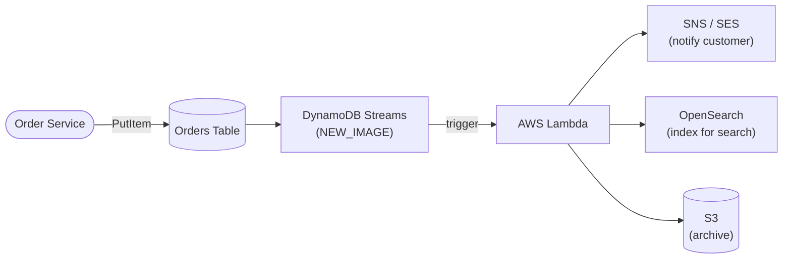

# DynamoDB Best Practices & Examples - SAA-C03 Deep Dive

> Practical guidance: choosing partition keys for uniform distribution, single-table design, GSI vs LSI selection, on-demand vs provisioned decisions, DAX for microsecond reads, Streams + Lambda patterns, Global Tables for active-active, capacity planning, cost control (Query over Scan), JSON item + CLI examples, and IAM fine-grained access.

See also: [01 - DynamoDB Intro & Core Concepts](01%20-%20DynamoDB%20Intro%20%26%20Core%20Concepts.md) · [02 - DynamoDB Architecture Deep Dive](02%20-%20DynamoDB%20Architecture%20Deep%20Dive.md) · [04 - DynamoDB Scenario Questions](04%20-%20DynamoDB%20Scenario%20Questions.md) · [05 - DynamoDB Troubleshooting (SRE)](05%20-%20DynamoDB%20Troubleshooting%20%28SRE%29.md) · [06 - DynamoDB Important Facts & Cheat Sheet](06%20-%20DynamoDB%20Important%20Facts%20%26%20Cheat%20Sheet.md) · [00 - Databases Overview & Exam Guide](00%20-%20Databases%20Overview%20%26%20Exam%20Guide.md) · [01 - ElastiCache Intro & Core Concepts](01%20-%20ElastiCache%20Intro%20%26%20Core%20Concepts.md)

---

## Table of Contents

- [Choosing Partition Keys for Uniform Distribution](#choosing-partition-keys-for-uniform-distribution)
- [Single-Table Design Overview](#single-table-design-overview)
- [When to Use GSI vs LSI](#when-to-use-gsi-vs-lsi)
- [On-Demand vs Provisioned Decision](#on-demand-vs-provisioned-decision)
- [DAX for Read-Heavy Microsecond Workloads](#dax-for-read-heavy-microsecond-workloads)
- [Streams + Lambda Patterns](#streams--lambda-patterns)
- [Global Tables for Multi-Region Active-Active](#global-tables-for-multi-region-active-active)
- [Capacity Planning and Auto Scaling](#capacity-planning-and-auto-scaling)
- [Cost Control: Query Over Scan](#cost-control-query-over-scan)
- [JSON Item and CLI Examples](#json-item-and-cli-examples)
- [IAM Fine-Grained Access (LeadingKeys)](#iam-fine-grained-access-leadingkeys)
- [Summary: Key Takeaways for SAA-C03](#summary-key-takeaways-for-saa-c03)

---



---

## Choosing Partition Keys for Uniform Distribution

The single most important DynamoDB design decision. The goal: **spread reads and writes evenly across partitions** so no single partition becomes hot.

Best practices:

- Pick a **high-cardinality** attribute (userId, deviceId, orderId, sessionId) - many distinct values.
- **Avoid low-cardinality keys** like `status`, `country`, `date`, or a boolean - they funnel traffic into a few partitions.
- For unavoidably hot keys, use **write sharding**: append a **random or calculated suffix** to the partition key (e.g., a value `1`-`100`, giving `key#1` .. `key#100`) and scatter writes across the resulting partitions. This needs **extra application read logic** to query across (or identify) the suffixed partitions when reading back.
- Combine attributes into a **composite key** to add cardinality (e.g., `tenantId#userId`).
- For **read** hot spots, front the table with a **cache (ElastiCache** or DAX**)** so repeated reads of the same key never reach the hot partition.
- For **rare/occasional** hot-partition events, simply **handle the throttling exception with retry + exponential backoff** (the SDKs do this automatically) rather than redesigning the schema.
- Remember that **redesigning the partition key on existing data is costly**: it usually means a data migration (potential downtime) plus application code changes. Get key design right up front.

| Bad Partition Key          | Why                                  | Better                   |
| :------------------------- | :----------------------------------- | :----------------------- |
| `status` (active/inactive) | 2 values -> 2 partitions             | `userId`                 |
| `currentDate`              | All today's writes hit one partition | `userId#date` or sharded |
| `deviceType`               | Few values                           | `deviceId`               |

> **Exam Tip:** "Performance degrades / throttling under load on a table with plenty of capacity" usually traces to a **low-cardinality partition key creating a hot partition**. The fix is **redesign the key for uniform distribution**.

[⬆ Back to top](#table-of-contents)

---

## Single-Table Design Overview

A DynamoDB best practice (NoSQL idiom) is to store **multiple entity types in one table**, using **generic key names** (`PK`, `SK`) and **overloaded keys** so related items co-locate and can be fetched in one query.

- Model **access patterns first**, then design keys to satisfy them (the opposite of relational normalization).
- Use **key prefixes** to distinguish entity types: `USER#1024`, `ORDER#5567`, `PROFILE#1024`.
- Use **item collections** (same PK, different SK) to fetch a parent and its children in one `Query`.
- Use **GSI overloading** to support secondary access patterns.

Example item collection (one Query returns the user and all their orders):

| PK          | SK                 | Attributes    |
| :---------- | :----------------- | :------------ |
| `USER#1024` | `PROFILE#1024`     | name, email   |
| `USER#1024` | `ORDER#2025-01-10` | total, status |
| `USER#1024` | `ORDER#2025-02-02` | total, status |

> **Exam Tip:** SAA-C03 rarely asks you to implement single-table design, but it may describe it as a way to **reduce the number of tables and avoid joins**. Recognize that DynamoDB favors **denormalization** and **design-for-access-patterns** over relational joins.

[⬆ Back to top](#table-of-contents)

---

## When to Use GSI vs LSI

| Need                                               | Choose  | Why                                 |
| :------------------------------------------------- | :------ | :---------------------------------- |
| Query by a **completely different attribute**      | **GSI** | Different PK; own capacity          |
| Add an index **after** the table exists            | **GSI** | LSIs are create-time only           |
| **Strongly consistent** reads on an alternate sort | **LSI** | GSIs are eventually consistent only |
| Different **sort order on the same PK**            | **LSI** | Shares PK, alternate sort key       |
| Isolate index throughput from the base table       | **GSI** | Has its own RCU/WCU                 |

Guidance:

- Project only needed attributes (**KEYS_ONLY / INCLUDE**) to cut storage and read cost.
- Provision GSIs adequately - an **under-provisioned GSI throttles base-table writes**.
- LSIs count item size against the **10 GB per-partition-key** limit.

> **Exam Tip:** Default to **GSI** unless the scenario explicitly needs **strong consistency on an alternate sort key** (then LSI) - and remember the LSI must have existed since table creation.

[⬆ Back to top](#table-of-contents)

---

## On-Demand vs Provisioned Decision

| Scenario signal                                    | Mode                               |
| :------------------------------------------------- | :--------------------------------- |
| New app, **unknown** traffic                       | **On-Demand**                      |
| **Spiky / unpredictable** spikes                   | **On-Demand**                      |
| Dev/test, low/sporadic use                         | **On-Demand**                      |
| **Steady, predictable** high volume                | **Provisioned + Auto Scaling**     |
| Cost optimization at scale                         | **Provisioned** (cheaper per unit) |
| Repeated ProvisionedThroughputExceeded from spikes | Switch to **On-Demand**            |

- You can switch modes **once per 24 hours** per table.
- On-Demand has effectively no capacity planning; Provisioned needs Auto Scaling to avoid throttling.

> **Exam Tip:** Map the keyword: **unpredictable/spiky/unknown -> On-Demand**; **predictable/steady/cost-sensitive -> Provisioned + Auto Scaling**.

[⬆ Back to top](#table-of-contents)

---

## DAX for Read-Heavy Microsecond Workloads

Use **DAX** when:

- Reads dominate writes (**read-heavy**), and the same items are read repeatedly.
- You need **microsecond** latency that DynamoDB's single-digit-ms cannot meet.
- You want minimal code change (DAX is API-compatible, write-through).

Avoid/limit DAX when:

- Workload is **write-heavy** (DAX accelerates reads, not writes).
- You need **strongly consistent** reads (DAX serves eventually consistent cached values for those reads).
- Data changes very frequently and **stale reads** are unacceptable.

> **Exam Tip:** "DynamoDB + microseconds + read-heavy" -> **DAX**. If the cache must be a general-purpose store (sessions, leaderboards, pub/sub) -> **ElastiCache** instead.

[⬆ Back to top](#table-of-contents)

---

## Streams + Lambda Patterns

Enable **Streams** (usually `NEW_AND_OLD_IMAGES`) and attach a **Lambda** trigger to build event-driven workflows:

| Pattern                              | How                                                |
| :----------------------------------- | :------------------------------------------------- |
| **Notifications**                    | New order item -> Lambda -> SNS/SES email          |
| **Search indexing**                  | Item change -> Lambda -> OpenSearch                |
| **Aggregation/materialized views**   | Update -> Lambda -> write rollups back to DynamoDB |
| **Cross-account/region replication** | Change -> Lambda -> remote table                   |
| **Audit / archive**                  | TTL delete -> Streams -> Lambda -> S3              |

Best practices: keep Lambda **idempotent** (Streams can deliver at-least-once), monitor **IteratorAge**, and right-size batch size / parallelization factor.

> **Exam Tip:** Any "react when an item is created/updated/deleted" requirement = **Streams + Lambda**. To archive expiring items, combine **TTL + Streams + Lambda + S3**.

[⬆ Back to top](#table-of-contents)

---

## Global Tables for Multi-Region Active-Active

Use Global Tables when:

- Users are **geographically distributed** and need **local low-latency** reads/writes.
- You need **multi-Region DR/HA** with automatic failover (clients just point to the nearest replica).

Design considerations:

- Replication is **eventually consistent** across Regions (sub-second typical); conflicts resolve **last-writer-wins**.
- Design to **avoid concurrent writes to the same item in different Regions** if possible (or accept LWW).
- Streams are required and enabled automatically.
- Use **On-Demand** or **Provisioned with Auto Scaling** on every replica.

> **Exam Tip:** "Active-active, multi-Region, low-latency globally" -> **Global Tables**. Do not pick read replicas (that is RDS/Aurora terminology) or a single-Region table for this.

[⬆ Back to top](#table-of-contents)

---

## Capacity Planning and Auto Scaling

- In **Provisioned** mode, enable **Application Auto Scaling**: set min/max and a **target utilization** (commonly 70%).
- Auto Scaling reacts to **sustained** load, not instantaneous spikes - **burst capacity** (up to 300s) and **adaptive capacity** cover short bursts.
- For truly unpredictable spikes, **On-Demand** is safer than chasing Auto Scaling.
- Provision **GSIs** independently and watch their throttling.

> **Exam Tip:** Auto Scaling is **reactive** (lagging). If spikes are sudden and large, the exam wants **On-Demand**, not Provisioned + Auto Scaling.

[⬆ Back to top](#table-of-contents)

---

## Cost Control: Query Over Scan

- **Query** reads items by partition key (and optional sort-key condition) - efficient, reads only matching items.
- **Scan** reads the **entire table** then filters client-side - slow and expensive at scale (you pay RCU for every item read, even those filtered out).

Cost/perf practices:

- **Prefer Query (and indexes) over Scan.** Add a GSI to enable a query instead of a scan.
- For unavoidable scans, use **parallel scan**, **page** with `Limit`, and project only needed attributes.
- Use **eventually consistent** reads (half the RCU) where freshness allows.
- For analytics, **Export to S3 + Athena** instead of scanning the live table.
- Choose **On-Demand vs Provisioned** to match traffic; use **Standard-IA** table class for infrequently accessed data.

> **Exam Tip:** "Reduce cost / improve performance of a full-table read" -> **avoid Scan; use Query with a GSI**, or **export to S3 and query with Athena**. Scan is almost always the wrong answer in cost questions.

[⬆ Back to top](#table-of-contents)

---

## JSON Item and CLI Examples

Put an item:

```bash
aws dynamodb put-item \
  --table-name Orders \
  --item '{
    "CustomerId": {"S": "c#500"},
    "OrderDate":  {"S": "2025-01-14"},
    "Total":      {"N": "129.50"},
    "Status":     {"S": "SHIPPED"}
  }' \
  --condition-expression "attribute_not_exists(CustomerId)"
```

Query all orders for a customer in January 2025 (efficient - no scan):

```bash
aws dynamodb query \
  --table-name Orders \
  --key-condition-expression "CustomerId = :c AND begins_with(OrderDate, :d)" \
  --expression-attribute-values '{
    ":c": {"S": "c#500"},
    ":d": {"S": "2025-01"}
  }' \
  --consistent-read
```

> **Exam Tip:** `--key-condition-expression` (Query) targets keys efficiently; a `--filter-expression` on a **Scan** still reads/charges for every item first. The `--condition-expression` enables optimistic locking / "create only if not exists".

[⬆ Back to top](#table-of-contents)

---

## IAM Fine-Grained Access (LeadingKeys)

DynamoDB supports **fine-grained, row-level access control** via IAM condition keys - so a user can access **only their own items**.

| Condition Key          | Restricts by                                                    |
| :--------------------- | :-------------------------------------------------------------- |
| `dynamodb:LeadingKeys` | **Partition key value** must match (e.g., the caller's user ID) |
| `dynamodb:Attributes`  | Which **attributes** are accessible                             |
| `dynamodb:Select`      | Whether all attributes or only projected are returned           |

Example: a policy that lets a federated/Cognito user read only items whose partition key equals their identity:

```json
{
  "Effect": "Allow",
  "Action": ["dynamodb:GetItem", "dynamodb:Query"],
  "Resource": "arn:aws:dynamodb:us-east-1:111122223333:table/Orders",
  "Condition": {
    "ForAllValues:StringEquals": {
      "dynamodb:LeadingKeys": ["${cognito-identity.amazonaws.com:sub}"]
    }
  }
}
```

> **Exam Tip:** "Restrict each mobile/web user to only their own rows in DynamoDB" -> IAM policy with **`dynamodb:LeadingKeys`** tied to the Cognito identity (`${cognito-identity.amazonaws.com:sub}`). This avoids a backend proxy for authorization.

[⬆ Back to top](#table-of-contents)

---

## Summary: Key Takeaways for SAA-C03

- Choose **high-cardinality partition keys** for uniform distribution; **write-shard** unavoidable hot keys.
- **Single-table design**: model access patterns first, denormalize, use overloaded keys and item collections.
- **GSI** for different attributes / add-later / isolated capacity; **LSI** for strong-consistency alternate sort (create-time only).
- **On-Demand** for spiky/unknown; **Provisioned + Auto Scaling** for steady (Auto Scaling is reactive).
- **DAX** for read-heavy microsecond reads; **ElastiCache** for general caching.
- **Streams + Lambda** for event-driven; **TTL + Streams + Lambda + S3** to archive expirations.
- **Global Tables** for multi-Region active-active (last-writer-wins).
- **Query over Scan** for cost/performance; **Export to S3 + Athena** for analytics.
- **`dynamodb:LeadingKeys`** for per-user row-level IAM access control.

[⬆ Back to top](#table-of-contents)
