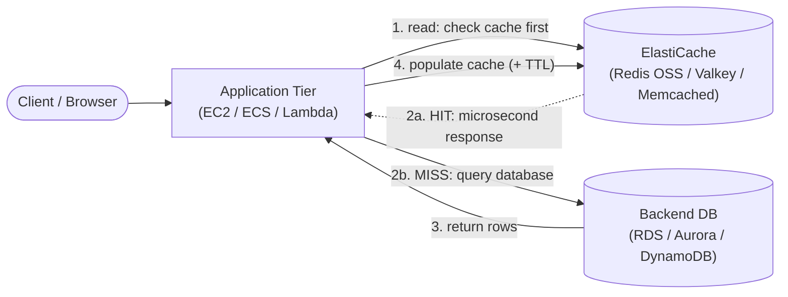

# ElastiCache Intro & Core Concepts - SAA-C03 Deep Dive

> What Amazon ElastiCache is, why an in-memory cache matters, the difference between ElastiCache for Redis OSS / Valkey and Memcached, the problems caching solves (offloading DB reads, session stores), and a first look at ElastiCache Serverless.

See also: [02 - ElastiCache Architecture Deep Dive](02%20-%20ElastiCache%20Architecture%20Deep%20Dive.md) · [03 - ElastiCache Best Practices & Examples](03%20-%20ElastiCache%20Best%20Practices%20%26%20Examples.md) · [04 - ElastiCache Scenario Questions](04%20-%20ElastiCache%20Scenario%20Questions.md) · [05 - ElastiCache Troubleshooting (SRE)](05%20-%20ElastiCache%20Troubleshooting%20%28SRE%29.md) · [06 - ElastiCache Important Facts & Cheat Sheet](06%20-%20ElastiCache%20Important%20Facts%20%26%20Cheat%20Sheet.md) · [00 - Databases Overview & Exam Guide](00%20-%20Databases%20Overview%20%26%20Exam%20Guide.md) · [01 - DynamoDB Intro & Core Concepts](01%20-%20DynamoDB%20Intro%20%26%20Core%20Concepts.md)

---

## Table of Contents

- [What Is Amazon ElastiCache](#what-is-amazon-elasticache)
- [Why In-Memory Caching](#why-in-memory-caching)
- [What a Cache Solves](#what-a-cache-solves)
- [Redis OSS / Valkey vs Memcached](#redis-oss--valkey-vs-memcached)
- [ElastiCache Serverless](#elasticache-serverless)
- [Core Terminology](#core-terminology)

---

---

## What Is Amazon ElastiCache

Amazon ElastiCache is a **fully managed, in-memory data store and cache** service. AWS handles provisioning, patching, monitoring, backups, failure detection, and recovery so you can run **Redis OSS**, **Valkey**, or **Memcached** without managing servers.

Key characteristics:

- **In-memory** → data lives in RAM, delivering **microsecond read/write latency** (vs single-digit-millisecond for disk-backed DBs).
- You connect to a **DNS endpoint** (primary/configuration/reader endpoint), never a raw node IP — AWS swaps the underlying node on failover.
- Runs **inside your VPC**, in subnets defined by a **cache subnet group**, protected by **security groups**.
- Like RDS, you do **not** get SSH/OS access to the cache nodes — it is a managed service.

> [!tip] Exam Tip
> When a question mentions **"microsecond latency"**, **"reduce read load on the database"**, **"session store"**, or **"in-memory cache"** for a relational/general workload, think **ElastiCache**. (For DynamoDB specifically, the microsecond-cache answer is **DAX**, not ElastiCache — see [06 - ElastiCache Important Facts & Cheat Sheet](06%20-%20ElastiCache%20Important%20Facts%20%26%20Cheat%20Sheet.md).)

[⬆ Back to top](#table-of-contents)

---

## Why In-Memory Caching

A database read that hits disk or runs a complex join is comparatively slow and consumes DB CPU/IOPS. A cache sits **in front of** the database and serves frequently requested data from RAM.

| Layer                         | Typical latency  | Cost per read | Durability     |
| :---------------------------- | :--------------- | :------------ | :------------- |
| In-memory cache (ElastiCache) | **Microseconds** | Very low      | Volatile (RAM) |
| Relational DB (RDS/Aurora)    | Single-digit ms  | Higher        | Durable        |
| Object store (S3)             | Tens of ms       | Low           | Very durable   |

The cache trades **durability for speed**: data in RAM can be lost on a node failure (Redis can mitigate with replication/snapshots; Memcached cannot). You cache data that is **expensive to compute or fetch** and **read far more often than written**.

> [!tip] Exam Tip
> Caching is best for **read-heavy, relatively static** data with **high reuse**. It is a poor fit for write-heavy, constantly-changing, or rarely-reread data.

[⬆ Back to top](#table-of-contents)

---

## What a Cache Solves

Common ElastiCache use cases on the exam:

| Use case                       | How the cache helps                                                                                                      |
| :----------------------------- | :----------------------------------------------------------------------------------------------------------------------- |
| **Offload DB reads**           | Serve hot rows/query results from RAM; RDS/Aurora CPU and IOPS drop dramatically                                         |
| **Session store**              | Store HTTP session state externally so the web tier can be **stateless** and horizontally scalable behind an ALB (Redis) |
| **Leaderboards / ranking**     | Redis **sorted sets** give O(log N) ranked queries in real time                                                          |
| **Rate limiting / counters**   | Atomic `INCR` counters for API throttling                                                                                |
| **Pub/Sub messaging**          | Redis publish/subscribe for lightweight fan-out                                                                          |
| **Full-page / fragment cache** | Cache rendered output to cut compute                                                                                     |
| **Geospatial**                 | Redis `GEO` commands for nearby-search                                                                                   |

> [!tip] Exam Tip
> **"Stateless web tier behind an ALB / Auto Scaling, need shared session state"** → store sessions in **ElastiCache for Redis** (durable across instance termination, supports replication). This is one of the most common ElastiCache exam scenarios.

[⬆ Back to top](#table-of-contents)

---

## Redis OSS / Valkey vs Memcached

ElastiCache offers **three engines**. Redis OSS and Valkey share the same feature set (Valkey is the Linux-Foundation fork of Redis, fully wire-compatible and often cheaper on ElastiCache); Memcached is the simpler, multi-threaded option.

| Dimension                                    | Redis OSS / Valkey                                                                | Memcached                                                |
| :------------------------------------------- | :-------------------------------------------------------------------------------- | :------------------------------------------------------- |
| Data structures                              | Rich: strings, hashes, lists, sets, **sorted sets**, streams, bitmaps, geospatial | Simple key/value (strings/objects) only                  |
| Replication / read replicas                  | **Yes** (primary + replicas)                                                      | No                                                       |
| Multi-AZ + automatic failover                | **Yes**                                                                           | No                                                       |
| Persistence / backups (snapshots)            | **Yes**                                                                           | No                                                       |
| Cross-Region replication                     | **Yes** (Global Datastore)                                                        | No                                                       |
| Encryption (in-transit / at-rest) + AUTH/ACL | **Yes**                                                                           | In-transit encryption supported; no replication/failover |
| Multi-threaded                               | Largely single-threaded core (per shard)                                          | **Yes** (scales with vCPUs)                              |
| Horizontal scaling                           | Sharding via **cluster mode**                                                     | Add nodes; sharding is **client-side**                   |
| Pub/Sub, transactions, Lua                   | **Yes**                                                                           | No                                                       |

> [!tip] Exam Tip
> **Redis/Valkey** = "I need HA, failover, persistence, replication, or advanced data structures (sorted sets, pub/sub)." **Memcached** = "Simple, multi-threaded object cache, scale out horizontally, no persistence/HA required." If the scenario needs **any** durability or failover, the answer is **Redis/Valkey**.

[⬆ Back to top](#table-of-contents)

---

## ElastiCache Serverless

**ElastiCache Serverless** (GA, supports Redis OSS, Valkey, and Memcached) removes capacity planning entirely:

- No node/instance sizing — you create a **cache** and it **scales automatically** based on traffic, vertically and horizontally, in seconds.
- **Pay for what you use**: data stored (GB-hours) + compute (ElastiCache Processing Units).
- Highly available by default (**multi-AZ**, data replicated across AZs).
- Single endpoint; ideal when traffic is **spiky or unpredictable** or you simply do not want to manage capacity.

> [!tip] Exam Tip
> "Unpredictable/spiky cache traffic, want zero capacity management, fastest path to a highly available cache" → **ElastiCache Serverless**. For full control over node type, cluster topology, and lowest cost at steady scale → **node-based (self-designed) clusters**.

[⬆ Back to top](#table-of-contents)

---

## Core Terminology

| Term                           | Meaning                                                                          |
| :----------------------------- | :------------------------------------------------------------------------------- |
| **Node**                       | Smallest building block — a fixed-size chunk of RAM running the engine           |
| **Shard / node group** (Redis) | A primary node + 0–5 read replicas; data partition in cluster mode               |
| **Cluster**                    | A collection of nodes (1 shard if cluster mode disabled; many shards if enabled) |
| **Replication group** (Redis)  | Primary + replicas providing read scaling and failover                           |
| **Cache subnet group**         | The VPC subnets across AZs where nodes can be placed                             |
| **Parameter group**            | Engine configuration (e.g., `maxmemory-policy`)                                  |
| **Endpoint**                   | DNS name clients connect to (primary, reader, or configuration endpoint)         |
| **TTL**                        | Time-to-live after which a cached key expires                                    |
| **CacheHitRate**               | % of requests served from cache vs going to the DB                               |

[⬆ Back to top](#table-of-contents)
