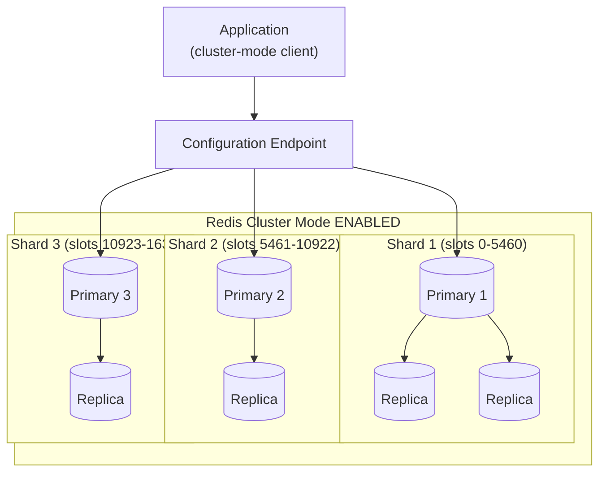
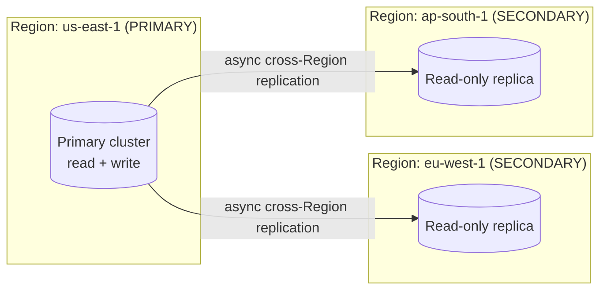

# ElastiCache Architecture Deep Dive - SAA-C03 Deep Dive

> Redis OSS / Valkey topologies (single-node, replication, cluster mode disabled vs enabled, Multi-AZ failover, snapshots, persistence, pub/sub, sorted sets, Global Datastore, encryption + AUTH/ACL), the Memcached model (multi-threaded, client-side sharding, no replication/persistence), a detailed engine comparison, and ElastiCache Serverless internals.

See also: [01 - ElastiCache Intro & Core Concepts](01%20-%20ElastiCache%20Intro%20%26%20Core%20Concepts.md) · [03 - ElastiCache Best Practices & Examples](03%20-%20ElastiCache%20Best%20Practices%20%26%20Examples.md) · [04 - ElastiCache Scenario Questions](04%20-%20ElastiCache%20Scenario%20Questions.md) · [05 - ElastiCache Troubleshooting (SRE)](05%20-%20ElastiCache%20Troubleshooting%20%28SRE%29.md) · [06 - ElastiCache Important Facts & Cheat Sheet](06%20-%20ElastiCache%20Important%20Facts%20%26%20Cheat%20Sheet.md) · [00 - Databases Overview & Exam Guide](00%20-%20Databases%20Overview%20%26%20Exam%20Guide.md) · [01 - DynamoDB Intro & Core Concepts](01%20-%20DynamoDB%20Intro%20%26%20Core%20Concepts.md)

---

## Table of Contents

- [Redis Single-Node and Replication](#redis-single-node-and-replication)
- [Cluster Mode Disabled vs Enabled](#cluster-mode-disabled-vs-enabled)
- [Multi-AZ and Automatic Failover](#multi-az-and-automatic-failover)
- [Backup, Snapshot, Restore and Persistence](#backup-snapshot-restore-and-persistence)
- [Data Tiering (DRAM + SSD)](#data-tiering-dram--ssd)
- [Redis Data Structures and Pub Sub](#redis-data-structures-and-pub-sub)
- [Global Datastore Cross-Region Replication](#global-datastore-cross-region-replication)
- [Security Encryption AUTH and ACL](#security-encryption-auth-and-acl)
- [Memcached Architecture](#memcached-architecture)
- [Redis vs Memcached Detailed Comparison](#redis-vs-memcached-detailed-comparison)
- [ElastiCache Serverless Internals](#elasticache-serverless-internals)

---

---

## Redis Single-Node and Replication

A Redis OSS / Valkey deployment is a **replication group** (cluster). Two basic shapes:

- **Single-node**: one node, no replica. Cheapest; **no HA** — node loss means data loss until you restore from a snapshot. Good for dev/test or pure cache where loss is acceptable.
- **Replication (primary + read replicas)**: one **primary** (read/write) plus up to **5 read replicas** per shard. Replicas use **asynchronous replication** and serve **read-only** traffic via the **reader endpoint**, scaling reads and providing failover targets.

Endpoints (cluster mode **disabled**):

| Endpoint             | Use                                                                  |
| :------------------- | :------------------------------------------------------------------- |
| **Primary endpoint** | All writes; always points at the current primary (survives failover) |
| **Reader endpoint**  | Round-robins reads across replicas                                   |
| Node endpoints       | Target a specific node (rarely used directly)                        |

> [!tip] Exam Tip
> Replicas are **asynchronous** → a replica read can be **slightly stale**. If the scenario demands read-after-write consistency, read from the **primary endpoint**.

[⬆ Back to top](#table-of-contents)

---

## Cluster Mode Disabled vs Enabled

The single biggest Redis architecture decision.

|                      | Cluster Mode **Disabled**                                 | Cluster Mode **Enabled**                                      |
| :------------------- | :-------------------------------------------------------- | :------------------------------------------------------------ |
| Shards (node groups) | **Exactly 1**                                             | **Up to 500**                                                 |
| Data partitioning    | All data in one shard                                     | **Sharded** across shards via 16,384 hash slots               |
| Replicas             | 0–5 on the single shard                                   | 0–5 per shard                                                 |
| Scaling              | Scale **up** (bigger node) or add replicas (read scaling) | Scale **out** (add shards) for more write throughput + memory |
| Client endpoint      | Primary + reader endpoints                                | **Configuration endpoint** (client discovers shards)          |
| Online resharding    | N/A                                                       | **Yes** — add/remove shards without downtime                  |
| Max data size        | One node's RAM                                            | Sum of all shards' RAM (huge datasets)                        |

- **Cluster mode enabled** spreads keys across shards by hashing the key to one of 16,384 slots, then mapping slot → shard. This scales **write throughput and total memory** beyond a single node.
- The client must be **cluster-aware** and connect to the **configuration endpoint**.

> [!tip] Exam Tip
> "Dataset too large for one node / need to scale writes / partition data" → **cluster mode enabled (sharding)**. "Just need more read throughput or simple HA" → **cluster mode disabled with read replicas + Multi-AZ**.

[⬆ Back to top](#table-of-contents)

---

## Multi-AZ and Automatic Failover

**Multi-AZ** places the primary and at least one replica in **different Availability Zones**. With **automatic failover** enabled, if the primary fails, ElastiCache promotes a healthy replica to primary, updates the **primary endpoint DNS**, and the application reconnects — typically within **seconds to ~1 minute**.

- Requires **at least one read replica** (Multi-AZ has no meaning on a single-node cluster).
- Failover is also triggered by maintenance, AZ disruption, or hardware failure.
- The **DNS endpoint stays the same**; only the underlying node changes — so applications should connect by endpoint and handle brief reconnects.

> [!tip] Exam Tip
> "Cache must survive an AZ outage / node failure with automatic recovery" → **Redis with Multi-AZ + automatic failover** (and ≥1 replica). **Memcached cannot do this** — it has no replication or failover.

[⬆ Back to top](#table-of-contents)

---

## Backup, Snapshot, Restore and Persistence

Redis OSS / Valkey supports **durability** features that Memcached lacks:

- **Snapshots (backups)**: point-in-time `.rdb` copies stored in **S3**. Can be **automatic** (daily, with a retention window and backup window) or **manual** (retained until you delete them).
- **Restore**: create a new cluster from a snapshot; also used to **migrate/seed** data or change node type/shard count.
- **Persistence**:
  - **RDB snapshots** = periodic point-in-time dumps.
  - **AOF (Append Only File)** = logs every write so data can be reconstructed; provides better durability between snapshots. **Note:** AOF is **not supported on cluster-mode-enabled** clusters and is generally superseded by **Multi-AZ** for ElastiCache durability.
- Taking a snapshot on the **primary** can briefly impact performance; ElastiCache prefers to snapshot a **replica** when one exists.

> [!tip] Exam Tip
> "Need to back up / restore / migrate cache data, or seed a new cluster" → **Redis snapshots to S3**. For node-failure durability AWS recommends **Multi-AZ** over relying on AOF. **Memcached has no backups at all.**

[⬆ Back to top](#table-of-contents)

---

## Data Tiering (DRAM + SSD)

**Data tiering** lets ElastiCache for Redis OSS / Valkey automatically tier data between **memory (DRAM)** and local **NVMe SSD** to lower cost per GB for large datasets.

- Available only on the **R6gd** node family (Graviton2 nodes with attached NVMe SSD).
- Ideal for workloads that **regularly access up to ~20% of their dataset** — the hot working set stays in DRAM, the colder remainder lives on SSD.
- When DRAM fills, **infrequently accessed items are moved to SSD asynchronously**; an access to an item on SSD pulls it back into DRAM (a slight, predictable latency increase for those reads).
- Storage scales up to **1 PB in a single cluster** (cluster mode enabled across shards) — far beyond pure-DRAM nodes.

> [!tip] Exam Tip
> "Very large Redis dataset, only a small fraction is hot, want to cut memory cost" → **data tiering on R6gd nodes** (DRAM + NVMe SSD, up to ~20% hot data, scales to 1 PB). Cold data on SSD trades a little read latency for much lower cost.

[⬆ Back to top](#table-of-contents)

---

## Redis Data Structures and Pub Sub

Redis/Valkey is far more than a key/value store. SAA-C03-relevant structures:

| Structure                | Example use                                                   |
| :----------------------- | :------------------------------------------------------------ |
| **String**               | Simple cache value, counter (`INCR`) for rate limiting        |
| **Hash**                 | Object/record fields under one key                            |
| **List**                 | Queues, recent-activity feeds                                 |
| **Set**                  | Unique tags, membership tests                                 |
| **Sorted Set (ZSET)**    | **Leaderboards / rankings** — O(log N) ranked reads via score |
| **Bitmap / HyperLogLog** | Cardinality / presence counts                                 |
| **Geospatial**           | Nearby-location search                                        |
| **Stream**               | Append-only log / event streaming                             |

**Pub/Sub**: producers `PUBLISH` to channels and subscribers receive messages in real time — useful for lightweight fan-out / notifications (not durable like SQS/Kinesis).

> [!tip] Exam Tip
> **Real-time leaderboard / ranking** → Redis **sorted sets**. **Lightweight real-time messaging/fan-out** → Redis **pub/sub** (but for guaranteed, durable delivery prefer **SQS/SNS/Kinesis**).

[⬆ Back to top](#table-of-contents)

---

## Global Datastore Cross-Region Replication

**Global Datastore** provides **fully managed, cross-Region replication** for Redis OSS / Valkey:

- One **primary (active) Region** handles writes; up to **two secondary Regions** are **read-only** replicas.
- Replication is **asynchronous**, typically with **sub-second** cross-Region lag.
- Enables **low-latency local reads** for geographically distributed users and **disaster recovery** — you can **promote a secondary Region** to primary.

> [!tip] Exam Tip
> "Cross-Region, low-latency reads for a global user base" or "cache-layer DR with regional failover" → **ElastiCache Global Datastore** (Redis/Valkey only). Memcached cannot replicate cross-Region.

[⬆ Back to top](#table-of-contents)

---

## Security Encryption AUTH and ACL

| Control                   | Detail                                                                                                                                                                                                                                                 |
| :------------------------ | :----------------------------------------------------------------------------------------------------------------------------------------------------------------------------------------------------------------------------------------------------- |
| **Network**               | Runs in your **VPC**; restrict access with **security groups** and a cache subnet group. No public access by design.                                                                                                                                   |
| **Encryption at rest**    | Optional AES-256 for snapshots and on-disk data (set at create time).                                                                                                                                                                                  |
| **Encryption in transit** | TLS between clients and nodes, and between nodes.                                                                                                                                                                                                      |
| **Redis AUTH**            | Password/token required to issue commands (requires in-transit encryption).                                                                                                                                                                            |
| **Redis RBAC / ACL**      | User + user-group based access control; finer-grained than a single AUTH token.                                                                                                                                                                        |
| **IAM authentication**    | Redis OSS / Valkey support **IAM-based auth** so clients authenticate with IAM identities instead of static tokens.                                                                                                                                    |
| **Compliance**            | Redis OSS / Valkey (with encryption + AUTH/RBAC) is eligible for **PCI DSS, HIPAA, and FedRAMP** workloads.                                                                                                                                            |
| **Memcached**             | Supports **in-transit encryption** and (with that) authentication, but **lacks strong auth/encryption** parity with Redis and has **no replication/failover**. Recommendation: run Memcached nodes in **private subnets with no public connectivity**. |

> [!tip] Exam Tip
> "Must encrypt cache data in transit and at rest and require authentication" → enable **in-transit + at-rest encryption** and **Redis AUTH/RBAC** (or IAM auth). Set encryption **at creation** — you cannot toggle at-rest encryption on an existing cluster. For **PCI DSS / HIPAA / FedRAMP**, choose **Redis/Valkey** (not Memcached).

[⬆ Back to top](#table-of-contents)

---

## Memcached Architecture

Memcached is the **simple, multi-threaded** engine:

- **Multi-threaded** → a single large node uses **all vCPUs**, giving high raw throughput. You scale **up** with a bigger node type or **out** by adding nodes (up to 40 by default).
- **No replication, no Multi-AZ, no failover** — losing a node loses its share of the data.
- **No persistence, no snapshots** — purely volatile.
- **Sharding is client-side**: the client library uses **consistent hashing** to spread keys across nodes. ElastiCache provides **Auto Discovery** so clients learn the node list automatically.
- Only **simple key/value objects** — no advanced data structures, pub/sub, or transactions.

> [!tip] Exam Tip
> Memcached's strengths: **multi-threaded throughput** and **simple horizontal scale-out** for a pure cache where data loss is tolerable. Its disqualifiers: any need for **persistence, backups, replication, failover, or rich data types** → choose **Redis/Valkey** instead.

[⬆ Back to top](#table-of-contents)

---

## Redis vs Memcached Detailed Comparison

| Feature                         | Redis OSS / Valkey                                               | Memcached                                  |
| :------------------------------ | :--------------------------------------------------------------- | :----------------------------------------- |
| Engine threading                | Single-threaded per shard                                        | **Multi-threaded**                         |
| Data types                      | Strings, hashes, lists, sets, sorted sets, streams, geo, bitmaps | Simple key/value only                      |
| Replication / read replicas     | Yes (up to 5/shard)                                              | No                                         |
| Multi-AZ + auto failover        | Yes                                                              | No                                         |
| Sharding                        | Built-in (cluster mode enabled)                                  | Client-side only                           |
| Persistence (RDB/AOF)           | Yes                                                              | No                                         |
| Backups / snapshots / restore   | Yes (to S3)                                                      | No                                         |
| Cross-Region replication        | Yes (Global Datastore)                                           | No                                         |
| Pub/Sub, transactions, Lua      | Yes                                                              | No                                         |
| Encryption in transit / at rest | Yes / Yes                                                        | Yes / Limited                              |
| AUTH / RBAC / IAM auth          | Yes                                                              | Limited                                    |
| Best for                        | HA, durability, complex data, leaderboards, sessions             | Simple, large, multi-threaded object cache |

> [!tip] Exam Tip
> Memorize the disqualifiers: the moment a question needs **persistence, HA/failover, replication, cross-Region, or sorted sets/pub-sub**, the answer is **Redis/Valkey**. Memcached wins only on **"simple, multi-threaded, scale-out, no HA needed."**

[⬆ Back to top](#table-of-contents)

---

## ElastiCache Serverless Internals

ElastiCache Serverless abstracts the cluster entirely:

- You provision a **cache** (not nodes). It maintains a fleet behind a **single endpoint** and scales **compute and memory automatically** in seconds as load changes.
- Data is replicated **across multiple AZs** for high availability by default.
- Supports **Redis OSS, Valkey, and Memcached** APIs.
- Billing = **data stored (GB-hours)** + **ElastiCache Processing Units (ECPUs)** consumed. You can set **usage limits** to cap cost.
- No manual sharding, failover configuration, or node sizing required.

> [!tip] Exam Tip
> Serverless = **operational simplicity + automatic scaling for unpredictable load**, multi-AZ HA out of the box. Trade-off: less topology control and potentially higher cost than a well-sized node-based cluster at steady high utilization.

[⬆ Back to top](#table-of-contents)
