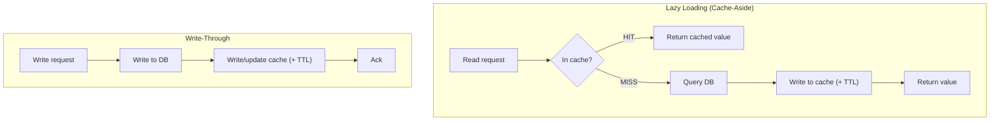

# ElastiCache Best Practices & Examples - SAA-C03 Deep Dive

> Caching strategies (lazy loading / cache-aside vs write-through, both with TTL), choosing Redis vs Memcached, Multi-AZ for HA, sizing, eviction policies (maxmemory-policy), the session-store and leaderboard patterns, cost optimisation, and security best practices — with code.

See also: [01 - ElastiCache Intro & Core Concepts](01%20-%20ElastiCache%20Intro%20%26%20Core%20Concepts.md) · [02 - ElastiCache Architecture Deep Dive](02%20-%20ElastiCache%20Architecture%20Deep%20Dive.md) · [04 - ElastiCache Scenario Questions](04%20-%20ElastiCache%20Scenario%20Questions.md) · [05 - ElastiCache Troubleshooting (SRE)](05%20-%20ElastiCache%20Troubleshooting%20%28SRE%29.md) · [06 - ElastiCache Important Facts & Cheat Sheet](06%20-%20ElastiCache%20Important%20Facts%20%26%20Cheat%20Sheet.md) · [00 - Databases Overview & Exam Guide](00%20-%20Databases%20Overview%20%26%20Exam%20Guide.md) · [01 - DynamoDB Intro & Core Concepts](01%20-%20DynamoDB%20Intro%20%26%20Core%20Concepts.md)

---

## Table of Contents

- [Caching Strategies Overview](#caching-strategies-overview)
- [Lazy Loading Cache-Aside](#lazy-loading-cache-aside)
- [Write-Through](#write-through)
- [TTL and When to Use Each Strategy](#ttl-and-when-to-use-each-strategy)
- [Choosing Redis vs Memcached](#choosing-redis-vs-memcached)
- [Multi-AZ and Sizing](#multi-az-and-sizing)
- [Eviction Policies](#eviction-policies)
- [Session Store Pattern](#session-store-pattern)
- [Leaderboard Pattern](#leaderboard-pattern)
- [Cost Optimisation](#cost-optimisation)
- [Security Best Practices](#security-best-practices)

---



---

## Caching Strategies Overview

The three classic strategies, plus a write-back note:

| Strategy                       | Cache written on            | Pros                                                            | Cons                                                     |
| :----------------------------- | :-------------------------- | :-------------------------------------------------------------- | :------------------------------------------------------- |
| **Lazy loading (cache-aside)** | Cache miss (read path)      | Only caches what is actually requested; resilient to cache loss | First read is a miss (latency); risk of **stale** data   |
| **Write-through**              | Every write                 | Cache is always fresh; no first-read miss                       | Write latency +1 hop; caches data that may never be read |
| **Write-back / write-behind**  | Write to cache, async to DB | Fast writes                                                     | Risk of data loss before flush; rarely the exam answer   |

Lazy loading and write-through are **complementary** — many real systems use **both** (write-through to keep hot data fresh, lazy loading as a fallback) plus **TTL** to bound staleness.

[⬆ Back to top](#table-of-contents)

---

## Lazy Loading Cache-Aside

The application checks the cache first; on a miss it loads from the DB and **populates** the cache.

```python
def get_user(user_id):
    key = f"user:{user_id}"
    value = cache.get(key)             # 1. check cache
    if value is not None:
        return value                   # HIT -> microseconds
    # MISS -> fall back to the database
    row = db.query("SELECT * FROM users WHERE id = %s", user_id)
    cache.set(key, row, ex=300)        # 2. populate cache with 5-min TTL
    return row
```

- **Pro**: only data that is requested is ever cached; a cold/lost cache just causes misses, not errors.
- **Con**: a **cache miss costs 3 trips** (cache, DB, cache write); data can go **stale** if the DB changes and the key has not expired.

> [!tip] Exam Tip
> Lazy loading is the **default/most common** strategy. The classic trade-off it introduces is **stale data**, which you bound with a **TTL** and/or invalidation on write.

[⬆ Back to top](#table-of-contents)

---

## Write-Through

The application updates the **cache and the DB together on every write**, so reads after a write are always hot.

```python
def update_user(user_id, data):
    db.update("users", user_id, data)        # 1. write DB (source of truth)
    cache.set(f"user:{user_id}", data, ex=300)  # 2. update cache (+ TTL)
```

- **Pro**: data in cache is **never stale** relative to the last write; reads avoid first-miss latency.
- **Con**: every write pays an extra hop; the cache fills with data that may **never be read** (wasted memory); a cold cache (e.g., new node) is missing data until it is rewritten — so combine with lazy loading.

> [!tip] Exam Tip
> "Data must be fresh in the cache immediately after a write" → **write-through**. "Cache cold-start has missing data after write-through" → combine with **lazy loading**.

[⬆ Back to top](#table-of-contents)

---

## TTL and When to Use Each Strategy

A **TTL (time-to-live / expiration)** is the safety net for **both** strategies — it caps how stale any value can get and lets unused keys expire to free memory.

```python
cache.set("session:abc", payload, ex=1800)   # expires after 30 minutes
```

| Want                                               | Choose                  |
| :------------------------------------------------- | :---------------------- |
| Cache only hot data, tolerate occasional staleness | **Lazy loading + TTL**  |
| Always-fresh reads right after writes              | **Write-through + TTL** |
| Best of both                                       | **Both** + TTL          |
| Bound staleness without code changes               | Tune the **TTL** down   |

> [!tip] Exam Tip
> Almost every "stale data in the cache" question is solved by **adding/lowering a TTL** (and/or invalidating on write). A TTL too **long** = stale data; too **short** = low hit rate and DB pressure.

[⬆ Back to top](#table-of-contents)

---

## Choosing Redis vs Memcached

| If the requirement is…                                           | Choose                              |
| :--------------------------------------------------------------- | :---------------------------------- |
| Persistence / backups / restore                                  | **Redis/Valkey**                    |
| Multi-AZ, automatic failover, replication                        | **Redis/Valkey**                    |
| Sorted sets / leaderboards / pub-sub / geo                       | **Redis/Valkey**                    |
| Cross-Region replication                                         | **Redis/Valkey (Global Datastore)** |
| Session store that must survive node loss                        | **Redis/Valkey**                    |
| Simple object cache, multi-threaded, scale out, **no HA needed** | **Memcached**                       |
| Zero capacity management / spiky load                            | **Serverless** (any engine)         |

> [!tip] Exam Tip
> When in doubt between the two, **Redis/Valkey is the safer answer** because it is a superset. Memcached is correct only when the question explicitly emphasizes **simplicity + multi-threaded + horizontal scale + no persistence/HA**.

[⬆ Back to top](#table-of-contents)

---

## Multi-AZ and Sizing

**HA best practices (Redis/Valkey):**

- Enable **Multi-AZ + automatic failover** with **≥1 read replica** in a different AZ for production.
- Use the **primary endpoint** for writes and the **reader endpoint** for read scaling.

**Sizing best practices:**

- Pick a node type with enough RAM for the working set **plus headroom** (~25–30%) for replication/overhead/bursts — reserve memory via `reserved-memory-percent` to avoid swap.
- **Scale up** (bigger node) or add **replicas** for read throughput; use **cluster mode enabled** to **scale out** writes/memory.
- Use **memory-optimized (r-family)** node types for large in-memory datasets.

**Subnet / IP planning:**

- A required first step in cluster creation is choosing/creating a **cache subnet group** in the VPC with subnets across the AZs you want to span.
- Each node gets an IP from its subnet, so the number of usable IPs (driven by the **subnet CIDR**) must cover all current and future nodes plus failover/maintenance churn. Undersized subnets can block scale-out.
- Pick subnets with **headroom** for adding shards/replicas later.

> [!tip] Exam Tip
> "Reads are overwhelming the cache primary" → add **read replicas** and use the **reader endpoint**. "Dataset/writes exceed one node" → **cluster mode enabled** (sharding). "Survive AZ failure" → **Multi-AZ**. "Cannot add nodes / scale the cluster" → check the **subnet group has enough free IPs** (subnet CIDR sizing).

[⬆ Back to top](#table-of-contents)

---

## Eviction Policies

When a Redis node hits `maxmemory`, the **`maxmemory-policy`** parameter decides what to evict:

| Policy                               | Behaviour                                                                  |
| :----------------------------------- | :------------------------------------------------------------------------- |
| `noeviction`                         | Reject writes once full (returns errors)                                   |
| `allkeys-lru`                        | Evict **least-recently-used** across all keys (good general cache default) |
| `volatile-lru`                       | LRU among keys **with a TTL** only                                         |
| `allkeys-lfu`                        | Evict **least-frequently-used** across all keys                            |
| `volatile-lfu`                       | LFU among keys with a TTL                                                  |
| `allkeys-random` / `volatile-random` | Random eviction                                                            |
| `volatile-ttl`                       | Evict keys with the **nearest expiry** first                               |

- Set via the **parameter group**. For a pure cache, **`allkeys-lru`** (or `allkeys-lfu`) is typical.
- Memcached uses an **LRU** model per slab automatically.

> [!tip] Exam Tip
> "Cache is full and rejecting writes / high evictions" → check `maxmemory-policy` (avoid `noeviction` for a cache), scale the node, or shorten TTLs. **Rising `Evictions` metric = memory pressure.**

[⬆ Back to top](#table-of-contents)

---

## Session Store Pattern

To make a web tier **stateless** (so any instance behind the ALB can serve any user, and Auto Scaling can add/remove instances freely), store **session state in ElastiCache for Redis** instead of on local instance disk.

```python
# On login
cache.setex(f"session:{session_id}", 1800, serialize(session))  # 30-min TTL
# On each request
session = deserialize(cache.get(f"session:{session_id}"))
```

- Use **Redis** so sessions survive an instance/AZ failure (replication + Multi-AZ).
- Set a **TTL** matching the session timeout; sliding-expiry by re-`setex` on activity.

> [!tip] Exam Tip
> "Users get logged out when an instance scales in / sticky sessions are undesirable" → externalize sessions to **ElastiCache for Redis**. This is the canonical stateless-web-tier answer.

[⬆ Back to top](#table-of-contents)

---

## Leaderboard Pattern

Real-time rankings use Redis **sorted sets** — scores are kept ordered so rank queries are O(log N).

```python
# Update a player's score
cache.zadd("game:leaderboard", {player_id: new_score})
# Top 10 (highest first)
top10 = cache.zrevrange("game:leaderboard", 0, 9, withscores=True)
# A player's rank
rank = cache.zrevrank("game:leaderboard", player_id)
```

> [!tip] Exam Tip
> "Real-time leaderboard / top-N ranking / live scoreboard" → **Redis sorted sets**. Doing this in a relational DB with `ORDER BY ... LIMIT` on every request does not scale — the exam wants Redis here.

[⬆ Back to top](#table-of-contents)

---

## Cost Optimisation

- Use **Reserved Nodes** (1- or 3-year) for steady, predictable workloads — significant discount vs on-demand.
- **Right-size** node types; avoid over-provisioning RAM you do not use.
- Use **TTLs** so stale/unused keys expire instead of forcing larger nodes.
- For **spiky/unpredictable** traffic, **Serverless** (pay-per-use) can be cheaper than over-provisioning fixed nodes.
- Snapshot to S3 only as needed; backups consume S3 storage cost.

> [!tip] Exam Tip
> "Steady, predictable cache load, lowest cost" → **Reserved Nodes**. "Unpredictable/spiky, no capacity management" → **Serverless**.

[⬆ Back to top](#table-of-contents)

---

## Security Best Practices

- Deploy in **private subnets**; restrict the **security group** to only the app tier's SG on the engine port (Redis 6379 / Memcached 11211).
- Enable **encryption in transit (TLS)** and **at rest** (set at create time).
- Use **Redis AUTH / RBAC** or **IAM authentication**; never expose the cache publicly.
- Keep clients and cache in the **same VPC** (or peered/connected) — there is no public endpoint by design.
- Apply least-privilege IAM for management actions and enable **CloudTrail** for the control plane.

> [!tip] Exam Tip
> "Secure the cache layer" → **VPC private subnets + tight security group + in-transit/at-rest encryption + AUTH/RBAC/IAM**. At-rest encryption must be enabled **at creation**.

[⬆ Back to top](#table-of-contents)
