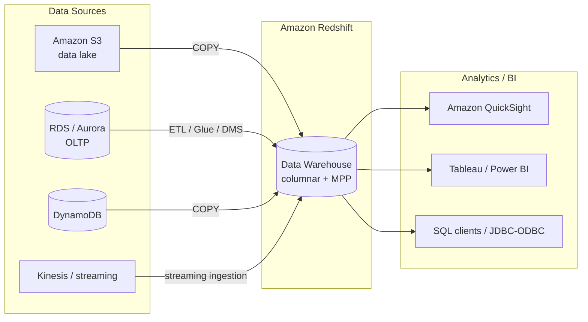

# Redshift Intro & Core Concepts - SAA-C03 Deep Dive

> What Amazon Redshift is: a petabyte-scale, fully managed cloud data warehouse for OLAP analytics (not OLTP), built on columnar storage, MPP, and compression, offered as provisioned clusters or Redshift Serverless.

See also: [02 - Redshift Architecture Deep Dive](02%20-%20Redshift%20Architecture%20Deep%20Dive.md) · [03 - Redshift Best Practices & Examples](03%20-%20Redshift%20Best%20Practices%20%26%20Examples.md) · [04 - Redshift Scenario Questions](04%20-%20Redshift%20Scenario%20Questions.md) · [05 - Redshift Troubleshooting (SRE)](05%20-%20Redshift%20Troubleshooting%20%28SRE%29.md) · [06 - Redshift Important Facts & Cheat Sheet](06%20-%20Redshift%20Important%20Facts%20%26%20Cheat%20Sheet.md) · [00 - Databases Overview & Exam Guide](00%20-%20Databases%20Overview%20%26%20Exam%20Guide.md) · [01 - RDS Intro & Core Concepts](01%20-%20RDS%20Intro%20%26%20Core%20Concepts.md)

---

## Table of Contents

- [What Is Amazon Redshift](#what-is-amazon-redshift)
- [OLAP vs OLTP - The #1 Exam Distinction](#olap-vs-oltp---the-1-exam-distinction)
- [Columnar Storage MPP and Compression](#columnar-storage-mpp-and-compression)
- [PostgreSQL Dialect but Not a Transactional DB](#postgresql-dialect-but-not-a-transactional-db)
- [Redshift Serverless vs Provisioned Clusters](#redshift-serverless-vs-provisioned-clusters)
- [When to Use Redshift](#when-to-use-redshift)

---

---

## What Is Amazon Redshift

Amazon Redshift is a **fully managed, petabyte-scale cloud data warehouse** designed to run **complex analytic queries against very large datasets**. It is optimized for **reading and aggregating large volumes of data** (sums, counts, joins across billions of rows) rather than for high-frequency single-row reads and writes.

Key characteristics:

- **Petabyte scale** — with RA3 managed storage and Redshift Spectrum it scales effectively into the **exabyte** range against an S3 data lake.
- **Columnar storage** + **Massively Parallel Processing (MPP)** + **data compression** for fast aggregation.
- Standard **SQL** interface over **JDBC/ODBC**; integrates with **QuickSight**, Tableau, Power BI, and any SQL client.
- Fully managed: AWS handles provisioning, patching, backups (snapshots to S3), and (optionally) automatic scaling.
- Available as **provisioned clusters** (you size nodes) or **Redshift Serverless** (capacity auto-managed).

> [!tip] Exam Tip
> When a question describes **business intelligence, reporting, dashboards, historical analysis, or aggregating huge datasets**, the answer is almost always **Redshift**. When it describes **per-transaction reads/writes from an app**, it is **NOT** Redshift (use RDS/Aurora/DynamoDB).

[⬆ Back to top](#table-of-contents)

---

## OLAP vs OLTP - The #1 Exam Distinction

This is the single most tested Redshift concept. Redshift is an **OLAP** (Online Analytical Processing) system. It is **not** an **OLTP** (Online Transaction Processing) system.

| Dimension       | OLAP (Redshift)                              | OLTP (RDS / Aurora / DynamoDB)                  |
| :-------------- | :------------------------------------------- | :---------------------------------------------- |
| Purpose         | Analytics, reporting, BI, aggregation        | Application transactions, day-to-day operations |
| Query pattern   | Few large complex queries scanning many rows | Many small fast queries on few rows             |
| Reads vs writes | Read-heavy, bulk loads                       | Mixed, high-frequency single-row writes         |
| Storage layout  | **Columnar**                                 | **Row-based**                                   |
| Latency target  | Seconds to minutes (large scans)             | Single-digit milliseconds                       |
| Data volume     | Terabytes to petabytes                       | Gigabytes to terabytes                          |
| Example         | "Total revenue by region by quarter"         | "Fetch order #12345 for this user"              |

> [!tip] Exam Tip
> Trap phrasing: "high-volume **transactional** workload", "low-latency single-record lookups", "shopping cart / order processing" → **NOT Redshift**. Phrases like "complex analytical queries", "data warehouse", "reporting across billions of rows" → **Redshift**.

[⬆ Back to top](#table-of-contents)

---

## Columnar Storage MPP and Compression

Three architectural pillars make Redshift fast for analytics:

- **Columnar storage** — data is stored by column, not by row. Analytic queries usually touch only a few columns (e.g., `SUM(revenue)`), so Redshift reads only those columns from disk, drastically cutting I/O. (Row stores must read whole rows.)
- **Massively Parallel Processing (MPP)** — data is distributed across many **compute nodes** and **slices**; each works on its portion in parallel, then results are aggregated. More nodes = more parallelism.
- **Compression (column encoding)** — because each column holds similar data, compression ratios are high (e.g., `AZ64`, `ZSTD`, `LZO`). Less data on disk means less I/O and faster scans. Redshift can pick encodings automatically with `COPY ... COMPUPDATE`/`ENCODE AUTO`.

> [!tip] Exam Tip
> If a question asks **why** Redshift is fast for analytics or contrasts it with a row-based RDBMS, the keywords are **columnar storage, MPP, and compression**. Columnar = read only needed columns = less I/O.

[⬆ Back to top](#table-of-contents)

---

## PostgreSQL Dialect but Not a Transactional DB

Redshift's SQL dialect is **based on PostgreSQL 8.x**, so many PostgreSQL clients, drivers, and queries work. **However, Redshift is not PostgreSQL and is not a transactional database.**

- It supports standard SQL `SELECT`, joins, aggregations, window functions, CTEs, and `COPY`/`UNLOAD`.
- It does **not** behave like an OLTP PostgreSQL: no efficient single-row `INSERT`/`UPDATE`/`DELETE` at high frequency, no traditional secondary indexes, no foreign-key enforcement (constraints are informational), no `IDENTITY`/sequences in the OLTP sense.
- **Bulk load with `COPY`** (from S3), not row-by-row `INSERT`. Frequent small `INSERT`s perform poorly.

> [!tip] Exam Tip
> "It speaks PostgreSQL, so can I use Redshift as my app's primary transactional database?" → **No.** PostgreSQL-compatibility is for tooling/queries, not for OLTP. Use **RDS/Aurora PostgreSQL** for transactional workloads.

[⬆ Back to top](#table-of-contents)

---

## Redshift Serverless vs Provisioned Clusters

Redshift comes in two deployment models:

| Aspect   | Provisioned Cluster                                         | Redshift Serverless                                                                 |
| :------- | :---------------------------------------------------------- | :---------------------------------------------------------------------------------- |
| Capacity | You choose node type and count                              | Auto-provisioned, measured in **RPUs** (Redshift Processing Units)                  |
| Scaling  | Manual resize / elastic resize / concurrency scaling        | Automatic scaling with workload                                                     |
| Billing  | Per node-hour (On-Demand or Reserved)                       | Pay per **RPU-hour** + managed storage; scales to near-zero when idle               |
| Best for | Steady, predictable workloads; cost-optimized with Reserved | **Intermittent, unpredictable, or spiky** analytics; dev/test; no capacity planning |
| Admin    | You manage cluster sizing                                   | No clusters/nodes to manage                                                         |

> [!tip] Exam Tip
> "Analytics run **intermittently / unpredictably**, want to avoid sizing and pay only when used" → **Redshift Serverless**. "Steady 24x7 analytics, want lowest cost with a 1-3 year commit" → **provisioned cluster + Reserved Instances (RA3)**.

[⬆ Back to top](#table-of-contents)

---

## When to Use Redshift

Choose Redshift when you need:

- A **data warehouse** consolidating data from many sources (RDS, Aurora, DynamoDB, S3, logs) for analysis.
- **Business intelligence and reporting** with QuickSight / Tableau / Power BI.
- **Complex aggregations and joins** over very large historical datasets.
- To **offload heavy analytical queries** off a production OLTP database so reporting does not slow the app.
- To **query an S3 data lake** directly with SQL (via **Redshift Spectrum**) without loading it first.

Do **NOT** choose Redshift for:

- High-throughput transactional apps (→ RDS/Aurora/DynamoDB).
- Single-digit-ms key-value lookups (→ DynamoDB/ElastiCache).
- Simple, small datasets or unstructured search (→ Athena, OpenSearch as appropriate).

> [!tip] Exam Tip
> A recurring scenario: "Reporting queries are slowing down the production database." The fix is to **offload analytics to Redshift** (load data via ETL/DMS/COPY), keeping the OLTP DB for transactions.

[⬆ Back to top](#table-of-contents)
