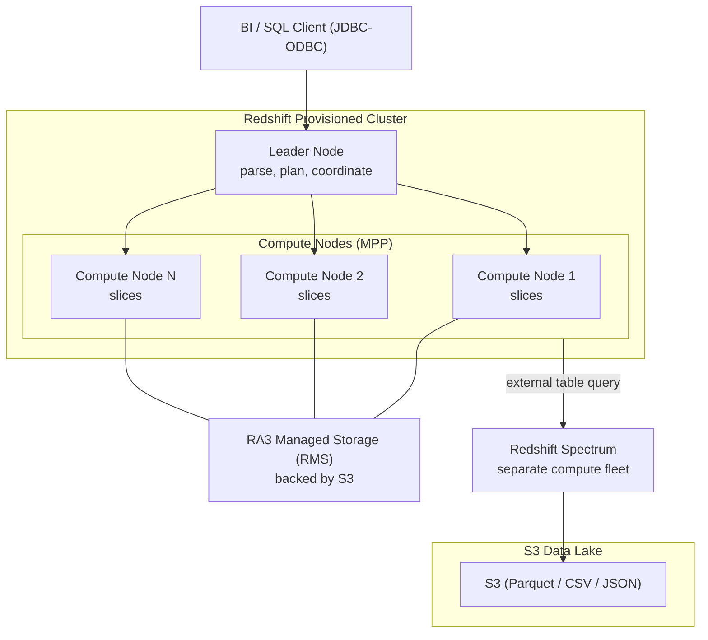

# Redshift Architecture Deep Dive - SAA-C03 Deep Dive

> How Redshift is built: leader and compute nodes, slices, node types (RA3 with managed storage, DC2), distribution and sort keys, Spectrum, Concurrency Scaling, WLM, materialized views, data sharing, snapshots, AQUA, and Serverless RPUs.

See also: [01 - Redshift Intro & Core Concepts](01%20-%20Redshift%20Intro%20%26%20Core%20Concepts.md) · [03 - Redshift Best Practices & Examples](03%20-%20Redshift%20Best%20Practices%20%26%20Examples.md) · [04 - Redshift Scenario Questions](04%20-%20Redshift%20Scenario%20Questions.md) · [05 - Redshift Troubleshooting (SRE)](05%20-%20Redshift%20Troubleshooting%20%28SRE%29.md) · [06 - Redshift Important Facts & Cheat Sheet](06%20-%20Redshift%20Important%20Facts%20%26%20Cheat%20Sheet.md) · [00 - Databases Overview & Exam Guide](00%20-%20Databases%20Overview%20%26%20Exam%20Guide.md) · [01 - RDS Intro & Core Concepts](01%20-%20RDS%20Intro%20%26%20Core%20Concepts.md)

---

## Table of Contents

- [Cluster Anatomy - Leader Compute Nodes and Slices](#cluster-anatomy---leader-compute-nodes-and-slices)
- [Node Types - RA3 vs DC2](#node-types---ra3-vs-dc2)
- [Columnar Storage and Zone Maps](#columnar-storage-and-zone-maps)
- [Distribution Styles - KEY EVEN ALL AUTO](#distribution-styles---key-even-all-auto)
- [Sort Keys - Compound vs Interleaved](#sort-keys---compound-vs-interleaved)
- [Redshift Spectrum](#redshift-spectrum)
- [Concurrency Scaling](#concurrency-scaling)
- [Workload Management WLM](#workload-management-wlm)
- [Materialized Views and Data Sharing](#materialized-views-and-data-sharing)
- [Snapshots and Cross-Region Copy](#snapshots-and-cross-region-copy)
- [AQUA and Redshift Serverless RPUs](#aqua-and-redshift-serverless-rpus)

---

---

## Cluster Anatomy - Leader Compute Nodes and Slices

A provisioned Redshift cluster has two node roles:

- **Leader node** — the single coordinator. It receives client connections, **parses and develops the query execution plan**, distributes compiled code to compute nodes, aggregates their partial results, and returns the final result. It stores no user data and is **free** (not separately billed). One leader per cluster.
- **Compute nodes** — do the actual work: store data, run query fragments in parallel, and return intermediate results to the leader. You pay for compute nodes. A cluster can have **1 to many** compute nodes (single-node clusters combine both roles).
- **Node slices** — each compute node is divided into **slices**, each allocated a portion of the node's memory and disk. Slices process their data in parallel — slices are the true unit of parallelism. The number of slices per node depends on node type/size.

> [!tip] Exam Tip
> The **leader node** can become a bottleneck if it must do too much aggregation/sorting or handle many connections. The **compute nodes + slices** provide MPP parallelism. More/larger compute nodes = more parallelism and storage.

[⬆ Back to top](#table-of-contents)

---

## Node Types - RA3 vs DC2

| Node type                                       | Storage model                                                                                                            | Best for                                                                                                |
| :---------------------------------------------- | :----------------------------------------------------------------------------------------------------------------------- | :------------------------------------------------------------------------------------------------------ |
| **RA3** (ra3.xlplus, ra3.4xlarge, ra3.16xlarge) | **Managed storage (RMS)** — compute and storage **decoupled**; hot data on local SSD, rest in S3-backed RMS, auto-tiered | The modern default; large/growing data where you scale compute and storage **independently**            |
| **DC2** (dc2.large, dc2.8xlarge)                | **Dense Compute** — local SSD, storage tied to node count                                                                | Smaller datasets (< ~1 TB compressed) needing high performance at low cost; storage and compute coupled |
| **DS2** (legacy)                                | Dense Storage (HDD)                                                                                                      | Legacy; AWS recommends migrating to RA3                                                                 |

Key facts:

- **RA3 + Redshift Managed Storage (RMS)** lets you **size compute for performance and pay separately for storage**. Add nodes for query speed without paying for unneeded storage, and grow storage without adding nodes.
- RA3 enables **data sharing** and is required for the most modern features.
- **DC2** is cost-effective for small, fixed datasets where local SSD is enough.

> [!tip] Exam Tip
> "Need to **scale storage and compute independently**" or "data is growing rapidly and we don't want to over-provision compute" → **RA3 with managed storage**. "Small dataset, want fast local SSD at lowest cost" → **DC2**.

[⬆ Back to top](#table-of-contents)

---

## Columnar Storage and Zone Maps

Redshift stores each column separately in **1 MB immutable blocks**. For every block it keeps a **zone map** — the **min and max value** of that block stored in memory.

- When a query filters on a sorted/range column, Redshift uses zone maps to **skip blocks** that cannot contain matching values (block pruning). This is why **sort keys** matter: well-sorted columns let zone maps eliminate huge amounts of I/O.
- Combined with compression, scans touch far less data than a row store.

> [!tip] Exam Tip
> Zone maps + sort keys = the mechanism behind "Redshift skips reading irrelevant data." If queries always filter on a date, making date the sort key lets zone maps prune most blocks.

[⬆ Back to top](#table-of-contents)

---

## Distribution Styles - KEY EVEN ALL AUTO

The **distribution style** controls how table rows are spread across compute-node slices. It is the biggest lever for join/aggregation performance because it determines whether data must be **redistributed across the network** during joins.

| Style    | How rows are placed                                                                     | Use when                                                                                          |
| :------- | :-------------------------------------------------------------------------------------- | :------------------------------------------------------------------------------------------------ |
| **KEY**  | Rows with the same value in the dist key column land on the same slice                  | Large fact-to-dimension joins on a common key; co-locate joined rows to avoid data movement       |
| **EVEN** | Round-robin across slices                                                               | No clear join key; load is balanced but joins may redistribute                                    |
| **ALL**  | Full copy of the table on **every** node                                                | Small, relatively static **dimension/lookup** tables frequently joined; eliminates redistribution |
| **AUTO** | Redshift chooses (often starts ALL for small tables, switches to KEY/EVEN as they grow) | Default; let Redshift manage it                                                                   |

> [!tip] Exam Tip
> **ALL** = small dimension tables joined everywhere (trades storage for no redistribution). **KEY** = big tables joined on the same column (co-location). **EVEN** = no obvious key. **AUTO** = default and a safe answer if unsure. A bad KEY choice causes **data skew** (see Troubleshooting).

[⬆ Back to top](#table-of-contents)

---

## Sort Keys - Compound vs Interleaved

A **sort key** defines the physical order of rows on disk, powering zone-map pruning and efficient range scans/merge joins.

- **Compound sort key** (default) — sorts by the listed columns **in order** (col1, then col2, ...). Excellent when queries filter/join on a **prefix** of the columns (especially the first). Most common choice; low maintenance overhead.
- **Interleaved sort key** — gives **equal weight** to each sort-key column. Better when queries filter on **different columns at different times** (no single dominant column). Higher `VACUUM` maintenance cost; use sparingly.

> [!tip] Exam Tip
> "Queries usually filter by date first" → **compound sort key** with date first. "Queries filter on several different columns unpredictably" → **interleaved sort key**. When in doubt, compound (or AUTO) is the safer answer.

[⬆ Back to top](#table-of-contents)

---

## Redshift Spectrum

**Redshift Spectrum** lets you run SQL **directly against data in Amazon S3** without loading it into the cluster.

- You define **external tables** (via an external schema, backed by the **AWS Glue Data Catalog** / Hive metastore) over S3 files (Parquet, ORC, CSV, JSON).
- Queries run on a **separate, AWS-managed Spectrum compute fleet**, not your cluster's compute nodes — so it scales independently and doesn't consume cluster storage.
- Billed **per TB scanned** from S3 (so partitioning and columnar formats like Parquet save money).
- You can **join** S3 (external) data with local Redshift tables in one query.

> [!tip] Exam Tip
> "Query infrequently-accessed / cold data sitting in S3 **without loading** it into Redshift" → **Redshift Spectrum**. Keep hot data in the cluster, cold data in S3 queried by Spectrum. (Note: **Athena** also queries S3 with SQL but is serverless and independent of any cluster.)

[⬆ Back to top](#table-of-contents)

---

## Concurrency Scaling

**Concurrency Scaling** automatically adds **transient compute clusters** to handle bursts of concurrent queries, then removes them when the burst ends.

- Targets **read query** spikes (and some write workloads) when many users/dashboards hit the cluster at once and queries start queuing.
- Provides **consistent fast performance** during peaks without permanently over-provisioning.
- You **earn free Concurrency Scaling credits** (typically up to 1 hour/day of usage credit per active cluster); beyond credits it's billed per second.
- Enabled per **WLM queue**.

> [!tip] Exam Tip
> "Many BI users at peak hours cause queries to **queue**, but the cluster is fine off-peak" → enable **Concurrency Scaling** rather than permanently resizing. Don't confuse with **Spectrum** (that's about querying S3, not concurrency).

[⬆ Back to top](#table-of-contents)

---

## Workload Management WLM

**Workload Management (WLM)** controls how query concurrency and memory are allocated, separating workloads (e.g., short dashboards vs long ETL) into **queues**.

| Mode              | Description                                                                                       |
| :---------------- | :------------------------------------------------------------------------------------------------ |
| **Automatic WLM** | Redshift dynamically manages concurrency and memory per query (recommended default)               |
| **Manual WLM**    | You define queues with fixed concurrency/memory and assign queries via query groups / user groups |

- **Short Query Acceleration (SQA)** routes short, fast queries to a dedicated space so they aren't stuck behind long ones.
- **Query Monitoring Rules (QMR)** can abort/log/reprioritize queries exceeding thresholds (e.g., runtime, rows scanned).

> [!tip] Exam Tip
> "Long ETL jobs are blocking quick dashboard queries" → use **WLM queues** (and SQA) to isolate workloads, or **Automatic WLM**. Queue waits are a classic cause of perceived slowness.

[⬆ Back to top](#table-of-contents)

---

## Materialized Views and Data Sharing

- **Materialized views** precompute and store the result of an expensive query (joins/aggregations). Queries hit the stored result for speed; refresh with `REFRESH MATERIALIZED VIEW` (auto or manual). Ideal for repeated dashboard aggregations.
- **Data sharing** (RA3 only) lets you **share live data** across Redshift clusters/workgroups **without copying or moving it** — across clusters, accounts (via AWS RAM), and Regions. Enables a producer cluster and multiple consumer clusters reading the same data (e.g., separate teams/environments).

> [!tip] Exam Tip
> "Multiple teams/clusters need read access to the same warehouse data without ETL copies" → **Redshift data sharing** (RA3). "Repeated expensive aggregation queries should be faster" → **materialized views**.

[⬆ Back to top](#table-of-contents)

---

## Snapshots and Cross-Region Copy

Redshift backs up to **Amazon S3** as **snapshots**:

| Snapshot type | Behavior                                                                                                                                                               |
| :------------ | :--------------------------------------------------------------------------------------------------------------------------------------------------------------------- |
| **Automated** | Enabled by default; periodic + incremental; retention configurable (default ~1 day, up to 35); deleted when cluster is deleted unless you keep a final manual snapshot |
| **Manual**    | Created on demand; retained until you delete them                                                                                                                      |

- Snapshots are **incremental** (only changed blocks) and stored in S3 (durable, managed by AWS).
- **Cross-Region snapshot copy** can be enabled to automatically copy snapshots to another Region for **disaster recovery**.
- Restoring a snapshot creates a **new cluster**.

> [!tip] Exam Tip
> "DR requirement: recover the warehouse in another Region" → enable **cross-Region automated snapshot copy** and restore there. Keep a **final manual snapshot** before deleting a cluster.

[⬆ Back to top](#table-of-contents)

---

## AQUA and Redshift Serverless RPUs

- **AQUA (Advanced Query Accelerator)** — a hardware-accelerated, distributed cache that pushes some compute (filtering/aggregation) closer to storage for certain RA3 node types, speeding up scan-heavy queries. Mostly a "feature exists" item for the exam; it accelerates queries without you managing it.
- **Redshift Serverless** measures capacity in **RPUs (Redshift Processing Units)**. You set a **base capacity (RPUs)** and optional **max RPU** limit; Redshift scales between them based on workload, billing per **RPU-hour** (plus managed storage). It scales down when idle, so you pay little when not querying — ideal for **intermittent/spiky** analytics with no cluster management.

> [!tip] Exam Tip
> **RPU** = the Serverless capacity unit (remember it). **AQUA** = automatic query acceleration on supported RA3. Neither requires manual node management.

[⬆ Back to top](#table-of-contents)
