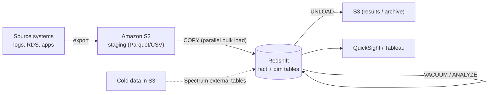

# Redshift Best Practices & Examples - SAA-C03 Deep Dive

> Practical guidance: choosing distribution and sort keys, bulk loading with COPY (not INSERT), VACUUM/ANALYZE, Spectrum for cold data, Concurrency Scaling, RA3, compression, cross-Region DR, security, and cost optimization, with SQL examples.

See also: [01 - Redshift Intro & Core Concepts](01%20-%20Redshift%20Intro%20%26%20Core%20Concepts.md) · [02 - Redshift Architecture Deep Dive](02%20-%20Redshift%20Architecture%20Deep%20Dive.md) · [04 - Redshift Scenario Questions](04%20-%20Redshift%20Scenario%20Questions.md) · [05 - Redshift Troubleshooting (SRE)](05%20-%20Redshift%20Troubleshooting%20%28SRE%29.md) · [06 - Redshift Important Facts & Cheat Sheet](06%20-%20Redshift%20Important%20Facts%20%26%20Cheat%20Sheet.md) · [00 - Databases Overview & Exam Guide](00%20-%20Databases%20Overview%20%26%20Exam%20Guide.md) · [01 - RDS Intro & Core Concepts](01%20-%20RDS%20Intro%20%26%20Core%20Concepts.md)

---

## Table of Contents

- [Choosing Distribution and Sort Keys](#choosing-distribution-and-sort-keys)
- [Bulk Load with COPY not INSERT](#bulk-load-with-copy-not-insert)
- [VACUUM and ANALYZE](#vacuum-and-analyze)
- [Spectrum for Cold Data and Concurrency Scaling for Spiky BI](#spectrum-for-cold-data-and-concurrency-scaling-for-spiky-bi)
- [RA3 Compression and Encoding](#ra3-compression-and-encoding)
- [Cross-Region Snapshot for DR](#cross-region-snapshot-for-dr)
- [Security Best Practices](#security-best-practices)
- [Cost Optimization](#cost-optimization)

---



---

## Choosing Distribution and Sort Keys

Good key design is the top performance lever.

- **Distribution key (DISTKEY)** — pick the column most used to **join** large tables, so matching rows co-locate on the same slice (avoids network redistribution). Choose a **high-cardinality, evenly-distributed** column to avoid skew.
- Use **DISTSTYLE ALL** for **small dimension/lookup tables** that are joined everywhere.
- Use **DISTSTYLE EVEN** when there's no clear join key.
- Let **DISTSTYLE AUTO** decide if unsure.
- **Sort key (SORTKEY)** — choose the column(s) most used in **range filters / `WHERE` / ORDER BY / joins**, typically a **timestamp/date** for time-series. Use **compound** for a dominant filter column, **interleaved** only when multiple columns are filtered unpredictably.

```sql
CREATE TABLE sales (
    sale_id      BIGINT,
    customer_id  BIGINT,
    sale_ts      TIMESTAMP,
    amount       DECIMAL(12,2)
)
DISTSTYLE KEY
DISTKEY (customer_id)        -- join sales to customers on customer_id
COMPOUND SORTKEY (sale_ts);  -- queries filter by date range
```

> [!tip] Exam Tip
> DISTKEY = the join column on large tables; SORTKEY = the range/filter column (often date). Small dimensions → **DISTSTYLE ALL**. A skewed DISTKEY is a top cause of slow queries.

[⬆ Back to top](#table-of-contents)

---

## Bulk Load with COPY not INSERT

Always load large data with the **`COPY`** command, which loads in **parallel across all slices** from S3 (or DynamoDB, EMR, SSH). Avoid row-by-row `INSERT`, which is slow and serialized.

```sql
COPY sales
FROM 's3://my-bucket/sales/2025/'
IAM_ROLE 'arn:aws:iam::111122223333:role/RedshiftLoadRole'
FORMAT AS PARQUET;            -- or CSV/JSON/Avro

-- CSV example with options
COPY sales
FROM 's3://my-bucket/sales/2025/'
IAM_ROLE 'arn:aws:iam::111122223333:role/RedshiftLoadRole'
CSV
GZIP
DELIMITER ','
IGNOREHEADER 1
COMPUPDATE ON;               -- auto-pick column compression on load
```

Best practices:

- **Split source files** into multiple files (ideally a multiple of the number of slices) so all slices load in parallel.
- Use an **IAM role** (not embedded keys) for S3 access.
- Use **`UNLOAD`** to export query results to S3 in parallel (e.g., to share or archive):

```sql
UNLOAD ('SELECT * FROM sales WHERE sale_ts >= ''2025-01-01''')
TO 's3://my-bucket/exports/sales_2025_'
IAM_ROLE 'arn:aws:iam::111122223333:role/RedshiftUnloadRole'
FORMAT AS PARQUET
PARALLEL ON;
```

> [!tip] Exam Tip
> "Fastest way to load large data into Redshift" → **COPY from S3** with **multiple split files** for parallelism. "Frequent small INSERTs are slow" → batch and use COPY instead.

[⬆ Back to top](#table-of-contents)

---

## VACUUM and ANALYZE

Two maintenance operations keep Redshift fast:

- **`VACUUM`** — reclaims space from deleted/updated rows and **re-sorts** rows according to the sort key (deletes/updates leave rows unsorted and marked-for-deletion). Modern Redshift runs **auto-vacuum** in the background, but heavy update/delete workloads may still need manual `VACUUM`.
- **`ANALYZE`** — updates the **table statistics** the query planner uses to build efficient plans. After large loads, run `ANALYZE` (COPY can auto-run it). Stale statistics cause **bad query plans** and slow queries.

```sql
VACUUM FULL sales;       -- reclaim space and re-sort
VACUUM SORT ONLY sales;  -- only re-sort
ANALYZE sales;           -- refresh planner statistics
```

> [!tip] Exam Tip
> "Queries got slow after lots of updates/deletes" → **VACUUM** (table bloat / unsorted rows). "Query plans went bad after a big load" → **ANALYZE** (stale statistics).

[⬆ Back to top](#table-of-contents)

---

## Spectrum for Cold Data and Concurrency Scaling for Spiky BI

- **Redshift Spectrum** — keep **hot, frequently-queried** data inside the cluster; keep **cold/historical/infrequent** data in **S3** and query it via Spectrum external tables. This shrinks cluster storage and cost while keeping all data SQL-queryable. Use **Parquet/ORC + partitioning** to minimize TB scanned.
- **Concurrency Scaling** — for **spiky concurrent BI** (e.g., many dashboard users at 9 AM), enable Concurrency Scaling on the relevant WLM queue so transient clusters absorb the burst instead of permanently up-sizing the cluster.

```sql
-- External schema + table for Spectrum (cold data in S3)
CREATE EXTERNAL SCHEMA spectrum_schema
FROM DATA CATALOG DATABASE 'analytics_db'
IAM_ROLE 'arn:aws:iam::111122223333:role/RedshiftSpectrumRole';

SELECT region, SUM(amount)
FROM spectrum_schema.archived_sales   -- lives in S3
WHERE year = 2022
GROUP BY region;
```

> [!tip] Exam Tip
> Cold data in S3, queried occasionally → **Spectrum**. Burst of concurrent users → **Concurrency Scaling**. These solve different problems; the exam tests that you don't swap them.

[⬆ Back to top](#table-of-contents)

---

## RA3 Compression and Encoding

- **Prefer RA3 nodes** when storage and compute should scale **independently** or data is growing — managed storage (RMS) tiers hot data to local SSD and the rest to S3 automatically.
- **Compression / column encoding** reduces storage and I/O. Let Redshift choose with **`ENCODE AUTO`** or **`COPY ... COMPUPDATE ON`**; common encodings: **AZ64** (numerics/dates), **ZSTD** (general/text), **LZO**. Do **not** compress the **sort key's leading column** if it hurts zone-map pruning (Redshift handles this automatically with AUTO).

> [!tip] Exam Tip
> "Data warehouse keeps growing; don't want to add compute just to get storage" → **RA3 managed storage**. Compression is automatic with COPY/ENCODE AUTO — less I/O, lower cost.

[⬆ Back to top](#table-of-contents)

---

## Cross-Region Snapshot for DR

For disaster recovery:

- Enable **automated snapshots** (on by default) with appropriate **retention**.
- Enable **cross-Region snapshot copy** to replicate snapshots to a DR Region automatically.
- For DR, **restore the snapshot** into a new cluster in the DR Region.
- Take a **final manual snapshot** before intentionally deleting a cluster.

> [!tip] Exam Tip
> "Recover the data warehouse in another Region after a regional failure" → **cross-Region automated snapshot copy** + restore. Snapshots live in **S3** and are **incremental**.

[⬆ Back to top](#table-of-contents)

---

## Security Best Practices

| Control               | Recommendation                                                                                                                              |
| :-------------------- | :------------------------------------------------------------------------------------------------------------------------------------------ |
| Network isolation     | Deploy the cluster in a **VPC** (private subnets); use security groups; **Enhanced VPC Routing** forces COPY/UNLOAD traffic through the VPC |
| Private connectivity  | Use **Redshift-managed VPC endpoints** / PrivateLink so clients reach the cluster without traversing the internet                           |
| Encryption at rest    | Enable **encryption with KMS** (or CloudHSM); covers data blocks and snapshots                                                              |
| Encryption in transit | Require **SSL/TLS** for client connections                                                                                                  |
| Access management     | Use **IAM** for `COPY`/`UNLOAD`/Spectrum roles; database users/groups for SQL-level permissions; integrate IAM/SSO/IdP for auth             |
| Auditing              | Enable **audit logging** (connection/user/activity logs) to S3 or CloudWatch                                                                |
| Least privilege       | Grant minimal table/column/row-level access; use **column-level** and **row-level security** features                                       |

> [!tip] Exam Tip
> "Encrypt the warehouse and control keys" → **KMS** (or CloudHSM). "Keep COPY/UNLOAD traffic private/off the internet" → **Enhanced VPC Routing**. "Use IAM roles, not access keys, for S3 loads" is the recommended pattern.

[⬆ Back to top](#table-of-contents)

---

## Cost Optimization

| Lever                              | When to use                                                                                                                |
| :--------------------------------- | :------------------------------------------------------------------------------------------------------------------------- |
| **Reserved Instances** (1 or 3 yr) | Steady, predictable 24x7 provisioned clusters → big discount vs On-Demand                                                  |
| **RA3 + managed storage**          | Pay for storage separately; don't over-provision compute for storage                                                       |
| **Pause and Resume**               | Provisioned clusters used only part-time (e.g., dev/test, business hours) — billing for compute pauses while data persists |
| **Redshift Serverless**            | Intermittent/unpredictable analytics — pay per RPU-hour, scales to near-zero when idle                                     |
| **Spectrum**                       | Keep cold data in cheap S3 instead of cluster storage; pay only per TB scanned (partition + Parquet to reduce scan)        |
| **Concurrency Scaling credits**    | Absorb bursts using free daily credits instead of permanently larger clusters                                              |

> [!tip] Exam Tip
> "Lowest cost for a steady warehouse" → **Reserved Instances + RA3**. "Used only during business hours" → **pause/resume** or **Serverless**. "Rarely-queried historical data" → **Spectrum on S3**.

[⬆ Back to top](#table-of-contents)
