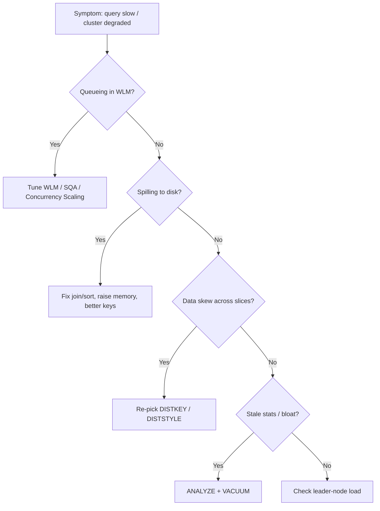

# Redshift Troubleshooting (SRE) - SAA-C03 Deep Dive

> An SRE-style playbook for diagnosing Redshift problems: slow queries, disk spill, table bloat, WLM queue waits, COPY errors, data skew, leader-node bottlenecks, snapshot/restore issues, and Spectrum cost/performance.

See also: [01 - Redshift Intro & Core Concepts](01%20-%20Redshift%20Intro%20%26%20Core%20Concepts.md) · [02 - Redshift Architecture Deep Dive](02%20-%20Redshift%20Architecture%20Deep%20Dive.md) · [03 - Redshift Best Practices & Examples](03%20-%20Redshift%20Best%20Practices%20%26%20Examples.md) · [04 - Redshift Scenario Questions](04%20-%20Redshift%20Scenario%20Questions.md) · [06 - Redshift Important Facts & Cheat Sheet](06%20-%20Redshift%20Important%20Facts%20%26%20Cheat%20Sheet.md) · [00 - Databases Overview & Exam Guide](00%20-%20Databases%20Overview%20%26%20Exam%20Guide.md) · [01 - RDS Intro & Core Concepts](01%20-%20RDS%20Intro%20%26%20Core%20Concepts.md)

---

## Table of Contents

- [Slow Queries - Bad Keys and Stale Stats](#slow-queries---bad-keys-and-stale-stats)
- [Disk-Based Queries and Spill](#disk-based-queries-and-spill)
- [Table Bloat and Unsorted Rows](#table-bloat-and-unsorted-rows)
- [WLM Queue Waits and Concurrency](#wlm-queue-waits-and-concurrency)
- [COPY Errors](#copy-errors)
- [Data Skew from a Poor Distribution Key](#data-skew-from-a-poor-distribution-key)
- [Leader-Node Bottleneck](#leader-node-bottleneck)
- [Snapshot and Restore Issues](#snapshot-and-restore-issues)
- [Spectrum Cost and Performance](#spectrum-cost-and-performance)

---

---

## Slow Queries - Bad Keys and Stale Stats

**Symptoms:** A query that was fast is now slow, or a new query is unexpectedly slow.

**Diagnose:**

- Inspect the plan with `EXPLAIN`; look for `DS_BCAST_INNER` / `DS_DIST_BOTH` (data broadcast/redistribution) — a sign of poor distribution.
- Check `SVL_QUERY_REPORT`, `STL_ALERT_EVENT_LOG`, and `SVL_QUERY_SUMMARY` for warnings ("missing statistics", "very selective filter", nested loop).
- Use the **Query Monitoring** tab / `STV_*` and `SVL_*` system tables.

**Fix:**

- Run **`ANALYZE`** to refresh planner statistics (stale stats cause bad plans).
- Choose a better **DISTKEY** (co-locate joins) and **SORTKEY** (enable zone-map pruning).
- Add a **materialized view** for repeated heavy aggregations.

> [!tip] Exam/SRE Tip
> "Missing statistics" in the alert log → **ANALYZE**. Plan shows broadcasting large tables → fix the **distribution key**.

[⬆ Back to top](#table-of-contents)

---

## Disk-Based Queries and Spill

**Symptoms:** Queries are slow with high disk usage; alert log shows steps spilling to disk.

**Cause:** A query step (sort, hash join, aggregation) needs **more memory than its WLM slot** provides, so it **spills to disk** (much slower than memory).

**Diagnose:** Check `SVL_QUERY_SUMMARY` (`is_diskbased = t`) and `STL_ALERT_EVENT_LOG`.

**Fix:**

- Increase memory per slot (Automatic WLM, or larger queue memory in Manual WLM).
- Reduce data processed: better **filters**, better **SORTKEY** (less to sort), better **DISTKEY** (less redistribution), select only needed columns.
- Avoid huge `ORDER BY`/`DISTINCT` on unsorted data.

> [!tip] Exam/SRE Tip
> "Disk-based / spilling" = memory pressure per query slot. Give the queue more memory or shrink the working set; don't just add nodes blindly.

[⬆ Back to top](#table-of-contents)

---

## Table Bloat and Unsorted Rows

**Symptoms:** Performance degrades over time on heavily updated/deleted tables; storage usage climbs.

**Cause:** `UPDATE`/`DELETE` mark rows for deletion and leave rows **unsorted**; space isn't reclaimed until vacuumed.

**Diagnose:** Check `SVV_TABLE_INFO` for high `unsorted` % and `tbl_rows` vs `estimated_visible_rows`.

**Fix:**

- Run **`VACUUM`** (FULL = reclaim + re-sort; SORT ONLY; DELETE ONLY) — though auto-vacuum handles much of this.
- Run **`ANALYZE`** afterward.
- Prefer bulk reload patterns over many small updates/deletes.

> [!tip] Exam/SRE Tip
> "Slow after many deletes/updates" + "unsorted rows / wasted space" → **VACUUM**.

[⬆ Back to top](#table-of-contents)

---

## WLM Queue Waits and Concurrency

**Symptoms:** Queries spend time **queued** (wait time high, exec time low); dashboards lag at peak.

**Diagnose:** Check `STV_WLM_QUERY_STATE`, `STL_WLM_QUERY` for queue wait times.

**Fix:**

- Move to **Automatic WLM**, or rebalance **Manual WLM** queues (separate ETL from dashboards).
- Enable **Short Query Acceleration (SQA)** so quick queries don't wait behind long ones.
- Enable **Concurrency Scaling** on the queue for read bursts.
- Use **Query Monitoring Rules** to cap runaway queries.

> [!tip] Exam/SRE Tip
> High **wait time** (not exec time) = WLM queueing. Fix with WLM tuning / SQA / Concurrency Scaling, not bigger nodes.

[⬆ Back to top](#table-of-contents)

---

## COPY Errors

**Symptoms:** A bulk load fails or partially loads.

**Diagnose:** Query **`STL_LOAD_ERRORS`** (and `SVL_LOAD_ERRORS`) — it shows the file, row, column, raw value, and error reason.

**Common causes and fixes:**

| Cause                                         | Fix                                                       |
| :-------------------------------------------- | :-------------------------------------------------------- |
| Data type mismatch (text in a numeric column) | Fix source data or column type; use `MAXERROR` cautiously |
| Wrong delimiter / format                      | Set correct `DELIMITER`, `CSV`, `FORMAT AS PARQUET`, etc. |
| Date/timestamp format mismatch                | Specify `DATEFORMAT` / `TIMEFORMAT`                       |
| Header row loaded as data                     | Add `IGNOREHEADER 1`                                      |
| Permission denied to S3                       | Fix the `IAM_ROLE` / bucket policy                        |
| Character encoding / length overflow          | Widen column or use `TRUNCATECOLUMNS`                     |

> [!tip] Exam/SRE Tip
> First stop for any load failure is **`STL_LOAD_ERRORS`**. Most failures are format/type/permission issues, not Redshift faults.

[⬆ Back to top](#table-of-contents)

---

## Data Skew from a Poor Distribution Key

**Symptoms:** One or a few slices are far busier than others; queries are slow despite many nodes; uneven disk usage per slice.

**Cause:** A **low-cardinality or unevenly-distributed DISTKEY** packs most rows onto a few slices, defeating MPP parallelism.

**Diagnose:** Check `SVV_TABLE_INFO.skew_rows` and per-slice row counts (`STV_TBL_PERM`).

**Fix:**

- Pick a **higher-cardinality, evenly-distributed** DISTKEY, or switch to **DISTSTYLE EVEN** (no good key) or **AUTO**.
- Use **DISTSTYLE ALL** for small dimension tables.

> [!tip] Exam/SRE Tip
> "Some nodes/slices much hotter than others" = **data skew** from a bad distribution key. Re-evaluate DISTKEY/DISTSTYLE.

[⬆ Back to top](#table-of-contents)

---

## Leader-Node Bottleneck

**Symptoms:** High leader-node CPU; slowness with many concurrent connections or queries returning huge result sets / heavy final aggregation/sort.

**Cause:** The single leader node parses/plans all queries, manages connections, and does final result aggregation. Too many connections or leader-side work overloads it.

**Fix:**

- Reduce connection count via **connection pooling**.
- Avoid pulling massive result sets to the client; aggregate in-cluster or use **`UNLOAD`** to S3.
- Distribute read load (read-only consumer clusters via **data sharing**, or Concurrency Scaling).

> [!tip] Exam/SRE Tip
> The leader node is a **single coordinator** — a potential bottleneck. Pool connections and avoid returning enormous result sets through it.

[⬆ Back to top](#table-of-contents)

---

## Snapshot and Restore Issues

**Symptoms:** Restore is slow; cross-Region copy missing; cluster deleted without backup.

**Diagnose / Fix:**

- Restoring a snapshot creates a **new cluster**; the cluster is available before all blocks are hydrated (lazy restore) but is slower until backfilled.
- For DR, confirm **cross-Region snapshot copy** is enabled and the snapshot exists in the DR Region.
- Always take a **final manual snapshot** before deleting a cluster — automated snapshots are deleted with the cluster.
- KMS-encrypted snapshots need a KMS key (and a grant) in the destination Region for cross-Region copy.

> [!tip] Exam/SRE Tip
> "Lost the cluster, no backup" → automated snapshots were deleted with it; mitigate with **manual final snapshot**. Cross-Region DR needs **cross-Region copy enabled in advance**.

[⬆ Back to top](#table-of-contents)

---

## Spectrum Cost and Performance

**Symptoms:** Spectrum queries are slow or expensive (high $ per query).

**Cause:** Spectrum bills **per TB scanned** in S3; scanning unpartitioned CSV/JSON scans everything.

**Fix:**

- Store data as **columnar Parquet/ORC** and **compress** it — far less scanned.
- **Partition** S3 data (e.g., by year/month) and filter on partition columns so Spectrum prunes partitions.
- Push filters and select only needed columns.
- Keep frequently-queried data **in the cluster**; reserve Spectrum for cold/occasional data.

> [!tip] Exam/SRE Tip
> Expensive Spectrum = too much scanned. **Partition + Parquet + compression** to cut TB scanned, and don't use Spectrum for hot data.

[⬆ Back to top](#table-of-contents)
