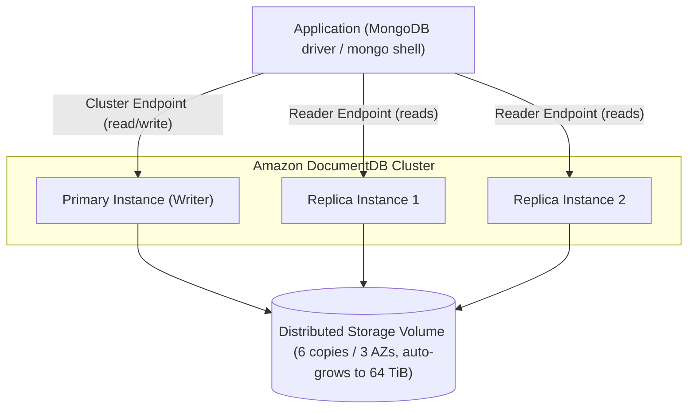

# DocumentDB Intro & Core Concepts - SAA-C03 Deep Dive

> Amazon DocumentDB is a fully managed, MongoDB-compatible document (JSON-like) database that lets you run MongoDB workloads using existing MongoDB drivers and tools without operating the database yourself.

See also: [02 - DocumentDB Architecture Deep Dive](02%20-%20DocumentDB%20Architecture%20Deep%20Dive.md) · [03 - DocumentDB Best Practices & Examples](03%20-%20DocumentDB%20Best%20Practices%20%26%20Examples.md) · [04 - DocumentDB Scenario Questions](04%20-%20DocumentDB%20Scenario%20Questions.md) · [05 - DocumentDB Troubleshooting (SRE)](05%20-%20DocumentDB%20Troubleshooting%20%28SRE%29.md) · [06 - DocumentDB Important Facts & Cheat Sheet](06%20-%20DocumentDB%20Important%20Facts%20%26%20Cheat%20Sheet.md) · [00 - Databases Overview & Exam Guide](00%20-%20Databases%20Overview%20%26%20Exam%20Guide.md) · [01 - Aurora Intro & Core Concepts](01%20-%20Aurora%20Intro%20%26%20Core%20Concepts.md) · [01 - DynamoDB Intro & Core Concepts](01%20-%20DynamoDB%20Intro%20%26%20Core%20Concepts.md)

---

## Table of Contents

- [What Is Amazon DocumentDB](#what-is-amazon-documentdb)
- [Documents, Collections & the Data Model](#documents-collections--the-data-model)
- [MongoDB Compatibility](#mongodb-compatibility)
- [When to Use DocumentDB](#when-to-use-documentdb)
- [DocumentDB vs DynamoDB vs Self-Managed MongoDB](#documentdb-vs-dynamodb-vs-self-managed-mongodb)
- [Exam Tips & Traps](#exam-tips--traps)

---

---

## What Is Amazon DocumentDB

Amazon DocumentDB (with MongoDB compatibility) is a **fully managed document database service** designed to store, query, and index **JSON-like documents**. AWS operates the database for you: provisioning, patching, backups, replication, failover, and storage scaling are all handled by the service.

Key points:

- It implements the **MongoDB API (wire protocol)**, so apps that talk to MongoDB can talk to DocumentDB by changing the connection string.
- It is **not** built on the open-source MongoDB engine. AWS re-implemented the API on top of an **Aurora-style distributed storage architecture** (see [02 - DocumentDB Architecture Deep Dive](02%20-%20DocumentDB%20Architecture%20Deep%20Dive.md)).
- It is **purpose-built for document workloads** — flexible schema, nested documents, arrays — unlike the relational [Aurora](01%20-%20Aurora%20Intro%20%26%20Core%20Concepts.md) or the key-value/document [DynamoDB](01%20-%20DynamoDB%20Intro%20%26%20Core%20Concepts.md).

> [!note]
> "Document database" here means documents in the **JSON/BSON** sense (flexible nested records), not "documents" like Word files or S3 objects.

[⬆ Back to top](#table-of-contents)

---

## Documents, Collections & the Data Model

DocumentDB uses the MongoDB data model:

| MongoDB / DocumentDB term           | Relational (SQL) analogy |
| :---------------------------------- | :----------------------- |
| **Document** (a JSON/BSON record)   | Row                      |
| **Collection** (group of documents) | Table                    |
| **Database** (group of collections) | Schema/database          |
| **Field** (a key-value pair)        | Column                   |
| **Object ID** (`_id`)               | Primary key              |
| **Index**                           | Index                    |

A document is a set of **nested key-value pairs**; because the schema is flexible you can **add or remove fields freely** per document without altering the whole collection.

Characteristics:

- **Flexible schema** — documents in the same collection can have different fields; no migration needed to add a field.
- **Nested structures** — documents can embed sub-documents and arrays, avoiding many joins.
- **Indexes** — you create indexes on fields (including compound and TTL indexes) to speed queries; missing indexes cause full collection scans (see [05 - DocumentDB Troubleshooting (SRE)](05%20-%20DocumentDB%20Troubleshooting%20%28SRE%29.md)).
- Queries use the **MongoDB query language** (e.g., `find`, `aggregate`, `$match`, `$group`).

[⬆ Back to top](#table-of-contents)

---

## MongoDB Compatibility

DocumentDB is **API/wire-compatible** with specific MongoDB versions. As of 2024–2025 it emulates the MongoDB **3.6, 4.0, and 5.0** wire protocols.

What this means:

- Existing **MongoDB drivers** (Node.js, Python/PyMongo, Java, Go, etc.), the **mongo/mongosh shell**, and tools like Compass connect by pointing at the DocumentDB endpoint.
- Most CRUD operations, aggregation pipeline stages, and indexing work unchanged.
- Supports **powerful ad hoc queries** (rich filters, aggregations) and **transactions** — including transactions that span **multiple documents** across **all CRUD statements** (a functional benefit over older MongoDB). This transaction support is **conceptually similar to DynamoDB transactions**.

Caveats (important for the exam and migrations):

- DocumentDB **does not support every MongoDB feature.** Notable gaps over time have included certain aggregation operators, some index types, and engine-internal behaviors.
- It is **not** the MongoDB engine — there is no `mmapv1`/`WiredTiger` storage engine, no MongoDB Atlas-only features.
- Always check the **Amazon DocumentDB compatibility / functional differences** documentation before migrating.

> [!warning]
> A migration trap: an app using a MongoDB feature DocumentDB doesn't implement will fail at runtime even though the driver connects fine. Validate with the DocumentDB compatibility tool / a test environment first.

[⬆ Back to top](#table-of-contents)

---

## When to Use DocumentDB

Pick DocumentDB when:

- You already run **MongoDB** (self-managed on EC2 or elsewhere) and want a **managed service** while **keeping MongoDB drivers/queries**.
- Your data is naturally **document-shaped** (JSON), with flexible/evolving schema.
- Common use cases:
  - **Content management systems** (articles, pages, metadata).
  - **Product catalogs** with varied attributes per item.
  - **User profiles / personalization** records.
  - **Real-time big data** ingestion and serving.
  - **Mobile/web app backends** storing semi-structured data.

Avoid DocumentDB when:

- You need a **relational** model with complex joins and transactions across many tables → [Aurora](01%20-%20Aurora%20Intro%20%26%20Core%20Concepts.md) / RDS.
- You want **serverless, single-digit-millisecond key-value** scale with no instance management → [DynamoDB](01%20-%20DynamoDB%20Intro%20%26%20Core%20Concepts.md).

[⬆ Back to top](#table-of-contents)

---

## DocumentDB vs DynamoDB vs Self-Managed MongoDB

| Dimension                | Amazon DocumentDB            | Amazon DynamoDB                 | Self-managed MongoDB on EC2  |
| :----------------------- | :--------------------------- | :------------------------------ | :--------------------------- |
| Model                    | Document (MongoDB API)       | Key-value + document            | Document (true MongoDB)      |
| API/drivers              | **MongoDB** drivers          | AWS SDK / DynamoDB API          | MongoDB drivers              |
| Management               | Fully managed (instances)    | Fully managed, **serverless**   | You manage everything        |
| Query language           | MongoDB query/aggregation    | PartiQL / DynamoDB API          | MongoDB query/aggregation    |
| Scaling                  | Replicas + Elastic Clusters  | Automatic, near-infinite        | Manual sharding/replica sets |
| Full MongoDB feature set | **Partial** (compat caveats) | N/A                             | **Full**                     |
| Best for                 | Migrating MongoDB workloads  | New serverless apps, huge scale | Need exact MongoDB features  |

> [!tip]
> Exam decision rule: **"keep MongoDB drivers / migrate from MongoDB" → DocumentDB.** "New app, serverless, key-value, massive scale, no MongoDB requirement" → DynamoDB.

[⬆ Back to top](#table-of-contents)

---

## Exam Tips & Traps

- "Fully managed **MongoDB-compatible** database" / "migrate MongoDB and keep the drivers" → **DocumentDB**.
- DocumentDB stores **JSON documents** via the **MongoDB API** — do not confuse with DynamoDB (its own API).
- It is **MongoDB-compatible, not MongoDB** — some features are unsupported; validate before migrating.
- Under the hood it uses an **Aurora-like 6-copy / 3-AZ** storage design (see [02 - DocumentDB Architecture Deep Dive](02%20-%20DocumentDB%20Architecture%20Deep%20Dive.md)).
- "Reduce operational overhead of running MongoDB on EC2" → DocumentDB (managed).
- DocumentDB is **instance-based** (you choose instance classes); DynamoDB is serverless.

[⬆ Back to top](#table-of-contents)
