```mermaid
flowchart TB
    APP["Application (MongoDB driver)"]
    subgraph CLUSTER["DocumentDB Cluster"]
        PRIMARY["Primary Instance (Writer)"]
        R1["Replica 1 (AZ-b)"]
        R2["Replica 2 (AZ-c)"]
    end
    subgraph STORAGE["Distributed Storage Volume"]
        AZ1[("AZ-a: 2 copies")]
        AZ2[("AZ-b: 2 copies")]
        AZ3[("AZ-c: 2 copies")]
    end
    APP -->|"Cluster Endpoint (writes)"| PRIMARY
    APP -->|"Reader Endpoint (balanced reads)"| R1
    APP -->|"Reader Endpoint (balanced reads)"| R2
    PRIMARY --> STORAGE
    R1 --> STORAGE
    R2 --> STORAGE
    STORAGE -.->|"continuous backup"| S3["Amazon S3"]
```

# DocumentDB Architecture Deep Dive - SAA-C03 Deep Dive

> Amazon DocumentDB borrows Aurora's architecture: it separates compute instances from a distributed, self-healing storage volume replicated six ways across three Availability Zones, with a writer plus up to 15 replicas, automatic failover, continuous backup, and optional Elastic and Global clusters.

See also: [01 - DocumentDB Intro & Core Concepts](01%20-%20DocumentDB%20Intro%20%26%20Core%20Concepts.md) · [03 - DocumentDB Best Practices & Examples](03%20-%20DocumentDB%20Best%20Practices%20%26%20Examples.md) · [04 - DocumentDB Scenario Questions](04%20-%20DocumentDB%20Scenario%20Questions.md) · [05 - DocumentDB Troubleshooting (SRE)](05%20-%20DocumentDB%20Troubleshooting%20%28SRE%29.md) · [06 - DocumentDB Important Facts & Cheat Sheet](06%20-%20DocumentDB%20Important%20Facts%20%26%20Cheat%20Sheet.md) · [00 - Databases Overview & Exam Guide](00%20-%20Databases%20Overview%20%26%20Exam%20Guide.md) · [01 - Aurora Intro & Core Concepts](01%20-%20Aurora%20Intro%20%26%20Core%20Concepts.md) · [01 - DynamoDB Intro & Core Concepts](01%20-%20DynamoDB%20Intro%20%26%20Core%20Concepts.md)

---

## Table of Contents

- [Decoupled Compute & Distributed Storage](#decoupled-compute--distributed-storage)
- [Primary, Replicas & Endpoints](#primary-replicas--endpoints)
- [Automatic Failover & High Availability](#automatic-failover--high-availability)
- [Storage Auto-Scaling](#storage-auto-scaling)
- [Backups, PITR & Snapshots](#backups-pitr--snapshots)
- [Encryption At Rest & In Transit](#encryption-at-rest--in-transit)
- [Elastic Clusters (Sharding)](#elastic-clusters-sharding)
- [Global Clusters (Cross-Region)](#global-clusters-cross-region)
- [Exam Tips & Traps](#exam-tips--traps)

---

---

## Decoupled Compute & Distributed Storage

Like [Aurora](02%20-%20Aurora%20Architecture%20Deep%20Dive.md), DocumentDB **separates the compute layer (instances) from a shared, distributed storage layer**:

- **Compute** = the primary + replica instances. They cache and serve queries but hold no unique durable copy of the data.
- **Storage** = a single, **distributed, fault-tolerant, self-healing volume** that all instances in the cluster share.

The storage layer replicates your data **6 ways across 3 Availability Zones** (2 copies per AZ):

| Property           | Value                                                   |
| :----------------- | :------------------------------------------------------ |
| Copies of data     | **6**                                                   |
| Availability Zones | **3** (2 copies each)                                   |
| Write quorum       | 4 of 6                                                  |
| Read quorum        | 3 of 6                                                  |
| Self-healing       | Storage continuously scans for and repairs bad segments |

Because all instances see the same storage, adding a replica does **not** copy data, and failover does not require data movement.

[⬆ Back to top](#table-of-contents)

---

## Primary, Replicas & Endpoints

A DocumentDB cluster has one **primary (writer)** instance and up to **15 replica** instances:

| Instance role | Capability                                             |
| :------------ | :----------------------------------------------------- |
| **Primary**   | Reads **and** writes                                   |
| **Replica**   | **Reads only**; can be promoted to primary on failover |

Endpoints:

| Endpoint              | Points to                         | Use for                                                       |
| :-------------------- | :-------------------------------- | :------------------------------------------------------------ |
| **Cluster endpoint**  | Always the current **primary**    | Writes (and reads if needed); survives failover automatically |
| **Reader endpoint**   | Load-balances across **replicas** | Scale read traffic                                            |
| **Instance endpoint** | One specific instance             | Targeted/diagnostic connections (avoid hardcoding for HA)     |

> [!tip]
> Send **writes to the cluster endpoint** and **reads to the reader endpoint.** The cluster endpoint auto-tracks the new primary after a failover, so the app keeps writing without DNS changes.

[⬆ Back to top](#table-of-contents)

---

## Automatic Failover & High Availability

- If the primary fails, DocumentDB **automatically promotes a replica** to primary. With at least one replica, failover typically completes in **~30 seconds** (often faster).
- If there are **no replicas**, DocumentDB creates a new primary instance (best-effort) — recovery takes longer. **Deploy replicas in other AZs for HA.**
- You can set a **failover priority (tier 0–15)** per replica to influence which one is promoted.
- The **cluster endpoint** DNS is repointed to the new primary automatically, so well-behaved drivers reconnect.

> [!warning]
> A single-instance cluster (primary only) is **not highly available.** For production HA, run the primary + at least one replica in a **different AZ**.

[⬆ Back to top](#table-of-contents)

---

## Storage Auto-Scaling

The DocumentDB cluster volume **grows automatically** as data is written:

| Property     | Value                                                    |
| :----------- | :------------------------------------------------------- |
| Growth       | Automatic, in 10 GB increments                           |
| Maximum size | **64 TiB**                                               |
| Provisioning | No pre-provisioning; you never manually allocate storage |
| Billing      | Pay for storage consumed + I/O                           |

There is **no "modify allocated storage"** action like classic RDS — capacity management is handled by the service.

> [!note]
> Note the difference from Aurora's **128 TiB** maximum — DocumentDB's storage volume maxes out at **64 TiB** (per non-Elastic cluster).

[⬆ Back to top](#table-of-contents)

---

## Backups, PITR & Snapshots

| Mechanism                         | Detail                                                                                 |
| :-------------------------------- | :------------------------------------------------------------------------------------- |
| **Continuous backup to S3**       | Storage layer continuously streams changes to Amazon S3                                |
| **Point-in-time recovery (PITR)** | Restore to any second within the **retention window (1–35 days)**                      |
| **Automated snapshots**           | Daily during the backup window, kept for the retention period                          |
| **Manual snapshots**              | Created on demand, retained until you delete them; can be shared/copied across Regions |
| **Restore**                       | Always creates a **new cluster** (you cannot restore in place)                         |

Backups are stored durably and do not impact cluster performance (taken from the storage layer, not the instances).

[⬆ Back to top](#table-of-contents)

---

## Encryption At Rest & In Transit

- **At rest** — encryption uses **AWS KMS** (CMK). It must be enabled **at cluster creation**; you **cannot** add encryption to an existing unencrypted cluster (workaround: snapshot → copy with encryption → restore). Backups, snapshots, and replicas inherit the encryption.
- **In transit** — **TLS** is enabled by default. Clients use the Amazon DocumentDB **CA certificate bundle** to validate the connection. TLS can be disabled via a cluster parameter (not recommended).

> [!tip]
> Exam phrasing: "encrypt an existing unencrypted DocumentDB cluster" → you must **snapshot, copy the snapshot with encryption enabled, and restore** — encryption-at-rest is not toggleable in place.

[⬆ Back to top](#table-of-contents)

---

## Elastic Clusters (Sharding)

**Amazon DocumentDB Elastic Clusters** add **horizontal scaling via sharding** for workloads that exceed a single cluster's limits:

- Distributes data across multiple shards using a **shard key**, supporting **millions of reads/writes per second** and **petabytes** of storage.
- **Scales out/in** the number of shards and shard compute without downtime.
- Managed sharding — you do not run `mongos`/config servers yourself.
- Use when a standard (instance-based) cluster cannot meet throughput or data-size needs.

| Standard cluster               | Elastic Cluster                   |
| :----------------------------- | :-------------------------------- |
| Vertical scale + read replicas | **Horizontal scale via sharding** |
| Up to 64 TiB                   | **Petabyte**-scale                |
| Single writer                  | Writes distributed across shards  |

[⬆ Back to top](#table-of-contents)

---

## Global Clusters (Cross-Region)

**Amazon DocumentDB Global Clusters** span multiple AWS Regions for disaster recovery and low-latency global reads:

- One **primary Region** (read/write) replicates to up to **5 secondary Regions** (read-only).
- Replication uses the **storage layer** with typical lag of **under one second**.
- **Cross-Region disaster recovery** — promote a secondary Region to primary, with an RPO usually measured in seconds.
- Secondary Regions serve **local low-latency reads** to nearby users.

> [!note]
> Global Clusters are for **cross-Region** DR/reads. Within a Region, the **6-copy / 3-AZ** design already provides AZ-level fault tolerance.

[⬆ Back to top](#table-of-contents)

---

## Exam Tips & Traps

- **6 copies across 3 AZs**, storage **auto-grows to 64 TiB** → DocumentDB durability signature (Aurora-style, but 64 TiB not 128 TiB).
- **Cluster endpoint** = writer (auto-follows failover); **reader endpoint** = balanced reads across replicas.
- Up to **15 replicas**; failover typically **~30s** when a replica exists.
- **Elastic Clusters** = sharding for **millions of ops/sec and petabytes**.
- **Global Clusters** = cross-Region DR + low-latency reads (sub-second replication).
- **Encryption at rest must be set at creation**; enable via snapshot-copy-restore otherwise.
- **PITR** within a **1–35 day** retention window; restores create a **new cluster**.

[⬆ Back to top](#table-of-contents)
