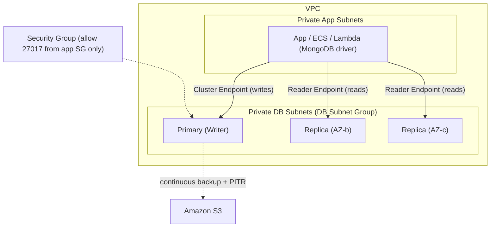

# DocumentDB Best Practices & Examples - SAA-C03 Deep Dive

> Practical guidance for sizing DocumentDB instances, scaling reads with replicas and the reader endpoint, designing indexes, securing clusters in a VPC, planning backups, migrating from MongoDB, and choosing Elastic Clusters for extreme scale.

See also: [01 - DocumentDB Intro & Core Concepts](01%20-%20DocumentDB%20Intro%20%26%20Core%20Concepts.md) · [02 - DocumentDB Architecture Deep Dive](02%20-%20DocumentDB%20Architecture%20Deep%20Dive.md) · [04 - DocumentDB Scenario Questions](04%20-%20DocumentDB%20Scenario%20Questions.md) · [05 - DocumentDB Troubleshooting (SRE)](05%20-%20DocumentDB%20Troubleshooting%20%28SRE%29.md) · [06 - DocumentDB Important Facts & Cheat Sheet](06%20-%20DocumentDB%20Important%20Facts%20%26%20Cheat%20Sheet.md) · [00 - Databases Overview & Exam Guide](00%20-%20Databases%20Overview%20%26%20Exam%20Guide.md) · [01 - Aurora Intro & Core Concepts](01%20-%20Aurora%20Intro%20%26%20Core%20Concepts.md) · [01 - DynamoDB Intro & Core Concepts](01%20-%20DynamoDB%20Intro%20%26%20Core%20Concepts.md)

---

## Table of Contents

- [Reference Architecture](#reference-architecture)
- [Instance Sizing](#instance-sizing)
- [Read Scaling & High Availability](#read-scaling--high-availability)
- [Index Design](#index-design)
- [Backup & PITR Strategy](#backup--pitr-strategy)
- [Encryption & Network Security](#encryption--network-security)
- [Migrating From MongoDB](#migrating-from-mongodb)
- [When to Use Elastic Clusters](#when-to-use-elastic-clusters)
- [Connection String Example](#connection-string-example)
- [Exam Tips & Traps](#exam-tips--traps)

---



---

## Reference Architecture

A production-grade DocumentDB deployment:

- Cluster placed in **private subnets** via a **DB subnet group** spanning **3 AZs**.
- **Primary + at least 2 replicas** in different AZs for HA and read scaling.
- App connects from private subnets through a **security group** that allows port **27017** only from the app's security group.
- **TLS** enforced; **KMS** encryption enabled at creation.
- Continuous backup with a defined **PITR retention window**.

[⬆ Back to top](#table-of-contents)

---

## Instance Sizing

- Unlike serverless **DynamoDB**, creating a DocumentDB cluster requires you to **specify the instance class and the number of instances** — capacity is not automatic.
- For production, **AWS recommends at least 3 instances** (a primary plus 2 replicas across AZs) for higher availability.
- The final cluster-setup step is configuring **username/password** authentication, after which you connect to the cluster.
- Choose an **instance class** (memory-optimized `db.r5`/`db.r6g`, etc.) based on **working-set size** — DocumentDB benefits from indexes and working data fitting in RAM.
- Watch **BufferCacheHitRatio**; a low ratio means the working set exceeds memory → scale up the instance class.
- All instances in a standard cluster should typically use the **same instance class** (the primary and replicas share work and failover roles).
- Scale **up** (bigger instance) for write throughput / working set; scale **out** (more replicas) for read throughput.

> [!tip]
> Right-size by memory first: keep frequently accessed documents and their indexes in the buffer cache to avoid storage reads.

[⬆ Back to top](#table-of-contents)

---

## Read Scaling & High Availability

- Add **replica instances** (up to 15) to serve reads and to act as failover targets.
- Point read-heavy traffic at the **reader endpoint**, which load-balances across replicas.
- For HA, place replicas in **different AZs** than the primary; set **failover priority tiers** if a specific replica should be promoted.
- Use a **read preference** in the driver (e.g., `secondaryPreferred`) so reads use replicas while writes go to the primary.

> [!warning]
> Reads from replicas are **eventually consistent** (replica lag). For read-after-write consistency, read from the **primary** (cluster endpoint / `primary` read preference).

[⬆ Back to top](#table-of-contents)

---

## Index Design

- Create indexes on fields used in query **filters, sorts, and joins**; without them queries do **full collection scans** (slow, high I/O).
- Use **compound indexes** that match query patterns (field order matters).
- Use **TTL indexes** to auto-expire documents (sessions, events) and control collection growth.
- Verify index usage with **`explain()`**; check for `COLLSCAN` (bad) vs `IXSCAN` (good).
- Don't over-index — each index adds write overhead and storage.

```javascript
// Create a compound index matching a common query
db.orders.createIndex({ customerId: 1, createdAt: -1 });

// Inspect the query plan
db.orders.find({ customerId: "C123" }).sort({ createdAt: -1 }).explain();
```

[⬆ Back to top](#table-of-contents)

---

## Backup & PITR Strategy

- Set the **automated backup retention** (1–35 days) based on your **RPO** requirement.
- Schedule the **backup window** during low-traffic periods (though backups come from the storage layer and are non-disruptive).
- Take **manual snapshots** before risky changes (schema migrations, version upgrades).
- For cross-Region DR, **copy snapshots to another Region** or use **Global Clusters** for continuous replication.
- Remember: **restores create a new cluster** — plan endpoint/DNS cutover accordingly.

[⬆ Back to top](#table-of-contents)

---

## Encryption & Network Security

| Control                   | Best practice                                                                        |
| :------------------------ | :----------------------------------------------------------------------------------- |
| **Encryption at rest**    | Enable **KMS** encryption **at creation** (can't toggle later in place)              |
| **Encryption in transit** | Keep **TLS on**; bundle the DocumentDB **CA cert** in clients                        |
| **Network**               | Deploy in **private subnets**; no public access                                      |
| **Security groups**       | Allow **27017** only from the app's SG                                               |
| **Auth**                  | Use database **users/roles** (least privilege); rotate credentials (Secrets Manager) |
| **Audit**                 | Enable **auditing** + export logs to CloudWatch Logs                                 |

[⬆ Back to top](#table-of-contents)

---

## Migrating From MongoDB

Common paths to move a self-managed MongoDB onto DocumentDB:

| Method                            | When to use                                                                                                           |
| :-------------------------------- | :-------------------------------------------------------------------------------------------------------------------- |
| **AWS DMS**                       | Live/continuous migration with minimal downtime (CDC); source MongoDB (**on-premises or on EC2**) → target DocumentDB |
| **`mongodump` / `mongorestore`**  | Offline/bulk migration of smaller datasets; simple dump-and-load                                                      |
| **`mongoexport` / `mongoimport`** | Per-collection JSON/CSV transfers                                                                                     |

Steps and tips:

1. **Assess compatibility** with the DocumentDB compatibility tool / functional-differences docs (see [01 - DocumentDB Intro & Core Concepts](01%20-%20DocumentDB%20Intro%20%26%20Core%20Concepts.md)).
2. **Choose a matching DocumentDB MongoDB-compatibility version** (e.g., 4.0 or 5.0) to align with app features.
3. Use **DMS** for near-zero-downtime cutover; use **mongodump/mongorestore** for one-time loads.
4. **Recreate indexes** on the target (dump/restore preserves them; verify with `explain()`).
5. Test the app against DocumentDB **before** cutover to catch unsupported operators.

[⬆ Back to top](#table-of-contents)

---

## When to Use Elastic Clusters

Move to **Elastic Clusters** (sharding) when a standard cluster cannot keep up:

- Throughput exceeding what a single writer can handle (**millions of reads/writes per second**).
- Storage beyond a single cluster's limits (**petabyte**-scale).
- Need to **scale out/in shards** elastically without redesigning the app.

Requires choosing a good **shard key** (high cardinality, even distribution) to avoid hot shards.

[⬆ Back to top](#table-of-contents)

---

## Connection String Example

```bash
# TLS-enabled connection using the cluster endpoint and the DocumentDB CA bundle
mongosh \
  --tls \
  --host docdb-cluster.cluster-abc123.us-east-1.docdb.amazonaws.com:27017 \
  --tlsCAFile global-bundle.pem \
  --username appuser --password
```

```text
# Driver URI: write to cluster endpoint, read from replicas, with TLS + retryable writes
mongodb://appuser:<pwd>@docdb-cluster.cluster-abc123.us-east-1.docdb.amazonaws.com:27017/?
  tls=true&tlsCAFile=global-bundle.pem&replicaSet=rs0&
  readPreference=secondaryPreferred&retryWrites=false
```

> [!note]
> DocumentDB does **not** support `retryWrites=true`; set **`retryWrites=false`** in the URI and implement retry logic in the app. Always validate TLS with the downloaded **`global-bundle.pem`** CA file.

[⬆ Back to top](#table-of-contents)

---

## Exam Tips & Traps

- Scale **reads** → add **replicas** + use the **reader endpoint**; scale **writes/working set** → bigger instance or **Elastic Clusters**.
- Migrate MongoDB with **minimal downtime** → **AWS DMS**; simple/offline → **mongodump/mongorestore**.
- **Encryption at rest** must be set at **creation** (snapshot-copy-restore to add later).
- Deploy in **private subnets**, restrict SG to **port 27017** from app SG, keep **TLS** on.
- DocumentDB requires **`retryWrites=false`** in the connection string.
- **Elastic Clusters** for petabyte / millions-of-ops sharded scale.

[⬆ Back to top](#table-of-contents)
