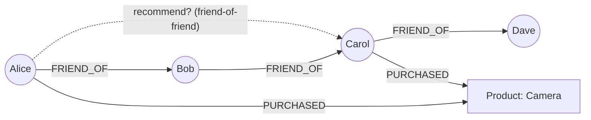

# Neptune Intro & Core Concepts - SAA-C03 Deep Dive

> Amazon Neptune is a fully managed graph database purpose-built for highly connected data and deep relationship queries, supporting Gremlin and openCypher (property graph) plus SPARQL (RDF) query languages.

See also: [02 - Neptune Architecture Deep Dive](02%20-%20Neptune%20Architecture%20Deep%20Dive.md) · [03 - Neptune Best Practices & Examples](03%20-%20Neptune%20Best%20Practices%20%26%20Examples.md) · [04 - Neptune Scenario Questions](04%20-%20Neptune%20Scenario%20Questions.md) · [05 - Neptune Troubleshooting (SRE)](05%20-%20Neptune%20Troubleshooting%20%28SRE%29.md) · [06 - Neptune Important Facts & Cheat Sheet](06%20-%20Neptune%20Important%20Facts%20%26%20Cheat%20Sheet.md) · [00 - Databases Overview & Exam Guide](00%20-%20Databases%20Overview%20%26%20Exam%20Guide.md) · [01 - Aurora Intro & Core Concepts](01%20-%20Aurora%20Intro%20%26%20Core%20Concepts.md)

---

## Table of Contents

- [What Is Amazon Neptune](#what-is-amazon-neptune)
- [Graph Data Models](#graph-data-models)
- [Query Languages](#query-languages)
- [Property Graph vs RDF](#property-graph-vs-rdf)
- [Ideal Use Cases](#ideal-use-cases)
- [When Graph Beats Relational](#when-graph-beats-relational)
- [Exam Tips & Traps](#exam-tips--traps)

---

---

## What Is Amazon Neptune

Amazon Neptune is a **fully managed graph database service** optimized for storing and navigating **highly connected data** where the _relationships_ between entities are as important as the entities themselves.

Key points:

- **Purpose-built graph engine** — not a relational or document store. Data is modeled as **nodes (vertices)**, **edges (relationships)**, and **properties**.
- **Fully managed**: AWS handles provisioning, patching, backup, replication, and failure recovery (Aurora-style storage — see [02 - Neptune Architecture Deep Dive](02%20-%20Neptune%20Architecture%20Deep%20Dive.md)).
- Designed for queries that **traverse many relationships (multi-hop)** efficiently — something relational joins do poorly at scale.
- Optimized for **millisecond query response over billions of relationships**.
- Provides **ACID transactions** and immediate consistency on the primary, with read replicas for scale-out reads.
- Supports **two graph models** (property graph and RDF) and **three query languages** (Gremlin, openCypher, SPARQL).

> [!note]
> Trigger words for Neptune on the exam: "graph database", "highly connected data", "relationships", "social network", "fraud detection", "recommendation engine", "knowledge graph", "Gremlin / SPARQL / openCypher".

[⬆ Back to top](#table-of-contents)

---

## Graph Data Models

A graph represents data as a network of connected objects:

| Element                 | Meaning                            | Example                                |
| :---------------------- | :--------------------------------- | :------------------------------------- |
| **Vertex / Node**       | An entity                          | A person, account, product, IP address |
| **Edge / Relationship** | A directed link between two nodes  | `Alice -FRIEND_OF-> Bob`               |
| **Property**            | A key/value on a node or edge      | `name=Alice`, `since=2021`             |
| **Label**               | A type/category for nodes or edges | `Person`, `PURCHASED`                  |

Why graphs matter: a "friend of a friend who bought X" question becomes a few **edge traversals** instead of multiple self-joins. The cost of a graph traversal scales with the number of relationships _touched_, not the total table size.

[⬆ Back to top](#table-of-contents)

---

## Query Languages

Neptune supports three query languages across two models:

| Language       | Model          | Standard / Origin        | Style                                                    |
| :------------- | :------------- | :----------------------- | :------------------------------------------------------- |
| **Gremlin**    | Property graph | Apache TinkerPop         | Imperative graph traversal (`g.V().has(...)`)            |
| **openCypher** | Property graph | openCypher / Neo4j-style | Declarative pattern matching (`MATCH (a)-[:KNOWS]->(b)`) |
| **SPARQL**     | RDF            | W3C standard             | Declarative triple-pattern queries over RDF              |

- **Gremlin and openCypher** both operate on the **property graph** model and can query the _same_ graph data.
- **SPARQL** operates on the **RDF (Resource Description Framework)** model — a different data representation based on subject-predicate-object **triples**.
- A given Neptune cluster can hold **property graph data** (Gremlin/openCypher) **and/or** **RDF data** (SPARQL), but you query each with its matching language.

> [!tip]
> Map the keyword to the language: **Gremlin / openCypher → property graph**; **SPARQL → RDF / W3C / triples / linked data / ontologies**.

[⬆ Back to top](#table-of-contents)

---

## Property Graph vs RDF

| Aspect          | Property Graph                                       | RDF                                                                                           |
| :-------------- | :--------------------------------------------------- | :-------------------------------------------------------------------------------------------- |
| Unit of data    | Nodes + edges with **properties**                    | **Triples** (subject, predicate, object)                                                      |
| Query languages | **Gremlin**, **openCypher**                          | **SPARQL**                                                                                    |
| Standard        | Apache TinkerPop / openCypher                        | **W3C** standard                                                                              |
| Best for        | Operational apps, social/fraud/recommendation graphs | Linked data, ontologies, knowledge graphs, semantic web, data integration across vocabularies |
| Identifiers     | Internal node/edge IDs                               | **IRIs/URIs** (globally unique resource identifiers)                                          |

Both can model the same domain, but RDF shines when you need **standardized, globally identifiable, interoperable** data (e.g., merging public datasets, ontology-driven knowledge graphs).

[⬆ Back to top](#table-of-contents)

---

## Ideal Use Cases

| Use case                                   | Why Neptune                                                                                                                                          | Pattern                                      |
| :----------------------------------------- | :--------------------------------------------------------------------------------------------------------------------------------------------------- | :------------------------------------------- |
| **Social networking**                      | Friends-of-friends, mutual connections, feeds                                                                                                        | Multi-hop traversal of relationships         |
| **Recommendation engines**                 | "Customers who bought X also bought Y"                                                                                                               | Collaborative-filtering style traversals     |
| **Fraud detection**                        | Detect rings/anomalous patterns of linked accounts, devices, cards                                                                                   | Pattern matching across shared attributes    |
| **Knowledge graphs**                       | Entity + relationship knowledge, semantic search                                                                                                     | Often RDF/SPARQL                             |
| **Network & IT topology**                  | Model devices, dependencies, blast radius                                                                                                            | Reachability / impact traversal              |
| **Cloud infrastructure / security graphs** | Map relationships between cloud entities — e.g. which resources use a given **IAM role**, or find **overpermissive IAM policies** (`*` on resources) | Traverse principal → policy → resource links |
| **Identity graphs**                        | Resolve a user across devices, cookies, emails                                                                                                       | Link resolution and de-duplication           |

[⬆ Back to top](#table-of-contents)

---

## When Graph Beats Relational

Choose Neptune (graph) over a relational DB when:

- Queries involve **deep, variable-depth relationship traversals** (e.g., "find all accounts within 4 hops of this fraudulent account").
- The same query in SQL would require **many JOINs or recursive CTEs** that get slow and complex as data grows.
- The **relationships are first-class** and frequently queried, not occasional foreign-key lookups.
- You need to discover **paths, patterns, or connectivity** rather than aggregate rows.

Stay relational (RDS/Aurora — see [01 - Aurora Intro & Core Concepts](01%20-%20Aurora%20Intro%20%26%20Core%20Concepts.md)) when data is tabular, queries are mostly single-table or shallow joins, and you need general-purpose SQL/transactions over structured records.

> [!warning]
> Graph is not a general replacement for SQL. The exam signal for Neptune is **explicitly relationship-centric**: many hops, connection patterns, "friends of friends", fraud rings, recommendations.

[⬆ Back to top](#table-of-contents)

---

## Exam Tips & Traps

- "Highly connected data / relationships / graph database" → **Neptune**.
- "Gremlin" or "openCypher" → property graph on **Neptune**; "SPARQL" / "RDF" / "W3C triples" → RDF on **Neptune**.
- "Social network friends-of-friends", "recommendation engine", "fraud detection ring", "knowledge graph", "identity graph" → **Neptune**.
- "SQL joins are too slow / too many joins for deep relationships" → **Neptune**.
- Do **not** pick DynamoDB for multi-hop relationship traversals — it is key-value/document, not graph (see [04 - Neptune Scenario Questions](04%20-%20Neptune%20Scenario%20Questions.md)).
- Neptune is fully managed and **ACID**-compliant on the writer.

[⬆ Back to top](#table-of-contents)
