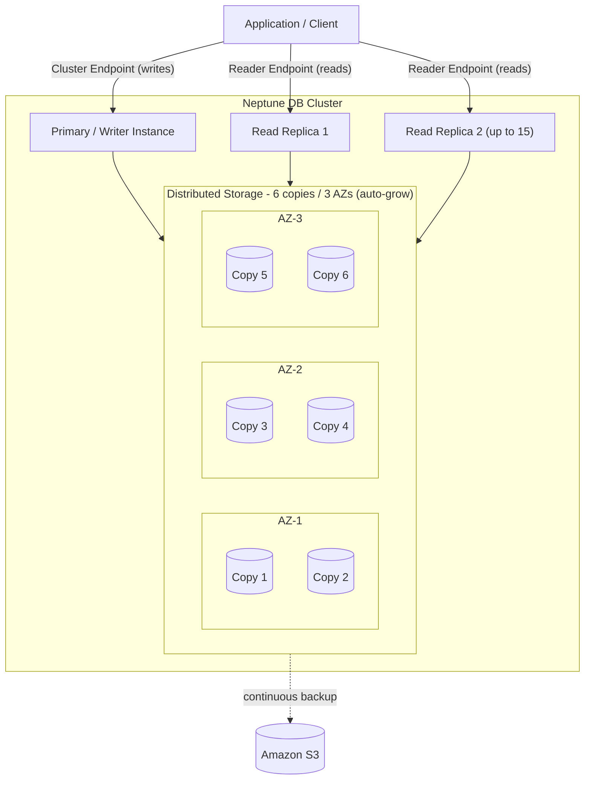

# Neptune Architecture Deep Dive - SAA-C03 Deep Dive

> Neptune uses an Aurora-like architecture: a primary writer plus up to 15 read replicas over a distributed storage volume that keeps 6 copies of data across 3 AZs, with self-healing storage, continuous S3 backup, PITR, Streams, Serverless, ML, and Global Database.

See also: [01 - Neptune Intro & Core Concepts](01%20-%20Neptune%20Intro%20%26%20Core%20Concepts.md) · [03 - Neptune Best Practices & Examples](03%20-%20Neptune%20Best%20Practices%20%26%20Examples.md) · [04 - Neptune Scenario Questions](04%20-%20Neptune%20Scenario%20Questions.md) · [05 - Neptune Troubleshooting (SRE)](05%20-%20Neptune%20Troubleshooting%20%28SRE%29.md) · [06 - Neptune Important Facts & Cheat Sheet](06%20-%20Neptune%20Important%20Facts%20%26%20Cheat%20Sheet.md) · [00 - Databases Overview & Exam Guide](00%20-%20Databases%20Overview%20%26%20Exam%20Guide.md) · [01 - Aurora Intro & Core Concepts](01%20-%20Aurora%20Intro%20%26%20Core%20Concepts.md)

---

## Table of Contents

- [Cluster & Storage Layer](#cluster--storage-layer)
- [Writer & Read Replicas](#writer--read-replicas)
- [Endpoints](#endpoints)
- [Caching Layers](#caching-layers)
- [Automatic Failover](#automatic-failover)
- [Backups, Snapshots & PITR](#backups-snapshots--pitr)
- [Encryption & Security](#encryption--security)
- [Neptune Streams](#neptune-streams)
- [Neptune Serverless](#neptune-serverless)
- [Neptune ML](#neptune-ml)
- [Neptune Global Database](#neptune-global-database)
- [Exam Tips & Traps](#exam-tips--traps)

---

---

## Cluster & Storage Layer

Like Aurora (see [02 - Aurora Architecture Deep Dive](02%20-%20Aurora%20Architecture%20Deep%20Dive.md)), Neptune **decouples compute from storage**:

| Property          | Detail                                                                                                                                          |
| :---------------- | :---------------------------------------------------------------------------------------------------------------------------------------------- |
| Copies            | **6 copies of data across 3 Availability Zones**                                                                                                |
| Durability target | Tolerates loss of an entire AZ + one additional copy without losing data                                                                        |
| Self-healing      | Storage continuously scans for and repairs bad segments automatically                                                                           |
| Auto-grow         | Starts at **10 GB** and grows automatically in 10 GB increments up to **64 TiB** (older docs/engines) and up to **128 TiB** on current versions |
| Shared volume     | All instances in the cluster read from the same distributed volume                                                                              |
| Independent layer | The **storage layer is decoupled from compute** and scales automatically on its own                                                             |

Because replicas attach to the **same shared storage**, adding a replica does not copy data and replica lag is typically very low (tens of milliseconds).

> [!note]
> For the exam, the durable-storage signature "**6 copies across 3 AZs, self-healing, auto-grow**" applies to both Aurora and Neptune.

[⬆ Back to top](#table-of-contents)

---

## Writer & Read Replicas

| Role                 | Count         | Scaling                                            | Function                                                        |
| :------------------- | :------------ | :------------------------------------------------- | :-------------------------------------------------------------- |
| **Primary (Writer)** | Maximum **1** | **Vertically** (bigger instance) only              | Handles all **writes** and can serve reads; strongly consistent |
| **Read Replicas**    | Up to **15**  | **Vertically or horizontally** (add more replicas) | Serve **read-only** traffic; act as **failover targets**        |

- Replicas scale **read throughput** horizontally and provide **high availability**.
- Replicas can be placed in different AZs for resilience.
- Each replica can be assigned a **failover priority tier** (tier-0 is promoted first).
- AWS **recommends at least 1 read replica** for availability and read performance — a single-instance (writer-only) cluster has no failover target.

> [!warning]
> A **single-writer cluster with no replicas** may be **down for a few minutes** while the writer instance restarts after a failure — there is nothing to promote, so HA is lost. Keep at least one replica in another AZ for production.

[⬆ Back to top](#table-of-contents)

---

## Endpoints

| Endpoint                               | Points to                                         | Use for                                                       |
| :------------------------------------- | :------------------------------------------------ | :------------------------------------------------------------ |
| **Writer endpoint = cluster endpoint** | Current primary                                   | **Writes** (and optional reads); read-after-write consistency |
| **Reader endpoint**                    | Distributes reads across replicas **round-robin** | **All reads** / read scaling                                  |
| **Instance endpoint**                  | One specific instance                             | Targeted diagnostics / pinning                                |
| **Custom endpoint**                    | A chosen set of instances                         | Workload isolation (e.g., analytics replicas)                 |

> [!warning]
> Send **writes to the cluster (writer) endpoint**, not the reader endpoint. After a failover, the cluster endpoint automatically resolves to the new primary — applications should reconnect rather than cache the old instance IP (see [05 - Neptune Troubleshooting (SRE)](05%20-%20Neptune%20Troubleshooting%20%28SRE%29.md)).

> [!important]
> The reader endpoint only balances **new connections** round-robin; Neptune does **NOT load-balance at the instance level** across an open connection. Any per-request distribution across replicas must be **built into the application** (or by resolving the reader endpoint per request / using a connection pool).

[⬆ Back to top](#table-of-contents)

---

## Caching Layers

Neptune uses three distinct caches to speed up queries:

| Cache                   | Scope                      | What it caches                                           | Notes                                                                                                                         |
| :---------------------- | :------------------------- | :------------------------------------------------------- | :---------------------------------------------------------------------------------------------------------------------------- |
| **Buffer cache**        | In-memory (every instance) | Frequently accessed graph data pages                     | Neptune allocates about **two-thirds of instance memory** to it; track with `BufferCacheHitRatio`                             |
| **Lookup cache**        | Instance-level             | Repetitive lookups of **property values / RDF literals** | **Enabled by default on R5d instances** (purpose-built for large in-memory workloads); uses the instance's **NVMe-based SSD** |
| **Query results cache** | Instance-level             | **Gremlin read-only query results**                      | Clear via **TTL per query**, a **per-query clear**, or a **full cache clear**; speeds up repeated identical queries           |

> [!tip]
> "Speed up repeated Gremlin reads" → **query results cache**. "Large in-memory workloads needing fast property/literal lookups (R5d / NVMe)" → **lookup cache**. The always-on in-memory page cache is the **buffer cache** (two-thirds of instance memory).

[⬆ Back to top](#table-of-contents)

---

## Automatic Failover

- If the writer fails, Neptune **automatically promotes a read replica** to be the new writer (typically in seconds), preferring the lowest-numbered failover tier.
- The **old writer**, once recovered, **rejoins the cluster as a read replica**.
- The **cluster endpoint** updates to point to the new primary; the **reader endpoint** keeps serving the remaining replicas.
- If there are **no replicas**, Neptune recreates/restarts the primary instance (the cluster can be **down for a few minutes**, no HA) — so production clusters should have at least one replica in another AZ.

[⬆ Back to top](#table-of-contents)

---

## Backups, Snapshots & PITR

| Feature                           | Detail                                                                               |
| :-------------------------------- | :----------------------------------------------------------------------------------- |
| **Continuous backup**             | Automatically streamed to **Amazon S3**                                              |
| **Point-in-Time Recovery (PITR)** | Restore to any second within the retention window (1–35 days)                        |
| **Manual snapshots**              | User-initiated, retained until deleted; shareable/copyable across accounts & Regions |
| **Restore behavior**              | Restores create a **new cluster** (you do not restore in place)                      |

[⬆ Back to top](#table-of-contents)

---

## Encryption & Security

- **Encryption at rest** via **AWS KMS** (enable at cluster creation; covers storage, backups, snapshots, replicas). Enabling encryption on an existing unencrypted cluster requires restoring an encrypted snapshot.
- **Encryption in transit** via **TLS/SSL** (Neptone enforces HTTPS connections; TLS can be required).
- Runs **inside a VPC**; control access with **security groups** and subnet placement.
- **IAM database authentication** — use IAM identities and **SigV4-signed requests** to authenticate to the database.
- Audit logging and CloudWatch/CloudTrail integration for visibility.

[⬆ Back to top](#table-of-contents)

---

## Neptune Streams

**Neptune Streams** captures an ordered, **change-data log** of every modification to the graph (vertices, edges, properties):

- Lets downstream consumers react to changes (replicate to another store, update search/Elasticsearch/OpenSearch, trigger Lambda, build materialized views).
- Changes are exposed via an **HTTP REST endpoint** and read in order with sequence numbers.
- Common pattern: **Neptune Streams → Lambda → OpenSearch** for full-text search over graph data.

> [!tip]
> "Capture changes to the graph / react to graph updates / replicate graph changes" → **Neptune Streams**.

[⬆ Back to top](#table-of-contents)

---

## Neptune Serverless

**Amazon Neptune Serverless** scales compute capacity automatically based on demand:

| Property      | Detail                                                                                                                                              |
| :------------ | :-------------------------------------------------------------------------------------------------------------------------------------------------- |
| Capacity unit | **NCU (Neptune Capacity Unit)** — measure of memory + associated compute                                                                            |
| Scaling       | Automatically scales NCUs up/down within a configured **min/max** range; you set an **upper capacity limit** that is only used when actually needed |
| Best for      | **Variable / unpredictable / intermittent** graph workloads                                                                                         |
| Benefit       | No need to provision for peak; pay for capacity used                                                                                                |

[⬆ Back to top](#table-of-contents)

---

## Neptune ML

**Neptune ML** uses **Graph Neural Networks (GNNs)** via **Amazon SageMaker** to make predictions on graph data:

| Prediction type                    | Example                                                               |
| :--------------------------------- | :-------------------------------------------------------------------- |
| **Node classification**            | Categorize a user/account (e.g., fraud vs legitimate)                 |
| **Node regression**                | Predict a numeric property of a node                                  |
| **Link prediction**                | Suggest likely missing edges (recommendations, "people you may know") |
| **Edge classification/regression** | Classify or score relationships                                       |

It exports graph data, trains a GNN in SageMaker, and lets you run inference inside Gremlin/SPARQL queries.

> [!tip]
> "Predict missing relationships / recommend connections / classify nodes using ML on a graph" → **Neptune ML (GNN + SageMaker)**.

[⬆ Back to top](#table-of-contents)

---

## Neptune Global Database

**Neptune Global Database** spans multiple AWS Regions:

- One **primary Region** for writes; up to **5 secondary** read-only Regions.
- **Storage-level replication** with typically **< 1 second** cross-Region lag.
- Use cases: **low-latency global reads** and **cross-Region disaster recovery** (promote a secondary Region if the primary fails).

[⬆ Back to top](#table-of-contents)

---

## Exam Tips & Traps

- "6 copies / 3 AZs, self-healing, auto-grow" → Neptune (and Aurora) storage.
- **1 writer (max) + up to 15 read replicas**; writer scales **vertically only**, replicas **vertically or horizontally**; reads via **reader endpoint** (round-robin), writes via **cluster endpoint**.
- Reader endpoint balances **connections only** — Neptune does **not** load-balance at the instance level; the app must distribute reads.
- Three caches: **buffer cache** (~2/3 of memory), **lookup cache** (R5d/NVMe, default on), **query results cache** (Gremlin read-only).
- Failover **promotes a replica** (old writer rejoins as a replica); **no replica = down a few minutes**, no HA.
- **Streams** = change capture; **Serverless** = auto-scaling compute (NCUs); **ML** = GNN predictions via SageMaker; **Global Database** = multi-Region DR/reads.
- Encryption: **KMS at rest, TLS in transit, IAM auth, runs in a VPC**.
- PITR via continuous S3 backup; restores create a **new cluster**.

[⬆ Back to top](#table-of-contents)
