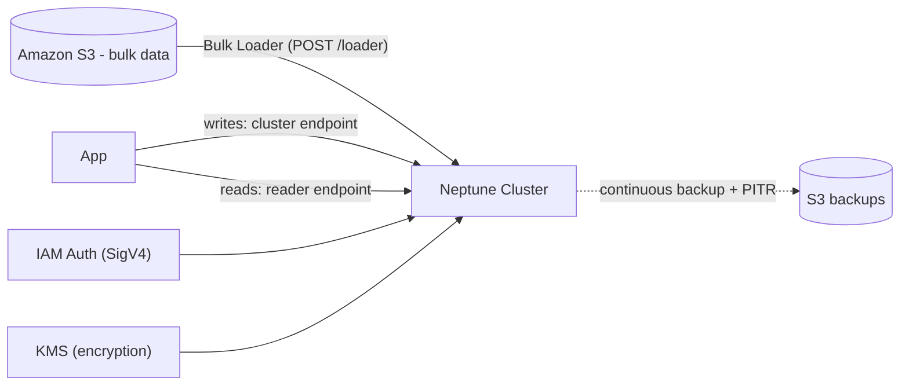

# Neptune Best Practices & Examples - SAA-C03 Deep Dive

> Best practices for Neptune: pick the query language that fits the model, use read replicas for scale and HA, bulk-load from S3, model the graph deliberately, choose Serverless for variable load, lock down with VPC/IAM/encryption, and rely on PITR for recovery.

See also: [01 - Neptune Intro & Core Concepts](01%20-%20Neptune%20Intro%20%26%20Core%20Concepts.md) · [02 - Neptune Architecture Deep Dive](02%20-%20Neptune%20Architecture%20Deep%20Dive.md) · [04 - Neptune Scenario Questions](04%20-%20Neptune%20Scenario%20Questions.md) · [05 - Neptune Troubleshooting (SRE)](05%20-%20Neptune%20Troubleshooting%20%28SRE%29.md) · [06 - Neptune Important Facts & Cheat Sheet](06%20-%20Neptune%20Important%20Facts%20%26%20Cheat%20Sheet.md) · [00 - Databases Overview & Exam Guide](00%20-%20Databases%20Overview%20%26%20Exam%20Guide.md) · [01 - Aurora Intro & Core Concepts](01%20-%20Aurora%20Intro%20%26%20Core%20Concepts.md)

---

## Table of Contents

- [Choosing the Right Query Language](#choosing-the-right-query-language)
- [Read Replicas for Scale & HA](#read-replicas-for-scale--ha)
- [Bulk Loading from S3](#bulk-loading-from-s3)
- [Data Modeling for Graphs](#data-modeling-for-graphs)
- [Neptune Serverless for Variable Load](#neptune-serverless-for-variable-load)
- [Security Best Practices](#security-best-practices)
- [Backup & Recovery](#backup--recovery)
- [Query Examples](#query-examples)
- [Exam Tips & Traps](#exam-tips--traps)

---



---

## Choosing the Right Query Language

| If your data is...                                          | Use model      | Use language                                                              |
| :---------------------------------------------------------- | :------------- | :------------------------------------------------------------------------ |
| Operational property graph (social, fraud, recommendations) | Property graph | **Gremlin** (imperative traversals) or **openCypher** (declarative MATCH) |
| Standardized/linked/ontology/semantic data                  | RDF            | **SPARQL**                                                                |
| Migrating from Neo4j-style Cypher                           | Property graph | **openCypher**                                                            |
| Migrating from a TinkerPop app                              | Property graph | **Gremlin**                                                               |

> [!tip]
> Pick the language **once, deliberately**, per dataset. Mixing models on the same logical graph causes confusion; choose property graph (Gremlin/openCypher) **or** RDF (SPARQL) for a given dataset.

[⬆ Back to top](#table-of-contents)

---

## Read Replicas for Scale & HA

- Add **read replicas** (up to 15) to scale read-heavy traversal workloads and provide failover targets.
- Place replicas in **multiple AZs** so a single AZ failure does not take down the cluster.
- Point read traffic at the **reader endpoint**; reserve the **cluster endpoint** for writes and read-after-write needs.
- Use **custom endpoints** to isolate heavy analytical traversals from latency-sensitive app reads.

[⬆ Back to top](#table-of-contents)

---

## Bulk Loading from S3

For initial population or large imports, use the **Neptune Bulk Loader** rather than thousands of individual insert queries:

| Step                    | Detail                                                            |
| :---------------------- | :---------------------------------------------------------------- |
| 1. Stage data in **S3** | CSV (Gremlin/openCypher) or RDF formats (e.g., N-Triples, Turtle) |
| 2. Grant access         | Attach an **IAM role** to the cluster + an **S3 VPC endpoint**    |
| 3. Trigger load         | `POST` to the `/loader` endpoint                                  |
| 4. Monitor              | Poll the loader status endpoint for progress/errors               |

Benefits: far faster, transactional batching, and parallelism vs. row-by-row inserts.

> [!tip]
> "Load a large existing dataset into a graph database efficiently" → **Neptune Bulk Loader from S3** (needs an IAM role + S3 VPC endpoint).

[⬆ Back to top](#table-of-contents)

---

## Data Modeling for Graphs

- Model **frequently traversed relationships as edges**, not as properties you must filter on.
- Keep **high-selectivity properties indexed/queryable** to anchor the start of a traversal (avoid full graph scans).
- Use meaningful **labels** on nodes/edges to constrain traversals early.
- Avoid **supernodes** (a single vertex with millions of edges) where possible — they create hotspots and slow traversals.
- Start traversals from a **specific, indexed node** and limit traversal depth.

[⬆ Back to top](#table-of-contents)

---

## Neptune Serverless for Variable Load

- Use **Neptune Serverless** for **spiky, intermittent, or unpredictable** workloads (dev/test, periodic analytics, new apps with unknown traffic).
- Configure a sensible **min/max NCU** range — min high enough to avoid cold-feeling latency, max high enough to absorb spikes.
- Use **provisioned instances** for steady, predictable high-throughput production where reserved capacity is cheaper.

[⬆ Back to top](#table-of-contents)

---

## Security Best Practices

| Control               | Practice                                                                                  |
| :-------------------- | :---------------------------------------------------------------------------------------- |
| Network               | Deploy in a **private VPC subnet**; restrict with **security groups**; no public exposure |
| AuthN                 | Enable **IAM database authentication** (SigV4-signed requests)                            |
| Encryption at rest    | Enable **KMS** at cluster creation                                                        |
| Encryption in transit | Enforce **TLS/HTTPS** for all connections                                                 |
| Auditing              | Enable audit logs; ship to CloudWatch; monitor with CloudTrail                            |
| Least privilege       | Scope IAM policies/roles tightly (loader role, app role)                                  |

[⬆ Back to top](#table-of-contents)

---

## Backup & Recovery

- Rely on **continuous backups to S3** and **PITR** (retention 1–35 days) for operational recovery.
- Take **manual snapshots** before risky migrations; copy snapshots cross-Region for DR.
- For multi-Region resilience and low-latency global reads, use **Neptune Global Database**.
- Test restores periodically — restores create a **new cluster**, so plan endpoint/DNS cutover.

[⬆ Back to top](#table-of-contents)

---

## Query Examples

**Gremlin** — friends-of-friends of "alice" (2 hops), excluding direct friends and self:

```groovy
g.V().has('person','name','alice').as('me')
 .out('knows').out('knows')
 .where(neq('me'))
 .dedup()
 .values('name')
```

**openCypher** — recommend products bought by friends that the user has not bought:

```cypher
MATCH (me:Person {name:'alice'})-[:KNOWS]->(f:Person)-[:PURCHASED]->(p:Product)
WHERE NOT (me)-[:PURCHASED]->(p)
RETURN p.name, count(*) AS score
ORDER BY score DESC
LIMIT 10
```

**SPARQL** — list people who know the person named "Alice" (RDF model):

```sparql
PREFIX ex: <http://example.org/>
SELECT ?friendName WHERE {
  ?alice ex:name "Alice" .
  ?friend ex:knows ?alice .
  ?friend ex:name ?friendName .
}
```

[⬆ Back to top](#table-of-contents)

---

## Exam Tips & Traps

- Match language to model: **Gremlin/openCypher → property graph**, **SPARQL → RDF**.
- **Bulk load from S3** (IAM role + S3 VPC endpoint) for large imports — not row-by-row inserts.
- **Reader endpoint for reads**, replicas across AZs for HA + scale.
- **Serverless** for variable load; **provisioned** for steady high throughput.
- Security checklist: **VPC + security groups + IAM auth + KMS + TLS**.
- **PITR + snapshots** for recovery; **Global Database** for cross-Region DR.

[⬆ Back to top](#table-of-contents)
