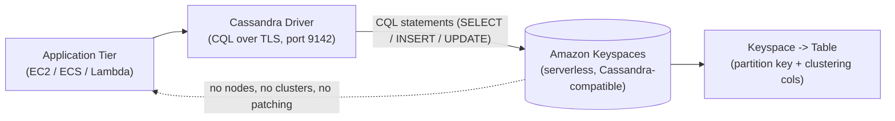

# Keyspaces Intro & Core Concepts - SAA-C03 Deep Dive

> What Amazon Keyspaces (for Apache Cassandra) is — a serverless, fully managed, Apache Cassandra-compatible wide-column database that speaks CQL — why it removes Cassandra cluster operations, the keyspace/table/partition-key/clustering-column data model, and when to choose it (existing Cassandra workloads, high-volume time-series/IoT).

See also: [02 - Keyspaces Architecture Deep Dive](02%20-%20Keyspaces%20Architecture%20Deep%20Dive.md) · [03 - Keyspaces Best Practices & Examples](03%20-%20Keyspaces%20Best%20Practices%20%26%20Examples.md) · [04 - Keyspaces Scenario Questions](04%20-%20Keyspaces%20Scenario%20Questions.md) · [05 - Keyspaces Troubleshooting (SRE)](05%20-%20Keyspaces%20Troubleshooting%20%28SRE%29.md) · [06 - Keyspaces Important Facts & Cheat Sheet](06%20-%20Keyspaces%20Important%20Facts%20%26%20Cheat%20Sheet.md) · [00 - Databases Overview & Exam Guide](00%20-%20Databases%20Overview%20%26%20Exam%20Guide.md) · [01 - DynamoDB Intro & Core Concepts](01%20-%20DynamoDB%20Intro%20%26%20Core%20Concepts.md)

---

## Table of Contents

- [What Is Amazon Keyspaces](#what-is-amazon-keyspaces)
- [Serverless vs Self-Managed Cassandra](#serverless-vs-self-managed-cassandra)
- [CQL - Cassandra Query Language](#cql---cassandra-query-language)
- [Data Model - Keyspaces, Tables, Keys](#data-model---keyspaces-tables-keys)
- [When to Use Amazon Keyspaces](#when-to-use-amazon-keyspaces)
- [Core Terminology](#core-terminology)

---



---

## What Is Amazon Keyspaces

Amazon Keyspaces (for Apache Cassandra) is a **serverless, fully managed, Apache Cassandra-compatible** wide-column (NoSQL) database service. You run Cassandra workloads using **CQL (Cassandra Query Language)** and existing **open-source Cassandra drivers/tools** — but AWS operates everything underneath.

Key characteristics:

- **Cassandra-compatible**: works with the open-source CQL API, `cqlsh`, and standard Cassandra drivers (Java, Python, Node.js, Go, etc.), so existing application code largely runs unchanged.
- **Serverless**: there are **no servers, nodes, or clusters to provision, patch, or scale**. Tables scale capacity up and down automatically based on traffic.
- **Fully managed**: AWS handles provisioning, replication, patching, failure detection, and recovery.
- **Wide-column model**: data is organized into keyspaces and tables with a **partition key** and optional **clustering columns**, exactly like Cassandra.

> [!tip] Exam Tip
> When a scenario says **"Apache Cassandra"**, **"CQL"**, **"keep our existing Cassandra drivers/queries"**, or **"managed/serverless Cassandra"**, the answer is almost always **Amazon Keyspaces** — not DynamoDB, RDS, or self-managed Cassandra on EC2.

[⬆ Back to top](#table-of-contents)

---

## Serverless vs Self-Managed Cassandra

Running Apache Cassandra yourself (on EC2 or on-prem) means owning a distributed ring of nodes. Keyspaces removes all of that operational burden.

| Concern                        | Self-managed Cassandra (EC2/on-prem)          | Amazon Keyspaces                             |
| :----------------------------- | :-------------------------------------------- | :------------------------------------------- |
| Cluster sizing & nodes         | You provision/size/replace nodes              | **None — serverless**                        |
| Scaling                        | Manual add/remove nodes, rebalance ring       | **Automatic** (on-demand or auto scaling)    |
| Patching / upgrades            | Your responsibility                           | **Managed by AWS**                           |
| Replication / durability       | You configure replication factor across nodes | **3 copies across multiple AZs**, automatic  |
| Repairs, compaction, GC tuning | Operator-managed                              | **Managed by AWS**                           |
| Backups / PITR                 | DIY snapshots & tooling                       | **Point-in-time recovery (up to 35 days)**   |
| Encryption                     | DIY                                           | **At rest (KMS) always on + TLS in transit** |
| Pricing                        | Pay for running nodes 24/7                    | **Pay per request / provisioned capacity**   |

**Why teams migrate** on-premises or EC2-hosted Cassandra clusters to Keyspaces — to stop owning the work of managing deployment, **JVM tuning for garbage collection**, understanding Cassandra internals, capacity provisioning, **version upgrades, patching, and infrastructure maintenance**. You also gain **better native AWS integration** than self-managing offers — **CloudWatch** for monitoring/metrics and **IAM** for authentication and authorization.

> [!warning] Trade-off
> Because Keyspaces fully abstracts the infrastructure, you do **not get access to the low-level cluster-management / control-plane APIs** of a self-run Cassandra ring (e.g., node/ring administration). You manage data via CQL and AWS APIs only — if a workload genuinely needs that low-level control, self-managed Cassandra on EC2 is the fit.

> [!tip] Exam Tip
> "Eliminate the operational overhead of managing a Cassandra cluster (scaling, patching, repairs)" → migrate to **Amazon Keyspaces**. Choosing **Cassandra on EC2** is the trap answer when the question explicitly wants to _reduce_ ops burden.

[⬆ Back to top](#table-of-contents)

---

## CQL - Cassandra Query Language

CQL is Cassandra's SQL-like query language. Keyspaces implements the CQL API so your queries and drivers carry over.

```cql
-- Create a keyspace (logical grouping of tables)
CREATE KEYSPACE iot
WITH REPLICATION = {'class': 'SingleRegionStrategy'};

-- Create a table with a partition key and clustering column
CREATE TABLE iot.sensor_readings (
    device_id   text,
    reading_ts  timestamp,
    temperature double,
    humidity    double,
    PRIMARY KEY (device_id, reading_ts)
) WITH CLUSTERING ORDER BY (reading_ts DESC);

-- Read recent readings for one device (efficient: single partition)
SELECT device_id, reading_ts, temperature
FROM iot.sensor_readings
WHERE device_id = 'sensor-42'
LIMIT 100;
```

- Keyspaces uses a Keyspaces-specific **replication strategy** keyword (e.g. `SingleRegionStrategy`) rather than tuning physical replication factor — durability/replication is managed for you.
- Familiar CQL DML (`INSERT`, `UPDATE`, `DELETE`, `SELECT`) and DDL (`CREATE/ALTER/DROP`) are supported.

> [!tip] Exam Tip
> The presence of **CQL syntax**, `cqlsh`, or "wide-column store with partition + clustering keys" in a question is a strong Keyspaces signal.

[⬆ Back to top](#table-of-contents)

---

## Data Model - Keyspaces, Tables, Keys

The Cassandra/Keyspaces data model is hierarchical and **partition-oriented**:

| Concept                  | Meaning                                                                      |
| :----------------------- | :--------------------------------------------------------------------------- |
| **Keyspace**             | Top-level namespace grouping related tables (analogous to a schema/database) |
| **Table**                | A wide-column collection of rows with a defined primary key                  |
| **Primary key**          | `(partition key, clustering columns...)` — uniquely identifies a row         |
| **Partition key**        | Determines which partition stores the row; basis of data distribution        |
| **Clustering column(s)** | Defines **sort order within a partition** for efficient range queries        |
| **Row / column**         | A row is a set of columns identified by the primary key                      |

- **Partition key** drives distribution and scalability — a good key spreads data and traffic evenly.
- **Clustering columns** let you store and read related rows in sorted order inside a partition (ideal for time-series).

> [!tip] Exam Tip
> The Keyspaces partition key is conceptually similar to the **DynamoDB partition key**, and clustering columns play a role like the **sort key**. The exam often contrasts the two — see [01 - DynamoDB Intro & Core Concepts](01%20-%20DynamoDB%20Intro%20%26%20Core%20Concepts.md) and the comparison in [06 - Keyspaces Important Facts & Cheat Sheet](06%20-%20Keyspaces%20Important%20Facts%20%26%20Cheat%20Sheet.md).

[⬆ Back to top](#table-of-contents)

---

## When to Use Amazon Keyspaces

Choose Keyspaces when the scenario matches these patterns:

| Signal                                     | Why Keyspaces fits                                                            |
| :----------------------------------------- | :---------------------------------------------------------------------------- |
| **Existing Apache Cassandra workload**     | Drop-in CQL/driver compatibility — minimal app changes                        |
| **Want to drop Cassandra ops**             | Serverless, no clusters/patching/repairs                                      |
| **High-volume time-series / IoT**          | Partition + clustering keys model time-ordered data; massive write throughput |
| **Wide-column / high-write NoSQL**         | Sensor data, logs, message history, fleet/asset tracking                      |
| **Need multi-AZ durability automatically** | 3 copies across AZs out of the box                                            |
| **Global active-active wide-column**       | Multi-Region replication (multi-active)                                       |

> [!tip] Exam Tip
> **IoT / time-series at huge write volume + Cassandra/CQL** is the classic Keyspaces use case. If the question is greenfield NoSQL with **no** Cassandra requirement, **DynamoDB** is usually the intended AWS-native answer.

[⬆ Back to top](#table-of-contents)

---

## Core Terminology

| Term                         | Meaning                                                        |
| :--------------------------- | :------------------------------------------------------------- |
| **Keyspace**                 | Namespace grouping tables                                      |
| **CQL**                      | Cassandra Query Language (SQL-like API)                        |
| **Partition key**            | Column(s) determining data distribution across partitions      |
| **Clustering column**        | Column(s) defining sort order within a partition               |
| **RRU / WRU**                | Read/Write Request Units (on-demand billing units)             |
| **RCU / WCU**                | Read/Write Capacity Units (provisioned mode)                   |
| **PITR**                     | Point-in-time recovery (continuous backups, up to 35 days)     |
| **On-demand / Provisioned**  | The two capacity (throughput) modes                            |
| **Multi-Region replication** | Multi-active replication of a keyspace across AWS Regions      |
| **cqlsh / DSBulk**           | Cassandra CLI shell / bulk load-unload tool used for migration |

[⬆ Back to top](#table-of-contents)
