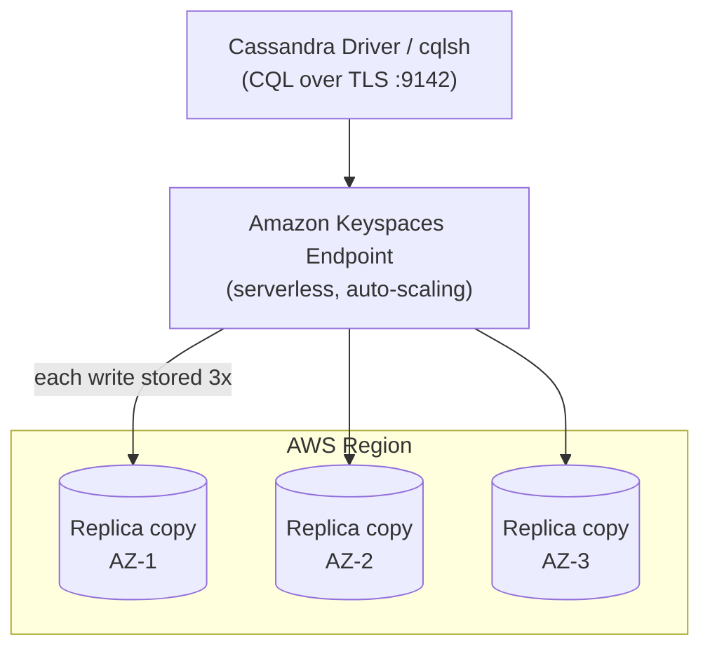

# Keyspaces Architecture Deep Dive - SAA-C03 Deep Dive

> How Amazon Keyspaces works under the hood — serverless auto-scaling tables, automatic 3-way replication across multiple AZs in a Region, on-demand vs provisioned capacity (RRU/WRU), point-in-time recovery, always-on KMS encryption + TLS, single-Region vs Multi-Region (multi-active) replication, VPC endpoint access, and CQL/Cassandra version compatibility.

See also: [01 - Keyspaces Intro & Core Concepts](01%20-%20Keyspaces%20Intro%20%26%20Core%20Concepts.md) · [03 - Keyspaces Best Practices & Examples](03%20-%20Keyspaces%20Best%20Practices%20%26%20Examples.md) · [04 - Keyspaces Scenario Questions](04%20-%20Keyspaces%20Scenario%20Questions.md) · [05 - Keyspaces Troubleshooting (SRE)](05%20-%20Keyspaces%20Troubleshooting%20%28SRE%29.md) · [06 - Keyspaces Important Facts & Cheat Sheet](06%20-%20Keyspaces%20Important%20Facts%20%26%20Cheat%20Sheet.md) · [00 - Databases Overview & Exam Guide](00%20-%20Databases%20Overview%20%26%20Exam%20Guide.md) · [01 - DynamoDB Intro & Core Concepts](01%20-%20DynamoDB%20Intro%20%26%20Core%20Concepts.md)

---

## Table of Contents

- [Serverless Architecture Overview](#serverless-architecture-overview)
- [3-AZ Replication and Durability](#3-az-replication-and-durability)
- [Capacity Modes - On-Demand vs Provisioned](#capacity-modes---on-demand-vs-provisioned)
- [Point-in-Time Recovery](#point-in-time-recovery)
- [Encryption and Security in Transit](#encryption-and-security-in-transit)
- [Single-Region vs Multi-Region Replication](#single-region-vs-multi-region-replication)
- [VPC Endpoint Connectivity](#vpc-endpoint-connectivity)
- [CQL and Cassandra Compatibility](#cql-and-cassandra-compatibility)

---

---

## Serverless Architecture Overview

Keyspaces decouples your application from any physical Cassandra ring. There is **no cluster, no nodes, no instance type** — you create a table, and AWS allocates throughput and storage on demand.

- **Tables scale automatically**: storage grows with your data (effectively unbounded), and throughput scales with traffic (instantly in on-demand mode; via auto scaling in provisioned mode).
- **Storage is decoupled from compute** — you are billed for data stored (GB-month) and for the read/write requests you make.
- A single regional **endpoint** fronts the service; you do not target individual nodes.
- Operational tasks Cassandra operators normally perform (compaction, repairs, node replacement, ring rebalancing) are **handled by AWS**.

> [!tip] Exam Tip
> "No capacity planning, no clusters, scales to handle any request rate" is the architectural pitch for Keyspaces. Pair this with **CQL/Cassandra** and it is the answer.

[⬆ Back to top](#table-of-contents)

---

## 3-AZ Replication and Durability

Every write to a Keyspaces table is **synchronously replicated three times across multiple Availability Zones** within the AWS Region before being acknowledged.

- This provides high **durability** and **availability** without any configuration — no replication factor to tune.
- AZ failure is transparent: the service continues serving from the remaining copies.
- This is the same durability model philosophy as DynamoDB (3 copies / multi-AZ).

| Property             | Behavior                                                      |
| :------------------- | :------------------------------------------------------------ |
| Copies per item      | **3**                                                         |
| Spread               | Across **multiple AZs** in the Region                         |
| Configuration needed | **None** (managed)                                            |
| Scope                | Single Region (extend globally with Multi-Region replication) |

> [!tip] Exam Tip
> Keyspaces is **multi-AZ by default** within a Region. You do **not** need to (and cannot) set a Cassandra-style replication factor — pick that over "deploy Cassandra across 3 AZs on EC2" when ops reduction matters.

[⬆ Back to top](#table-of-contents)

---

## Capacity Modes - On-Demand vs Provisioned

Keyspaces has two **throughput (capacity) modes**, directly analogous to DynamoDB. Reads/writes are metered in **Request Units**.

|                   | On-Demand                                   | Provisioned (+ Auto Scaling)              |
| :---------------- | :------------------------------------------ | :---------------------------------------- |
| Billing unit      | **RRU / WRU** (per-request)                 | **RCU / WCU** (provisioned per second)    |
| Capacity planning | None — instant scaling                      | Set baseline; optional auto scaling       |
| Best for          | **Spiky / unpredictable** traffic, new apps | **Predictable, steady** traffic           |
| Cost profile      | Pay per request (higher per-unit)           | Lower cost at steady, high utilization    |
| Throttling risk   | Minimal (scales automatically)              | If under-provisioned without auto scaling |

- **Read units**: 1 RRU/RCU = one **LOCAL_QUORUM** read of up to 4 KB. `LOCAL_ONE` (eventually consistent) reads cost **half**.
- **Write units**: 1 WRU/WCU = one write of up to 1 KB.
- You can switch modes (limited frequency, like DynamoDB).

> [!tip] Exam Tip
> Spiky/unknown traffic or "don't want to manage capacity" → **on-demand**. Steady, predictable, cost-sensitive at scale → **provisioned with auto scaling**. The RRU/WRU vs RCU/WCU distinction mirrors DynamoDB ([01 - DynamoDB Intro & Core Concepts](01%20-%20DynamoDB%20Intro%20%26%20Core%20Concepts.md)).

[⬆ Back to top](#table-of-contents)

---

## Point-in-Time Recovery

**Point-in-time recovery (PITR)** gives continuous backups so you can restore a table to any second within the retention window.

- Retention window: **up to 35 days**.
- Protects against accidental writes/deletes.
- Restore creates a **new table** with data as of the chosen timestamp; the original is untouched.
- Enabled per table; off by default.

> [!tip] Exam Tip
> "Recover from accidental deletes / restore to a point in time" for a Cassandra/Keyspaces table → enable **PITR (35 days)**. Same concept and window as DynamoDB PITR.

[⬆ Back to top](#table-of-contents)

---

## Encryption and Security in Transit

| Control                   | Behavior                                                                                           |
| :------------------------ | :------------------------------------------------------------------------------------------------- |
| **Encryption at rest**    | **Always on**, cannot be disabled. AWS owned key by default, or **customer managed KMS key (CMK)** |
| **Encryption in transit** | **TLS required** — clients connect on port **9142** with TLS                                       |
| **Authentication**        | IAM (via service-specific credentials / SigV4 plugin) or temporary credentials                     |
| **Authorization**         | **IAM policies** scope access to keyspaces/tables/actions                                          |
| **Auditing**              | **AWS CloudTrail** logs control-plane (API) activity                                               |

- Data-plane access uses Cassandra drivers with the **SigV4 authentication plugin** or generated **service-specific credentials**.
- Fine-grained, IAM-based access control replaces Cassandra's internal role system.

> [!tip] Exam Tip
> Encryption at rest is **mandatory and automatic** in Keyspaces — a question asking "how do I ensure data is encrypted at rest?" needs no extra action beyond optionally choosing a **customer-managed KMS key**. In transit is always **TLS**.

[⬆ Back to top](#table-of-contents)

---

## Single-Region vs Multi-Region Replication

By default a keyspace lives in **one Region** (replicated across its AZs). **Multi-Region replication** extends a keyspace to additional Regions with **multi-active** (active-active) replication.

|                   | Single-Region            | Multi-Region                                         |
| :---------------- | :----------------------- | :--------------------------------------------------- |
| Write locations   | One Region               | **All replica Regions (active-active)**              |
| Read locality     | One Region               | **Local low-latency reads** in each Region           |
| Use case          | Standard workloads       | **Global apps, DR, low-latency global reads/writes** |
| Capacity mode     | On-demand or provisioned | **On-demand recommended** for multi-Region           |
| Conflict handling | n/a                      | **Last-writer-wins** reconciliation                  |

- Each replica Region can serve reads **and** writes locally; changes propagate asynchronously to other Regions.
- Provides regional fault tolerance (survive a full Region impairment) and **low-latency global access**.

> [!tip] Exam Tip
> "Globally distributed, active-active, low-latency reads and writes in multiple Regions for a Cassandra workload" → **Keyspaces Multi-Region replication**. This is the Cassandra analog of **DynamoDB global tables**.

[⬆ Back to top](#table-of-contents)

---

## VPC Endpoint Connectivity

You can reach Keyspaces over the public service endpoint or privately through a VPC.

- **Interface VPC endpoint (AWS PrivateLink)** keeps traffic between your VPC and Keyspaces on the AWS network — it never traverses the public internet.
- Improves security posture and can satisfy compliance requirements that forbid public-internet data paths.
- Works together with **security groups** and **IAM** for layered access control.

> [!tip] Exam Tip
> "Connect to Keyspaces privately without traversing the internet" → **interface VPC endpoint (PrivateLink)**.

[⬆ Back to top](#table-of-contents)

---

## CQL and Cassandra Compatibility

- Keyspaces implements the **CQL API** and is compatible with Cassandra **3.11** and **4.x** drivers/tooling.
- Works with open-source **Cassandra drivers** (Java, Python, Node.js, Go, .NET) and **`cqlsh`**.
- Supports core CQL data types, DDL/DML, and lightweight operations; some self-managed Cassandra features differ or are managed for you (e.g., physical replication factor, manual repairs, certain config knobs).
- Clients authenticate with the **SigV4 plugin** or service-specific credentials over **TLS:9142**.

> [!tip] Exam Tip
> The key compatibility selling point: **keep your existing CQL queries and Cassandra drivers** and point them at Keyspaces with TLS + SigV4. Treat any "minimize application rewrite when leaving self-managed Cassandra" scenario as a Keyspaces answer.

[⬆ Back to top](#table-of-contents)
