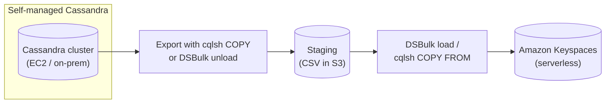

# Keyspaces Best Practices & Examples - SAA-C03 Deep Dive

> Practical guidance for Amazon Keyspaces — partition-key design to avoid hot partitions, choosing on-demand vs provisioned capacity, Multi-Region active-active, point-in-time recovery, security (IAM, VPC endpoints, encryption), migrating from self-managed Cassandra (cqlsh, DSBulk, drivers), and modeling time-series/IoT data with CQL examples.

See also: [01 - Keyspaces Intro & Core Concepts](01%20-%20Keyspaces%20Intro%20%26%20Core%20Concepts.md) · [02 - Keyspaces Architecture Deep Dive](02%20-%20Keyspaces%20Architecture%20Deep%20Dive.md) · [04 - Keyspaces Scenario Questions](04%20-%20Keyspaces%20Scenario%20Questions.md) · [05 - Keyspaces Troubleshooting (SRE)](05%20-%20Keyspaces%20Troubleshooting%20%28SRE%29.md) · [06 - Keyspaces Important Facts & Cheat Sheet](06%20-%20Keyspaces%20Important%20Facts%20%26%20Cheat%20Sheet.md) · [00 - Databases Overview & Exam Guide](00%20-%20Databases%20Overview%20%26%20Exam%20Guide.md) · [01 - DynamoDB Intro & Core Concepts](01%20-%20DynamoDB%20Intro%20%26%20Core%20Concepts.md)

---

## Table of Contents

- [Partition-Key Design to Avoid Hot Partitions](#partition-key-design-to-avoid-hot-partitions)
- [Choosing a Capacity Mode](#choosing-a-capacity-mode)
- [Multi-Region for Global Active-Active](#multi-region-for-global-active-active)
- [Point-in-Time Recovery Best Practices](#point-in-time-recovery-best-practices)
- [Security Best Practices](#security-best-practices)
- [Migrating from Self-Managed Cassandra](#migrating-from-self-managed-cassandra)
- [Time-Series and IoT Data Modeling](#time-series-and-iot-data-modeling)

---



---

## Partition-Key Design to Avoid Hot Partitions

Throughput in Keyspaces is distributed by **partition key**. A poor key concentrates traffic on a few partitions and causes **throttling** even when total provisioned capacity looks sufficient.

Best practices:

- **Choose a high-cardinality partition key** so reads/writes spread evenly (e.g., `device_id`, `user_id`).
- **Avoid low-cardinality or sequential keys** (e.g., a single `status` value, or a monotonically increasing timestamp as the _partition_ key) that funnel traffic to one partition.
- For very hot time-series, **add a bucket/shard suffix** (write sharding) to the partition key to fan out: `device_id#bucket`.
- Keep **partition size bounded** — avoid unbounded ever-growing partitions; bucket by time window.

> [!tip] Exam Tip
> "Throttling despite low overall utilization" almost always means a **hot partition** caused by a poor partition key. The fix is **redesigning the partition key for higher cardinality / write sharding**, not just raising capacity.

[⬆ Back to top](#table-of-contents)

---

## Choosing a Capacity Mode

| Use                                 | Recommended mode                         |
| :---------------------------------- | :--------------------------------------- |
| New app, unknown traffic            | **On-demand**                            |
| Spiky / unpredictable load          | **On-demand**                            |
| Steady, predictable, cost-sensitive | **Provisioned + auto scaling**           |
| Multi-Region tables                 | **On-demand** (recommended)              |
| Need to cap cost / known throughput | **Provisioned** with auto-scaling bounds |

- Start most workloads on **on-demand**; move to **provisioned + auto scaling** once traffic is well understood and steady to reduce cost.
- In provisioned mode, **always enable auto scaling** to absorb variability and reduce throttling.
- Use **eventually consistent (`LOCAL_ONE`) reads** where strong consistency is not required — they cost **half** the read units.

> [!tip] Exam Tip
> Eventually consistent reads (`LOCAL_ONE`) cost half the RRUs/RCUs of `LOCAL_QUORUM` reads — a cheap, common cost-optimization answer.

[⬆ Back to top](#table-of-contents)

---

## Multi-Region for Global Active-Active

- Use **Multi-Region replication** when users are global and you need **local low-latency reads and writes** plus **regional fault tolerance**.
- Each Region is **active** (read + write); replication is asynchronous with **last-writer-wins** conflict resolution.
- Prefer **on-demand** capacity for multi-Region tables so each Region scales independently.
- Design application logic to tolerate eventual cross-Region propagation (write to the nearest Region; reads may briefly lag in other Regions).

> [!tip] Exam Tip
> Multi-Region Keyspaces = the Cassandra equivalent of **DynamoDB global tables**: active-active, low-latency global access, and a DR option that survives a full Region outage.

[⬆ Back to top](#table-of-contents)

---

## Point-in-Time Recovery Best Practices

- **Enable PITR** on production tables to protect against accidental or malicious writes/deletes (up to **35 days**).
- Remember a restore creates a **new table** — plan application cutover / table swap.
- Combine PITR with **IAM least privilege** to limit who can delete/alter tables in the first place.

> [!tip] Exam Tip
> PITR protects against logical/accidental data loss; **3-AZ replication** protects against hardware/AZ failure; **Multi-Region** protects against Region failure. The exam expects you to map the failure type to the right control.

[⬆ Back to top](#table-of-contents)

---

## Security Best Practices

| Area                      | Best practice                                                                           |
| :------------------------ | :-------------------------------------------------------------------------------------- |
| **Authentication**        | Use IAM (SigV4 plugin) or short-lived credentials; avoid long-lived static secrets      |
| **Authorization**         | Scope **IAM policies** to specific keyspaces/tables/actions (least privilege)           |
| **Encryption at rest**    | Always on; use a **customer-managed KMS key** when you need key control/auditing        |
| **Encryption in transit** | Enforce **TLS** (port 9142) in driver config                                            |
| **Network**               | Use an **interface VPC endpoint (PrivateLink)** to keep traffic off the public internet |
| **Auditing**              | Enable **CloudTrail** for control-plane API logging                                     |

> [!tip] Exam Tip
> "Restrict access to specific Keyspaces tables" → **IAM policies**, not Cassandra internal roles. "Keep traffic private" → **VPC interface endpoint**. "Control/audit encryption keys" → **customer-managed KMS key**.

[⬆ Back to top](#table-of-contents)

---

## Migrating from Self-Managed Cassandra

Common migration tooling and path:

| Tool                  | Role                                                                  |
| :-------------------- | :-------------------------------------------------------------------- |
| **Cassandra drivers** | Repoint app to Keyspaces (TLS:9142 + SigV4) — minimal code change     |
| **`cqlsh`**           | Recreate schema (`CREATE KEYSPACE/TABLE`); small `COPY` export/import |
| **DSBulk**            | Bulk **unload** from Cassandra and **load** into Keyspaces at scale   |
| **Amazon S3**         | Stage exported CSV data between source and target                     |

Steps:

1. Recreate keyspaces/tables in Keyspaces (adjust replication keyword, e.g., `SingleRegionStrategy`).
2. Export source data (DSBulk unload or `cqlsh COPY TO`) to staging (S3/local CSV).
3. Load into Keyspaces (DSBulk load or `cqlsh COPY FROM`).
4. Repoint the application's Cassandra driver to the Keyspaces endpoint with **TLS + SigV4**.
5. Validate, then decommission the cluster.

> [!tip] Exam Tip
> "Migrate self-managed Cassandra to a managed service while keeping CQL and existing drivers" → **Keyspaces**, using **DSBulk / cqlsh** for data load. No application rewrite to a different API is required.

[⬆ Back to top](#table-of-contents)

---

## Time-Series and IoT Data Modeling

Time-series/IoT is the canonical Keyspaces workload. Use the partition key for the entity and a clustering column for time, ordered descending for "latest first" reads.

```cql
CREATE KEYSPACE telemetry
WITH REPLICATION = {'class': 'SingleRegionStrategy'};

-- Bucket by device + day to bound partition size; sort by time desc
CREATE TABLE telemetry.events (
    device_id   text,
    day_bucket  date,
    event_ts    timestamp,
    metric      text,
    value       double,
    PRIMARY KEY ((device_id, day_bucket), event_ts)
) WITH CLUSTERING ORDER BY (event_ts DESC);

-- Efficient: read today's most recent 50 events for one device
SELECT event_ts, metric, value
FROM telemetry.events
WHERE device_id = 'sensor-42'
  AND day_bucket = '2026-06-01'
LIMIT 50;
```

- The composite partition key `((device_id, day_bucket))` **bounds partition growth** and **spreads writes** across days.
- Clustering by `event_ts DESC` makes "latest readings" queries fast and avoids full scans.

> [!tip] Exam Tip
> For high-volume IoT/time-series at scale, model with a **bounded composite partition key** (entity + time bucket) and a **time clustering column** — this is both an exam pattern and the recommended Keyspaces design.

[⬆ Back to top](#table-of-contents)
