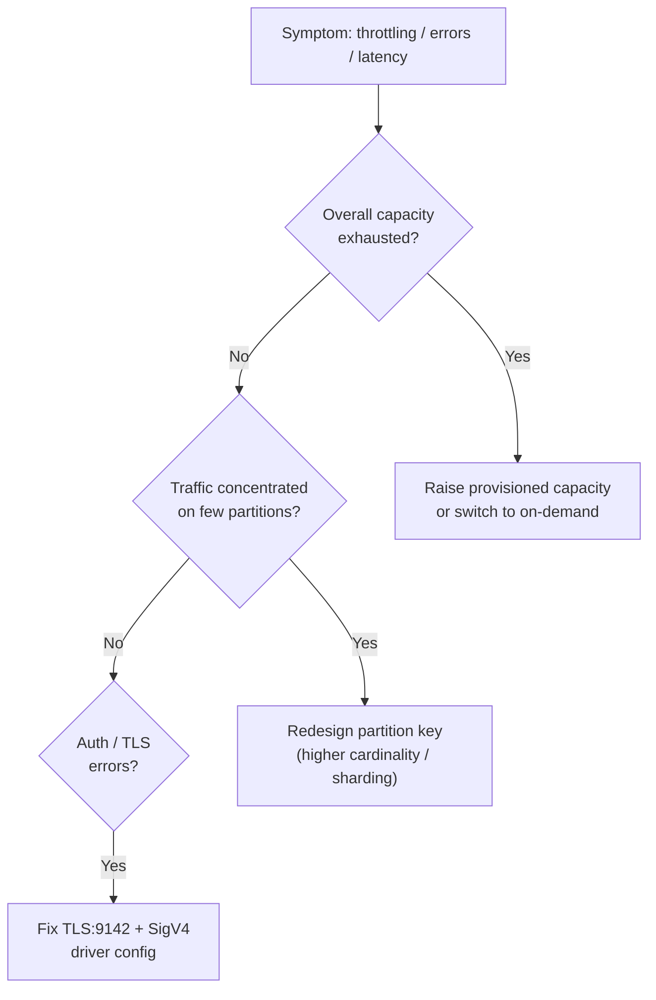

# Keyspaces Troubleshooting (SRE) - SAA-C03 Deep Dive

> An SRE-oriented runbook for Amazon Keyspaces — diagnosing throttling (under-provisioned RRU/WRU and hot partitions), partition-key skew, large-partition limits, capacity-mode tuning, connection/driver TLS+SigV4 issues, consistency-level behavior, and PITR/restore operations.

See also: [01 - Keyspaces Intro & Core Concepts](01%20-%20Keyspaces%20Intro%20%26%20Core%20Concepts.md) · [02 - Keyspaces Architecture Deep Dive](02%20-%20Keyspaces%20Architecture%20Deep%20Dive.md) · [03 - Keyspaces Best Practices & Examples](03%20-%20Keyspaces%20Best%20Practices%20%26%20Examples.md) · [04 - Keyspaces Scenario Questions](04%20-%20Keyspaces%20Scenario%20Questions.md) · [06 - Keyspaces Important Facts & Cheat Sheet](06%20-%20Keyspaces%20Important%20Facts%20%26%20Cheat%20Sheet.md) · [00 - Databases Overview & Exam Guide](00%20-%20Databases%20Overview%20%26%20Exam%20Guide.md) · [01 - DynamoDB Intro & Core Concepts](01%20-%20DynamoDB%20Intro%20%26%20Core%20Concepts.md)

---

## Table of Contents

- [Throttling - Under-Provisioned Capacity](#throttling---under-provisioned-capacity)
- [Throttling - Hot Partitions and Key Skew](#throttling---hot-partitions-and-key-skew)
- [Large-Partition and Item-Size Limits](#large-partition-and-item-size-limits)
- [Capacity-Mode Tuning](#capacity-mode-tuning)
- [Connection, TLS, and Driver Issues](#connection-tls-and-driver-issues)
- [Consistency-Level Behavior](#consistency-level-behavior)
- [PITR and Restore Operations](#pitr-and-restore-operations)

---

---

## Throttling - Under-Provisioned Capacity

**Symptom:** `Read/Write throttling` errors (Cassandra `WriteTimeout`/`ReadTimeout` or capacity-exceeded errors); rising `ThrottledRequests` / `PerConnectionRequestRateExceeded` in CloudWatch.

**Diagnosis (SRE):**

- Check **provisioned RCU/WCU** vs consumed in CloudWatch; sustained consumption near the ceiling indicates under-provisioning.
- Confirm whether **auto scaling** is enabled and whether it is reacting fast enough to spikes.

**Remediation:**

- Increase provisioned capacity, or **enable/ tune auto scaling** (target utilization, min/max).
- For unpredictable bursts, **switch to on-demand** so capacity tracks traffic automatically.

> [!tip] Exam Tip
> Throttling with high _overall_ utilization → raise capacity / enable auto scaling / go on-demand. Throttling with _low_ overall utilization → suspect a hot partition (next section).

[⬆ Back to top](#table-of-contents)

---

## Throttling - Hot Partitions and Key Skew

**Symptom:** Throttling on specific operations even though **aggregate capacity is far from exhausted**; latency spikes for one entity/key.

**Diagnosis (SRE):**

- Identify whether traffic concentrates on a **few partition-key values** (e.g., a single device, a `status='ACTIVE'` key, or a sequential/timestamp partition key).
- This is **partition-key skew** — a single partition has a per-partition throughput ceiling.

**Remediation:**

- **Redesign the partition key** for higher cardinality.
- Apply **write sharding**: append a bucket/suffix (`device_id#bucket`) and read across shards.
- For time-series, **bucket by time window** so one partition does not absorb all writes.

> [!tip] Exam Tip
> "Throttling despite low total utilization" = **hot partition**. The exam-correct fix is **partition-key redesign / write sharding**, not merely adding capacity.

[⬆ Back to top](#table-of-contents)

---

## Large-Partition and Item-Size Limits

**Symptom:** Errors or degraded performance on writes/reads for very large rows or unbounded partitions.

**Key limits to remember:**

| Limit                   | Value                                                         |
| :---------------------- | :------------------------------------------------------------ |
| Max **row (item) size** | **1 MB**                                                      |
| Write metering          | 1 WCU/WRU per **1 KB**                                        |
| Read metering           | 1 RCU/RRU per **4 KB** (`LOCAL_QUORUM`); half for `LOCAL_ONE` |
| Partition growth        | **Bound it** — avoid ever-growing partitions                  |

**Remediation:**

- Keep rows under **1 MB**; offload large blobs to **S3** and store a reference.
- **Bucket partitions** (by time/range) to keep them bounded and queries efficient.

> [!tip] Exam Tip
> Max row size is **1 MB**. Large objects belong in **S3** with a pointer stored in Keyspaces — the same pattern used with DynamoDB.

[⬆ Back to top](#table-of-contents)

---

## Capacity-Mode Tuning

**Symptom:** Either frequent throttling (under-provisioned) or high cost (over-provisioned).

**Remediation:**

- **On-demand**: best for spiky/unknown traffic; no tuning, pay per request.
- **Provisioned + auto scaling**: best for steady/predictable traffic; set target utilization and sensible min/max to balance cost and headroom.
- Switch modes during planned windows (mode changes are rate-limited).
- Use **`LOCAL_ONE` reads** where eventual consistency is acceptable to halve read cost/units.

> [!tip] Exam Tip
> Match mode to traffic shape: spiky → on-demand; steady → provisioned + auto scaling. Always enable auto scaling in provisioned mode.

[⬆ Back to top](#table-of-contents)

---

## Connection, TLS, and Driver Issues

**Symptom:** Cannot connect; `SSL/TLS handshake` failures; `authentication`/`Unauthorized` errors.

**Diagnosis & remediation (SRE):**

- Confirm clients connect on **port 9142 with TLS enabled** and trust the Starfield/Amazon CA certificate.
- Verify the driver uses the **SigV4 authentication plugin** (IAM) or valid **service-specific credentials**.
- Check the **IAM policy** grants the needed Keyspaces actions on the target keyspace/table.
- For private connectivity, confirm the **VPC interface endpoint**, **security groups**, and DNS resolution are correct.
- Watch **per-connection request-rate** limits — open enough connections / use driver connection pooling for high throughput.

> [!tip] Exam Tip
> Keyspaces requires **TLS (9142) + SigV4 (or service-specific credentials)**. Plain unencrypted Cassandra connections will fail — a common migration gotcha.

[⬆ Back to top](#table-of-contents)

---

## Consistency-Level Behavior

**Symptom:** Reads return stale data, or higher-than-expected read cost.

**Diagnosis:**

- Keyspaces supports **`LOCAL_QUORUM`** (strong, default for reads/writes that need consistency) and **`LOCAL_ONE`** (eventually consistent reads).
- `LOCAL_ONE` reads may return slightly stale data but cost **half** the read units.
- Writes use `LOCAL_QUORUM` durability across the 3 AZ copies.

**Remediation:**

- Use `LOCAL_QUORUM` when reads must reflect the latest write; use `LOCAL_ONE` to cut cost where staleness is acceptable.

> [!tip] Exam Tip
> Stale reads + `LOCAL_ONE` configured → expected behavior; switch to `LOCAL_QUORUM` for strong reads. Cost optimization for read-heavy, staleness-tolerant workloads → `LOCAL_ONE`.

[⬆ Back to top](#table-of-contents)

---

## PITR and Restore Operations

**Symptom:** Need to recover from accidental/malicious data changes.

**Diagnosis & remediation (SRE):**

- Confirm **PITR is enabled** on the table (it is off by default) — without it there is no point-in-time restore.
- Restore to a timestamp within the **35-day** window; the restore produces a **new table**.
- Plan **application cutover** to the restored table (or rename/swap) and validate data before redirecting traffic.
- Tighten **IAM** to prevent recurrence of the destructive action.

> [!tip] Exam Tip
> PITR must be **enabled in advance** and restores to a **new table** within **35 days** — there is no in-place rollback. Replication (AZ or Region) is not a substitute for PITR against logical data loss.

[⬆ Back to top](#table-of-contents)
