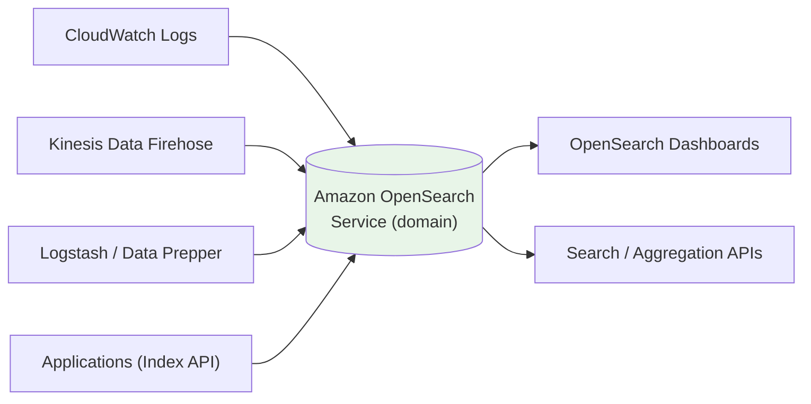

# Amazon OpenSearch Service - SAA-C03 Deep Dive

> Amazon OpenSearch Service is the AWS-managed **search and analytics** engine (forked from Elasticsearch/Kibana) used for full-text search, log analytics, observability, and ML-powered search, with **OpenSearch Dashboards** for visualization.

See also: [02 - OpenSearch Architecture Deep Dive](02%20-%20OpenSearch%20Architecture%20Deep%20Dive.md) · [03 - OpenSearch Best Practices & Examples](03%20-%20OpenSearch%20Best%20Practices%20%26%20Examples.md) · [04 - OpenSearch Scenario Questions](04%20-%20OpenSearch%20Scenario%20Questions.md) · [05 - OpenSearch Troubleshooting (SRE)](05%20-%20OpenSearch%20Troubleshooting%20%28SRE%29.md) · [06 - OpenSearch Important Facts & Cheat Sheet](06%20-%20OpenSearch%20Important%20Facts%20%26%20Cheat%20Sheet.md) · [00 - Databases Overview & Exam Guide](00%20-%20Databases%20Overview%20%26%20Exam%20Guide.md)

---

## Table of Contents

- [What Is Amazon OpenSearch Service](#what-is-amazon-opensearch-service)
- [The Elasticsearch Lineage](#the-elasticsearch-lineage)
- [Common Use Cases](#common-use-cases)
- [Instance-Based vs Serverless](#instance-based-vs-serverless)
- [OpenSearch Dashboards](#opensearch-dashboards)
- [Core Vocabulary](#core-vocabulary)
- [When to Choose OpenSearch](#when-to-choose-opensearch)
- [Summary: Key Takeaways](#summary-key-takeaways)

---

---

## What Is Amazon OpenSearch Service

Amazon OpenSearch Service is a **fully managed** service that makes it easy to deploy, operate, and scale OpenSearch clusters in AWS. OpenSearch is a distributed **search and analytics** engine: you write JSON **documents** into **indices**, and the engine builds an **inverted index** so you can run fast full-text queries, filters, and **aggregations** (analytics) over huge volumes of data in near real time.

AWS handles the heavy operational lifting: provisioning, patching, failure recovery, snapshots/backups, node replacement, and scaling. You define a **domain** (the managed cluster) and AWS runs the rest.

> **Exam Tip:** OpenSearch is a **search/analytics** engine, not a transactional database. If a scenario needs **full-text search**, **log/observability analytics**, or **near-real-time dashboards over logs**, OpenSearch is the answer — not RDS, DynamoDB, or Redshift.

[⬆ Back to top](#table-of-contents)

---

## The Elasticsearch Lineage

OpenSearch is an **open-source project derived from Elasticsearch and Kibana** (forked from the Apache 2.0-licensed Elasticsearch 7.10 / Kibana 7.10). The forks were renamed **OpenSearch** (engine) and **OpenSearch Dashboards** (visualization).

The AWS service itself was **formerly called "Amazon Elasticsearch Service"** and was renamed **Amazon OpenSearch Service** in 2021. Legacy Elasticsearch engine versions (e.g. Elasticsearch 7.10) are still supported for compatibility, but new work targets the OpenSearch engine line.

| Old Name                     | New Name                      |
| :--------------------------- | :---------------------------- |
| Amazon Elasticsearch Service | **Amazon OpenSearch Service** |
| Elasticsearch (engine)       | **OpenSearch**                |
| Kibana (visualization)       | **OpenSearch Dashboards**     |

> **Exam Tip:** If you see **"Amazon Elasticsearch Service"** or **"Kibana"** in a question, mentally map them to **OpenSearch** and **OpenSearch Dashboards** — same service, renamed.

> **Trap:** OpenSearch is **not** the same as Amazon CloudSearch (an older, separate managed search service). Modern exam answers favor **OpenSearch**.

[⬆ Back to top](#table-of-contents)

---

## Common Use Cases

| Use Case                       | Why OpenSearch                                                                                           |
| :----------------------------- | :------------------------------------------------------------------------------------------------------- |
| **Full-text search**           | Inverted index, relevance scoring, fuzzy/typo-tolerant search for product catalogs, document/site search |
| **Log analytics**              | Ingest application/system logs, query and aggregate them at scale (centralized logging)                  |
| **Observability**              | Metrics, traces, and logs in one place; dashboards + alerting on operational data                        |
| **Ingestion/search pipelines** | OpenSearch Ingestion (Data Prepper-based) and Firehose pipelines to filter, transform, and load data     |
| **ML-powered search**          | Vector search / k-NN, semantic search, anomaly detection, and recommendations                            |
| **SIEM / security analytics**  | Centralize and search security logs for threat detection                                                 |

[⬆ Back to top](#table-of-contents)

---

## Instance-Based vs Serverless

OpenSearch Service offers two deployment models:

| Aspect               | Instance-Based (Managed Cluster / Domain)          | OpenSearch Serverless                              |
| :------------------- | :------------------------------------------------- | :------------------------------------------------- |
| **You manage**       | Instance types, node counts, shards, storage tiers | Nothing — AWS auto-scales capacity                 |
| **Capacity unit**    | EC2-style search instances (data + manager nodes)  | **OCUs** (OpenSearch Compute Units)                |
| **Scaling**          | Manual / scheduled; blue/green for config changes  | Automatic, on demand                               |
| **Best for**         | Steady-state, cost-predictable, full control       | Spiky/intermittent workloads, no capacity planning |
| **Collection types** | n/a                                                | Time series (logs), Search, Vector search          |

> **Exam Tip:** **Serverless** = no capacity planning, pay for OCUs, ideal for **unpredictable/intermittent** traffic. **Instance-based** = you size and tune the cluster, better for steady, cost-optimized workloads and when you need storage tiers like UltraWarm/cold.

[⬆ Back to top](#table-of-contents)

---

## OpenSearch Dashboards

**OpenSearch Dashboards** (the Kibana-derived UI) ships with every domain. It provides:

- Interactive **visualizations** and dashboards over your indices
- **Discover** for ad-hoc search/exploration
- **Dev Tools** console for running queries
- **Alerting**, anomaly detection, and index management UIs

Dashboard sign-in supports **SAML** (federate with your IdP) or **Amazon Cognito** (user pools + identity pools). See [02 - OpenSearch Architecture Deep Dive](02%20-%20OpenSearch%20Architecture%20Deep%20Dive.md) for the security model.

> **Exam Tip:** To control **who can log into the dashboard**, the two managed options are **Amazon Cognito** and **SAML**.

[⬆ Back to top](#table-of-contents)

---

## Core Vocabulary

| Term         | Meaning                                                                        |
| :----------- | :----------------------------------------------------------------------------- |
| **Domain**   | The managed OpenSearch cluster (the unit you create/configure)                 |
| **Index**    | A collection of related documents (like a "table")                             |
| **Document** | A single JSON record stored in an index                                        |
| **Shard**    | A horizontal partition of an index; **primary** + **replica** shards           |
| **Node**     | An instance in the cluster: **data node** or **cluster manager (master) node** |
| **Snapshot** | A backup of indices stored in S3 (automated + manual)                          |

[⬆ Back to top](#table-of-contents)

---

## When to Choose OpenSearch

| Need                                                        | Best Service                  |
| :---------------------------------------------------------- | :---------------------------- |
| **Full-text / relevance search, log analytics, dashboards** | **Amazon OpenSearch Service** |
| Petabyte-scale **structured SQL analytics (OLAP)**          | Amazon Redshift               |
| **Serverless SQL queries over S3** (ad-hoc, no infra)       | Amazon Athena                 |
| Simple **log search/queries within CloudWatch**             | CloudWatch Logs Insights      |
| Transactional **OLTP** relational workload                  | Amazon RDS / Aurora           |

> **Exam Tip:** **Full-text search + relevance ranking** is the strongest OpenSearch signal. **Long-term cheap log queries on S3** lean Athena; **dashboards/observability on live logs** lean OpenSearch.

[⬆ Back to top](#table-of-contents)

---

## Summary: Key Takeaways

- Amazon OpenSearch Service = **managed search & analytics** engine, **formerly Amazon Elasticsearch Service**.
- OpenSearch & OpenSearch Dashboards are **open-source forks of Elasticsearch & Kibana**.
- Use cases: **full-text search, log analytics, observability, ingestion pipelines, ML/vector search**.
- Two models: **instance-based (domain)** vs **Serverless (OCUs)**.
- **Dashboards** = visualization; auth via **Cognito or SAML**.
- Pick OpenSearch for **search & live log analytics**; Redshift for OLAP, Athena for S3 SQL, CloudWatch Logs Insights for in-CW queries.

[⬆ Back to top](#table-of-contents)
