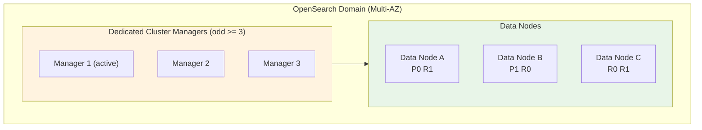

# Amazon OpenSearch Architecture - SAA-C03 Deep Dive

> Inside an OpenSearch domain: dedicated **cluster-manager** vs **data** nodes, primary/replica **shards**, **Multi-AZ with Standby**, the **hot / UltraWarm / cold** storage tiers, **VPC vs public** access, security, **blue/green** config changes, and snapshots.

See also: [01 - OpenSearch Intro & Core Concepts](01%20-%20OpenSearch%20Intro%20%26%20Core%20Concepts.md) · [03 - OpenSearch Best Practices & Examples](03%20-%20OpenSearch%20Best%20Practices%20%26%20Examples.md) · [04 - OpenSearch Scenario Questions](04%20-%20OpenSearch%20Scenario%20Questions.md) · [05 - OpenSearch Troubleshooting (SRE)](05%20-%20OpenSearch%20Troubleshooting%20%28SRE%29.md) · [06 - OpenSearch Important Facts & Cheat Sheet](06%20-%20OpenSearch%20Important%20Facts%20%26%20Cheat%20Sheet.md) · [00 - Databases Overview & Exam Guide](00%20-%20Databases%20Overview%20%26%20Exam%20Guide.md)

---

## Table of Contents

- [The Domain](#the-domain)
- [Cluster-Manager vs Data Nodes](#cluster-manager-vs-data-nodes)
- [Shards and Replicas](#shards-and-replicas)
- [Multi-AZ with Standby](#multi-az-with-standby)
- [Storage Tiers: Hot, UltraWarm, Cold](#storage-tiers-hot-ultrawarm-cold)
- [Storage Volumes: EBS vs Instance Store](#storage-volumes-ebs-vs-instance-store)
- [Networking: VPC vs Public](#networking-vpc-vs-public)
- [Security Model](#security-model)
- [Blue/Green Configuration Changes](#bluegreen-configuration-changes)
- [Snapshots and Backups](#snapshots-and-backups)
- [Summary: Key Takeaways](#summary-key-takeaways)

---

---

## The Domain

A **domain** is the OpenSearch Service equivalent of a cluster plus all of its configuration: engine version, instance types and counts, storage, network (VPC/public), encryption, access policy, and dashboard auth. Everything you provision and tune lives under the domain.

A domain can be **single-node** (dev/test) or **multi-node** (production). You scale a domain by adding/changing nodes and storage, which AWS rolls out as a **blue/green deployment** (see below).

[⬆ Back to top](#table-of-contents)

---

## Cluster-Manager vs Data Nodes

OpenSearch separates two node roles:

| Role                              | Responsibility                                                                                                                    |
| :-------------------------------- | :-------------------------------------------------------------------------------------------------------------------------------- |
| **Cluster manager (master) node** | Cluster-wide state: track nodes, create/delete indices, allocate shards, elect a leader. Does **not** serve search/index traffic. |
| **Data node**                     | Stores shards, executes indexing and search/aggregation requests. CPU/RAM/storage scale here.                                     |

**Dedicated cluster manager nodes** are separate instances that do _only_ the management role. They are **optional for dev** (a data node can assume the role) but **strongly recommended for production** so heavy data traffic never starves cluster management and destabilizes the cluster.

**Sizing rule (memorize):** use an **odd number of dedicated cluster-manager nodes, minimum 3** so a quorum can be maintained and **split-brain** is avoided. With 3 managers, the cluster tolerates the loss of 1; quorum = `floor(n/2)+1`.

The recommended **manager instance type scales with the data-node count** — e.g. `m5.large.search` / `m6g.large.search` (Graviton) for roughly **1–10 data nodes**, scaling to larger types as data-node count grows.

> **Exam Tip:** "Production stability / avoid split-brain" → **3 dedicated cluster-manager nodes (odd, minimum 3)**. Never use 2 (no tie-break) and avoid even numbers.

[⬆ Back to top](#table-of-contents)

---

## Shards and Replicas

An index is split into **shards** for horizontal scale:

- **Primary shard** — holds an original portion of the index data; set at index creation.
- **Replica shard** — a copy of a primary on a _different_ node, providing **HA** and extra **read** throughput.

Replicas let the cluster survive a node failure (a replica is promoted to primary). Shards are distributed across data nodes (and AZs) by the cluster manager.

> **Trap:** **Primary shard count is fixed at index creation** — you cannot change it without **reindexing**. Replica count _can_ be changed any time. Too many tiny shards wastes overhead; too few huge shards hurt parallelism (target ~10–50 GB per shard).

[⬆ Back to top](#table-of-contents)

---

## Multi-AZ with Standby

OpenSearch supports **Multi-AZ deployments** to spread nodes across 2 or 3 Availability Zones. The modern option is **Multi-AZ with Standby**:

- Deploys across **3 AZs**; one AZ acts as a **standby** that does not take active traffic.
- AWS enforces best-practice topology (replicas, dedicated managers, even shard distribution).
- On an AZ failure, OpenSearch **fails over to the standby** with consistent performance and **no data loss** (RPO targeted at zero).

> **Exam Tip:** **Multi-AZ with Standby** = highest resilience, predictable failover, enforced best practices. Choose it when the scenario stresses **consistent performance during AZ failure** and **simplified HA**.

[⬆ Back to top](#table-of-contents)

---

## Storage Tiers: Hot, UltraWarm, Cold

To cost-optimize time-series/log data, OpenSearch offers three tiers:

| Tier          | Backing                                  | Latency                              | Use Case                                      |
| :------------ | :--------------------------------------- | :----------------------------------- | :-------------------------------------------- |
| **Hot**       | Data-node EBS / instance store           | Fastest, read+write                  | Active indexing and frequent queries          |
| **UltraWarm** | **S3 + local cache** on UltraWarm nodes  | Slower, read-only                    | Older logs queried occasionally; large, cheap |
| **Cold**      | **S3** (detached, not attached to nodes) | Must be reattached/queried on demand | Rarely accessed archives, lowest cost         |

Data flows **Hot → UltraWarm → Cold** as it ages (via Index State Management). UltraWarm and cold indices are **read-only**.

> **Exam Tip:** "Cheaply retain old logs but still searchable" → **UltraWarm**. "Rarely accessed, lowest cost, occasionally need it back" → **Cold storage**. Both are **S3-backed**.

[⬆ Back to top](#table-of-contents)

---

## Storage Volumes: EBS vs Instance Store

Hot-tier data nodes use either:

- **EBS volumes** — most instance types; you choose the volume type (e.g. gp3/gp2) and size, and can **grow EBS** on a live domain (blue/green).
- **Instance store (NVMe SSD)** — certain instance families (e.g. `i3`, `r6gd`) bundle local NVMe for high IOPS; storage is fixed by instance type.

> **Trap:** Available **volume types depend on the chosen instance type**. Instance-store families give high performance but you cannot independently resize storage — you change the instance type instead.

[⬆ Back to top](#table-of-contents)

---

## Networking: VPC vs Public

A domain is created with **one** access mode (cannot be switched later without recreating):

| Mode              | Characteristics                                                                                                                                             |
| :---------------- | :---------------------------------------------------------------------------------------------------------------------------------------------------------- |
| **VPC access**    | Endpoint lives in your VPC subnets; controlled by **security groups** and **IAM**; not reachable from the internet. Most secure — preferred for production. |
| **Public access** | Internet-reachable endpoint; you must lock it down with a resource-based **access policy** (and fine-grained access control).                               |

VPC domains place an ENI in subnets you select; for Multi-AZ choose **one subnet per AZ**.

> **Exam Tip:** "Must not be exposed to the internet / private only" → **VPC access**. You **cannot toggle** public↔VPC after creation — pick correctly up front.

[⬆ Back to top](#table-of-contents)

---

## Security Model

| Layer                     | Mechanism                                                                                            |
| :------------------------ | :--------------------------------------------------------------------------------------------------- |
| **Network**               | VPC + security groups, or public + resource access policy                                            |
| **Authentication (API)**  | IAM (SigV4-signed requests)                                                                          |
| **Authorization**         | IAM policies + **Fine-Grained Access Control (FGAC)** — index/document/field-level + dashboard roles |
| **Dashboard sign-in**     | **SAML** or **Amazon Cognito**                                                                       |
| **Encryption at rest**    | **AWS KMS**                                                                                          |
| **Encryption in transit** | **TLS** for client traffic + **node-to-node encryption**                                             |

**Fine-Grained Access Control (FGAC)** is the OpenSearch internal security layer: it provides an internal user database (or maps IAM/SAML identities to roles) and enforces **index-, document-, and field-level** permissions. FGAC requires encryption at rest, node-to-node encryption, and HTTPS enforced.

> **Exam Tip:** "Restrict which users see which indices/fields" → **Fine-Grained Access Control**. "Encrypt cluster data with customer-managed keys" → **KMS at rest**. "Secure traffic between nodes" → **node-to-node encryption**.

[⬆ Back to top](#table-of-contents)

---

## Blue/Green Configuration Changes

Most domain configuration changes — **growing EBS, changing instance type, changing engine version, enabling node-to-node encryption, changing manager count** — are applied via a **blue/green deployment**:

1. AWS provisions a **new (green) environment** alongside the existing (blue).
2. Data is migrated/replicated to the green environment.
3. Traffic cuts over; the old environment is retired.

The domain stays available, but the migration consumes extra resources and can take time. **Schedule these during off-peak hours.**

> **Trap:** Some changes (e.g. scaling, version upgrade) **temporarily double** the effective node footprint during blue/green. If the domain is already near capacity, a config change can fail or stall — leave headroom and do it off-peak.

[⬆ Back to top](#table-of-contents)

---

## Snapshots and Backups

OpenSearch backs up index data with **snapshots stored in Amazon S3**:

- **Automated snapshots** — taken on a schedule, used for cluster recovery; retained per domain settings (default hourly for recent OpenSearch versions).
- **Manual snapshots** — you trigger to your own registered S3 repository; useful for **cross-region/cross-account migration** and long-term retention.

Restoring a snapshot recreates indices into the (same or another) domain.

> **Exam Tip:** "Migrate a domain to another Region/account" or "long-term retention beyond automated retention" → **manual snapshots to S3**.

[⬆ Back to top](#table-of-contents)

---

## Summary: Key Takeaways

- A **domain** = the managed cluster + config; changes roll out via **blue/green** (do off-peak).
- **Cluster-manager** nodes manage state; **data** nodes serve traffic. Use **odd ≥ 3 dedicated managers** in prod (avoid split-brain).
- Indices split into **primary + replica shards**; primaries are fixed at creation.
- **Multi-AZ with Standby** = best resilience with consistent failover.
- Storage tiers: **Hot → UltraWarm (S3+cache) → Cold (S3)** for cost-tiering aging logs.
- **VPC** (private) vs **public** access — chosen at creation, not switchable.
- Security: **KMS** at rest, **TLS + node-to-node** in transit, **FGAC** for granular auth, **SAML/Cognito** for dashboards.
- **Snapshots to S3**: automated (recovery) + manual (migration/long-term).

[⬆ Back to top](#table-of-contents)
