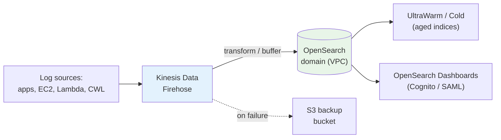

# Amazon OpenSearch Best Practices - SAA-C03 Deep Dive

> Production-grade patterns: **odd ≥ 3 dedicated managers**, right-sized shards/indices, **UltraWarm** for log retention, **VPC + fine-grained access**, **off-peak blue/green** changes, a sound snapshot strategy, and a **Firehose log-analytics pipeline**.

See also: [01 - OpenSearch Intro & Core Concepts](01%20-%20OpenSearch%20Intro%20%26%20Core%20Concepts.md) · [02 - OpenSearch Architecture Deep Dive](02%20-%20OpenSearch%20Architecture%20Deep%20Dive.md) · [04 - OpenSearch Scenario Questions](04%20-%20OpenSearch%20Scenario%20Questions.md) · [05 - OpenSearch Troubleshooting (SRE)](05%20-%20OpenSearch%20Troubleshooting%20%28SRE%29.md) · [06 - OpenSearch Important Facts & Cheat Sheet](06%20-%20OpenSearch%20Important%20Facts%20%26%20Cheat%20Sheet.md) · [00 - Databases Overview & Exam Guide](00%20-%20Databases%20Overview%20%26%20Exam%20Guide.md)

---

## Table of Contents

- [Dedicated Master Nodes: Odd and at Least 3](#dedicated-master-nodes-odd-and-at-least-3)
- [Master Instance Sizing](#master-instance-sizing)
- [Shard and Index Sizing](#shard-and-index-sizing)
- [UltraWarm and Cold for Log Retention](#ultrawarm-and-cold-for-log-retention)
- [VPC Plus Fine-Grained Access Control](#vpc-plus-fine-grained-access-control)
- [Off-Peak Blue/Green Changes](#off-peak-bluegreen-changes)
- [Snapshot Strategy](#snapshot-strategy)
- [Ingestion via Kinesis Data Firehose](#ingestion-via-kinesis-data-firehose)
- [Summary: Key Takeaways](#summary-key-takeaways)

---



---

## Dedicated Master Nodes: Odd and at Least 3

For any production domain, provision **dedicated cluster-manager (master) nodes** so cluster management is isolated from data traffic. Always use an **odd number, minimum 3**:

- **3 managers** tolerate the loss of 1 while keeping a quorum (`floor(3/2)+1 = 2`).
- **Odd counts** ensure a tie-break and prevent **split-brain**.
- **Never use 2** (loss of either breaks quorum) and avoid even counts (e.g. 4 gives the same fault tolerance as 3 but costs more).

> **Exam Tip:** The canonical answer for production stability is **3 dedicated master nodes**. If asked to scale further, the next odd number used is **5** (rarely needed).

[⬆ Back to top](#table-of-contents)

---

## Master Instance Sizing

Dedicated managers do not serve data, but they must hold cluster state for all shards/indices, so the **manager instance type scales with data-node count**:

| Data Nodes  | Suggested Manager Type                            |
| :---------- | :------------------------------------------------ |
| **1 – 10**  | `m5.large.search` / `m6g.large.search` (Graviton) |
| **11 – 30** | `c5.xlarge.search` / `m6g.xlarge.search`          |
| **31 – 75** | `c5.2xlarge.search` / larger                      |
| **76+**     | `r5.xlarge.search`+ (more memory for state)       |

> **Exam Tip:** Symptoms of **undersized managers** = cluster instability, frequent leader re-elections, slow index operations. Fix by sizing managers to the **data-node count**, not the data volume.

[⬆ Back to top](#table-of-contents)

---

## Shard and Index Sizing

- Target **~10–50 GB per shard** (logs often ~30–50 GB; search often smaller).
- Keep shards per node proportional to heap: aim for **≤ ~25 shards per GB of JVM heap** on a node.
- For time-series/logs, use **rollover / time-based indices** (e.g. one index per day) instead of one giant index — easier to delete, tier, and reshard.
- Remember: **primary shard count is fixed at index creation**; plan it up front or **reindex** later.

> **Trap:** "Oversharding" (thousands of tiny shards) causes high overhead and JVM memory pressure. Fewer, well-sized shards beat many tiny ones.

[⬆ Back to top](#table-of-contents)

---

## UltraWarm and Cold for Log Retention

Use **Index State Management (ISM)** policies to age data automatically and slash cost:

1. **Hot** — recent indices (active writes + frequent queries) on data-node storage.
2. **UltraWarm** — after N days, migrate read-only indices to **S3-backed UltraWarm** (large, cheap, still searchable).
3. **Cold** — after M days, move to **cold storage (detached S3)** for archival; reattach to query.
4. **Delete** — after the retention window expires.

> **Exam Tip:** "Keep 18 months of logs searchable but cut cost" → **hot for recent + UltraWarm for older + cold for archive**, automated with **ISM**. UltraWarm/cold are read-only.

[⬆ Back to top](#table-of-contents)

---

## VPC Plus Fine-Grained Access Control

For production, combine network and identity controls:

- **VPC access** — keep the endpoint private; control reachability with **security groups**.
- **Fine-Grained Access Control (FGAC)** — index/document/field-level permissions and dashboard roles; map **IAM** or **SAML** identities to OpenSearch roles.
- **Encryption** — KMS at rest, TLS + node-to-node in transit (FGAC requires these).
- **Dashboard auth** — **Cognito** (user pools) or **SAML** (enterprise IdP).

```bash
# Enable fine-grained access control with an internal master user (snippet)
aws opensearch create-domain \
  --domain-name prod-logs \
  --engine-version OpenSearch_2.13 \
  --cluster-config InstanceType=r6g.large.search,InstanceCount=3,DedicatedMasterEnabled=true,DedicatedMasterType=m6g.large.search,DedicatedMasterCount=3,ZoneAwarenessEnabled=true \
  --node-to-node-encryption-options Enabled=true \
  --encryption-at-rest-options Enabled=true \
  --domain-endpoint-options EnforceHTTPS=true \
  --advanced-security-options Enabled=true,InternalUserDatabaseEnabled=true,MasterUserOptions='{MasterUserName=admin,MasterUserPassword=<StrongPassw0rd!>}' \
  --vpc-options SubnetIds=subnet-aaa,subnet-bbb,subnet-ccc,SecurityGroupIds=sg-123
```

> **Exam Tip:** "Private, encrypted, per-user index access" → **VPC + KMS + node-to-node encryption + FGAC**. All four show up together in security-hardening questions.

[⬆ Back to top](#table-of-contents)

---

## Off-Peak Blue/Green Changes

Config changes (grow EBS, change instance type, version upgrade, enable encryption, change manager count) trigger a **blue/green deployment** that temporarily uses extra capacity:

- **Schedule during off-peak** to absorb the migration overhead.
- **Leave headroom** — a near-full domain may fail/stall a blue/green change.
- **Batch** related changes so you pay the blue/green cost once.
- Take a **manual snapshot** before risky changes (e.g. major version upgrades).

> **Exam Tip:** "Resize/upgrade with minimal user impact" → **blue/green during off-peak with capacity headroom**. The domain stays online throughout.

[⬆ Back to top](#table-of-contents)

---

## Snapshot Strategy

- Rely on **automated snapshots to S3** for routine recovery.
- Take **manual snapshots** before major upgrades and for **cross-Region / cross-account migration** and long-term retention.
- Restore manual snapshots into a **new domain** to clone or migrate.
- Combine with **UltraWarm/cold** so backups stay small (cold data lives in S3 already).

[⬆ Back to top](#table-of-contents)

---

## Ingestion via Kinesis Data Firehose

For centralized log analytics, **Kinesis Data Firehose** is the go-to managed ingestion path:

- **Fully managed, serverless** — no consumer to run; buffers, optionally **transforms (Lambda)**, and delivers to OpenSearch.
- **Built-in S3 backup** for failed/all records (durability and replay).
- Other paths: **CloudWatch Logs subscription**, **OpenSearch Ingestion (Data Prepper)**, **Logstash**.

> **Exam Tip:** "Stream and load logs into OpenSearch with no servers to manage" → **Kinesis Data Firehose** (with S3 backup). For OTel/trace-style pipelines with transformation, **OpenSearch Ingestion (Data Prepper)**.

[⬆ Back to top](#table-of-contents)

---

## Summary: Key Takeaways

- **3 dedicated master nodes (odd ≥ 3)** for production; size managers to **data-node count**.
- Target **~10–50 GB shards**, use **time-based indices**, plan primaries up front.
- **ISM** to age data **Hot → UltraWarm → Cold → delete** for cheap log retention.
- Production security = **VPC + KMS + node-to-node TLS + FGAC**, dashboards via **Cognito/SAML**.
- Make config changes via **off-peak blue/green** with capacity headroom.
- **Automated snapshots** for recovery, **manual snapshots** for migration/retention.
- **Kinesis Data Firehose** = serverless ingestion with S3 backup.

[⬆ Back to top](#table-of-contents)
