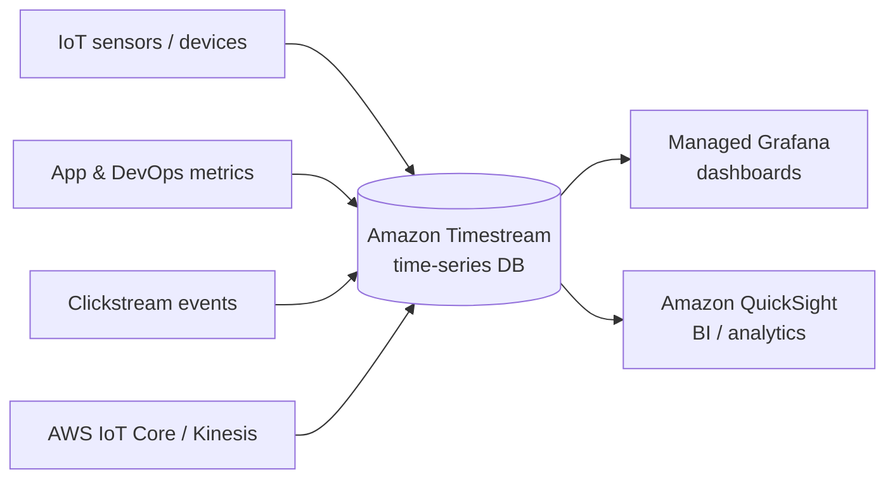

# Amazon Timestream Intro & Core Concepts - SAA-C03 Deep Dive

> Amazon Timestream is a fully managed, serverless time-series database built for IoT, application/DevOps metrics, and sensor/clickstream data at massive scale — up to 1/10th the cost and 1000x faster than relational databases for time-series queries.

See also: [02 - Timestream Architecture Deep Dive](02%20-%20Timestream%20Architecture%20Deep%20Dive.md) · [03 - Timestream Best Practices & Examples](03%20-%20Timestream%20Best%20Practices%20%26%20Examples.md) · [04 - Timestream Scenario Questions](04%20-%20Timestream%20Scenario%20Questions.md) · [05 - Timestream Troubleshooting (SRE)](05%20-%20Timestream%20Troubleshooting%20%28SRE%29.md) · [06 - Timestream Important Facts & Cheat Sheet](06%20-%20Timestream%20Important%20Facts%20%26%20Cheat%20Sheet.md) · [00 - Databases Overview & Exam Guide](00%20-%20Databases%20Overview%20%26%20Exam%20Guide.md)

---

## Table of Contents

- [What Is Amazon Timestream](#what-is-amazon-timestream)
- [Why Time-Series Needs a Purpose-Built Database](#why-time-series-needs-a-purpose-built-database)
- [Serverless and Fully Managed](#serverless-and-fully-managed)
- [Performance and Cost Claims](#performance-and-cost-claims)
- [Built-in Time-Series Analytics](#built-in-time-series-analytics)
- [The Two Flavors LiveAnalytics vs InfluxDB](#the-two-flavors-liveanalytics-vs-influxdb)
- [Core Concepts and Vocabulary](#core-concepts-and-vocabulary)
- [When to Choose Timestream](#when-to-choose-timestream)
- [Exam Tips and Traps](#exam-tips-and-traps)

---

---

## What Is Amazon Timestream

Amazon Timestream is a **fully managed, serverless time-series database**. Time-series data is a sequence of data points indexed by time — each measurement is recorded with a timestamp. Timestream is purpose-built to **ingest, store, and analyze** this data efficiently.

Typical workloads:

- **IoT telemetry** — sensor readings (temperature, pressure, GPS) from millions of devices.
- **Application / DevOps metrics** — CPU, memory, request latency, error rates over time.
- **Industrial / equipment monitoring** — vibration, RPM, energy usage.
- **Clickstream and event data** — user activity captured with timestamps.

Timestream scales to **trillions of events per day** and is designed so you never provision servers or instances.

[⬆ Back to top](#table-of-contents)

---

## Why Time-Series Needs a Purpose-Built Database

Relational databases (RDS) and key-value stores (DynamoDB) can store time-stamped data, but they struggle at time-series scale:

| Pain with general-purpose DBs                   | How Timestream solves it                            |
| :---------------------------------------------- | :-------------------------------------------------- |
| Rigid schemas don't fit fast-changing telemetry | Flexible schema; dimensions/measures per record     |
| Manual tiering of hot vs cold data              | Automatic **memory store → magnetic store** tiering |
| Expensive to retain huge history                | **Retention policies** auto-expire old data         |
| Slow time-windowed aggregations                 | Engine optimized for time-range queries + analytics |
| Scaling ingestion needs sharding/provisioning   | Serverless auto-scaling ingestion                   |

> **Exam Tip:** When a scenario says "time-stamped events at massive scale", "IoT sensor data over time", or "metrics over time", that is the **time-series trigger** pointing to Timestream — not RDS, not DynamoDB.

[⬆ Back to top](#table-of-contents)

---

## Serverless and Fully Managed

There are **no instances to choose, size, or manage** in Timestream for LiveAnalytics. You do not pick instance classes, storage volumes, or read replicas.

- Ingestion and query capacity **scale automatically**.
- Storage tiers and data lifecycle are managed by AWS.
- You pay for writes, stored data (per tier), and queries scanned — not for idle servers.

This is the major operational contrast with RDS (you choose instances) and even Aurora Serverless (capacity units). Timestream is **truly serverless** for the LiveAnalytics engine.

[⬆ Back to top](#table-of-contents)

---

## Performance and Cost Claims

AWS positions Timestream against relational databases for time-series workloads:

- **Up to 1000x faster** query performance for time-series queries.
- **As little as 1/10th the cost** of relational databases for the same workloads.
- Scales to ingest **trillions of events per day**.

These gains come from the decoupled storage/compute design and the tiered storage model: recent data lives in a fast **memory store** while older data is moved to a cheaper **magnetic store**.

> **Exam Tip:** "Cheaper and faster than RDS for time-series" is a classic distractor-vs-answer pairing — Timestream is the intended answer.

[⬆ Back to top](#table-of-contents)

---

## Built-in Time-Series Analytics

Timestream includes **time-series-specific analytic functions** you can use with **standard SQL**:

- **Interpolation** — fill gaps between data points (linear, locf — last observation carried forward).
- **Smoothing** — reduce noise to reveal trends.
- **Derivatives / rate of change** and binning over time windows.

This lets you find **trends, patterns, and anomalies** without exporting data to a separate analytics tool.

[⬆ Back to top](#table-of-contents)

---

## The Two Flavors LiveAnalytics vs InfluxDB

AWS offers two distinct Timestream engines. Know both, but the exam focuses on **LiveAnalytics**.

| Engine                           | What it is                                                                                         | Use it when                                                                    |
| :------------------------------- | :------------------------------------------------------------------------------------------------- | :----------------------------------------------------------------------------- |
| **Timestream for LiveAnalytics** | The serverless engine in this guide; SQL, tiered storage, trillions of events/day                  | New time-series workloads, large-scale analytics, IoT/metrics                  |
| **Timestream for InfluxDB**      | A **managed InfluxDB** offering (open-source InfluxDB) with single-digit-millisecond query latency | Existing InfluxDB apps, InfluxQL/Flux compatibility, low-latency point queries |

> **Exam Tip:** If a scenario explicitly mentions **InfluxDB compatibility** or migrating an existing InfluxDB workload, the answer is **Timestream for InfluxDB**. Otherwise, "serverless time-series at scale" = **Timestream for LiveAnalytics**.

[⬆ Back to top](#table-of-contents)

---

## Core Concepts and Vocabulary

| Term                 | Meaning                                                                 |
| :------------------- | :---------------------------------------------------------------------- |
| **Database**         | Top-level container holding tables.                                     |
| **Table**            | Holds time-series records; has memory + magnetic retention settings.    |
| **Record**           | A single time-stamped data point.                                       |
| **Dimension**        | Metadata/attribute describing the source (e.g., `device_id`, `region`). |
| **Measure**          | The actual value(s) measured (e.g., `temperature=21.4`).                |
| **Timestamp**        | **Mandatory** time dimension on every record.                           |
| **Memory store**     | In-memory tier for recent, latency-sensitive data.                      |
| **Magnetic store**   | Cost-optimized tier for older, analytical data.                         |
| **Retention policy** | Controls how long data lives in each tier before expiry.                |

Timestream is **append-only**: records cannot be updated or deleted directly; data leaves only through **retention expiry**.

[⬆ Back to top](#table-of-contents)

---

## When to Choose Timestream

Choose Timestream when:

- Data is fundamentally **time-stamped** and queried by **time ranges**.
- Volume is **high** (IoT, metrics, sensors, clickstream).
- You want **serverless** operations and **automatic data lifecycle**.
- You need **built-in time-series analytics** with SQL.

Do **not** choose Timestream for transactional/relational workloads (use RDS/Aurora), simple key-value lookups (DynamoDB), or data-warehouse joins across many tables (Redshift).

[⬆ Back to top](#table-of-contents)

---

## Exam Tips and Traps

- **Trigger words:** "IoT sensor data", "telemetry", "metrics over time", "time-stamped events at scale" → Timestream.
- **Serverless:** no instances to manage — contrast with RDS.
- **Append-only:** no direct update/delete; removal via retention policy expiry.
- **Two tiers:** memory store (recent / point-in-time, latency-sensitive) vs magnetic store (older / analytical).
- **InfluxDB scenario** → Timestream for InfluxDB; everything else → LiveAnalytics.
- **Trap:** Don't pick DynamoDB just because it's NoSQL — if the access pattern is time-range analytics at scale, Timestream wins.

[⬆ Back to top](#table-of-contents)
