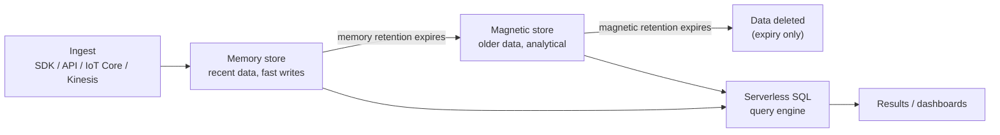

# Amazon Timestream Architecture Deep Dive - SAA-C03 Deep Dive

> Timestream's architecture decouples storage from compute: data is ingested append-only into a fast in-memory tier, automatically tiers to a cost-optimized magnetic store per retention policy, and is queried by a serverless SQL engine — all encrypted by default.

See also: [01 - Timestream Intro & Core Concepts](01%20-%20Timestream%20Intro%20%26%20Core%20Concepts.md) · [03 - Timestream Best Practices & Examples](03%20-%20Timestream%20Best%20Practices%20%26%20Examples.md) · [04 - Timestream Scenario Questions](04%20-%20Timestream%20Scenario%20Questions.md) · [05 - Timestream Troubleshooting (SRE)](05%20-%20Timestream%20Troubleshooting%20%28SRE%29.md) · [06 - Timestream Important Facts & Cheat Sheet](06%20-%20Timestream%20Important%20Facts%20%26%20Cheat%20Sheet.md) · [00 - Databases Overview & Exam Guide](00%20-%20Databases%20Overview%20%26%20Exam%20Guide.md)

---

## Table of Contents

- [Data Model Databases Tables Dimensions Measures](#data-model-databases-tables-dimensions-measures)
- [The Append-Only Write Model](#the-append-only-write-model)
- [Mandatory Timestamp Dimension](#mandatory-timestamp-dimension)
- [Memory Store Tier](#memory-store-tier)
- [Magnetic Store Tier](#magnetic-store-tier)
- [Automatic Tiering by Retention Policy](#automatic-tiering-by-retention-policy)
- [Decoupled Storage and Compute Query Engine](#decoupled-storage-and-compute-query-engine)
- [Scheduled Queries](#scheduled-queries)
- [Encryption and Security](#encryption-and-security)
- [Exam Tips and Traps](#exam-tips-and-traps)

---

---

## Data Model Databases Tables Dimensions Measures

Timestream organizes data hierarchically:

- **Database** → logical container for tables (encryption key set here).
- **Table** → holds records; carries its own memory + magnetic retention settings.
- **Record** → one time-stamped observation, composed of dimensions + measures + timestamp.

Within a record:

- **Dimensions** — string attributes that identify the source/context (e.g., `device_id`, `building`, `city`). They describe _what_ the measurement belongs to.
- **Measures** — the measured value(s): a **measure name**, **measure value**, and **measure value type** (e.g., `cpu_utilization`, `87.5`, `DOUBLE`). Timestream supports **single-measure** and **multi-measure** records (multiple values sharing one timestamp).

> **Exam Tip:** Dimensions = metadata you filter/group by; Measures = the numbers you analyze. Multi-measure records are more storage- and query-efficient than many single-measure records.

[⬆ Back to top](#table-of-contents)

---

## The Append-Only Write Model

Timestream is **append-only**. You write new records; you **cannot directly UPDATE or DELETE** individual records via query.

- Data is removed **only** when it ages out per the retention policy.
- This model keeps ingestion fast and storage immutable, ideal for telemetry where history matters.
- Writing a record with the same dimensions + timestamp + measure can **upsert** (with version handling) but there is no general DELETE/UPDATE statement.

> **Exam Tip:** "Need to delete or modify individual rows frequently" is a **bad fit** for Timestream. Removal happens via retention expiry, not DML.

[⬆ Back to top](#table-of-contents)

---

## Mandatory Timestamp Dimension

Every record **requires a timestamp** — it is the mandatory dimension that makes the data time-series.

- The timestamp determines **which tier** the record lands in (memory vs magnetic) relative to the retention windows.
- Records whose timestamp is **older than the memory-store retention** may be rejected unless **magnetic store writes** are enabled to accept late-arriving data.

[⬆ Back to top](#table-of-contents)

---

## Memory Store Tier

The **memory store** (in-memory tier) holds the **most recent** data.

- Optimized for **fast writes** and **low-latency, point-in-time** queries (e.g., "what is the latest reading?").
- Has a configurable **memory-store retention period** (hours to days, up to the service maximum).
- Most expensive tier per GB but fastest.

Best for **latency-sensitive** and recent-data queries.

[⬆ Back to top](#table-of-contents)

---

## Magnetic Store Tier

The **magnetic store** holds **older** data after it ages out of memory.

- Cost-optimized, durable storage for **large analytical** queries over long time ranges.
- Has a configurable **magnetic-store retention period** (days up to **200 years** maximum).
- Slower than the memory store but far cheaper.

Best for **historical / analytical** queries spanning weeks, months, or years.

> **Exam Tip:** Memory store = recent + latency-sensitive + point-in-time. Magnetic store = older + analytical + cost-optimized. Map the query pattern to the tier.

[⬆ Back to top](#table-of-contents)

---

## Automatic Tiering by Retention Policy

Each table has **two retention settings** that AWS enforces automatically:

| Setting                      | Controls                                       | When it ends                              |
| :--------------------------- | :--------------------------------------------- | :---------------------------------------- |
| **Memory store retention**   | How long data stays in the fast in-memory tier | Data **moves to magnetic store**          |
| **Magnetic store retention** | How long data stays in the magnetic tier       | Data is **permanently deleted (expires)** |

- Data **moves automatically** from memory → magnetic when memory retention elapses.
- Data is **deleted automatically** when magnetic retention elapses.
- Total retained history = memory retention + magnetic retention.

> **Exam Tip:** This is how you "auto-expire old data" — set the magnetic-store retention. No Lambda/cron needed.

[⬆ Back to top](#table-of-contents)

---

## Decoupled Storage and Compute Query Engine

Timestream **decouples storage from compute**:

- The **serverless query engine** scales independently of stored data.
- A single SQL query can **transparently span both tiers** (memory + magnetic), so you don't choose where to read from — the engine federates the query.
- Query cost is based on the **amount of data scanned**, so narrow time ranges and selective predicates cost less.

This separation is what enables massive scale and the 1000x performance claim for time-series queries.

[⬆ Back to top](#table-of-contents)

---

## Scheduled Queries

**Scheduled queries** are managed, periodic queries that compute aggregates/rollups and write results into a **derived table**.

- Offload expensive aggregations (e.g., hourly averages) so dashboards read pre-computed results.
- Reduce repeated scans of raw data → **lower query cost and latency**.
- Fully managed by Timestream (no external scheduler required).

> **Exam Tip:** When a scenario wants frequent dashboard refreshes over large data **cheaply**, scheduled queries (pre-aggregation) are the optimization.

[⬆ Back to top](#table-of-contents)

---

## Encryption and Security

- **Encrypted by default** at rest using an **AWS-owned/managed KMS key**, or a **customer-managed KMS key (CMK)** for control over rotation/policy.
- **Encrypted in transit** via TLS.
- Access controlled with **IAM** policies (database/table-level actions).
- Integrates with **CloudTrail** for API auditing and **CloudWatch** for metrics.

> **Exam Tip:** "Need full control over the encryption key" → use a **customer-managed KMS key**. Encryption itself is always on by default.

[⬆ Back to top](#table-of-contents)

---

## Exam Tips and Traps

- Two retention windows: **memory** (→ tiers to magnetic) and **magnetic** (→ deletes).
- **Append-only**: no direct UPDATE/DELETE; expiry handles removal.
- **Timestamp is mandatory** and decides tier placement; late data needs **magnetic store writes** enabled.
- **Decoupled compute/storage**: one query spans both tiers; cost = data scanned.
- **Scheduled queries** pre-aggregate to cut cost/latency.
- **KMS CMK** option for customer-managed encryption.

[⬆ Back to top](#table-of-contents)
