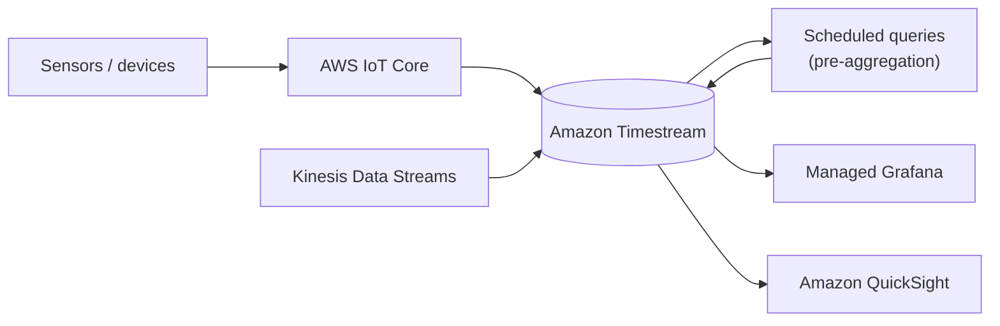

# Amazon Timestream Best Practices & Examples - SAA-C03 Deep Dive

> Design clean dimension/measure schemas, tune memory + magnetic retention to your query patterns, pre-aggregate with scheduled queries, and visualize via Grafana/QuickSight — all locked down with IAM and KMS.

See also: [01 - Timestream Intro & Core Concepts](01%20-%20Timestream%20Intro%20%26%20Core%20Concepts.md) · [02 - Timestream Architecture Deep Dive](02%20-%20Timestream%20Architecture%20Deep%20Dive.md) · [04 - Timestream Scenario Questions](04%20-%20Timestream%20Scenario%20Questions.md) · [05 - Timestream Troubleshooting (SRE)](05%20-%20Timestream%20Troubleshooting%20%28SRE%29.md) · [06 - Timestream Important Facts & Cheat Sheet](06%20-%20Timestream%20Important%20Facts%20%26%20Cheat%20Sheet.md) · [00 - Databases Overview & Exam Guide](00%20-%20Databases%20Overview%20%26%20Exam%20Guide.md)

---

## Table of Contents

- [Schema and Dimension Design](#schema-and-dimension-design)
- [Use Multi-Measure Records](#use-multi-measure-records)
- [Tune Retention to Query Patterns](#tune-retention-to-query-patterns)
- [Use Scheduled Queries for Aggregations](#use-scheduled-queries-for-aggregations)
- [Control Query Cost](#control-query-cost)
- [Ingestion Best Practices](#ingestion-best-practices)
- [Integrations Grafana and QuickSight](#integrations-grafana-and-quicksight)
- [Security KMS and IAM](#security-kms-and-iam)
- [SQL Example with Time Range and Interpolation](#sql-example-with-time-range-and-interpolation)
- [Exam Tips and Traps](#exam-tips-and-traps)

---



---

## Schema and Dimension Design

- Use **dimensions** for attributes you **filter and group by** (e.g., `device_id`, `region`, `sensor_type`). Keep dimension names consistent.
- Avoid putting **high-cardinality, ever-changing** values that you only display (not filter) into dimensions unnecessarily — model values as measures.
- Keep dimension naming **stable** across records so queries and grouping stay simple.

> **Exam Tip:** Dimensions identify the series; measures hold the numbers. Good dimension design = cheaper, faster queries.

[⬆ Back to top](#table-of-contents)

---

## Use Multi-Measure Records

When a source emits several values at the **same timestamp** (e.g., `cpu`, `memory`, `disk` together), store them as a **multi-measure record** instead of multiple single-measure records.

- Fewer records → **less storage** and **lower write cost**.
- Queries that need several measures avoid extra joins/scans.

[⬆ Back to top](#table-of-contents)

---

## Tune Retention to Query Patterns

Set the **two retention windows** to match how you query:

| Query pattern                     | Memory store retention            | Magnetic store retention |
| :-------------------------------- | :-------------------------------- | :----------------------- |
| Mostly latest/recent, low latency | Longer (hours–days)               | Short–medium             |
| Mostly long-range analytics       | Short (just enough for late data) | Long (months–years)      |
| Compliance / keep-forever         | Short                             | Up to **200 years**      |

- Don't over-provision memory retention — it is the most expensive tier.
- Keep enough memory retention to absorb **late-arriving** data, or enable **magnetic store writes**.

[⬆ Back to top](#table-of-contents)

---

## Use Scheduled Queries for Aggregations

- Create **scheduled queries** to compute rollups (hourly/daily averages, p99 latency) into a derived table.
- Dashboards then read **small pre-aggregated** results instead of scanning raw data.
- Cuts both **query latency** and **query cost**.

[⬆ Back to top](#table-of-contents)

---

## Control Query Cost

Query cost is driven by **data scanned**:

- Always include a **time-range predicate** (`WHERE time BETWEEN ...`).
- Filter on **dimensions** to narrow the scan.
- Prefer **scheduled-query / pre-aggregated** tables for repetitive dashboard queries.
- Avoid `SELECT *` over wide, long ranges.

> **Exam Tip:** "Query costs are too high / queries scan too much" → add time-range + dimension filters, and pre-aggregate with scheduled queries.

[⬆ Back to top](#table-of-contents)

---

## Ingestion Best Practices

- Write via the **SDK/API**, **AWS IoT Core** rule actions, or **Kinesis** → Timestream pipelines.
- **Batch** records per write request to improve throughput and reduce throttling.
- Handle **rejected records** (late data past memory retention, duplicate version) gracefully — retry or enable magnetic store writes.

[⬆ Back to top](#table-of-contents)

---

## Integrations Grafana and QuickSight

- **Amazon Managed Grafana** has a native Timestream data source — ideal for **operational/IoT dashboards**.
- **Amazon QuickSight** connects for **BI and ad-hoc analytics**.
- **AWS IoT Core** rules route device messages straight into Timestream.
- **Kinesis** (Data Streams / Data Analytics for Apache Flink) for streaming ingestion pipelines.

[⬆ Back to top](#table-of-contents)

---

## Security KMS and IAM

- Encryption is **always on**; choose an **AWS-managed key** or a **customer-managed KMS key (CMK)** for key control and rotation.
- Use **IAM policies** to scope `timestream:WriteRecords`, `timestream:Select`, and management actions to least privilege.
- Audit with **CloudTrail**; monitor with **CloudWatch**.

[⬆ Back to top](#table-of-contents)

---

## SQL Example with Time Range and Interpolation

Standard SQL with a time-range filter and **interpolation** to fill gaps and smooth a sensor reading:

```sql
SELECT
    device_id,
    INTERPOLATE_LINEAR(
        CREATE_TIME_SERIES(time, measure_value::double),
        SEQUENCE(ago(1h), now(), 1m)
    ) AS smoothed_temp
FROM "iot_db"."sensor_readings"
WHERE measure_name = 'temperature'
    AND time BETWEEN ago(1h) AND now()
    AND region = 'us-east-1'
GROUP BY device_id
ORDER BY device_id;
```

Notes:

- `time BETWEEN ago(1h) AND now()` keeps the scan small (cost control).
- `CREATE_TIME_SERIES` + `INTERPOLATE_LINEAR` build and fill the series at 1-minute steps.
- `region` is a **dimension** filter; `temperature` is the **measure**.

[⬆ Back to top](#table-of-contents)

---

## Exam Tips and Traps

- **Auto-expire old data** = set magnetic-store retention (no custom cleanup jobs).
- **Lower query cost** = time-range + dimension filters + scheduled-query pre-aggregation.
- **Dashboards** = Managed Grafana (ops/IoT) or QuickSight (BI).
- **Ingestion at scale** = IoT Core rules or Kinesis, batched writes.
- **Key control** = customer-managed KMS key.

[⬆ Back to top](#table-of-contents)
