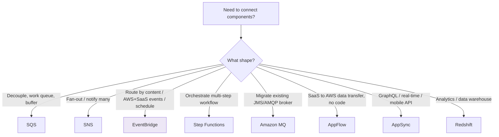

# Application Integration - Section Overview (SAA-C03)

> **Application Integration** services let independent components communicate **asynchronously and loosely coupled** - the backbone of resilient, scalable, event-driven architectures. This is a heavily tested domain: know **which service fits which messaging shape**.

See also: [01 - SQS Fundamentals & Deep Dive](01%20-%20SQS%20Fundamentals%20%26%20Deep%20Dive.md) · [01 - SNS Fundamentals & Deep Dive](01%20-%20SNS%20Fundamentals%20%26%20Deep%20Dive.md) · [01 - EventBridge Fundamentals & Deep Dive](01%20-%20EventBridge%20Fundamentals%20%26%20Deep%20Dive.md) · [01 - Step Functions Fundamentals & Deep Dive](01%20-%20Step%20Functions%20Fundamentals%20%26%20Deep%20Dive.md) · [01 - Amazon MQ Fundamentals & Deep Dive](01%20-%20Amazon%20MQ%20Fundamentals%20%26%20Deep%20Dive.md) · [01 - AppFlow Fundamentals & Deep Dive](01%20-%20AppFlow%20Fundamentals%20%26%20Deep%20Dive.md) · [01 - AppSync Fundamentals & Deep Dive](01%20-%20AppSync%20Fundamentals%20%26%20Deep%20Dive.md) · [01 - Redshift Fundamentals & Deep Dive](01%20-%20Redshift%20Fundamentals%20%26%20Deep%20Dive.md)

---

## Table of Contents

- [1. Why Application Integration](#1-why-application-integration)
- [2. The Services at a Glance](#2-the-services-at-a-glance)
- [3. The Master Decision Map](#3-the-master-decision-map)
- [4. How to Study This Section](#4-how-to-study-this-section)
- [5. Folder Index](#5-folder-index)

---

---

## 1. Why Application Integration

Tightly coupled systems fail together: if one component is slow or down, callers block, time out, and cascade. Integration services insert **buffers, routers, and orchestrators** so components scale and fail **independently**. Core themes the exam rewards:

- **Decoupling** (SQS) - absorb spikes, isolate failures.
- **Fan-out** (SNS) - one event, many independent reactions.
- **Event routing** (EventBridge) - content-based, AWS-native, SaaS, scheduled.
- **Orchestration** (Step Functions) - stateful multi-step workflows with retries.
- **Protocol compatibility** (Amazon MQ) - migrate standard-broker apps.
- **SaaS data movement** (AppFlow) and **real-time APIs** (AppSync).
- **Analytics** (Redshift) - the warehouse that often sits at the end of these pipelines.

[⬆ Back to top](#table-of-contents)

---

## 2. The Services at a Glance

| Service                                            | One-line role        | Core exam trigger             |
| :------------------------------------------------- | :------------------- | :---------------------------- | ------------------------------------------------- |
| \*\*[SQS](01%20-%20SQS%20Fundamentals%20%26%20Deep%20Dive.md)\*\*            | Managed pull-based **queue**  | Decouple, buffer, work queue, retries (DLQ)       |
| \*\*[SNS](01%20-%20SNS%20Fundamentals%20%26%20Deep%20Dive.md)\*\*            | Push **pub/sub**              | Fan-out to many subscribers, notifications        |
| \*\*[EventBridge](01%20-%20EventBridge%20Fundamentals%20%26%20Deep%20Dive.md)\*\*    | Serverless **event bus**      | Content routing, AWS/SaaS events, cron, replay    |
| \*\*[Step Functions](01%20-%20Step%20Functions%20Fundamentals%20%26%20Deep%20Dive.md)\*\* | Workflow **orchestrator**     | Multi-step state machine, retries, human approval |
| \*\*[Amazon MQ](01%20-%20Amazon%20MQ%20Fundamentals%20%26%20Deep%20Dive.md)\*\*      | Managed **ActiveMQ/RabbitMQ** | Migrate JMS/AMQP/MQTT apps, no rewrite            |
| \*\*[AppFlow](01%20-%20AppFlow%20Fundamentals%20%26%20Deep%20Dive.md)\*\*        | **SaaS ↔ AWS** data transfer  | Salesforce/SaaS → S3/Redshift, no code            |
| \*\*[AppSync](01%20-%20AppSync%20Fundamentals%20%26%20Deep%20Dive.md)\*\*        | Managed **GraphQL** API       | Real-time, offline, multi-source mobile/web API   |
| \*\*[Redshift](01%20-%20Redshift%20Fundamentals%20%26%20Deep%20Dive.md)\*\*       | **Data warehouse** (OLAP)     | Petabyte analytics/BI on structured data          |

[⬆ Back to top](#table-of-contents)

---

## 3. The Master Decision Map

| If the requirement is…                                                                                        | Choose                                        |
| :------------------------------------------------------------------------------------------------------------ | :-------------------------------------------- |
| Decouple a slow back-end; buffer a spike; durable work queue                                                  | **SQS**                                       |
| One message → many independent consumers                                                                      | **SNS** (often **SNS → SQS fan-out**)         |
| Route events by **content**; react to AWS service events; ingest SaaS events; serverless **cron**; **replay** | **EventBridge**                               |
| Coordinate **multiple steps** with branching, retries, compensation, or human approval                        | **Step Functions**                            |
| Migrate an app using **JMS/AMQP/MQTT/STOMP** with minimal change                                              | **Amazon MQ**                                 |
| Move data between a **SaaS app and AWS** with no custom code                                                  | **AppFlow**                                   |
| **GraphQL**, real-time subscriptions, offline sync, combine sources                                           | **AppSync**                                   |
| Heavy, recurring **analytics/BI** on large structured data                                                    | **Redshift**                                  |
| Highest-throughput, lowest-latency fan-out                                                                    | **SNS** (not EventBridge)                     |
| Orchestration (control) vs choreography (loose events)                                                        | **Step Functions** vs **EventBridge/SNS/SQS** |

[⬆ Back to top](#table-of-contents)

---

## 4. How to Study This Section

Each service folder has the same three-file rhythm (Redshift/SQS/SNS/EventBridge/Step Functions have all three; AppFlow/AppSync combine the last two):

1. **`01 - Fundamentals & Deep Dive`** - concepts, architecture, mermaid diagrams, the "why".
2. **`02 - Architecture & Examples`** - patterns, code/IaC, when to use each.
3. **`03 - Scenarios, Best Practices & Troubleshooting`** - exam scenario drills, best practices, and an **SRE troubleshooting** table + key CloudWatch metrics.

**Priority for the exam:** SQS → SNS → EventBridge → Step Functions are the highest-yield. Amazon MQ, AppFlow, AppSync are usually single-question "recognize the trigger word" topics. Redshift spans into the analytics domain.

[⬆ Back to top](#table-of-contents)

---

## 5. Folder Index

| #   | Folder                 | Files                                                                             |
| :-- | :--------------------- | :-------------------------------------------------------------------------------- |
| 01  | **Amazon SQS**         | Fundamentals · Architecture & Examples · Scenarios/Best Practices/Troubleshooting |
| 02  | **Amazon SNS**         | Fundamentals · Architecture & Examples · Scenarios/Best Practices/Troubleshooting |
| 03  | **Amazon EventBridge** | Fundamentals · Architecture & Examples · Scenarios/Best Practices/Troubleshooting |
| 04  | **AWS Step Functions** | Fundamentals · Architecture & Examples · Scenarios/Best Practices/Troubleshooting |
| 05  | **Amazon MQ**          | Fundamentals · Architecture & Examples · Scenarios/Best Practices/Troubleshooting |
| 06  | **Amazon AppFlow**     | Fundamentals · Scenarios/Examples/Troubleshooting                                 |
| 07  | **AWS AppSync**        | Fundamentals · Scenarios/Examples/Troubleshooting                                 |
| 08  | **Amazon Redshift**    | Fundamentals · Architecture & Examples · Scenarios/Best Practices/Troubleshooting |

[⬆ Back to top](#table-of-contents)
