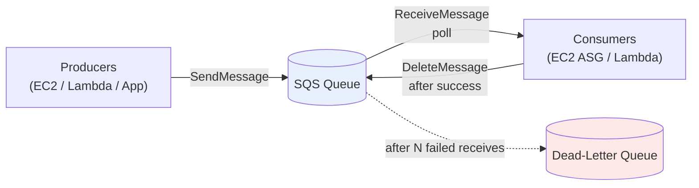
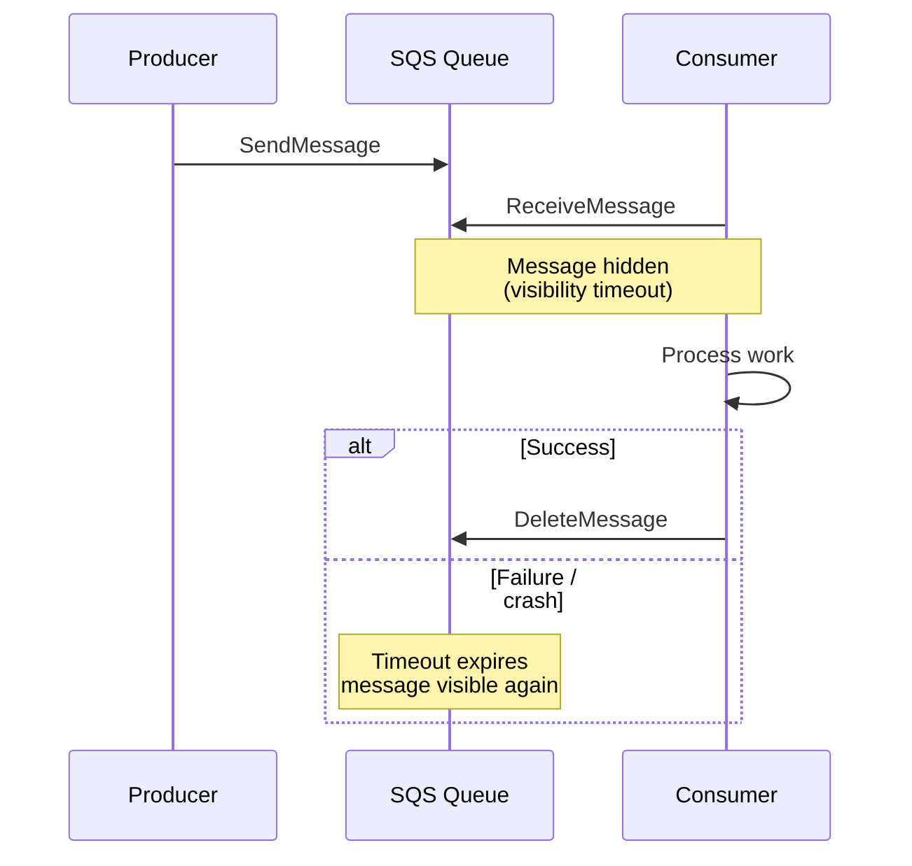
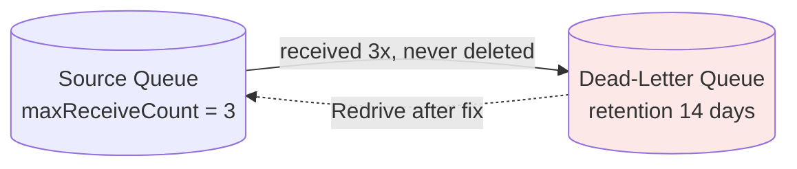

# Amazon SQS - Fundamentals & Deep Dive (SAA-C03)

> Amazon **Simple Queue Service (SQS)** is a fully managed, serverless **message queue** used to **decouple** producers from consumers. It is the single most-tested integration service on the SAA-C03 exam - know Standard vs FIFO, visibility timeout, DLQs, and long polling cold.

See also: [02 - SQS Architecture & Examples](02%20-%20SQS%20Architecture%20%26%20Examples.md) · [03 - SQS Scenarios, Best Practices & Troubleshooting](03%20-%20SQS%20Scenarios%2C%20Best%20Practices%20%26%20Troubleshooting.md) · [01 - SNS Fundamentals & Deep Dive](01%20-%20SNS%20Fundamentals%20%26%20Deep%20Dive.md) · [01 - EventBridge Fundamentals & Deep Dive](01%20-%20EventBridge%20Fundamentals%20%26%20Deep%20Dive.md)

---

## Table of Contents

- [1. What Is SQS and Why It Exists](#1-what-is-sqs-and-why-it-exists)
- [2. Core Vocabulary](#2-core-vocabulary)
- [3. Standard vs FIFO Queues](#3-standard-vs-fifo-queues)
- [4. The Message Lifecycle](#4-the-message-lifecycle)
- [5. Visibility Timeout (Exam Critical)](#5-visibility-timeout-exam-critical)
- [6. Polling: Short vs Long](#6-polling-short-vs-long)
- [7. Dead-Letter Queues (DLQ)](#7-dead-letter-queues-dlq)
- [8. Delays, Retention & Sizing Limits](#8-delays-retention--sizing-limits)
- [9. Security & Encryption](#9-security--encryption)
- [10. Pricing Model](#10-pricing-model)
- [11. Key Takeaways](#11-key-takeaways)

---

---

## 1. What Is SQS and Why It Exists

SQS is a **pull-based** (poll) message queue that lets one part of a system send messages that another part processes **asynchronously**. The producer and consumer never talk directly - they only know about the queue.

**The problem it solves - tight coupling:**

- Without a queue, if the consumer (e.g., an image-processing service) is slow or down, the producer (web tier) blocks, times out, or drops work.
- With a queue, the producer drops the message and moves on. The consumer processes at its own pace. A traffic spike just makes the queue longer, not the website crash.

**Core properties:**

| Property                       | Detail                                                      |
| :----------------------------- | :---------------------------------------------------------- |
| **Fully managed / serverless** | No servers, no capacity to provision. Scales automatically. |
| **Unlimited throughput**       | Standard queues have no throughput limit.                   |
| **Pull-based**                 | Consumers **poll** for messages (SQS does not push).        |
| **At-least-once (Standard)**   | A message may be delivered more than once.                  |
| **Decoupling pattern**         | Classic use with Auto Scaling Groups and Lambda.            |

[⬆ Back to top](#table-of-contents)

---

## 2. Core Vocabulary

| Term                   | Meaning                                                                                                     |
| :--------------------- | :---------------------------------------------------------------------------------------------------------- |
| **Producer**           | Sends messages to the queue (`SendMessage`).                                                                |
| **Consumer**           | Polls and processes messages (`ReceiveMessage` → process → `DeleteMessage`).                                |
| **Message**            | Payload up to **256 KB**. For larger, use the **SQS Extended Client** (store body in S3, pointer in queue). |
| **Visibility Timeout** | Time a received message is hidden from other consumers.                                                     |
| **Polling**            | The act of asking the queue for messages.                                                                   |
| **DLQ**                | A second queue that receives messages that failed processing too many times.                                |

> **Exam trap:** The consumer must explicitly **delete** the message after processing. If it doesn't, the message reappears after the visibility timeout and gets processed again.

[⬆ Back to top](#table-of-contents)

---

## 3. Standard vs FIFO Queues

This comparison is the **#1 SQS exam topic**. Memorize it.

| Feature              | **Standard**                            | **FIFO**                                                                             |
| :------------------- | :-------------------------------------- | :----------------------------------------------------------------------------------- |
| **Ordering**         | Best-effort (can be out of order)       | **Strict order** preserved                                                           |
| **Delivery**         | **At-least-once** (possible duplicates) | **Exactly-once** processing                                                          |
| **Throughput**       | **Unlimited**                           | 300 msg/s (or 3,000 with batching of 10); **up to 70,000/s in high-throughput mode** |
| **Name requirement** | Any name                                | **Must end in `.fifo`**                                                              |
| **Deduplication**    | None                                    | Via `MessageDeduplicationId` (5-min window)                                          |
| **Grouping**         | N/A                                     | `MessageGroupId` - ordering is per group                                             |

**When to pick which:**

- **Standard** → maximum throughput, order doesn't matter, app is idempotent (can tolerate dup). Default choice.
- **FIFO** → order matters or duplicates are unacceptable (e.g., financial transactions, command sequences, inventory decrements).

**FIFO ordering nuance:** Order is guaranteed **within a `MessageGroupId`**. Different group IDs are processed in parallel (this is how FIFO scales). Use a customer ID or order ID as the group ID to keep per-customer ordering while still scaling across customers.

**FIFO deduplication:** Two methods —

- **Content-based dedup:** SHA-256 hash of the body is the dedup ID.
- **Explicit:** you provide `MessageDeduplicationId`. Any duplicate within the **5-minute** dedup window is silently discarded.

[⬆ Back to top](#table-of-contents)

---

## 4. The Message Lifecycle

1. **Producer** calls `SendMessage`. Message is stored redundantly across multiple AZs.
2. **Consumer** calls `ReceiveMessage` (up to 10 messages per call). The message becomes **invisible** (visibility timeout starts).
3. Consumer **processes** the message (do the work).
4. Consumer calls `DeleteMessage`. The message is gone permanently.
5. If the consumer **fails / crashes / never deletes**, the visibility timeout expires and the message becomes **visible again** for another consumer to retry.

[⬆ Back to top](#table-of-contents)

---

## 5. Visibility Timeout (Exam Critical)

The **visibility timeout** is how long a message stays hidden after a consumer receives it.

- **Default:** 30 seconds. **Range:** 0 seconds to **12 hours**.
- A consumer can call `ChangeMessageVisibility` to extend it while still working (heartbeat pattern).

**The two failure modes the exam tests:**

| Symptom                        | Cause                                                                                                                                                            | Fix                                                                                                         |
| :----------------------------- | :--------------------------------------------------------------------------------------------------------------------------------------------------------------- | :---------------------------------------------------------------------------------------------------------- |
| **Messages processed twice**   | Visibility timeout **too short** - work takes longer than the timeout, so the message reappears and a second consumer grabs it while the first is still working. | Increase the visibility timeout to exceed max processing time, or heartbeat with `ChangeMessageVisibility`. |
| **Slow recovery from crashes** | Visibility timeout **too long** - a crashed consumer's messages stay hidden for a long time before retry.                                                        | Lower the timeout (balance against the above).                                                              |

> **Rule of thumb:** Set visibility timeout to **a bit longer than the worst-case processing time**.

[⬆ Back to top](#table-of-contents)

---

## 6. Polling: Short vs Long

|               | **Short Polling**                                                     | **Long Polling**                                     |
| :------------ | :-------------------------------------------------------------------- | :--------------------------------------------------- |
| **Wait time** | 0 seconds (returns immediately)                                       | 1-20 seconds (`WaitTimeSeconds`)                     |
| **Behavior**  | May return empty even if messages exist (samples a subset of servers) | Waits until a message arrives or the timeout elapses |
| **Cost**      | More empty receives = **more API calls = higher cost**                | Fewer empty responses = **lower cost**               |
| **Latency**   | Lowest                                                                | Slightly higher but usually fine                     |

**Long polling is almost always preferred.** It reduces cost and the number of empty responses. Enable it by setting **`ReceiveMessageWaitTimeSeconds`** (1-20) on the queue, or per-request via `WaitTimeSeconds`.

> **Exam answer:** "How do you reduce the number of empty API responses / lower SQS cost?" → **Enable long polling.**

[⬆ Back to top](#table-of-contents)

---

## 7. Dead-Letter Queues (DLQ)

A **DLQ** is a normal SQS queue that collects messages a consumer fails to process after a set number of attempts - so a "poison pill" message doesn't loop forever and block the queue.

- Set **`maxReceiveCount`** via a **redrive policy** on the source queue. After a message is received that many times without being deleted, SQS moves it to the DLQ.
- **The DLQ type must match the source:** FIFO source → FIFO DLQ; Standard → Standard.
- Set a **long retention** on the DLQ (e.g., 14 days) to give you time to inspect and fix.
- **DLQ Redrive:** AWS provides a console feature to move messages **back** from the DLQ to the source queue after you've fixed the bug.

> **Exam scenario:** "Some messages repeatedly fail and consume the queue." → Configure a **DLQ with a redrive policy**.

[⬆ Back to top](#table-of-contents)

---

## 8. Delays, Retention & Sizing Limits

| Setting                       | Default | Range / Limit                                                |
| :---------------------------- | :------ | :----------------------------------------------------------- |
| **Message size**              | -       | Up to **256 KB** (larger → SQS Extended Client + S3)         |
| **Message retention**         | 4 days  | **60 seconds to 14 days**                                    |
| **Delay queue** (whole queue) | 0 s     | 0 to **15 minutes**                                          |
| **Per-message delay timer**   | 0 s     | 0 to **15 minutes** (Standard only; not per-message on FIFO) |
| **Visibility timeout**        | 30 s    | 0 s to 12 hours                                              |
| **Long poll wait**            | 0 s     | 0 to 20 seconds                                              |
| **Batch size (receive/send)** | -       | Up to **10 messages** per API call                           |

**Delay queue vs visibility timeout:** A delay queue hides a message **when first sent** (before any consumer sees it). Visibility timeout hides it **after** a consumer receives it.

[⬆ Back to top](#table-of-contents)

---

## 9. Security & Encryption

| Layer                      | Mechanism                                                                                                                                                                    |
| :------------------------- | :--------------------------------------------------------------------------------------------------------------------------------------------------------------------------- |
| **Encryption in transit**  | HTTPS (TLS) endpoints.                                                                                                                                                       |
| **Encryption at rest**     | **SSE-SQS** (AWS-managed key, default) or **SSE-KMS** (your CMK).                                                                                                            |
| **Client-side encryption** | You encrypt before sending; SQS only stores ciphertext.                                                                                                                      |
| **Access control**         | **IAM policies** for API-level access; **SQS access policies** (resource-based, like S3 bucket policies) for cross-account access and allowing services like SNS/S3 to send. |

> **Cross-account / "allow SNS to send to my queue":** Use an **SQS resource (access) policy**, not an IAM identity policy. This is how SNS → SQS fan-out and S3 event notifications → SQS are authorized.

[⬆ Back to top](#table-of-contents)

---

## 10. Pricing Model

- Billed **per request** (API calls), in batches of 64 KB chunks. 1 request can carry up to 10 messages.
- **FIFO** is priced slightly higher than Standard.
- There is a generous **free tier** (1M requests/month).
- **Cost levers:** use **batching** (10 messages per call) and **long polling** to cut request counts dramatically.

[⬆ Back to top](#table-of-contents)

---

## 11. Key Takeaways

| Concept                | Must-Know                                                            |
| :--------------------- | :------------------------------------------------------------------- |
| **Model**              | Pull-based, decoupling queue. Consumers poll.                        |
| **Standard**           | Unlimited throughput, at-least-once, best-effort order.              |
| **FIFO**               | Strict order + dedup, `.fifo` suffix, ordering per `MessageGroupId`. |
| **Visibility timeout** | Too short = double processing; too long = slow retry.                |
| **Long polling**       | Reduces empty responses and cost.                                    |
| **DLQ**                | Catches poison-pill messages via `maxReceiveCount`.                  |
| **Big messages**       | 256 KB limit → SQS Extended Client + S3.                             |
| **Cross-account send** | SQS resource policy.                                                 |

[⬆ Back to top](#table-of-contents)
