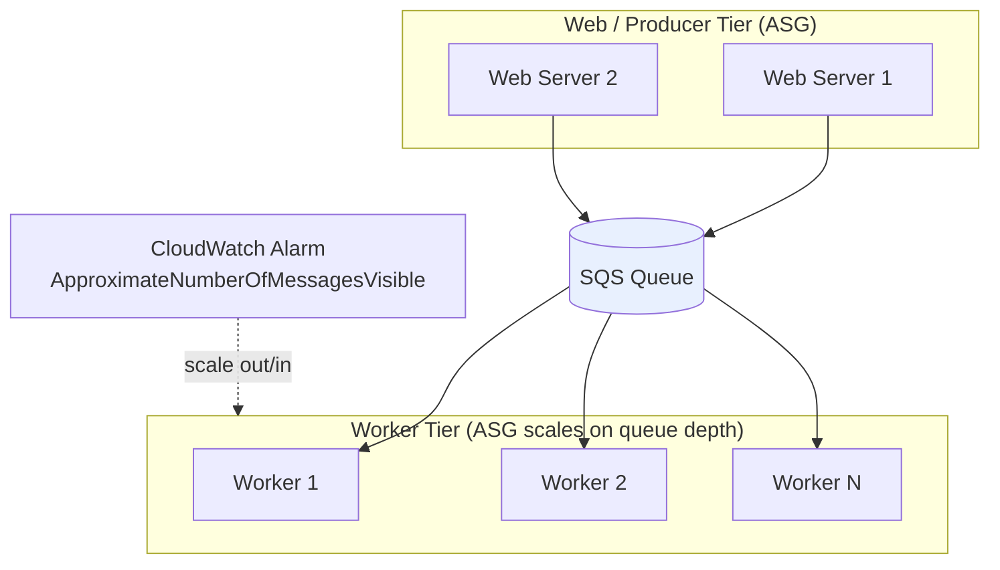
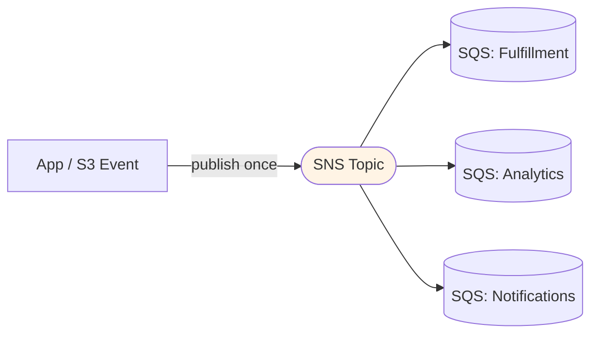

# Amazon SQS - Architecture Patterns & Examples (SAA-C03)

> The exam rarely asks "what is SQS" - it asks you to **recognize the pattern**: decouple a tier, scale workers on queue depth, fan-out with SNS, or buffer writes. This file is the pattern catalog.

See also: [01 - SQS Fundamentals & Deep Dive](01%20-%20SQS%20Fundamentals%20%26%20Deep%20Dive.md) · [03 - SQS Scenarios, Best Practices & Troubleshooting](03%20-%20SQS%20Scenarios%2C%20Best%20Practices%20%26%20Troubleshooting.md) · [01 - SNS Architecture & Examples](01%20-%20SNS%20Architecture%20%26%20Examples.md)

---

## Table of Contents

- [1. The Decoupling Pattern (Web ↔ Worker)](#1-the-decoupling-pattern-web--worker)
- [2. Auto Scaling on Queue Depth](#2-auto-scaling-on-queue-depth)
- [3. SQS + Lambda (Event Source Mapping)](#3-sqs--lambda-event-source-mapping)
- [4. SNS + SQS Fan-Out](#4-sns--sqs-fan-out)
- [5. Request-Response (Temporary Queues)](#5-request-response-temporary-queues)
- [6. Large Payloads with S3](#6-large-payloads-with-s3)
- [7. Ordering & Dedup with FIFO](#7-ordering--dedup-with-fifo)
- [8. Buffering Database Writes](#8-buffering-database-writes)
- [9. Code Examples](#9-code-examples)
- [10. Pattern Selection Cheat Sheet](#10-pattern-selection-cheat-sheet)

---



---

## 1. The Decoupling Pattern (Web ↔ Worker)

The canonical SQS architecture: a **front-end tier** accepts requests and a **back-end worker tier** does heavy processing.

- Web tier validates the request, writes a message, and immediately returns `202 Accepted` to the user.
- Worker tier polls the queue and does the slow work (transcoding, PDF generation, ML inference).
- **Benefit:** The two tiers scale **independently**. The queue absorbs spikes. If workers die, no work is lost (messages wait in the queue).

**Why the exam loves it:** It turns a synchronous, fragile call into an asynchronous, resilient one - the textbook answer to "make this architecture more resilient / handle traffic spikes."

[⬆ Back to top](#table-of-contents)

---

## 2. Auto Scaling on Queue Depth

Scale the worker ASG based on **how much work is waiting**, not CPU.

- **Metric:** `ApproximateNumberOfMessagesVisible` (messages waiting).
- **Better metric (target tracking):** **Backlog per instance** = `ApproximateNumberOfMessagesVisible / RunningInstanceCount`. Set a target (e.g., each instance should have ≤ 10 messages backlog). This is the AWS-recommended approach because raw queue depth doesn't account for current capacity.

```
Backlog per instance = messages visible / number of healthy workers
Target tracking keeps that number at your chosen value.
```

> **Exam answer:** "How should the worker fleet scale with the queue?" → CloudWatch alarm / target-tracking on **queue depth (backlog per instance)**, not CPU.

[⬆ Back to top](#table-of-contents)

---

## 3. SQS + Lambda (Event Source Mapping)

Instead of running EC2 pollers, **Lambda** can consume SQS directly via an **event source mapping**. The Lambda service polls the queue for you and invokes your function with batches.

- **Standard queue:** Lambda scales up concurrent pollers automatically (up to 1,000+ concurrent).
- **FIFO queue:** Concurrency is limited per `MessageGroupId` to preserve order.
- **Batch size:** 1-10,000 (with batch window); failures can be reported per-message with **`ReportBatchItemFailures`** so only failed messages return to the queue.
- **DLQ:** Attach to the **queue** (not the function) for SQS event sources.

> **Exam trap:** With Lambda + SQS, set the **queue's visibility timeout to at least 6× the Lambda function timeout**. Otherwise messages can be picked up again before the function finishes.

[⬆ Back to top](#table-of-contents)

---

## 4. SNS + SQS Fan-Out

One event needs to trigger **multiple** independent processors. Publish once to **SNS**; subscribe **multiple SQS queues**.



- Each queue gets its **own copy** of the message and processes at its own pace.
- **Durability:** if a consumer is down, its queue retains messages (SNS alone would drop them).
- Authorize SNS to send via an **SQS access policy** on each queue.
- Common trigger: **S3 event → SNS → multiple SQS** (S3 can only send to one destination per event type, so fan out via SNS).

[⬆ Back to top](#table-of-contents)

---

## 5. Request-Response (Temporary Queues)

For synchronous-style request/reply over queues, the requester creates a **temporary reply queue** and puts its ARN in the message. The worker sends the response there. The **Temporary Queue Client** manages short-lived queues. Rarely the "best" answer on the exam (Step Functions or direct API is usually better), but know it exists.

[⬆ Back to top](#table-of-contents)

---

## 6. Large Payloads with S3

SQS max message size is **256 KB**. For larger payloads, use the **SQS Extended Client Library** (Java):

1. Producer uploads the large body to **S3**.
2. SQS message contains a **pointer** (S3 bucket + key).
3. Consumer reads the pointer, fetches the object from S3.

> **Exam answer:** "Need to send 1 GB messages through SQS" → store payload in **S3**, send a reference via the **SQS Extended Client**.

[⬆ Back to top](#table-of-contents)

---

## 7. Ordering & Dedup with FIFO

**Per-customer ordering at scale:** Use `MessageGroupId = customerId`. Messages for one customer are strictly ordered; different customers process in parallel.

**Idempotency:** Use `MessageDeduplicationId` (or content-based dedup) so a retried `SendMessage` within 5 minutes doesn't create a duplicate - important for payment/order systems.

> **Exam scenario:** "Process transactions per account in order, but scale across accounts." → **FIFO queue**, `MessageGroupId` = account ID.

[⬆ Back to top](#table-of-contents)

---

## 8. Buffering Database Writes

A spike of writes can overwhelm a database. Put SQS in front:

- App writes messages to SQS instead of hitting the DB directly.
- Workers drain the queue at a **controlled, steady rate** the DB can handle (rate limiting / smoothing).
- **Result:** the database sees a flat write rate even during spikes; the queue absorbs the burst.

> **Exam answer:** "Spiky writes overwhelm RDS" → buffer with **SQS** and have workers consume at a sustainable rate.

[⬆ Back to top](#table-of-contents)

---

## 9. Code Examples

**Send a message (AWS CLI):**

```bash
aws sqs send-message \
  --queue-url https://sqs.us-east-1.amazonaws.com/123456789012/orders \
  --message-body '{"orderId":"A-1001","action":"process"}' \
  --message-attributes '{"priority":{"DataType":"String","StringValue":"high"}}'
```

**Receive with long polling + delete (CLI):**

```bash
# Long poll up to 20s, get up to 10 messages
aws sqs receive-message \
  --queue-url $URL \
  --max-number-of-messages 10 \
  --wait-time-seconds 20

# After processing, delete using the ReceiptHandle
aws sqs delete-message --queue-url $URL --receipt-handle "<handle>"
```

**FIFO send with group + dedup (CLI):**

```bash
aws sqs send-message \
  --queue-url $FIFO_URL \
  --message-body '{"txn":"debit","amt":50}' \
  --message-group-id "account-42" \
  --message-deduplication-id "txn-90817"
```

**Create queue with DLQ + long polling (Terraform):**

```hcl
resource "aws_sqs_queue" "dlq" {
  name                      = "orders-dlq"
  message_retention_seconds = 1209600  # 14 days
}

resource "aws_sqs_queue" "orders" {
  name                       = "orders"
  visibility_timeout_seconds = 60
  receive_wait_time_seconds  = 20      # long polling
  redrive_policy = jsonencode({
    deadLetterTargetArn = aws_sqs_queue.dlq.arn
    maxReceiveCount     = 3
  })
}
```

[⬆ Back to top](#table-of-contents)

---

## 10. Pattern Selection Cheat Sheet

| Requirement                           | Pattern                               |
| :------------------------------------ | :------------------------------------ |
| Decouple slow back-end from front-end | Web → SQS → Worker tier               |
| Scale workers with workload           | ASG on **backlog per instance**       |
| No servers for consumers              | **SQS → Lambda** event source mapping |
| One event, many consumers             | **SNS → multiple SQS** fan-out        |
| Payload > 256 KB                      | **SQS Extended Client + S3**          |
| Strict order + no duplicates          | **FIFO** with `MessageGroupId`        |
| Protect a DB from write spikes        | **SQS buffer** + rate-limited workers |
| Poison-pill messages                  | **DLQ** with `maxReceiveCount`        |

[⬆ Back to top](#table-of-contents)
