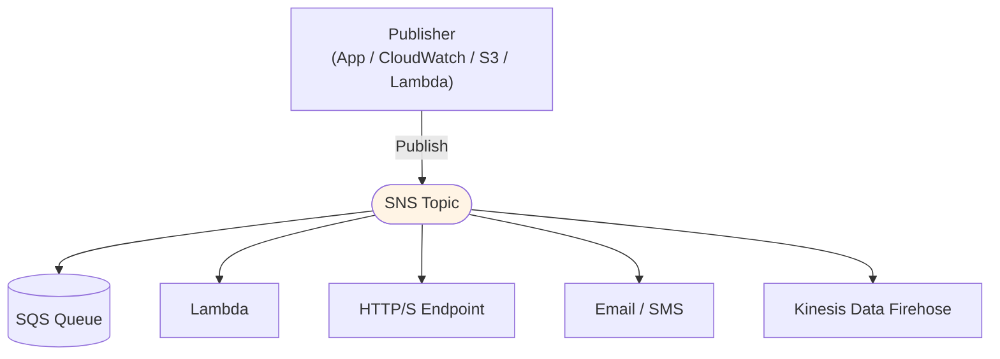
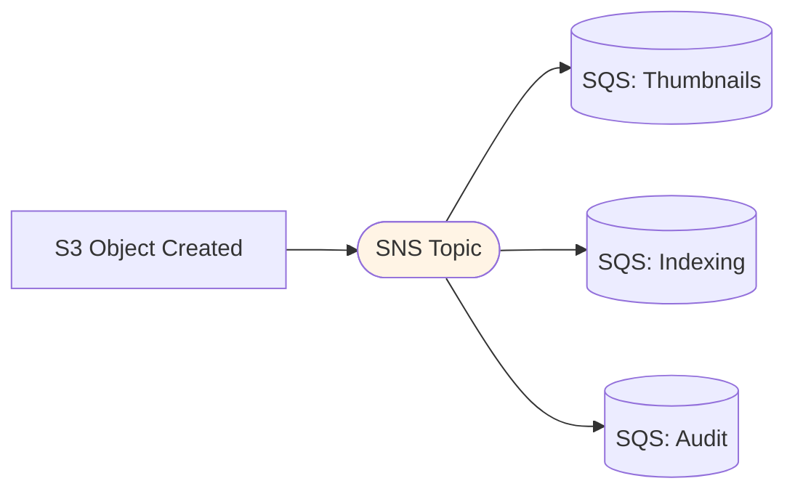

# Amazon SNS - Fundamentals & Deep Dive (SAA-C03)

> Amazon **Simple Notification Service (SNS)** is a fully managed, **push-based pub/sub** service. One publisher → a **topic** → many subscribers. The exam pairs it constantly with SQS (fan-out) and Lambda.

See also: [02 - SNS Architecture & Examples](02%20-%20SNS%20Architecture%20%26%20Examples.md) · [03 - SNS Scenarios, Best Practices & Troubleshooting](03%20-%20SNS%20Scenarios%2C%20Best%20Practices%20%26%20Troubleshooting.md) · [01 - SQS Fundamentals & Deep Dive](01%20-%20SQS%20Fundamentals%20%26%20Deep%20Dive.md) · [01 - EventBridge Fundamentals & Deep Dive](01%20-%20EventBridge%20Fundamentals%20%26%20Deep%20Dive.md)

---

## Table of Contents

- [1. What Is SNS and the Pub/Sub Model](#1-what-is-sns-and-the-pubsub-model)
- [2. Core Vocabulary](#2-core-vocabulary)
- [3. Supported Subscriber Types](#3-supported-subscriber-types)
- [4. SNS + SQS Fan-Out (The Big Pattern)](#4-sns--sqs-fan-out-the-big-pattern)
- [5. Standard vs FIFO Topics](#5-standard-vs-fifo-topics)
- [6. Message Filtering](#6-message-filtering)
- [7. Delivery, Retries & DLQ](#7-delivery-retries--dlq)
- [8. Security & Encryption](#8-security--encryption)
- [9. SNS vs SQS (When to Use Which)](#9-sns-vs-sqs-when-to-use-which)
- [10. Key Takeaways](#10-key-takeaways)

---



---

## 1. What Is SNS and the Pub/Sub Model

SNS is a **publish/subscribe (pub/sub)** messaging service. A publisher sends a message **once** to a **topic**; SNS **pushes** a copy to **every subscriber** of that topic.

- **Push, not pull:** Unlike SQS (consumers poll), SNS actively delivers to subscribers.
- **Decoupling + fan-out:** One message can reach many systems simultaneously without the publisher knowing who they are.
- **Up to 12,500,000 subscriptions** per topic; **100,000 topics** per account (soft limits).

**SQS vs SNS one-liner:** SQS = **one** message, **one** consumer group, processed once. SNS = **one** message, **many** subscribers, each gets a copy.

[⬆ Back to top](#table-of-contents)

---

## 2. Core Vocabulary

| Term                  | Meaning                                                                  |
| :-------------------- | :----------------------------------------------------------------------- |
| **Topic**             | The logical access point / channel publishers send to.                   |
| **Publisher**         | Anything that sends (`Publish`) to a topic.                              |
| **Subscriber**        | An endpoint that receives copies (SQS, Lambda, email, etc.).             |
| **Subscription**      | The binding of a subscriber endpoint to a topic (must be **confirmed**). |
| **Message filtering** | A **filter policy** on a subscription so it only gets relevant messages. |
| **Fan-out**           | Publishing once and delivering to many subscribers (esp. SQS queues).    |

[⬆ Back to top](#table-of-contents)

---

## 3. Supported Subscriber Types

| Subscriber                | Notes                                                              |
| :------------------------ | :----------------------------------------------------------------- |
| **SQS**                   | Most common; durable fan-out. SNS pushes into the queue.           |
| **Lambda**                | Async invocation; great for event-driven processing.               |
| **HTTP/HTTPS**            | Webhooks; subscription must be confirmed.                          |
| **Email / Email-JSON**    | Human notifications (not for app logic - no programmatic ack).     |
| **SMS**                   | Text messages (mobile).                                            |
| **Kinesis Data Firehose** | Archive/stream messages to S3, Redshift, OpenSearch, etc.          |
| **Mobile Push**           | APNs (Apple), FCM (Google), etc. - application/platform endpoints. |

> **A2A vs A2P:** **Application-to-Application** (SQS, Lambda, HTTP, Firehose) vs **Application-to-Person** (SMS, email, mobile push).

[⬆ Back to top](#table-of-contents)

---

## 4. SNS + SQS Fan-Out (The Big Pattern)

The most-tested SNS pattern. Publish **once** to SNS; multiple **SQS queues** subscribe.



**Why fan-out beats SNS-only:**

| Benefit              | Explanation                                                                                                 |
| :------------------- | :---------------------------------------------------------------------------------------------------------- |
| **Durability**       | If a consumer is down, its **SQS queue retains** messages. Raw SNS-to-Lambda/HTTP would drop after retries. |
| **Decoupling**       | Add a new consumer later by subscribing a new queue - no publisher change.                                  |
| **Independent pace** | Each queue is drained at its own speed with its own scaling.                                                |
| **Replay/buffer**    | SQS gives a buffer; you can reprocess.                                                                      |

**Setup gotcha:** The SQS queue needs an **access policy** allowing the SNS topic to `SendMessage`.

> **S3 → multiple targets:** S3 event notifications can send to **one** destination per event type, so use **S3 → SNS → many SQS** to fan out.

[⬆ Back to top](#table-of-contents)

---

## 5. Standard vs FIFO Topics

|                 | **Standard Topic** | **FIFO Topic**                             |
| :-------------- | :----------------- | :----------------------------------------- |
| **Ordering**    | Best-effort        | **Strict order** (per `MessageGroupId`)    |
| **Dedup**       | None               | Yes (dedup ID / content-based)             |
| **Throughput**  | Very high          | 300 msg/s per topic (higher with batching) |
| **Subscribers** | All types          | **SQS FIFO only** (plus some)              |
| **Name**        | Any                | Must end in **`.fifo`**                    |

- **SNS FIFO** integrates with **SQS FIFO** to give an **ordered, deduplicated fan-out**.
- Use when downstream order matters across multiple queues.

[⬆ Back to top](#table-of-contents)

---

## 6. Message Filtering

A **filter policy** (JSON) on a subscription lets each subscriber receive **only** the messages it cares about - so you don't need a separate topic per use case.

- Filter on **message attributes** (default) or **message body** (`FilterPolicyScope = MessageBody`).
- Example: an "orders" topic where the fulfillment queue only wants `state = "placed"` and the cancellations queue only wants `state = "cancelled"`.

```json
{
  "state": ["placed"],
  "priority": [{ "anything-but": "low" }]
}
```

> **Exam answer:** "Route different message types from one topic to different queues without app logic." → **SNS message filtering with filter policies.**

[⬆ Back to top](#table-of-contents)

---

## 7. Delivery, Retries & DLQ

- **Delivery retries** depend on subscriber type. **SQS/Lambda/HTTP** have retry policies (with backoff). HTTP/S has a configurable retry policy (linear/geometric, up to many attempts over hours).
- **Redrive / DLQ:** Attach an **SNS subscription DLQ** (an SQS queue) so messages that can't be delivered after all retries are captured instead of lost.
- **Message archiving & replay (FIFO):** FIFO topics support **archive + replay** to re-deliver historical messages to a subscriber.

> **Exam point:** SNS itself doesn't persist messages long-term like SQS. For durability, fan out to **SQS** or attach a **DLQ** to the subscription.

[⬆ Back to top](#table-of-contents)

---

## 8. Security & Encryption

| Layer                | Mechanism                                                                                                                                            |
| :------------------- | :--------------------------------------------------------------------------------------------------------------------------------------------------- |
| **In transit**       | HTTPS/TLS.                                                                                                                                           |
| **At rest**          | **SSE** with SNS-managed or **KMS** customer-managed keys.                                                                                           |
| **Access control**   | IAM identity policies + **SNS topic access policy** (resource-based) for cross-account publishing and to allow services (S3, CloudWatch) to publish. |
| **Private delivery** | **VPC Endpoint (PrivateLink)** to publish to SNS without traversing the public internet.                                                             |

> **Allow S3/CloudWatch to publish:** Set an **SNS access policy** granting the service principal `sns:Publish` on the topic.

[⬆ Back to top](#table-of-contents)

---

## 9. SNS vs SQS (When to Use Which)

| Need                                                    | Choose                  |
| :------------------------------------------------------ | :---------------------- |
| One message processed by **one** worker group, buffered | **SQS**                 |
| One message delivered to **many** subscribers           | **SNS**                 |
| Many subscribers **and** durability/buffering           | **SNS + SQS fan-out**   |
| Ordered, deduplicated multi-consumer                    | **SNS FIFO + SQS FIFO** |
| Push notifications / email / SMS to people              | **SNS** (A2P)           |

[⬆ Back to top](#table-of-contents)

---

## 10. Key Takeaways

| Concept        | Must-Know                                                       |
| :------------- | :-------------------------------------------------------------- |
| **Model**      | Push-based pub/sub; one publish → many subscribers.             |
| **Fan-out**    | SNS → multiple SQS for durable, independent processing.         |
| **FIFO topic** | Ordering + dedup; pairs with SQS FIFO; `.fifo` suffix.          |
| **Filtering**  | Filter policies route subsets to subscribers - no app logic.    |
| **Durability** | SNS is transient; add SQS or a subscription DLQ.                |
| **Security**   | Topic access policy authorizes cross-account / service publish. |
| **A2A vs A2P** | Apps (SQS/Lambda/HTTP) vs people (SMS/email/push).              |

[⬆ Back to top](#table-of-contents)
