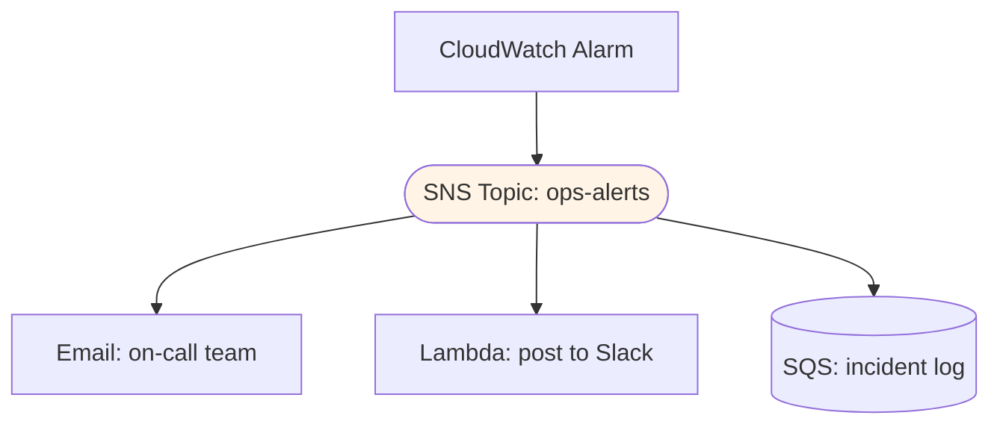

# Amazon SNS - Architecture Patterns & Examples (SAA-C03)

> SNS shows up in the exam as the "fan-out / notify many things" answer. This is the pattern catalog with diagrams and code.

See also: [01 - SNS Fundamentals & Deep Dive](01%20-%20SNS%20Fundamentals%20%26%20Deep%20Dive.md) · [03 - SNS Scenarios, Best Practices & Troubleshooting](03%20-%20SNS%20Scenarios%2C%20Best%20Practices%20%26%20Troubleshooting.md) · [02 - SQS Architecture & Examples](02%20-%20SQS%20Architecture%20%26%20Examples.md)

---

## Table of Contents

- [1. Fan-Out to Multiple SQS Queues](#1-fan-out-to-multiple-sqs-queues)
- [2. Event Notifications (S3 / CloudWatch)](#2-event-notifications-s3--cloudwatch)
- [3. SNS to Lambda (Event-Driven)](#3-sns-to-lambda-event-driven)
- [4. Alerting & Human Notifications](#4-alerting--human-notifications)
- [5. SNS to Kinesis Data Firehose (Archive)](#5-sns-to-kinesis-data-firehose-archive)
- [6. Cross-Account & Cross-Region](#6-cross-account--cross-region)
- [7. Ordered Fan-Out with FIFO](#7-ordered-fan-out-with-fifo)
- [8. Code Examples](#8-code-examples)
- [9. Pattern Selection Cheat Sheet](#9-pattern-selection-cheat-sheet)

---



---

## 1. Fan-Out to Multiple SQS Queues

Publish once; each subscribed SQS queue gets a copy and is processed independently. See [01 - SNS Fundamentals & Deep Dive > 4. SNS + SQS Fan-Out (The Big Pattern)](01%20-%20SNS%20Fundamentals%20%26%20Deep%20Dive.md#4-sns--sqs-fan-out-the-big-pattern) for why this beats SNS-only.

**Use it when:** an event (order placed, file uploaded, signup) must kick off several **independent, durable** pipelines.

[⬆ Back to top](#table-of-contents)

---

## 2. Event Notifications (S3 / CloudWatch)

Many AWS services publish to SNS:

- **S3 Event Notifications** → SNS (object created/deleted) → fan out.
- **CloudWatch Alarms** → SNS → email/SMS/Lambda/Auto Scaling.
- **AWS Budgets**, **RDS events**, **Auto Scaling lifecycle hooks**, **CloudFormation** stack events → SNS.

> **Exam:** "Notify the ops team + log + auto-remediate when a metric breaches" → CloudWatch alarm → **SNS** → email + Lambda (+ SQS).

[⬆ Back to top](#table-of-contents)

---

## 3. SNS to Lambda (Event-Driven)

SNS can invoke a **Lambda** function **asynchronously** per message.

- Good for lightweight, stateless processing of each event.
- Lambda async invocation has its **own retry** (2 retries) + can route failures to a **Lambda DLQ / on-failure destination**.
- For guaranteed durability and buffering, prefer **SNS → SQS → Lambda** (the queue absorbs spikes and retains on failure).

[⬆ Back to top](#table-of-contents)

---

## 4. Alerting & Human Notifications

- **A2P** channels: SMS, email, mobile push (APNs/FCM).
- Common for **operational alerts**, OTP/transactional SMS, and marketing pushes.
- For rich, multi-channel user messaging at scale, **Amazon Pinpoint** sits on top of SNS-like delivery (out of scope detail, but know it exists).

[⬆ Back to top](#table-of-contents)

---

## 5. SNS to Kinesis Data Firehose (Archive)

Subscribe **Kinesis Data Firehose** to a topic to **persist every published message** to:

- **S3** (data lake / audit), **Redshift**, **OpenSearch**, or 3rd-party.

> **Exam answer:** "Keep a durable, queryable archive of all notifications." → SNS → **Firehose** → S3.

[⬆ Back to top](#table-of-contents)

---

## 6. Cross-Account & Cross-Region

- **Cross-account:** Topic **access policy** grants another account `sns:Subscribe`/`sns:Publish`. Common in centralized logging/alerting.
- **Cross-region delivery:** SNS can deliver to subscribers in other regions (e.g., an SQS queue in another region) for DR and aggregation.

[⬆ Back to top](#table-of-contents)

---

## 7. Ordered Fan-Out with FIFO

**SNS FIFO → SQS FIFO** gives ordered, deduplicated delivery to multiple queues. Use `MessageGroupId` for per-entity ordering. Pick this when downstream consumers require strict order (e.g., a price feed mirrored to multiple processors).

[⬆ Back to top](#table-of-contents)

---

## 8. Code Examples

**Create topic, subscribe an SQS queue, publish (CLI):**

```bash
# Create topic
aws sns create-topic --name order-events

# Subscribe an SQS queue (raw message delivery removes SNS envelope)
aws sns subscribe \
  --topic-arn arn:aws:sns:us-east-1:123456789012:order-events \
  --protocol sqs \
  --notification-endpoint arn:aws:sqs:us-east-1:123456789012:fulfillment \
  --attributes '{"RawMessageDelivery":"true"}'

# Publish with an attribute used for filtering
aws sns publish \
  --topic-arn arn:aws:sns:us-east-1:123456789012:order-events \
  --message '{"orderId":"A-1001"}' \
  --message-attributes '{"state":{"DataType":"String","StringValue":"placed"}}'
```

**Subscription with a filter policy (CLI):**

```bash
aws sns set-subscription-attributes \
  --subscription-arn <sub-arn> \
  --attribute-name FilterPolicy \
  --attribute-value '{"state":["placed"]}'
```

**Topic + fan-out + queue policy (Terraform):**

```hcl
resource "aws_sns_topic" "orders" { name = "order-events" }

resource "aws_sqs_queue" "fulfillment" { name = "fulfillment" }

resource "aws_sns_topic_subscription" "to_sqs" {
  topic_arn            = aws_sns_topic.orders.arn
  protocol             = "sqs"
  endpoint             = aws_sqs_queue.fulfillment.arn
  raw_message_delivery = true
  filter_policy        = jsonencode({ state = ["placed"] })
}

# Allow SNS to send to the queue
resource "aws_sqs_queue_policy" "allow_sns" {
  queue_url = aws_sqs_queue.fulfillment.id
  policy = jsonencode({
    Version = "2012-10-17"
    Statement = [{
      Effect    = "Allow"
      Principal = { Service = "sns.amazonaws.com" }
      Action    = "sqs:SendMessage"
      Resource  = aws_sqs_queue.fulfillment.arn
      Condition = { ArnEquals = { "aws:SourceArn" = aws_sns_topic.orders.arn } }
    }]
  })
}
```

[⬆ Back to top](#table-of-contents)

---

## 9. Pattern Selection Cheat Sheet

| Requirement                          | Pattern                                                |
| :----------------------------------- | :----------------------------------------------------- |
| One event → many durable pipelines   | **SNS → multiple SQS** fan-out                         |
| Operational alerts to people         | SNS **email/SMS** (A2P)                                |
| Event-driven compute per message     | **SNS → Lambda** (or SNS → SQS → Lambda for buffering) |
| Archive every message                | SNS → **Firehose** → S3                                |
| Route message subsets to subscribers | **Filter policies**                                    |
| Ordered multi-consumer delivery      | **SNS FIFO → SQS FIFO**                                |
| Central alerting across accounts     | Cross-account **topic access policy**                  |

[⬆ Back to top](#table-of-contents)
