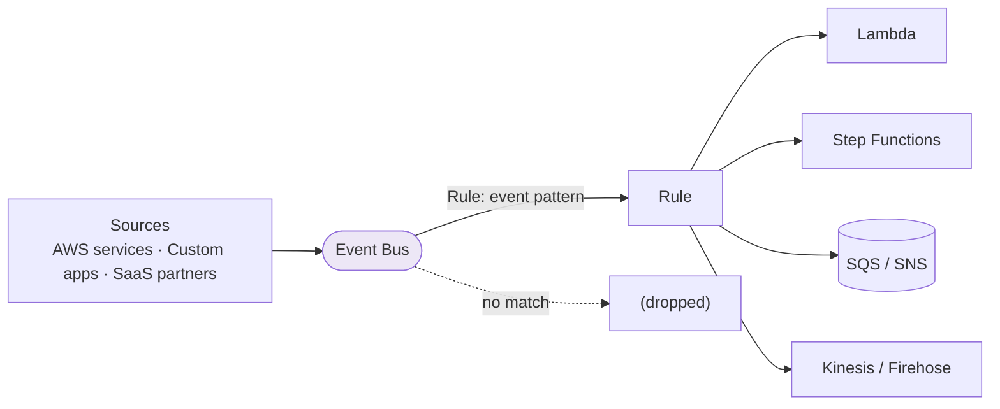
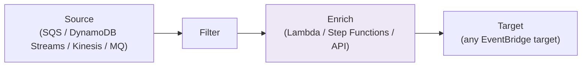

# Amazon EventBridge - Fundamentals & Deep Dive (SAA-C03)

> Amazon **EventBridge** (formerly CloudWatch Events) is the serverless **event bus** that routes events from AWS services, your apps, and SaaS partners to targets using **rules**. It's the modern "glue" for event-driven architecture and the **scheduler** that replaced cron-style CloudWatch Events.

See also: [02 - EventBridge Architecture & Examples](02%20-%20EventBridge%20Architecture%20%26%20Examples.md) · [03 - EventBridge Scenarios, Best Practices & Troubleshooting](03%20-%20EventBridge%20Scenarios%2C%20Best%20Practices%20%26%20Troubleshooting.md) · [01 - SNS Fundamentals & Deep Dive](01%20-%20SNS%20Fundamentals%20%26%20Deep%20Dive.md) · [01 - Step Functions Fundamentals & Deep Dive](01%20-%20Step%20Functions%20Fundamentals%20%26%20Deep%20Dive.md)

---

## Table of Contents

- [1. What Is EventBridge](#1-what-is-eventbridge)
- [2. Core Concepts: Bus, Rules, Targets](#2-core-concepts-bus-rules-targets)
- [3. Event Structure & Pattern Matching](#3-event-structure--pattern-matching)
- [4. The Three Bus Types](#4-the-three-bus-types)
- [5. Scheduler (Cron & Rate)](#5-scheduler-cron--rate)
- [6. Schema Registry & Discovery](#6-schema-registry--discovery)
- [7. Archive & Replay](#7-archive--replay)
- [8. Pipes (Point-to-Point Integration)](#8-pipes-point-to-point-integration)
- [9. Reliability: Retries, DLQ, Delivery](#9-reliability-retries-dlq-delivery)
- [10. Security](#10-security)
- [11. EventBridge vs SNS vs SQS](#11-eventbridge-vs-sns-vs-sqs)
- [12. Key Takeaways](#12-key-takeaways)

---



---

## 1. What Is EventBridge

EventBridge is a **serverless event router**. Events (small JSON documents describing "something happened") arrive on a **bus**; **rules** match events by pattern or schedule and send them to one or more **targets**.

- **Evolution:** Started as **CloudWatch Events**; rebranded and expanded with SaaS partners, schema registry, archive/replay, scheduler, and pipes.
- **Why it matters:** It's the AWS-recommended backbone for **event-driven, loosely-coupled** architectures and for **content-based routing** that SNS/SQS can't do as richly.

[⬆ Back to top](#table-of-contents)

---

## 2. Core Concepts: Bus, Rules, Targets

| Concept               | Meaning                                                                                                  |
| :-------------------- | :------------------------------------------------------------------------------------------------------- |
| **Event**             | A JSON message describing a change ("EC2 instance stopped", "order placed").                             |
| **Event bus**         | A pipeline that receives events. Default bus = AWS service events.                                       |
| **Rule**              | Matches incoming events (by **event pattern**) or fires on a **schedule**, then routes to targets.       |
| **Target**            | Where matched events go - 20+ types (Lambda, SQS, SNS, Step Functions, Kinesis, ECS, API destinations…). |
| **Input transformer** | Reshapes the event before sending to a target.                                                           |

- A single rule can have **up to 5 targets**.
- Targets can be in **other accounts/regions** (cross-account event routing).

[⬆ Back to top](#table-of-contents)

---

## 3. Event Structure & Pattern Matching

Every event has a standard envelope:

```json
{
  "version": "0",
  "id": "...",
  "detail-type": "EC2 Instance State-change Notification",
  "source": "aws.ec2",
  "account": "123456789012",
  "region": "us-east-1",
  "time": "2026-06-01T12:00:00Z",
  "resources": ["arn:aws:ec2:..."],
  "detail": { "instance-id": "i-abc", "state": "stopped" }
}
```

**Event patterns** match on any field. Example - only stopped EC2 instances:

```json
{
  "source": ["aws.ec2"],
  "detail-type": ["EC2 Instance State-change Notification"],
  "detail": { "state": ["stopped", "terminated"] }
}
```

Patterns support prefix matching, numeric ranges, `anything-but`, `exists`, and more - far richer than SNS filter policies.

> **Exam:** "Route events to targets based on **content** of the event" → **EventBridge rule with an event pattern.**

[⬆ Back to top](#table-of-contents)

---

## 4. The Three Bus Types

| Bus Type              | Use                                                                              |
| :-------------------- | :------------------------------------------------------------------------------- |
| **Default event bus** | Receives events from **AWS services** automatically.                             |
| **Custom event bus**  | For **your own applications'** events (`PutEvents`). Isolate domains/teams.      |
| **Partner event bus** | Receives events from **SaaS partners** (Zendesk, Datadog, Shopify, Auth0, etc.). |

> **Exam:** "Receive events directly from a third-party SaaS app into AWS." → **EventBridge partner event source / partner event bus.**

[⬆ Back to top](#table-of-contents)

---

## 5. Scheduler (Cron & Rate)

EventBridge can trigger targets on a **schedule** - this replaced "CloudWatch Events scheduled rules" and is the standard answer for **serverless cron**.

- **Rate expression:** `rate(5 minutes)`.
- **Cron expression:** `cron(0 12 * * ? *)` (noon UTC daily).
- **EventBridge Scheduler** (newer, dedicated service): one-time or recurring schedules, **time zones**, **flexible time windows**, and **300,000+ schedules**; can target 270+ AWS APIs directly. More scalable than classic scheduled rules.

> **Exam:** "Run a Lambda every night / invoke an API on a schedule without servers." → **EventBridge Scheduler / scheduled rule.**

[⬆ Back to top](#table-of-contents)

---

## 6. Schema Registry & Discovery

- **Schema registry** stores the structure (schema) of events on a bus.
- **Schema discovery** can automatically infer schemas from events flowing through a bus.
- Generate **code bindings** (Java, Python, TypeScript) so developers get typed objects for events.

> **Exam:** "Developers need the structure of events to build consumers." → **EventBridge Schema Registry** (+ discovery + code bindings).

[⬆ Back to top](#table-of-contents)

---

## 7. Archive & Replay

- **Archive:** Persist events (all, or filtered by pattern) on a bus for a defined retention (or indefinitely).
- **Replay:** Re-send archived events to the bus/targets later - for **reprocessing, testing, or recovery**.

> **Exam:** "Reprocess past events after fixing a bug" → **EventBridge archive + replay.** (SNS/SQS can't replay arbitrary history like this.)

[⬆ Back to top](#table-of-contents)

---

## 8. Pipes (Point-to-Point Integration)

**EventBridge Pipes** connect a **single source** to a **single target** with optional **filtering**, **enrichment**, and **transformation** - a managed alternative to writing glue Lambda.



- **Sources:** SQS, Kinesis, DynamoDB Streams, Amazon MQ, Kafka (MSK/self-managed).
- **Use:** Replace boilerplate "poll a stream → transform → forward" Lambda code with a managed pipe.

> **Bus vs Pipes:** A **bus** is many-to-many (pub/sub style routing). **Pipes** is one-to-one (point-to-point) with built-in enrichment.

[⬆ Back to top](#table-of-contents)

---

## 9. Reliability: Retries, DLQ, Delivery

- **Retries:** EventBridge retries target delivery with exponential backoff for up to **24 hours**.
- **DLQ:** Attach an **SQS DLQ** to a rule's target so events that can't be delivered aren't lost.
- **Delivery model:** At-least-once delivery to targets (targets may occasionally receive duplicates).
- **API destinations:** Deliver events to external **HTTP/SaaS APIs** with managed auth (API key, OAuth, Basic) and **rate limiting**.

[⬆ Back to top](#table-of-contents)

---

## 10. Security

| Layer                  | Mechanism                                                                                                      |
| :--------------------- | :------------------------------------------------------------------------------------------------------------- |
| **Who can put events** | IAM + **resource-based policy** on the bus (cross-account `PutEvents`).                                        |
| **Target invocation**  | EventBridge uses an **IAM role** to invoke targets that need it (e.g., Step Functions, ECS, API destinations). |
| **Encryption**         | Events encrypted in transit; KMS for archives where supported.                                                 |
| **Cross-account**      | Bus resource policy grants other accounts/orgs permission to send.                                             |

[⬆ Back to top](#table-of-contents)

---

## 11. EventBridge vs SNS vs SQS

|                        | **EventBridge**                           | **SNS**                               | **SQS**                |
| :--------------------- | :---------------------------------------- | :------------------------------------ | :--------------------- |
| **Model**              | Event bus + routing                       | Pub/sub push                          | Queue pull             |
| **Routing**            | Rich **content-based** (event patterns)   | Attribute/body filter policies        | None (single queue)    |
| **Targets**            | 20+ AWS targets, API destinations         | Subscribers (SQS, Lambda, HTTP, SMS…) | Consumers poll         |
| **Throughput/latency** | Higher latency, lower throughput than SNS | **Very high throughput, low latency** | High                   |
| **AWS service events** | **Native** (default bus)                  | No                                    | No                     |
| **SaaS integration**   | **Partner buses**                         | No                                    | No                     |
| **Replay**             | **Yes** (archive)                         | No                                    | No                     |
| **Schedule**           | **Yes** (cron/rate/Scheduler)             | No                                    | No                     |
| **Best for**           | Routing, SaaS, scheduling, AWS events     | Fan-out, high-throughput notify       | Decoupling/work queues |

> **Rule of thumb:** Need **content-based routing, AWS-service or SaaS events, scheduling, or replay** → **EventBridge**. Need **massive-scale, low-latency fan-out** → **SNS**.

[⬆ Back to top](#table-of-contents)

---

## 12. Key Takeaways

| Concept              | Must-Know                                                                  |
| :------------------- | :------------------------------------------------------------------------- |
| **Core**             | Bus + rule (event pattern/schedule) + targets (up to 5).                   |
| **Buses**            | Default (AWS), custom (your app), partner (SaaS).                          |
| **Scheduler**        | Serverless cron/rate; Scheduler service for scale + time zones.            |
| **Schema registry**  | Discover schemas, generate code bindings.                                  |
| **Archive & replay** | Persist and reprocess past events.                                         |
| **Pipes**            | Point-to-point source→target with filter/enrich/transform.                 |
| **Reliability**      | Retries up to 24h + SQS DLQ on targets.                                    |
| **vs SNS**           | EventBridge = rich routing/AWS+SaaS events; SNS = high-throughput fan-out. |

[⬆ Back to top](#table-of-contents)
