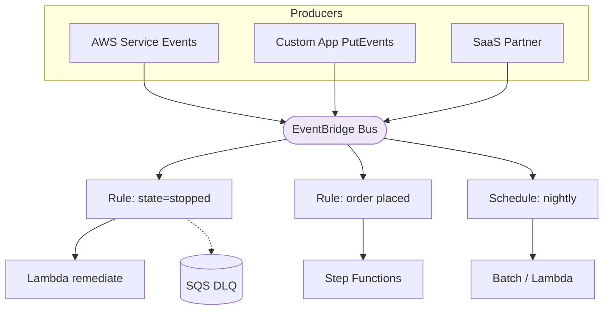

# Amazon EventBridge - Architecture Patterns & Examples (SAA-C03)

> EventBridge is the routing/scheduling/glue answer. This file maps the common architectures and gives copy-ready event patterns and IaC.

See also: [01 - EventBridge Fundamentals & Deep Dive](01%20-%20EventBridge%20Fundamentals%20%26%20Deep%20Dive.md) · [03 - EventBridge Scenarios, Best Practices & Troubleshooting](03%20-%20EventBridge%20Scenarios%2C%20Best%20Practices%20%26%20Troubleshooting.md) · [02 - Step Functions Architecture & Examples](02%20-%20Step%20Functions%20Architecture%20%26%20Examples.md)

---

## Table of Contents

- [1. Event-Driven Routing (Content-Based)](#1-event-driven-routing-content-based)
- [2. Serverless Cron / Scheduled Jobs](#2-serverless-cron--scheduled-jobs)
- [3. Auto-Remediation & Security Response](#3-auto-remediation--security-response)
- [4. SaaS Integration (Partner Buses)](#4-saas-integration-partner-buses)
- [5. Fan-In Across Accounts](#5-fan-in-across-accounts)
- [6. Decoupling Microservices](#6-decoupling-microservices)
- [7. EventBridge Pipes Integration](#7-eventbridge-pipes-integration)
- [8. Reliable Delivery with DLQ + Archive](#8-reliable-delivery-with-dlq--archive)
- [9. Code & IaC Examples](#9-code--iac-examples)
- [10. Pattern Selection Cheat Sheet](#10-pattern-selection-cheat-sheet)

---



---

## 1. Event-Driven Routing (Content-Based)

EventBridge's signature pattern: **one bus, many rules**, each routing a **slice** of events to a different target based on the event's content.

- Order service emits `OrderPlaced`, `OrderCancelled`, `OrderShipped` to a custom bus.
- Rule A (`detail-type = OrderPlaced`) → fulfillment Step Function.
- Rule B (`OrderCancelled`) → refund Lambda.
- Rule C (`amount > 10000`) → fraud-review queue.

This is **content-based routing** SNS can't do as expressively.

[⬆ Back to top](#table-of-contents)

---

## 2. Serverless Cron / Scheduled Jobs

Replace cron servers entirely:

- `rate(1 hour)` → Lambda that rotates logs.
- `cron(0 2 * * ? *)` → start a nightly **AWS Batch** job or **ECS task**.
- **EventBridge Scheduler** for time-zone-aware, one-time, or millions of schedules targeting 270+ APIs directly (e.g., stop dev EC2 instances at 7 pm local time).

> **Exam:** "Stop non-prod instances every evening to save cost." → **EventBridge schedule → Lambda / EC2 StopInstances.**

[⬆ Back to top](#table-of-contents)

---

## 3. Auto-Remediation & Security Response

AWS services emit events to the default bus; rules trigger automated responses:

- **GuardDuty finding** → EventBridge rule → Lambda isolates the instance / SNS alerts SOC.
- **Config rule non-compliant** → rule → SSM Automation document remediates.
- **Root account login / IAM change** (via CloudTrail → EventBridge) → alert.

> **Exam:** "Automatically respond to a GuardDuty/Config finding." → **EventBridge rule → Lambda/SSM/SNS.**

[⬆ Back to top](#table-of-contents)

---

## 4. SaaS Integration (Partner Buses)

Third-party SaaS (Datadog, Zendesk, Shopify, Auth0, Segment…) push events into a **partner event bus**. Rules route them into AWS workflows - no polling/webhook server to maintain.

> **Exam:** "Ingest events from a SaaS provider into an event-driven AWS pipeline." → **EventBridge partner event source.**

[⬆ Back to top](#table-of-contents)

---

## 5. Fan-In Across Accounts

Member accounts `PutEvents` to a **central** account's bus (granted via the bus **resource policy**). Central account applies org-wide rules (security, audit, routing). Common in **multi-account / Control Tower** setups.

[⬆ Back to top](#table-of-contents)

---

## 6. Decoupling Microservices

Services communicate via events on a shared/custom bus instead of direct API calls:

- Producers don't know consumers (loose coupling).
- New consumers subscribe by adding a rule - **no producer change**.
- Compare to **SNS** when you need richer routing or AWS/SaaS-native events; compare to **SQS** when you need durable work queues (often EventBridge → SQS target).

[⬆ Back to top](#table-of-contents)

---

## 7. EventBridge Pipes Integration

Point-to-point with built-in enrichment - replaces glue Lambda:

- **DynamoDB Streams → Pipe (filter + enrich via Lambda) → EventBridge bus / Step Functions.**
- **Amazon MQ / Kafka → Pipe → SQS/Lambda.**

Use Pipes when you have exactly one source and one target and want managed filtering/enrichment.

[⬆ Back to top](#table-of-contents)

---

## 8. Reliable Delivery with DLQ + Archive

For events that must not be lost:

- Attach an **SQS DLQ** to the rule target (captures failed deliveries after 24h of retries).
- Enable an **archive** on the bus so you can **replay** after fixing bugs.

[⬆ Back to top](#table-of-contents)

---

## 9. Code & IaC Examples

**Put a custom event (CLI):**

```bash
aws events put-events --entries '[{
  "Source": "com.myapp.orders",
  "DetailType": "OrderPlaced",
  "Detail": "{\"orderId\":\"A-1001\",\"amount\":250}",
  "EventBusName": "orders-bus"
}]'
```

**Rule with event pattern + Lambda target (Terraform):**

```hcl
resource "aws_cloudwatch_event_bus" "orders" { name = "orders-bus" }

resource "aws_cloudwatch_event_rule" "high_value" {
  name           = "high-value-orders"
  event_bus_name = aws_cloudwatch_event_bus.orders.name
  event_pattern  = jsonencode({
    source        = ["com.myapp.orders"]
    "detail-type" = ["OrderPlaced"]
    detail        = { amount = [{ numeric = [">", 10000] }] }
  })
}

resource "aws_cloudwatch_event_target" "to_lambda" {
  rule           = aws_cloudwatch_event_rule.high_value.name
  event_bus_name = aws_cloudwatch_event_bus.orders.name
  arn            = aws_lambda_function.fraud_review.arn

  dead_letter_config { arn = aws_sqs_queue.dlq.arn }
  retry_policy {
    maximum_retry_attempts       = 10
    maximum_event_age_in_seconds = 3600
  }
}
```

**Scheduled rule (nightly, CLI):**

```bash
aws scheduler create-schedule \
  --name nightly-cleanup \
  --schedule-expression "cron(0 2 * * ? *)" \
  --schedule-expression-timezone "Asia/Kolkata" \
  --flexible-time-window '{"Mode":"OFF"}' \
  --target '{"Arn":"arn:aws:lambda:...:function:cleanup","RoleArn":"arn:aws:iam::...:role/scheduler"}'
```

[⬆ Back to top](#table-of-contents)

---

## 10. Pattern Selection Cheat Sheet

| Requirement                      | Pattern                                   |
| :------------------------------- | :---------------------------------------- |
| Route events by content          | **Rule with event pattern**               |
| Serverless cron                  | **Schedule rule / EventBridge Scheduler** |
| Auto-remediate AWS findings      | AWS event → rule → **Lambda/SSM**         |
| Ingest SaaS events               | **Partner event bus**                     |
| Central multi-account events     | **Bus resource policy** (fan-in)          |
| One source → one target + enrich | **EventBridge Pipes**                     |
| Don't lose events / reprocess    | Target **DLQ** + bus **archive/replay**   |
| Call an external HTTP/SaaS API   | **API destinations**                      |

[⬆ Back to top](#table-of-contents)
