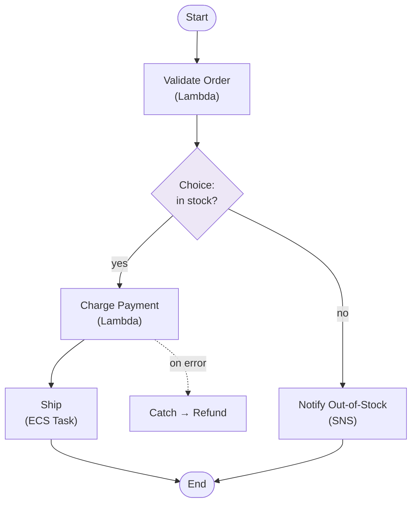

# AWS Step Functions - Fundamentals & Deep Dive (SAA-C03)

> AWS **Step Functions** is a serverless **workflow orchestrator**. You define a **state machine** (steps, branching, retries, parallelism) in JSON (Amazon States Language) and it coordinates Lambda, ECS, SQS, SNS, and 200+ AWS services - with built-in error handling and visual execution history.

See also: [02 - Step Functions Architecture & Examples](02%20-%20Step%20Functions%20Architecture%20%26%20Examples.md) · [03 - Step Functions Scenarios, Best Practices & Troubleshooting](03%20-%20Step%20Functions%20Scenarios%2C%20Best%20Practices%20%26%20Troubleshooting.md) · [01 - EventBridge Fundamentals & Deep Dive](01%20-%20EventBridge%20Fundamentals%20%26%20Deep%20Dive.md) · [01 - SQS Fundamentals & Deep Dive](01%20-%20SQS%20Fundamentals%20%26%20Deep%20Dive.md)

---

## Table of Contents

- [1. What Is Step Functions](#1-what-is-step-functions)
- [2. State Machines & Amazon States Language](#2-state-machines--amazon-states-language)
- [3. State Types](#3-state-types)
- [4. Standard vs Express Workflows (Exam Critical)](#4-standard-vs-express-workflows-exam-critical)
- [5. Error Handling: Retry & Catch](#5-error-handling-retry--catch)
- [6. Service Integration Patterns](#6-service-integration-patterns)
- [7. Wait, Choice & Parallel/Map](#7-wait-choice--parallelmap)
- [8. Triggering & Observability](#8-triggering--observability)
- [9. Security](#9-security)
- [10. Step Functions vs SWF vs EventBridge](#10-step-functions-vs-swf-vs-eventbridge)
- [11. Key Takeaways](#11-key-takeaways)

---



---

## 1. What Is Step Functions

Step Functions coordinates multiple services into **serverless workflows** so you don't hand-code orchestration logic (state, retries, parallelism, error handling) inside Lambda functions.

- **Visual:** The console shows the workflow as a graph and **every execution's path**, inputs/outputs, and where it failed - huge for debugging.
- **Durable:** Long-running workflows (Standard) can run **up to 1 year**, surviving failures and waiting on humans or external systems.
- **Serverless:** No infrastructure; pay per state transition (Standard) or per duration (Express).

> **Mental model:** Lambda = one task. Step Functions = the **conductor** that runs many tasks in order, in parallel, with branching and retries.

[⬆ Back to top](#table-of-contents)

---

## 2. State Machines & Amazon States Language

A **state machine** is a workflow defined in **Amazon States Language (ASL)** - a JSON document of **states**.

```json
{
  "Comment": "Simple order workflow",
  "StartAt": "ValidateOrder",
  "States": {
    "ValidateOrder": {
      "Type": "Task",
      "Resource": "arn:aws:lambda:us-east-1:123456789012:function:validate",
      "Next": "ChargePayment"
    },
    "ChargePayment": {
      "Type": "Task",
      "Resource": "arn:aws:lambda:us-east-1:123456789012:function:charge",
      "End": true
    }
  }
}
```

Each state has a `Type`, optional `Next`/`End`, and input/output processing (`InputPath`, `Parameters`, `ResultPath`, `OutputPath`).

[⬆ Back to top](#table-of-contents)

---

## 3. State Types

| State `Type` | Purpose                                                             |
| :----------- | :------------------------------------------------------------------ |
| **Task**     | Do work - invoke a Lambda, ECS task, or any integrated AWS service. |
| **Choice**   | Branch based on input (if/else).                                    |
| **Parallel** | Run multiple branches **concurrently**.                             |
| **Map**      | Run the **same steps for each item** in an array (dynamic fan-out). |
| **Wait**     | Pause for a duration or until a timestamp.                          |
| **Pass**     | Inject/transform data without doing work.                           |
| **Succeed**  | End successfully.                                                   |
| **Fail**     | End with an error.                                                  |

[⬆ Back to top](#table-of-contents)

---

## 4. Standard vs Express Workflows (Exam Critical)

| Feature             | **Standard**                                  | **Express**                                              |
| :------------------ | :-------------------------------------------- | :------------------------------------------------------- |
| **Max duration**    | **Up to 1 year**                              | **5 minutes**                                            |
| **Execution model** | Exactly-once                                  | At-least-once (async) / at-most-once (sync)              |
| **Rate**            | Up to ~2,000 starts/s                         | **100,000+ starts/s** (very high volume)                 |
| **Pricing**         | Per **state transition**                      | Per **execution + duration + memory**                    |
| **History**         | Full visual execution history                 | Sent to CloudWatch Logs                                  |
| **Best for**        | Long-running, auditable, human steps, durable | High-volume, short, event processing (e.g., per-request) |

**How to choose:**

- **Long-running, low-volume, need audit trail, human approval, wait states** → **Standard**.
- **High-volume, short-lived, event-driven (IoT, streaming, API backends)** → **Express**.

> **Exam:** "Orchestrate a high-volume (thousands/sec), sub-5-minute event pipeline cheaply." → **Express**. "Order workflow that may wait days for a human approval." → **Standard**.

[⬆ Back to top](#table-of-contents)

---

## 5. Error Handling: Retry & Catch

Built-in resilience - no try/catch code in your Lambdas:

- **Retry:** Per-state retry with `ErrorEquals`, `IntervalSeconds`, `MaxAttempts`, `BackoffRate` (exponential backoff + jitter).
- **Catch:** Route specific errors to a fallback state (e.g., compensating "refund" step).

```json
"ChargePayment": {
  "Type": "Task",
  "Resource": "arn:aws:lambda:...:charge",
  "Retry": [{ "ErrorEquals": ["States.TaskFailed"], "MaxAttempts": 3, "BackoffRate": 2.0, "IntervalSeconds": 2 }],
  "Catch": [{ "ErrorEquals": ["States.ALL"], "Next": "RefundAndNotify" }],
  "Next": "Ship"
}
```

> **Exam:** "Add automatic retries with exponential backoff and a fallback path between steps." → **Step Functions Retry/Catch** (don't build it in Lambda).

[⬆ Back to top](#table-of-contents)

---

## 6. Service Integration Patterns

How a Task state waits for the integrated service:

| Pattern                                     | Behavior                                                                                                                                           |
| :------------------------------------------ | :------------------------------------------------------------------------------------------------------------------------------------------------- |
| **Request/Response** (default)              | Call the service and immediately move on.                                                                                                          |
| **Run a Job (`.sync`)**                     | Call and **wait for the job to complete** (e.g., ECS task, Batch, EMR, Glue).                                                                      |
| **Wait for Callback (`.waitForTaskToken`)** | Pause until an external system calls `SendTaskSuccess`/`SendTaskFailure` with a **task token** - for **human approval** or third-party async work. |

> **Exam:** "Pause the workflow until a manager approves via email/UI." → **`.waitForTaskToken`** callback pattern.

[⬆ Back to top](#table-of-contents)

---

## 7. Wait, Choice & Parallel/Map

- **Wait:** delay or wait-until-timestamp (e.g., wait 24h before sending a reminder) - cheaper and simpler than a Lambda sleeping.
- **Choice:** content-based branching.
- **Parallel:** fixed set of branches concurrently (e.g., process payment AND reserve inventory at once).
- **Map:** dynamic fan-out over an array. **Distributed Map** scales to **millions** of items reading from S3 (large-scale batch processing) - a common modern exam answer for "process millions of S3 objects in parallel."

[⬆ Back to top](#table-of-contents)

---

## 8. Triggering & Observability

**How workflows start:**

- **EventBridge** rule (event-driven), **API Gateway**, **Lambda**, **SDK/CLI `StartExecution`**, or **EventBridge Scheduler** (cron).

**Observability:**

- **Visual execution history** (Standard) shows each state's input/output and failures.
- **CloudWatch Logs/Metrics**; **X-Ray** tracing for distributed traces across the workflow.

[⬆ Back to top](#table-of-contents)

---

## 9. Security

- Step Functions assumes an **IAM execution role** to call integrated services (least-privilege to the exact Task resources).
- Encrypts data in transit and at rest; integrates with **KMS**.
- Use **VPC endpoints** for private access; resource policies/IAM for who can `StartExecution`.

[⬆ Back to top](#table-of-contents)

---

## 10. Step Functions vs SWF vs EventBridge

|                    | **Step Functions**                | **Simple Workflow (SWF)**                                                    | **EventBridge**                     |
| :----------------- | :-------------------------------- | :--------------------------------------------------------------------------- | :---------------------------------- |
| **Role**           | Serverless workflow orchestration | Legacy orchestration (deciders/workers)                                      | Event routing/scheduling            |
| **State**          | Managed, visual                   | You manage workers                                                           | Stateless routing                   |
| **When**           | **Default** for orchestration     | Only if you need external signals/child workflows AWS recommends SFN instead | Trigger/route, not multi-step state |
| **Recommendation** | **Use this**                      | Legacy - avoid for new builds                                                | Use to **start** workflows          |

> **Exam:** SWF is legacy; the answer for new orchestration is almost always **Step Functions**. EventBridge **triggers** a workflow; Step Functions **runs** it.

[⬆ Back to top](#table-of-contents)

---

## 11. Key Takeaways

| Concept             | Must-Know                                                                    |
| :------------------ | :--------------------------------------------------------------------------- |
| **Role**            | Serverless orchestrator of multi-step workflows (state machine in ASL).      |
| **Standard**        | Up to 1 year, exactly-once, per-transition pricing, audit history.           |
| **Express**         | ≤ 5 min, very high volume, per-duration pricing.                             |
| **States**          | Task, Choice, Parallel, Map, Wait, Pass, Succeed, Fail.                      |
| **Resilience**      | Built-in **Retry** (backoff) and **Catch** (fallback).                       |
| **Integrations**    | Request/Response, `.sync` (run a job), `.waitForTaskToken` (human/callback). |
| **Distributed Map** | Parallel processing of millions of S3 items.                                 |
| **vs SWF**          | SWF is legacy - prefer Step Functions.                                       |

[⬆ Back to top](#table-of-contents)
