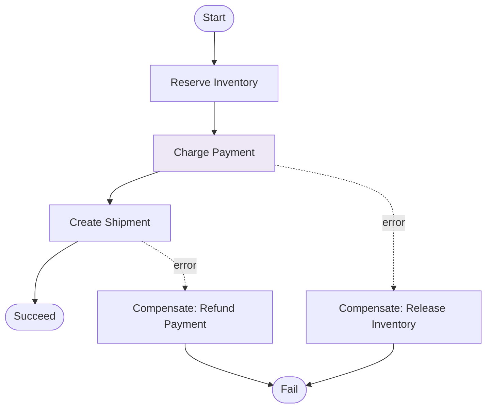
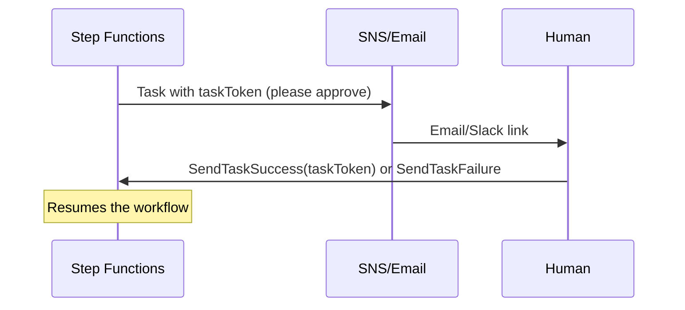

# AWS Step Functions - Architecture Patterns & Examples (SAA-C03)

> The orchestration patterns the exam expects you to recognize: saga/compensation, human approval, fan-out with Map, and event-driven pipelines.

See also: [01 - Step Functions Fundamentals & Deep Dive](01%20-%20Step%20Functions%20Fundamentals%20%26%20Deep%20Dive.md) · [03 - Step Functions Scenarios, Best Practices & Troubleshooting](03%20-%20Step%20Functions%20Scenarios%2C%20Best%20Practices%20%26%20Troubleshooting.md) · [02 - EventBridge Architecture & Examples](02%20-%20EventBridge%20Architecture%20%26%20Examples.md)

---

## Table of Contents

- [1. Orchestrating a Microservice Workflow](#1-orchestrating-a-microservice-workflow)
- [2. Saga Pattern (Compensating Transactions)](#2-saga-pattern-compensating-transactions)
- [3. Human Approval (Callback / Task Token)](#3-human-approval-callback--task-token)
- [4. Parallel & Map Fan-Out](#4-parallel--map-fan-out)
- [5. Event-Driven Pipelines (EventBridge → SFN)](#5-event-driven-pipelines-eventbridge--sfn)
- [6. Long-Running Wait & Polling](#6-long-running-wait--polling)
- [7. Express for High-Volume Stream Processing](#7-express-for-high-volume-stream-processing)
- [8. ETL / Data Orchestration](#8-etl--data-orchestration)
- [9. Code & IaC Examples](#9-code--iac-examples)
- [10. Pattern Selection Cheat Sheet](#10-pattern-selection-cheat-sheet)

---



---

## 1. Orchestrating a Microservice Workflow

Replace chained Lambda-calls-Lambda spaghetti with a state machine:

- Each step is a **Task** (Lambda/ECS/service call).
- Branching via **Choice**, retries via **Retry**, failures via **Catch**.
- The visual history shows exactly where an order/job failed.

**Why over chained Lambdas:** no hand-coded state passing, retries, or error routing; full observability; easy to change the flow without redeploying every function.

[⬆ Back to top](#table-of-contents)

---

## 2. Saga Pattern (Compensating Transactions)

For distributed transactions across services that can't share a DB transaction, use **compensation**: if a later step fails, undo earlier steps.

- Reserve inventory → charge payment → create shipment.
- If "charge payment" fails → **Catch** → "release inventory".
- If "shipment" fails → **Catch** → "refund payment" + "release inventory".

> **Exam:** "Maintain data consistency across microservices without a distributed transaction." → **Step Functions saga with Catch/compensation steps.**

[⬆ Back to top](#table-of-contents)

---

## 3. Human Approval (Callback / Task Token)

Use the **`.waitForTaskToken`** integration to pause until a human (or external system) responds.



- The workflow can wait **up to 1 year** (Standard) for the callback.
- Common for approvals, manual QA gates, or waiting on a third-party async job.

[⬆ Back to top](#table-of-contents)

---

## 4. Parallel & Map Fan-Out

- **Parallel:** run a fixed set of branches at once (e.g., generate thumbnails AND extract metadata AND scan for viruses on an uploaded file).
- **Map:** run identical steps over each element of an array (e.g., process each line item).
- **Distributed Map:** read **millions** of items from S3 and process in massive parallel batches with concurrency control.

> **Exam:** "Process millions of records/objects from S3 in parallel, serverless." → **Step Functions Distributed Map.**

[⬆ Back to top](#table-of-contents)

---

## 5. Event-Driven Pipelines (EventBridge → SFN)

EventBridge **starts** Step Functions executions when something happens:

- `S3 ObjectCreated` → EventBridge rule → **Step Functions** ingest pipeline.
- SaaS event (partner bus) → rule → workflow.
- Schedule (cron) → Scheduler → workflow (nightly batch orchestration).

[⬆ Back to top](#table-of-contents)

---

## 6. Long-Running Wait & Polling

- **Wait state** to delay (e.g., wait 7 days then send a follow-up) - no idle Lambda.
- **Poll loop:** Task → Wait → Choice ("done?") → loop or proceed, to poll an external job's status cheaply.

[⬆ Back to top](#table-of-contents)

---

## 7. Express for High-Volume Stream Processing

For per-event processing at very high rates (≤ 5 min each):

- API Gateway → **Express workflow** synchronous response.
- IoT/streaming events → Express workflow per message at 100k+/s.
- Cheaper for short, high-volume workloads (priced by duration, not transitions).

[⬆ Back to top](#table-of-contents)

---

## 8. ETL / Data Orchestration

Coordinate **Glue**, **EMR**, **Batch**, **Athena**, **Lambda** using `.sync` integrations that wait for each job to finish:

- Crawl → transform (Glue) → load (Redshift) → validate (Athena) → notify (SNS).
- Retries and Catch handle transient job failures automatically.

[⬆ Back to top](#table-of-contents)

---

## 9. Code & IaC Examples

**State with Choice + Catch (ASL excerpt):**

```json
{
  "StartAt": "CheckStock",
  "States": {
    "CheckStock": {
      "Type": "Choice",
      "Choices": [
        { "Variable": "$.inStock", "BooleanEquals": true, "Next": "Charge" }
      ],
      "Default": "NotifyOutOfStock"
    },
    "Charge": {
      "Type": "Task",
      "Resource": "arn:aws:states:::lambda:invoke",
      "Parameters": { "FunctionName": "charge", "Payload.$": "$" },
      "Retry": [
        { "ErrorEquals": ["States.ALL"], "MaxAttempts": 3, "BackoffRate": 2 }
      ],
      "Catch": [{ "ErrorEquals": ["States.ALL"], "Next": "Refund" }],
      "End": true
    },
    "NotifyOutOfStock": {
      "Type": "Task",
      "Resource": "arn:aws:states:::sns:publish",
      "Parameters": { "TopicArn": "...", "Message.$": "$" },
      "End": true
    },
    "Refund": {
      "Type": "Task",
      "Resource": "arn:aws:states:::lambda:invoke",
      "Parameters": { "FunctionName": "refund", "Payload.$": "$" },
      "End": true
    }
  }
}
```

**Wait-for-callback task (ASL excerpt):**

```json
"ManagerApproval": {
  "Type": "Task",
  "Resource": "arn:aws:states:::sns:publish.waitForTaskToken",
  "Parameters": {
    "TopicArn": "arn:aws:sns:...:approvals",
    "Message": { "taskToken.$": "$$.Task.Token", "order.$": "$.orderId" }
  },
  "Next": "Ship"
}
```

**State machine (Terraform):**

```hcl
resource "aws_sfn_state_machine" "orders" {
  name     = "order-workflow"
  role_arn = aws_iam_role.sfn.arn
  type     = "STANDARD"            # or "EXPRESS"
  definition = file("${path.module}/order.asl.json")
}
```

[⬆ Back to top](#table-of-contents)

---

## 10. Pattern Selection Cheat Sheet

| Requirement                              | Pattern                                     |
| :--------------------------------------- | :------------------------------------------ |
| Orchestrate multi-step service workflow  | **State machine** (Task/Choice/Catch)       |
| Consistency across microservices         | **Saga** with compensation (Catch)          |
| Wait for human approval                  | **`.waitForTaskToken`** callback (Standard) |
| Process millions of S3 items in parallel | **Distributed Map**                         |
| Wait for a long-running job to finish    | **`.sync`** integration                     |
| Trigger workflow on an event             | **EventBridge → StartExecution**            |
| High-volume short workflows              | **Express** workflow                        |
| Delay/poll without idle compute          | **Wait + Choice** loop                      |

[⬆ Back to top](#table-of-contents)
